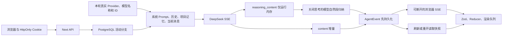

# 项目交接

## 当前结论

- 仓库：`LuzernRR/agent-workbench`，分支 `main`。
- 阶段 1 已由用户验收，Issue [#2](https://github.com/LuzernRR/agent-workbench/issues/2) 已关闭。
- 阶段 2 已由用户验收，Issue [#3](https://github.com/LuzernRR/agent-workbench/issues/3) 已关闭。
- 阶段 3 已由用户验收，Issue [#4](https://github.com/LuzernRR/agent-workbench/issues/4) 已关闭。
- 当前唯一活动功能是 S00 跨语言契约，Issue [#5](https://github.com/LuzernRR/agent-workbench/issues/5)；`Execution Gate: allowed`，状态 `awaiting_acceptance`。
- 正式地址：[http://localhost:3100/workbench](http://localhost:3100/workbench)。
- 真实配置：`config/agent-runtime.local.json`，禁止提交或复制密钥。
- 实现目录：`frontend/`；根目录文档记录架构、门禁与交接。
- 不在同一 Issue 中混入 LangGraph、ReAct、万能搜索 Agent 或其他新功能。

## 当前活动功能

- 目标：在 `frontend/contracts/v2/` 以 JSON Schema Draft 2020-12 冻结 TypeScript/Python 共享的万能搜索 Agent v2 边界。
- 范围：common、ResearchIntent、ResearchBrief、SearchPlan、Tool、Evidence、Claim/Citation、SearchResponse、SteeringCommand、RunQueueEntry、独立 ThreadQueueEvent、未来 AgentState 公共引用、AgentEvent v2、Context/Budget 事件，以及共享 fixtures 和跨对象语义不变量。
- 验收：TypeScript 与 Python 必须读取同一 schemas、manifest 和 fixtures，并对每条 fixture 返回一致的合法性与稳定错误码。
- 非目标：不接入当前 v1 生产路径；不改 UI、API、数据库和 Provider；不实现 S01 前端、S02 Gold Dataset、v2 配置、Python 服务、LangGraph、Ctrl+Enter、运行队列、工具执行、搜索、RAG、MCP 或 Memory v2。
- 兼容：S00 只增加版本化合同和测试，当前 Next.js/DeepSeek/PostgreSQL/SSE 行为保持不变；没有数据库迁移。
- 交付记录：`docs/development/2026-07-26-004-search-agent-contracts.md`。
- 完成门：验证后把本节状态改为 `awaiting_acceptance`，Issue #5 保持 OPEN；用户明确验收前不得开始 S01。

### S00 当前工作树进度

- 已冻结 14 份 Draft 2020-12 Schema，canonical `$id` 在 TypeScript/Python 两端预注册并离线解析。
- `fixtures/manifest.json` 已冻结 107 项：30 项合法、77 项非法；manifest 无重复 ID、重复路径或漏收 fixture。
- manifest 顶层同时冻结 37 项稳定错误码；TypeScript `contractErrorCodes` 与 Python `CONTRACT_ERROR_CODES` 必须逐项同序。
- TypeScript 定向契约测试 5 项通过；Python 定向契约测试 6 项通过；`uv sync --locked`、Ajv strict 离线编译和 TypeScript 类型检查通过。
- 完整仓库门禁通过：17 个 Vitest 文件通过、1 个文件跳过，共 95 项通过、1 项跳过；类型检查、全仓 Lint、标准生产构建和 16 项 Playwright 全部通过。
- 生产依赖审计为 0 个漏洞；PostgreSQL healthy；3100 已在最终构建后恢复，`/workbench` 返回 HTTP 200。
- 当前状态只等待用户明确验收；Issue #5 保持 OPEN，未验收前不得创建或启动 S01。
- 当前合同与生产 v1 完全隔离，没有数据库 migration、模型请求或运行时行为变更。

## 已实现

| 领域 | 当前事实 |
|---|---|
| 模型 | DeepSeek 真实 SSE；模型列表来自服务端统一配置；身份问题按本轮 Provider、模型名称和 ID 回答；浏览器不接触密钥 |
| 数据 | PostgreSQL 17 + pgvector 保存访客、项目、会话、运行、事件、附件和项目记忆 |
| 身份 | 高熵 `HttpOnly` Cookie；数据库仅存 SHA-256；所有 live 查询按访客隔离 |
| URL | 项目 `/workbench/p/{id}`；会话 `/workbench/t/{id}`；刷新和直达恢复同一选择 |
| 编辑 | 事务归档目标运行及下游活动分支，确认修改后旧回复立即消失 |
| 导航 | 左栏项目树包含所属会话；无项目会话单列但没有“独立会话”标题；每行单行裁切且不显示省略号 |
| 顶栏 | 项目名与会话名是两个独立点击目标；会话菜单只显示当前项目或无项目范围 |
| 拖拽 | 1 像素移动直接启动；项目排序与会话拖入、拖出、跨项目移动先更新乐观缓存再清除覆盖层；无落点回放和旧位置回跳 |
| 视觉 | 项目输入、消息编辑、按钮和菜单无矩形焦点框；空导航无说明占位；图片不显示文件名 |
| 输出 | 回复不显示“智能助手”；DeepSeek 原始推理只在服务端运行内存，模型基于本轮真实推理生成 1 至 3 个自然文段；无标题模板、列表或 Markdown，完成后自动折叠 |
| 滚动 | 用户向上滚动后停止底部跟随；只有点击底部按钮才恢复 |
| 后台 | 页面隐藏时前端立即追平持久 delta；关闭页面和 SSE 后服务端仍生成并落库 |
| 停止 | 有真实 `runId` 才显示停止；事件串行落库；停止、完成、失败原子竞争唯一终态；重复停止幂等 |
| 记忆 | 每个成功交换完整归档；同访客、同项目跨会话共享；召回兼顾来源会话覆盖、当前问题相关性和最近内容；不跨项目、不跨访客 |
| 保留 | 会话最后活动超过 3 天且不在运行时自动删除；运行、事件、附件级联；项目记忆完整归档与单轮上下文预算分离 |
| mock | 仅 `WORKBENCH_LLM_MODE=mock` 与 Playwright `3110` 使用；live 不显示种子、模拟工具或虚构状态 |

## 尚未实现

- Python + LangGraph 运行时尚未接入；当前 Agent 编排仍在 Next 服务端。
- 万能搜索 Agent、真实搜索、抓取、重排、声明级引用和验证循环尚未实现。
- pgvector 扩展和 `embedding` 字段已准备，但项目记忆当前按时间召回，不是语义检索。
- 图片只做存储与预览，没有进入多模态模型输入。
- 匿名 Cookie 不能跨浏览器、设备或清除 Cookie 后恢复；暂无登录、租户、角色和权限系统。
- 服务进程重启会把未完成运行标记失败；尚无 LangGraph checkpoint 续跑与外部任务队列。

## 关键链路

SSE 订阅不是运行所有者。`frontend/src/server/live/engine.ts` 中的后台执行先落库，再通知零个或多个订阅者；浏览器关闭只移除订阅者。`frontend/src/hooks/use-agent-thread.ts` 在页面隐藏后禁用逐字动画并立即应用完整 delta，避免恢复时慢速回放。

同一 live runtime 通过 `eventTail` 串行提交事件。停止先同步设置 `cancelled` 并中止 Provider，再由 `finalizeLiveRun()` 用条件更新抢占终态；线程状态、完成消息、项目记忆和终态事件与抢占结果保持同一事务。终态已存在时 stop API 返回实际状态，不写重复事件。

## 数据与配置

- 容器：`agent-workbench-postgres`，镜像 `pgvector/pgvector:pg17`，仅绑定 `127.0.0.1:5432`。
- 幂等 schema：`frontend/src/server/persistence/schema.ts`。
- 数据访问：`frontend/src/server/persistence/database.ts` 与 `frontend/src/server/live/store.ts`。
- 清理入口：`ensureLiveRecovery()` 首次 live 请求触发，之后按 `cleanupIntervalMinutes` 限频。
- 保留配置固定 `threadTtlDays: 3`；项目记忆默认最多 120 条、召回 24 条、上下文最多 16000 字符。
- `projectMemoryMaxItems` 当前仅为配置兼容字段，不再触发物理删除；召回使用 `projectMemoryRecallItems` 和 `projectMemoryMaxChars` 控制单轮上下文。
- 项目记忆字符预算包含来源会话、角色标签和分隔符；首条超长内容也不会突破预算。
- `wb_project_memories.embedding` 为 nullable `vector`，不得在未实现 embedding 时宣称语义召回。

## 核心代码

- 壳层与顶栏：`frontend/src/components/workbench/app-shell/WorkbenchShell.tsx`
- 入口与 URL：`frontend/src/components/workbench/entry/WorkbenchEntry.tsx`
- 项目会话树：`frontend/src/components/workbench/sidebar/WorkbenchSidebar.tsx`
- 对话与滚动：`frontend/src/components/workbench/conversation/Conversation.tsx`
- 输入、附件、模型：`frontend/src/components/workbench/composer/AgentComposer.tsx`
- SSE 状态：`frontend/src/hooks/use-agent-thread.ts`
- 逐字与后台追平：`frontend/src/lib/agent-events/typewriter-queue.ts`
- live 运行：`frontend/src/server/live/engine.ts`
- live 数据：`frontend/src/server/live/store.ts`
- Prompt 策略：`frontend/src/server/live/prompt-policy.ts`
- 真实记忆集成契约：`frontend/src/server/live/store.integration.test.ts`
- DeepSeek：`frontend/src/server/llm/deepseek-client.ts`
- 阶段 3 研究与协议：`docs/reasoning-project-context/RESEARCH.md`
- 阶段 3 中文开发记录：`docs/development/2026-07-26-003-reasoning-project-context.md`
- S00 合同根目录：`frontend/contracts/v2/`
- S00 TypeScript 消费入口：`frontend/src/lib/contracts/search-agent-v2.ts`
- S00 Python 消费测试：`frontend/contracts/python/tests/test_contracts.py`
- S00 中文开发记录：`docs/development/2026-07-26-004-search-agent-contracts.md`

## 已取得的验收证据

- 真实 DeepSeek：项目 A 会话 1 写入随机代号，会话 2准确召回；项目 B 返回“不知道”。
- 真实保留：4 天前会话清理前有 1 会话、1 运行、9 事件、1 附件、2 记忆；清理后原始链路全为 0，项目记忆仍为 2。
- 真实后台：浏览器上下文与 SSE 关闭后运行状态仍为 `completed`，447 个事件已落库，重开直接显示完整回复。
- 真实停止：UI 首次与重复停止均为 200；运行 `stopped`、线程 `idle`、取消事件唯一且为最后事件，等待 2 秒事件数不变，项目记忆为 0；刷新后可继续发起并停止新运行。
- 真实刷新：14 次 DOM 文字采样无首页招呼语、禁用空状态文字、乱码或错误归属。
- 真实身份：Cookie 刷新稳定、不同上下文不同、`HttpOnly`；数据库摘要长度固定 64。
- 自动化：16 个 Vitest 文件共 76 项、类型检查、全仓 Lint、生产构建、16 项 Playwright 全部通过；生产依赖审计为 0 个漏洞。
- Issue 证据：[阶段 1 验收记录](https://github.com/LuzernRR/agent-workbench/issues/2#issuecomment-5082415434)。
- 阶段 2 定向单测：Prompt/Store 共 17 项通过；真实 PostgreSQL 全生命周期集成场景通过。
- 阶段 2 真实身份：Flash 返回 `DeepSeek / DeepSeek V4 Flash / deepseek-v4-flash`；Pro 返回对应 Pro 名称和 ID。
- 阶段 2 真实记忆：刷新后同会话和同项目另一会话均召回 `PJ-51062349`；其他项目只返回 `UNKNOWN`。
- 阶段 2 全量门禁：85 项 Vitest、类型、Lint、生产构建、16 项 Playwright、UTF-8/LF、禁用文案、可见省略号、链接和依赖扫描全部通过。
- 阶段 3 真实思考：Flash 与 Pro 均返回 `reasoning_content`；可见结果由关闭思考的同模型请求归纳，SSE 和 PostgreSQL 快照均没有原始推理。
- 阶段 3 真实自然段：Flash 在 3100 返回 1 至 2 个随问题变化的自然文段，无固定阶段词、列表或 Markdown；完成后自动折叠，手动展开正常。
- 阶段 3 真实记忆：同项目第三个新会话召回另两个会话的 `MEM-A-262626` 和 `MEM-B-262626`；另一项目返回 `UNKNOWN`。
- 阶段 3 真实停止：Pro 思考期间停止后 2 秒事件序号不再增长，`run.cancelled` 唯一且没有 `run.completed`。
- 阶段 3 全量门禁：90 项 Vitest、真实 PostgreSQL 集成测试、类型、全仓 Lint、生产构建和 16 项 Playwright 全部通过。
- S00 跨语言合同：14 份 Draft 2020-12 Schema、107 项共享 fixture 与 37 项共享错误码；TypeScript 5 项、Python 6 项定向测试和 Ajv strict 离线编译通过。
- S00 全量门禁：95 项 Vitest 通过、1 项跳过；类型、Lint、标准生产构建和 16 项 Playwright 全部通过；生产依赖审计 0；3100 恢复为 HTTP 200。

## 后续实现不变量与路线

以下内容是 S01 及以后必须遵守的冻结约束，不代表 S00 已经实现运行时或 UI。

### 可见过程

- 可见思考不是 `reasoning_content` 或私有 CoT。目标 UI 只消费真实的 node、plan、tool、evidence、verification、context 和 budget 事件。
- 模型语义节点的 `publicText` 必须与真实结构化 result 在同一次响应中产生，限制为 1 至 2 句精简安全自然段，并通过投影门；失败时隐藏，不得使用本地 fallback。
- `node.started` 只显示真实节点状态，不额外调用模型；deterministic 节点不伪造 ModelUsage 或可见“思考”。
- 简单任务不创建空计划或计划卡；只有复杂任务才持久化、展示和更新计划。
- 未来 S05 的内部 NodeOutput 还需保存 internal-only `publicSupports[]`，以 JSON Pointer + relation 指向允许公开的 result 字段。投影门检查字段白名单、数字、日期、实体；完成式动作必须对应 confirmed Tool Operation，未来动作必须对应 nextNode 或 plan step。固定版本 NLI 只能用于收紧高风险结果；AgentEvent 仍只公开 publicText、reasonCodes、outputRef 和 hash，不泄露 supports。

### Router 与调用预算

- direct：`classify -> compose -> verify`。
- simple one-tool：允许单工具闭环，但不展开计划卡。
- complex：`classify -> brief -> plan -> bounded tools -> compose -> verify`。
- clarification：进入可持久恢复的 interrupt，不与 steering 或 FIFO 混用。
- `build_brief`、`load_context`、`normalize`、`finalize` 等确定性节点不得伪造 Provider、ModelUsage 或零调用 Usage。
- 普通复杂路径起步 4 次模型调用，repair 路径 6 次；全 run 最多再执行一次 schema repair，所有调用、失败、Token、费用、时限和取消都计入预算。

### 会话上下文与项目记忆

- 单会话上下文由 thread-scoped checkpointer 隔离；同一项目不同会话通过 `(tenant, actor/visitor-or-principals, project_id, generation)` 的项目 Store + ACL 按需检索共享，不复制全部旧会话。
- 只有 verify passed 且 finalize 成功的用户目标、最终答案和已确认事实可以进入长期项目记忆。
- 草稿、计划、publicText、工具错误、原始思维链、失败、停止、未完成 clarification/guidance 和队列状态不得写入长期记忆。

### 超长上下文

- 处理顺序固定为：保留原文 `keep` -> 结构化压缩 `compress` -> Artifact/Evidence 引用替换 `replace-with-reference` -> 丢弃无用项 `drop`。
- 安全规则、当前目标、最新 guidance、权限与预算、完整 Tool Call 消息组、未决 interrupt、关键 Evidence locator 不得静默裁剪。
- 压缩结果必须记录版本、hash 和来源，避免 summary-of-summary；Provider compaction 只是可选不透明能力，不能替代可审计的 ConversationSummary。

### 串行路线

- S00 用户验收后，S01 先实现前端过程、结果、工具、引导与 FIFO 消息队列。
- S02 再建立 Gold 评测基线；S04 才接入 LangGraph；S05 接真实 LLM 结构化节点和 publicSupports 投影门；S06 实现项目 Memory Store。
- 每一步必须单独建立唯一活动 Issue、满足 Execution Gate，并在用户验收后才能开始下一步。

## 接手顺序

1. 阅读 `README.md`、本文件和 `docs/development/2026-07-26-003-reasoning-project-context.md`。
2. 运行 `git status --short`，保留用户改动和本地密钥。
3. 确认 `docker ps --filter name=agent-workbench-postgres` 为 healthy。
4. 在 `frontend/` 运行 `npm test`、`npm run typecheck`、`npm run lint`、`npm run build`、`npm run test:e2e`。
5. 确认 Issue #5 是唯一活动 Feature，且 `Execution Gate: allowed`；当前只允许完成 S00。
6. 运行 S00 的 TypeScript/Python 定向合同测试，再运行完整前端门禁。
7. S00 验证后保持 Issue #5 开放并等待用户验收；用户验收 S00 后才可新建 S01“前端过程、结果、工具、引导与消息队列”Issue；S02 Gold 仍不得提前启动。
