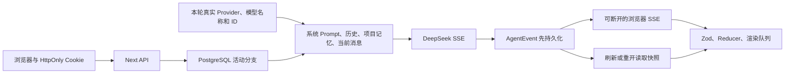

# 项目交接

## 当前结论

- 仓库：`LuzernRR/agent-workbench`，分支 `main`。
- 阶段 1 已由用户验收，Issue [#2](https://github.com/LuzernRR/agent-workbench/issues/2) 已关闭。
- 当前唯一功能：Issue [#3](https://github.com/LuzernRR/agent-workbench/issues/3)，动态模型身份与分层记忆契约已完成，等待用户验收。
- 正式地址：[http://localhost:3100/workbench](http://localhost:3100/workbench)。
- 真实配置：`config/agent-runtime.local.json`，禁止提交或复制密钥。
- 实现目录：`frontend/`；根目录文档记录架构、门禁与交接。
- 用户未明确验收阶段 2 前，不开始 LangGraph、ReAct、万能搜索 Agent 或其他新功能。

## 已实现

| 领域 | 当前事实 |
|---|---|
| 模型 | DeepSeek 真实 SSE；模型列表来自服务端统一配置；身份问题按本轮 Provider、模型名称和 ID 回答；浏览器不接触密钥 |
| 数据 | PostgreSQL 17 + pgvector 保存访客、项目、会话、运行、事件、附件和项目记忆 |
| 身份 | 高熵 `HttpOnly` Cookie；数据库仅存 SHA-256；所有 live 查询按访客隔离 |
| URL | 项目 `/workbench/p/{id}`；会话 `/workbench/t/{id}`；刷新和直达恢复同一选择 |
| 编辑 | 事务归档目标运行及下游活动分支，确认修改后旧回复立即消失 |
| 导航 | 左栏项目树包含所属会话；无项目会话单列但没有“独立会话”标题；每行单行裁切且不显示省略号 |
| 顶栏 | 项目名与会话名是两个独立点击目标；会话菜单只显示当前项目或无项目范围 |
| 拖拽 | 无长按等待；项目直接排序；会话可拖入、拖出和跨项目移动；刷新后保持 |
| 视觉 | 项目输入、消息编辑、按钮和菜单无矩形焦点框；空导航无说明占位；图片不显示文件名 |
| 输出 | 回复不显示“智能助手”；按内容选择表格、步骤、列表或短段落；移动端表格内部滚动 |
| 滚动 | 用户向上滚动后停止底部跟随；只有点击底部按钮才恢复 |
| 后台 | 页面隐藏时前端立即追平持久 delta；关闭页面和 SSE 后服务端仍生成并落库 |
| 停止 | 有真实 `runId` 才显示停止；事件串行落库；停止、完成、失败原子竞争唯一终态；重复停止幂等 |
| 记忆 | 同会话活动完成历史；同访客、同项目、跨会话共享；不跨项目、不跨访客；记忆内容按不可信事实背景注入 Prompt |
| 保留 | 会话最后活动超过 3 天且不在运行时自动删除；运行、事件、附件级联；有界项目记忆保留 |
| mock | 仅 `WORKBENCH_LLM_MODE=mock` 与 Playwright `3110` 使用；live 不显示种子、模拟工具或虚构状态 |

## 尚未实现

- Python + LangGraph 运行时尚未接入；当前 Agent 编排仍在 Next 服务端。
- 万能搜索 Agent、真实搜索、抓取、重排、声明级引用和验证循环尚未实现。
- pgvector 扩展和 `embedding` 字段已准备，但项目记忆当前按时间召回，不是语义检索。
- 图片只做存储与预览，没有进入多模态模型输入。
- 匿名 Cookie 不能跨浏览器、设备或清除 Cookie 后恢复；暂无登录、租户、角色和权限系统。
- 服务进程重启会把未完成运行标记失败；尚无 LangGraph checkpoint 续跑与外部任务队列。

## 关键链路

SSE 订阅不是运行所有者。`frontend/src/server/live/engine.ts` 中的后台执行先落库，再通知零个或多个订阅者；浏览器关闭只移除订阅者。`frontend/src/hooks/use-agent-thread.ts` 在页面隐藏后禁用逐字动画并立即应用完整 delta，避免恢复时慢速回放。

同一 live runtime 通过 `eventTail` 串行提交事件。停止先同步设置 `cancelled` 并中止 Provider，再由 `finalizeLiveRun()` 用条件更新抢占终态；线程状态、完成消息、项目记忆和终态事件与抢占结果保持同一事务。终态已存在时 stop API 返回实际状态，不写重复事件。

## 数据与配置

- 容器：`agent-workbench-postgres`，镜像 `pgvector/pgvector:pg17`，仅绑定 `127.0.0.1:5432`。
- 幂等 schema：`frontend/src/server/persistence/schema.ts`。
- 数据访问：`frontend/src/server/persistence/database.ts` 与 `frontend/src/server/live/store.ts`。
- 清理入口：`ensureLiveRecovery()` 首次 live 请求触发，之后按 `cleanupIntervalMinutes` 限频。
- 保留配置固定 `threadTtlDays: 3`；项目记忆默认最多 120 条、召回 24 条、上下文最多 16000 字符。
- 项目记忆字符预算包含角色标签和分隔符；首条超长内容也不会突破预算。
- `wb_project_memories.embedding` 为 nullable `vector`，不得在未实现 embedding 时宣称语义召回。

## 核心代码

- 壳层与顶栏：`frontend/src/components/workbench/app-shell/WorkbenchShell.tsx`
- 入口与 URL：`frontend/src/components/workbench/entry/WorkbenchEntry.tsx`
- 项目会话树：`frontend/src/components/workbench/sidebar/WorkbenchSidebar.tsx`
- 对话与滚动：`frontend/src/components/workbench/conversation/Conversation.tsx`
- 输入、附件、模型：`frontend/src/components/workbench/composer/AgentComposer.tsx`
- SSE 状态：`frontend/src/hooks/use-agent-thread.ts`
- 逐字与后台追平：`frontend/src/lib/agent-events/typewriter-queue.ts`
- live 运行：`frontend/src/server/live/engine.ts`
- live 数据：`frontend/src/server/live/store.ts`
- Prompt 策略：`frontend/src/server/live/prompt-policy.ts`
- 真实记忆集成契约：`frontend/src/server/live/store.integration.test.ts`
- DeepSeek：`frontend/src/server/llm/deepseek-client.ts`

## 已取得的验收证据

- 真实 DeepSeek：项目 A 会话 1 写入随机代号，会话 2准确召回；项目 B 返回“不知道”。
- 真实保留：4 天前会话清理前有 1 会话、1 运行、9 事件、1 附件、2 记忆；清理后原始链路全为 0，项目记忆仍为 2。
- 真实后台：浏览器上下文与 SSE 关闭后运行状态仍为 `completed`，447 个事件已落库，重开直接显示完整回复。
- 真实停止：UI 首次与重复停止均为 200；运行 `stopped`、线程 `idle`、取消事件唯一且为最后事件，等待 2 秒事件数不变，项目记忆为 0；刷新后可继续发起并停止新运行。
- 真实刷新：14 次 DOM 文字采样无首页招呼语、禁用空状态文字、乱码或错误归属。
- 真实身份：Cookie 刷新稳定、不同上下文不同、`HttpOnly`；数据库摘要长度固定 64。
- 自动化：16 个 Vitest 文件共 76 项、类型检查、全仓 Lint、生产构建、16 项 Playwright 全部通过；生产依赖审计为 0 个漏洞。
- Issue 证据：[阶段 1 验收记录](https://github.com/LuzernRR/agent-workbench/issues/2#issuecomment-5082415434)。
- 阶段 2 定向单测：Prompt/Store 共 17 项通过；真实 PostgreSQL 全生命周期集成场景通过。
- 阶段 2 真实身份：Flash 返回 `DeepSeek / DeepSeek V4 Flash / deepseek-v4-flash`；Pro 返回对应 Pro 名称和 ID。
- 阶段 2 真实记忆：刷新后同会话和同项目另一会话均召回 `PJ-51062349`；其他项目只返回 `UNKNOWN`。
- 阶段 2 全量门禁：85 项 Vitest、类型、Lint、生产构建、16 项 Playwright、UTF-8/LF、禁用文案、可见省略号、链接和依赖扫描全部通过。

## 接手顺序

1. 阅读 `README.md`、本文件和 `docs/development/2026-07-26-002-model-identity-memory.md`。
2. 运行 `git status --short`，保留用户改动和本地密钥。
3. 确认 `docker ps --filter name=agent-workbench-postgres` 为 healthy。
4. 在 `frontend/` 运行 `npm test`、`npm run typecheck`、`npm run lint`、`npm run build`、`npm run test:e2e`。
5. 阶段 2 未验收时只修复 Issue #3 回归，不创建下一功能。
6. 用户验收后关闭 Issue #3；建议下一功能是 Python/LangGraph 最小运行时与 PostgreSQL checkpoint，不同时接工具、搜索或 RAG。
