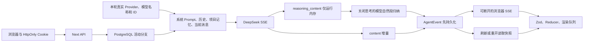

# 项目交接

## 当前结论（2026-08-03，Issue #29 Writer 纯 content 流式已验收，下一功能执行门放行）

- 本轮唯一功能为
  [#29](https://github.com/LuzernRR/agent-workbench/issues/29)“Writer 走纯 content 流式，回答正文
  逐块可见”，`Execution Gate: allowed`。开发记录见
  [033](docs/development/2026-08-03-033-issue-29-writer-content-streaming.md)。
- 方向由用户纠正后确定：**结构化输出服务于 Agent 的工具调用与内部决策，Writer 产出的是面向用户的
  自然语言，本就不该套 schema**。据此删除 `ComposeResult`，Writer 改走 `stream_writer_answer`
  （`stream=True` + `include_usage`，先若干 `str` 增量、最后一个 `ModelUsage` 作终结项）。这同时
  绕开了「结构化输出与 token 流式不可兼得」这一业界公认冲突，不需要增量解析半成品 JSON。
- 其它 5 个角色（Supervisor / Planner / Reflector / Verifier / Source Curator）仍走 strict function
  calling，`PRODUCTION_STRUCTURED_SCHEMAS` 保留这 5 个 schema，未动。
- 本轮关键设计是 `_AnswerStreamEmitter`：前端已可见消息不可回写，因此公开文本必须始终是终稿 answer
  的前缀。三条规则各封死一处差异来源——只在完整句子边界放行、只放行 `_clean_answer_prefix` 不会再删
  的文本、`[来源N]` 按首次出现顺序增量归一（State 仍存原始编号，归一化全程只发生一次）。第二条是
  复核 `_compact_answer_markdown` 时自查发现的缺口（末尾停在悬空标题会被终稿删掉却已公开），已补测试
  锁定。
- 新增 `answer.started/delta/completed` 三个内部事件（只含 `composeRound` 与 `delta`），由 BFF mapper
  投影为 `message.*`；`answerMessageId()` 在改写轮（`composeRound > 0`）追加 `_r{N}`，避免续写在已
  可见的上一版答案上。engine 用 `streamedMessageId` 防护，结算只补 citations，不整段重发。
- 打字机队列改为按积压提速（1 → 最多 24 字/帧），backlog 有界且仍保持逐字 append、顺序不变、不回写。
- 门禁：`pytest -q` 399 passed、`ruff check .` 全通过、`npx tsc --noEmit` 干净、`npx vitest run`
  398 passed / 1 skipped、`npm run test:e2e`（mock 3110）16 passed / 3 skipped（skipped 为需真实
  provider 的 live spec，与基线一致）；14 个改动文件均 UTF-8 + 纯 LF，`git diff --check` 无告警。
- A5 / A11 已在真实 provider 链路实测（本地未提交代码跑 8101，对照旧提交代码的容器 8080，
  `promptVersion=2026-08-03.v42-writer-content-streaming` 确认被测的是新代码）：新链路
  `firstVisible` 由 `answer.delta` 给出、`isPrefix=True`、`streamedEqualsFinal=True`、字段白名单
  违规 0；旧链路正文只在 `run.completed` 一次性交付（`deltas=0`，`firstVisible=40453ms`）。
- **但 A5 的实际收益有限**：三次运行的 `firstVisible/total` 为 95%(34107/32438)、90%(50177/45092)、
  91%(3538/3232)——34s 的运行里流式窗口只有约 1.7s。空窗的 90–95% 属于 Writer 之前的
  research → reflect → replan 链路，不是 Writer 本身。要真正降低体感等待，得靠缩短前置链路
  （见下条），Writer 流式只是必要前提。
- 实测同时印证了用户反馈的「链路太长」：三次运行 `fastPath=False`，**包括跑旧提交代码的容器**，
  因此不是 #29 引入的回归。「今天是几号」这类单事实问题的 nodeOrder 出现两轮
  `plan_research → … → reflect`，从未走 `plan_fast_search`/`accept_fast_evidence`；其中一次以
  `stopReason=MODEL_CALL_LIMIT`、`responseStatus=partial`、`verificationPassed=false`、10 次模型调用
  结束。根因在 `nodes.py` 的 `_fast_search_request()` 返回 None，即 Supervisor 未给出
  `evidence_depth="single_fact"`（或 `fast_search` 不合法）——属 #28 的语义判定缺口，单独立 Issue。
- 用户 2026-08-03 授权「你自己测试一下，然后没问题就可以验收」，自测全绿后受控收口。
- 下一功能执行门：放行（阶段 3 起按序排队：researcher 降 effort → Verifier 拆分 → run 级
  `replan_budget`；随后阶段 4/5 与 Item I，一 Issue 一 feature，不得提前开工）。
- 新立 Issue（尚未开工）：单事实快路径未生效导致链路冗余，须先做成熟产品的设计调研——一次搜索满足
  即收口，不满足才二次搜索。

## 当前结论（2026-08-03，Issue #28 已验收关闭，下一功能执行门放行）

- 用户 2026-08-03 回复「通过，继续」，验收
  [#28](https://github.com/LuzernRR/agent-workbench/issues/28)「Supervisor 增加 evidence_depth 分层，
  单事实问题走 1 次搜索快路径」。受控收口提交 `741e047` 已推送 `main`，Issue 以 completed 关闭。
- [#25](https://github.com/LuzernRR/agent-workbench/issues/25)「修复被误标 Content-Type 的网页无法
  读取正文」同轮一并验收，收口提交 `181db68`，Issue 以 completed 关闭。两项按 Issue 边界拆成独立
  提交：`181db68` 只含类型门禁三层判定与 `config/.gitignore` 的 `*.local.json.bak-*`；`741e047` 只含
  #28 的 schema / 状态位 / 两个确定性节点 / 快路径路由 / Prompt v41。
- 下一功能执行门：放行（阶段 2 按序排队：Writer 流式 → researcher 降 effort → `asyncio.as_completed`
  先到先用 → prompt-caching 等，一 Issue 一 feature）。

## 当前结论（2026-08-03，Issue #28 单事实快路径已实现，等待验收）

- 本轮唯一功能为
  [#28](https://github.com/LuzernRR/agent-workbench/issues/28)“Supervisor 增加 evidence_depth 分层，
  单事实问题走 1 次搜索快路径”，`Execution Gate: allowed`。目标是让**链路成本匹配问题复杂度**，
  不是减少搜索：`single_fact` 仍然真实联网检索、仍然读正文、仍然过 Verifier 硬门禁。
- `IntentResult` 新增两个必填字段 `evidence_depth: single_fact|multi_source` 与
  `fast_search: PlannedSearch | None`，由 `model_validator` 锁死组合：不搜索 ⇒ 必须 multi_source +
  fast_search=null；single_fact ⇒ 必须恰好一个渠道、必须给 fast_search、且 `fast_search.channel ∈
  channels`。分层由 Supervisor **语义判定**，服务端不写关键词表，也从不代猜查询文本。
- 新增两个**确定性节点**（不调模型、不发公开摘要）：`plan_fast_search` 用 Supervisor 给出的
  query/channel 直接建 1 步计划；`accept_fast_evidence` 把本轮读到正文的 Evidence 从 `read` 迁移到
  `accepted`。后者是本轮的关键发现——完整链路的 `read → accepted` 迁移由 Reflector/Source Curator
  完成（`nodes.py:2471`），而 `answerable_evidence()` 只接受 `accepted/cited`；跳过 Reflector 却不补
  这一步，快路径的证据将永远不可作答。
- 新增显式 `fast_path: bool` 状态位：`plan_fast_search` 置 True，`plan_research` 的**每个**返回路径
  清 False。若不这么做而让路由重读 `intent`，一旦降级到完整链路会被 single_fact 条件反复命中，
  永远回不去。
- **目标从「2 次模型调用」下调为 3 次**（intent + compose + verify），并已记入 Issue #28。原因是两个
  硬门禁（`nodes.py:2530`、`nodes.py:2585` 的 missingChannels 检查）都位于模型节点 `verify` 内部，
  用户明令不得绕过。省下的是 Planner + Reflector（+ Source Curator）与最多 2 轮补搜，这才是延迟主体。
- 快路径节点序列：`load_context → classify_intent → plan_fast_search → mark_plan_running →
  merge_research → accept_fast_evidence → compose → verify → finalize`，1 次工具调用。任一环节不成立
  （缺 fast_search、渠道非法、预算为 0、计划校验失败、没读到正文、verify 判 research_more）都自动退
  回完整链路，不自行编造查询、不凭记忆作答。
- Prompt 版本 `2026-08-03.v41-supervisor-evidence-depth`，只追加判据说明与约束，不含任何固定问答模板。
- 门禁：Search Agent `390 passed`；Ruff `All checks passed`；compileall 0；`git diff --check` 0；
  7 个改动文件均为 UTF-8 + LF + 无 BOM。前端安全性由既有 `reducer.ts` 的 `sourcePresentations.size &&`
  守卫保证：跳过 reflect 不清空 UI，也不逼前端自造过程文案（`AGENTS.md:50`）。
- 遗留：`nodes.py:394` `_freshness_required()` 关键词正则仍覆盖 Supervisor 语义，按用户要求待本分层
  验证稳定后单独开 Issue 移除。阶段 2–5（Writer 流式、researcher 降 effort、`asyncio.as_completed`
  先到先用、prompt-caching 等）按序排队，一 Issue 一 feature。
- 详见 `docs/development/2026-08-03-032-issue-28-single-fact-fast-path.md`。

## 上一轮结论（2026-08-03，Issue #25 误标 Content-Type 网页无法读取正文，等待验收）

- 本轮唯一功能为
  [#25](https://github.com/LuzernRR/agent-workbench/issues/25)“修复被误标 Content-Type 的网页无法
  读取正文，导致证据为空”。只改 `services/search-agent/app/tools/fetch_page.py` 与其测试，不动
  事件契约、Prompt 与任何 tracked 共享配置。
- 这是一个**正确性缺陷伪装成的性能问题**：类型门禁误拒可读页面 → `web.py:65` 跳过 →
  `evidence_count=0` → Reflector 判 insufficient → 再规划一轮 → 触顶 `MAX_ITERATIONS` → partial、
  0 引用。实测单次 run 38-73s，其中 67% 花在工具调用。延迟是重试的结果，不是原因。
- 两类误判已修复：其一，RFC 9110 §5.2 允许把重复字段行按逗号合并（CDN 会发
  `text/html, text/html`），旧 `.split(";",1)[0]` 解析不出白名单类型；其二，
  `application/octet-stream` 是“服务器没主动标注”的默认值，实测有站点用它返回真 HTML。现按三层
  判定：明确二进制大类**不读 body** 直接拒绝 → 白名单文本照旧接受 → 其余给一次首 512 字节嗅探。
- 安全上的关键点：嗅探**必须在流式读取中做**。本轮中途曾用 `await response.aread()` 实现嗅探，
  那会在体积上限生效前把整页读进内存，等于为判类型引入一条无界内存路径，且恰好作用在最可疑的
  那批响应上。已改为边流式读边判，`MAX_RESPONSE_BYTES` 全程有效；既有
  `test_declared_oversized_response_is_rejected_before_buffering` 仍通过。另：状态码 >= 400 不做
  类型门禁，避免用“不支持的响应类型”掩盖真实 HTTP 失败原因。
- `fetch_pages` 曾被改为 `asyncio.wait` 早退（新增 `success_target`），**已还原**为原本的
  `asyncio.gather`：全仓 grep 确认无任何调用方传该参数，`target` 恒等于 `len(urls)`，行为与
  `gather` 完全一致，属没有调用方的推测性代码。早退需连同过量提供候选的调用方一起改（阶段 4）。
- 门禁：Search Agent `384 passed`（改前 378，本轮 +6）；Ruff `All checks passed`；compileall 0；
  `git diff --check` 0。真实站点复验 `m.tthuangli.com` 由 `不支持的响应类型：application/octet-stream`
  变为 `ok=True status=200`。`packages/contracts/python` 因当前 venv 缺 `jsonschema` 无法收集，
  属预存环境问题，本轮未改动该目录。
- 未修复且已记录：`www.timeanddate.com` 仍 `HTTP 403`（反爬，与本 Issue 无关，不声称修复）；
  `web_search.py:383-385` 的 `auth_required` 未设上限，401 会走遍整个 Key 池；`reducer.ts:338`
  导致点击发送后耗时显示空窗；`nodes.py:394` `_freshness_required()` 关键词正则覆盖 Supervisor
  语义。四项各自另开 Issue，均未并入本轮。
- 详见 `docs/development/2026-08-03-031-issue-25-mislabeled-content-type.md`。

## 上一轮结论（2026-08-02，Issue #24 工具过程文案单一真相源已验收关闭）

- 本轮唯一功能为
  [#24](https://github.com/LuzernRR/agent-workbench/issues/24)“收敛工具过程文案到单一真相源，移除
  前端自撰陈述”，`Execution Gate: allowed`。纯前端改动，不动后端事件契约。修正三处违反
  `AGENTS.md:50`（公开过程文案只能来自版本化 LangGraph Agent 输出）的位置：`ActivityRow.tsx` 的
  `summarizeSearchActivity` 用前端去重结果重算「找到 N 条结果，读取 M 个来源」，与后端原文可能不
  一致；`isPlaceholderTool`/`commandTool` 分支为终端类工具发明「运行了多个命令」「命令未能完成」
  等过程陈述；`reducer.ts` 的 `tool.started` 与 `run.completed` 兜底会在上游漏填时替 Agent 断言
  「正在准备」与核验结论。现结算行只渲染后端 `settlementSummary` 原文，缺原文即不渲染；主文案取
  `summary || name`；reducer 兜底改为留空并由消费方回落到工具名，核验结论缺失时不生成状态行。
- 取证排除（不属于 #24）：`mapper.ts:375-379` 的三条终态文案与 `nodes.py:2750`/`nodes.py:2524` 的
  `response_status`/`verification_passed` 取值一一对应，自洽且由 BFF 统一投影，不是缺陷；
  `mapper.ts:142` 与 `mock/engine.ts:44` 证明两条生产路径始终填 `name`+`summary`，所以 reducer 的
  旧兜底是不可达死默认——修正它是消除潜在风险，不是修 line bug。
- 新增契约测试锁住这个不变量：`mapper.test.ts` 断言三个渠道与 `unknown_tool` 的 `tool.started`、
  三种终态组合的 `run.completed` 都自带非空过程文案；`scripts.test.ts` 断言 mock 两条分支的每个
  工具步骤都有非空 `name`/`summary`；`reducer.test.ts` 断言上游漏填时状态里不出现
  「正在准备」「回答已通过证据核验」「本次回答未完全核验」。
- 门禁：Web `394 passed, 1 skipped`；typecheck 0；lint clean；build 成功；Playwright
  `16 passed, 3 skipped`（3 条 live 用例需真实 Provider）；Search Agent `378 passed`；Ruff 0；
  compileall 0；`git diff --check` 0。`packages/contracts/python` 因当前 venv 缺 `jsonschema`
  无法收集，属预存环境问题，本轮未改动该目录。
- 详见 `docs/development/2026-08-02-030-issue-24-process-text-single-source.md`。
- 验收：用户 2026-08-02 回复“通过”，#24 已 accepted 并以 completed 关闭，下一功能执行门放行。

## 历史结论（2026-08-01，Issue #23 可观测性 / 可选 LangSmith / 完整离线评测已验收关闭）

- 本轮唯一功能为
  [#23](https://github.com/LuzernRR/agent-workbench/issues/23)“实现可观测性、可选 LangSmith
  tracing 与完整离线评测体系”，`Execution Gate: allowed`。三项能力正交实现，均复用既有公开事件流
  与隐私门，不新开第二套运行循环或第二套隐私规则。`#22` 因小红书工具账号 `AUTH_REQUIRED` 需用户
  扫码重登，属外部平台阻塞，标记 parked 且不关闭。
- 可观测性：`app/observability/` 新增 `RunTracer` 从公开事件流派生 run/node/tool span；`model`
  span 因模型层不发事件，改由 contextvar 绑定的 `record_model_call` 上报，不进入 State、
  checkpoint、事件或日志。tracing 关闭时 `tracing_enabled()` 为假，模型层跳过全部计时开销，
  NDJSON 事件流逐字节不变（`test_tracing_does_not_change_the_public_event_stream` 断言
  `traced == untraced`）。span 属性经 `_assert_public` + allowlist 双重门控，自由文本进不了 span；
  sink 抛错只降级为 `sinkFailures` 计数，绝不影响 run 终态。
- 可选 LangSmith：`langsmith_sink_from_env` 仅在 `SEARCH_AGENT_LANGSMITH_ENABLED` +
  `LANGSMITH_API_KEY` 同时存在时启用，缺依赖/缺密钥/客户端构造失败均返回 `None` 静默关闭；导出
  `inputs={}`，问题原文与 Prompt 不离开本进程；禁止字段导出计数为 0。
- 完整离线评测：`app/evaluation/` 用 `ReplayGraph` 复用 `HarnessRunner.stream()`（静态断言 runner
  模块不含 `graph.astream`/`initial_state`/`stream_mode`，仅 1 处 `runner.stream(`）；无 live 图，
  真实 Provider 路径结构上不存在。9 个确定性 scorer（终态唯一、node 配对、Evidence 迁移、Citation
  溯源、账本完整、计划合法含依赖环检测、路由/渠道、禁止字段、延迟）每维有正反例，反例真被判 fail。
  同一 dataset 连续两次运行报告 SHA-256 相同；`evaluation/gold/search-agent.json` 6 用例，密钥
  扫描仅命中 token 计数字段。
- 门禁：Search Agent `378 passed`、Ruff 0、compileall 0；评测 CLI 6 用例 × 9 维度全通过 `EXIT=0`；
  共享合同 `6 passed`；Web 未改动（改动为 Python-only），回归确认 `388 passed, 1 skipped`；
  `git diff --check` 通过。完整记录见
  `docs/development/2026-08-01-029-issue-23-observability-langsmith-evaluation.md`。
- 验收：用户 2026-08-02 回复“通过”，#23 已 `accepted` 并以 completed 关闭，下一功能执行门放行。

## 当前结论（2026-08-01，Issue #22 Markdown 信息层级已部署，待小红书重新登录后补终验）

- 当前活动 feature 为
  [#22](https://github.com/LuzernRR/agent-workbench/issues/22)“优化字段型回答的 Markdown 信息层级”，
  `Execution Gate: allowed`。字段型回答不再把第一字段作为一级编号项、其余字段做嵌套列表；每条
  现在由模型依据该条 Evidence 生成 `### N. 对象/场景短标题`，标题后空行，全部用户字段按原顺序
  使用无缩进同级列表，明确要求的安全边界单独放入 Markdown 引用块。
- 动态合同只从当前问题提取条数和字段名，不包含防晒对象、产品、体验、结论或固定免责声明。
  确定性检查会拒绝字段连续堆叠、旧嵌套布局、无/空/重复字段标题、标题带引用或占位、标题后
  缺空行、嵌套字段、缺字段、乱序、附加表格和来源错位；只触发受控模型改写，不生成模板答案。
  普通搜索回答和“你是谁”等直接回答不套用该结构，逐 grapheme、append-only 流式边界未修改。
- 真实生产 Web 运行 `run_dc60cdb14166475ab9eac7250feeade6` 使用 Python 官方文档与动态
  “主题 / 适用场景 / 核心说明 / 来源链接”字段，两个真实工具调用后以 `VERIFIED / completed`
  收口；持久回答包含 3 个 h3 标题、12 个同级字段、3 个 Citation，0 个旧嵌套字段，Prompt 为
  `2026-08-01.v40-markdown-record-hierarchy`，证明没有写死防晒模板。
- 使用原始防晒问题与生产 `run_755ff83b07a44f7987eb79a6be62d64c` 的 3 条真实已核验小红书
  Evidence 做当前线上 v40 隔离评测：一次 Writer 生成 3 个标题、15 个同级字段与安全引用块，
  确定性格式问题为空，Verifier `pass`。该评测不发起新搜索、不写用户会话或长期记忆，不能冒充
  新的端到端生产运行。
- 原问题的新生产运行 `run_35d6136fab0b439983acef73d14cbf7f` 真实结算两个工具，但小红书
  工具账号已返回 `AUTH_REQUIRED`，0 Evidence，以 `RUN_TIME_RESERVE / partial` 诚实降级。工具账号
  登录二维码端点先 65 秒超时，保留私有会话卷重启工具容器后仍返回 500，当前无法由用户扫码。
  因此 #22 的“原始小红书问题新生产持久回答”验收项保持未勾选，Issue 不关闭。
- 门禁：Search Agent `262 passed`、Ruff、compileall；共享合同 `6 passed`；Web
  `388 passed, 1 skipped`、typecheck、lint、production build；Playwright
  `16 passed, 3 skipped`；`git diff --check` 通过。已保留
  `agent-workbench/search-agent:pre-issue-22-6368e14` 并滚动部署 Search Agent；七服务 healthy，
  3000、8080 与 [https://luzern.cc.cd/workbench](https://luzern.cc.cd/workbench) 均为 200。
  完整记录见 `docs/development/2026-08-01-028-issue-22-markdown-record-hierarchy.md`。

## 当前结论（2026-08-01，Issue #21 已核验证据长期记忆已贯通）

- 本轮唯一功能为
  [#21](https://github.com/LuzernRR/agent-workbench/issues/21)“完善可审计的已核验证据长期记忆”，
  `Execution Gate: allowed`。只有最终 `VERIFIED` 且答案实际引用的 `cited Evidence` 能进入
  Milvus；`partial/direct/read/accepted/rejected`、停止、取消和失败运行均不写入。
- `memoryRef` 由服务端依据 tenant、visitor、project、`evidenceId`、`contentHash` 与
  `embeddingVersion` 生成稳定 SHA-256 身份；记录同时保存 `sourceId/sourceRunId/source URL/title/
  capturedAt` 和严格作用域。召回强制过滤 visitor、project、类型、active 状态与 embedding 版本，
  缺失 provenance 的旧记录不会被采用。
- 证据记忆不再在 `load_context` 阶段拼入会话历史。只有已经判定需要搜索的 Planner 才收到有界、
  明确标注可能过期的 `memory_candidates`，用于形成新的检索；它们不进入当前 Evidence、Citation、
  Writer 或 Verifier。公开 `memory.updated` 只含 operation/status/count、稳定引用 ID、embedding 版本、
  时间元数据与受控 reasonCode，不含正文、Prompt、Provider body、Cookie、token、私有 CoT 或
  `reasoning_content`。
- BFF 严格校验并持久化 recall/store 生命周期；Reducer 以 `runId + operation` 幂等归并，已完成状态
  不会被后续降级事件倒退。Workbench 仅显示“召回 N 条历史证据线索 / 保存 N 条已引用证据”或受控
  降级状态；mock 运行器也已改用同一公开合同，不再发旧版正文数组。
- 生产项目 A 首轮 `run_755ff83b07a44f7987eb79a6be62d64c` 真实调用两次小红书工具，以
  `VERIFIED / completed` 保存 3 条已引用证据；同项目第二轮
  `run_3c531b601202468b94cdbe4048bd0fdf` 召回完全相同的 3 个 `memoryRef/evidenceId`，随后仍完成
  4 次真实工具调用。项目 B 的相近请求 `run_7060f03b133041a88449d86f75f6300f` 召回 0 条并完成
  2 次真实工具调用，证明项目隔离；记忆引用在非 memory 事件中的持久出现数为 0。
- 门禁：Search Agent `262 passed`、Ruff、compileall；共享合同 `6 passed`；Web
  `387 passed, 1 skipped`、typecheck、lint、production build；Playwright
  `16 passed, 3 skipped`；`git diff --check` 通过。已保留
  `agent-workbench/{search-agent,web}:pre-issue-21-9ca2ee2` 并滚动部署 Search Agent 与 Web；
  Compose 七服务 healthy，3000、8080 与
  [https://luzern.cc.cd/workbench](https://luzern.cc.cd/workbench) 均为 200。完整记录见
  `docs/development/2026-08-01-027-issue-21-auditable-evidence-memory.md`。

## 当前结论（2026-08-01，Issue #19 Evidence 生命周期已贯通）

- 本轮唯一功能为
  [#19](https://github.com/LuzernRR/agent-workbench/issues/19)“实现 Evidence 生命周期与可审计状态”，
  `Execution Gate: allowed`。每条真实已读正文现在由服务端基于 URL 与正文生成稳定
  `sourceId/evidenceId/contentHash`，状态只允许 `read -> accepted -> cited` 或
  `read -> rejected`；同状态重放幂等，身份漂移或倒退以 `EVIDENCE_STATE_CONFLICT`
  fail-closed，模型不能创建或修改 ID。
- `merge_research` 只为真实正文创建 `read`；Reflector/Source Curator 依据真实来源展示结果标记
  `accepted/rejected`，未决正文保留 `read`。Writer、Verifier、Citation 与长期记忆只消费
  `accepted/cited`；最终只有答案实际出现且可解析的 `[来源N]` 对应 Evidence 进入 `cited`，不再
  为未引用正文自动发布 Citation。
- `evidence.updated` 公开事件只含 ID、SHA-256、`toolCallId`、URL、标题、渠道、结构化状态、
  reasonCode 与时间。BFF 严格 Zod 白名单将其持久化到原工具来源，Reducer 只接受合法单向迁移并
  在刷新/replay 时拒绝倒退或同 URL 身份漂移；Workbench 统一显示“已读取 / 已采用 / 已排除 /
  已引用”，不生成模型推理文案，也不保存正文、Prompt、Provider body、Cookie、token、私有
  CoT 或 `reasoning_content`。
- 真实小红书运行 `run_32747c65d748476d99e723007adf8a14` 用时 31.493 秒，两次工具调用均
  success、各 5 个候选与 3 条正文；6 个稳定 Evidence 均经历 read/accepted，其中答案实际引用
  的 3 个进入 cited，另 3 个保持 accepted，助手消息恰有 3 个 Citation，最终
  `VERIFIED / completed`。持久公开事件敏感字段扫描为 0。UTF-8 身份回归
  `run_f1b18b5a46184e3c92251fac67cce5a5` 在已有其他主题消息的同一线程中用时 2.945 秒，由模型
  一次调用直接回答“你是谁”，0 plan、0 tool、0 Evidence。
- 门禁：Search Agent `258 passed`、Ruff、compileall；共享合同 `6 passed`；Web
  `385 passed, 1 skipped`、typecheck、lint、production build；Playwright
  `16 passed, 3 skipped`；`git diff --check` 通过。已保留
  `agent-workbench/{search-agent,web}:pre-issue-19-244a553` 并滚动部署 Search Agent 与 Web；
  Compose 七服务 healthy，3000、8080 与
  [https://luzern.cc.cd/workbench](https://luzern.cc.cd/workbench) 均为 200。完整记录见
  `docs/development/2026-08-01-026-issue-19-evidence-lifecycle.md`。早先一次 PowerShell 探针未显式
  使用 UTF-8，持久输入已被核对为 `???`，不作为产品路由证据；修正编码后的搜索与身份回归均
  按真实意图执行。

## 当前结论（2026-08-01，Issue #20 模型 Markdown 字段输出已优化）

- 本轮唯一功能为
  [#20](https://github.com/LuzernRR/agent-workbench/issues/20)“优化模型结果的 Markdown 字段布局”，
  `Execution Gate: allowed`。修复前只检查字段出现和顺序，模型把“肤质与场景 / 使用感受 /
  防晒产品类型 / 可能不适合的人群 / 来源链接”挤在同一段仍会被放行。
- 当前问题中的引号字段和条数仍由服务端动态提取，不包含防晒答案模板。Writer 现在生成 Markdown
  编号一级记录，字段名加粗、字段逐行、其余字段为缩进子列表，记录间保留空行；字段对象、值和
  [来源N] 均来自真实模型与已读 Evidence。确定性检查会拒绝行内堆叠、缺字段、乱序、缺空行以及
  “来源链接”未列全该条实际引用的输出，并触发最多一次模型改写。
- Writer/Verifier 增加了领域无关证据规则：优先选择指定字段覆盖更完整的正文；只有标题、类别或
  场景清单的弱来源不能凑条数；每条必须保留具体对象，分类缺失时可如实说明，不得用用户问题的
  筛选词、产品名暗示或“可以推断”补写正文没有的事实。次要字段准确写“正文未说明”本身不是
  拒绝理由。
- 字段型 Markdown 的交付上限单独调整为 1100 个 Unicode 字符，避免 3–5 条多字段记录被 760 字
  默认边界截掉来源或必需免责声明；普通检索和“你是谁”等直接回答仍保持 760 字上限。工具调用
  达到上限后禁止继续搜索，但仍允许唯一一次不调用工具的答案改写，不再错误阻断收尾。
- 真实小红书运行 `run_issue20_markdown_v38_1785585531370` 在 86.061 秒完成两次真实工具调用，
  两次均 `success`、各读取 3 条正文，0 node.failed；模型输出 3 条完整 Markdown 记录、3 个字段
  子项、记录空行、真实 Citation 和非医疗边界，`answerSource=model`。严格 Verifier 对正文未说明
  字段仍产生 false negative，运行诚实以 `REWRITE_LIMIT / partial` 收口。后续 v39 运行又遇到
  小红书 MCP 90.180 秒受控降级并以 `RUN_TIME_RESERVE / partial` 收口；未伪报 verified。
- 门禁：Search Agent `250 passed`、Ruff、compileall；共享合同 `6 passed`；Web
  `381 passed, 1 skipped`、typecheck、lint、production build；Playwright `16 passed, 3 skipped`；
  `git diff --check` 通过。已保留 `agent-workbench/search-agent:pre-issue-20-f980ca9`，最终仅滚动
  部署 Search Agent；七服务 healthy，3000、8080 与
  [https://luzern.cc.cd/workbench](https://luzern.cc.cd/workbench) 均为 200。完整记录见
  `docs/development/2026-08-01-025-issue-20-markdown-output.md`。

## 当前结论（2026-08-01，Issue #18 Web 正文读取延迟与部分成功已优化）

- 本轮唯一功能为
  [#18](https://github.com/LuzernRR/agent-workbench/issues/18)“优化 Web 正文读取延迟与部分成功
  可靠性”，`Execution Gate: allowed`。旧 `fetch_page` 会分别给 robots 最多 10 秒、正文最多
  20 秒，单页总耗时可叠加；`fetch_pages` 又把同域并发固定为 1，三个同域候选最坏接近
  90 秒，外层时间保留可能取消整次工具调用并丢掉已完成正文。
- 单页 20 秒现在是覆盖 robots、DNS/SSRF 校验、逐跳重定向、正文与可选动态层的总 deadline；
  单页超时只返回该页稳定 `timeout` FetchResult，不取消同批其他页面。外部 stop/cancel 仍传播
  `CancelledError`，不会被伪装成普通页面超时。
- 正文并发硬上限保持全局 3，同一域名从完全串行调整为有界 2；三个同域页面按 2+1 批次执行。
  URL policy、固定公网 IP、Host/TLS SNI、每跳 robots 重检、内容类型/体积上限和动态抓取
  fail-closed 均未放宽。
- 首页奖学金真实生产回归 `run_issue18_scholarship_1785583215521`：两个 Web 工具分别为
  44.462 秒和 58.565 秒，对比 #17 的 75.055/84.501 秒基线分别减少 30.593/25.936 秒；
  整轮从 103.334 秒降到 80.359 秒，取得 3 条正文 Evidence。外部搜索仍未覆盖用户全部硬条件，
  因而诚实以 `RUN_TIME_RESERVE / partial` 收口，没有伪报 verified，也没有领域污染、节点失败或
  禁止字段。
- 门禁：新增 deadline、同域/跨域并发、部分成功与取消测试；Search Agent `247 passed`、Ruff、
  compileall；共享合同 `6 passed`；Web `381 passed, 1 skipped`、typecheck、lint、production
  build。Playwright 首次因未在 12 秒出现“滚动到底部”按钮而偶发失败，同用例单独复跑通过，
  随后全量 `16 passed, 3 skipped`；`git diff --check` 通过。
- 已保留 `agent-workbench/search-agent:pre-issue-18-df143b3` 并只滚动部署 Search Agent；七服务
  healthy，3000、8080 与 [https://luzern.cc.cd/workbench](https://luzern.cc.cd/workbench)
  均为 200。下一独立 feature 回到 Evidence 生命周期/状态机与声明级关联，不再扩展抓取器。
  完整记录见 `docs/development/2026-08-01-024-issue-18-web-fetch-latency.md`。

## 当前结论（2026-08-01，Issue #17 当前意图隔离与检索计划预算已完成）

- 本轮唯一功能为
  [#17](https://github.com/LuzernRR/agent-workbench/issues/17)“修复当前意图隔离与检索计划预算”，
  `Execution Gate: allowed`。真实故障运行 `run_c0e55bd0d19646f19bceacbe092eb30b`
  的持久输入确为“你是谁”，但旧配置 `forceSearch=true` 和 Supervisor 的强制搜索规则跳过了
  真实意图判断；完整奖学金历史又被交给 Planner/Writer，最终产生无关检索和“Writer Agent”
  自称。这不是线程事件串线。
- 生产现在由真实 structured Supervisor 返回 `need_search/channels/use_history`。当前消息是唯一
  权威任务；只有它含有必须依赖历史才能消解的明确指代时，后续直接回答才收到历史。独立问题
  不再把旧主题交给 Writer。身份回复仍由模型生成，前端和服务端没有固定身份答案、关键词问答
  或伪造的思考文案。
- Planner 每轮最多接受两个高区分度步骤，步骤数、单步证据目标和总证据容量均由真实剩余工具/
  正文预算校验；超预算计划只允许一次真实模型修复，非法快照不公开。上游失败导致依赖不可达时
  会进入 Reflector，不再误报 `PLAN_NO_RUNNABLE_STEP`；工具成功取得至少一条正文时计划步骤记为
  done，证据是否充分交由 Evidence 节点判断；重规划前还会保留 Planner 与最终写作/核验时间，
  不创建一个随后必然全部 blocked 的新计划。
- 通用 Reflector、Writer、Verifier 已删除防晒、肤质、不适人群和医疗免责声明等案例专属规则。
  条目、字段、筛选条件和领域安全边界只从当前问题提取；地域、时间、资格和状态不满足的对象
  不得作为合格结果。Prompt 版本为 `2026-08-01.v30-domain-neutral-contracts`。
- 生产验收 `run_issue17_direct_v30_1785582433089` 在 3.593 秒内直接模型回答“你是谁”，
  0 plan、0 tool、0 node.failed，旧奖学金历史未进入答案。首页奖学金回归
  `run_issue17_scholarship_final2_1785582623189` 真实调用两个 Web 工具、获得 1 条正文 Evidence，
  无领域污染或禁止字段；一个步骤 done，另一个因真实网页读取超过保留窗口以
  `RUN_TIME_RESERVE` blocked，最终诚实 partial。它证明搜索路由仍真实可用，也暴露出下一项应
  独立优化的 Web 正文读取延迟，不能把 partial 伪报为完成。
- 门禁：Search Agent `242 passed`、Ruff、compileall；共享合同 `6 passed`；Web
  `381 passed, 1 skipped`、typecheck、lint、production build；Playwright
  `16 passed, 3 skipped`；`git diff --check` 通过。已保留
  `agent-workbench/search-agent:pre-issue-17-e9edb65` 并滚动部署 Search Agent；七服务 healthy，
  3000、8080 与 [https://luzern.cc.cd/workbench](https://luzern.cc.cd/workbench) 均为 200。
- 下一独立 feature 应优化 Web 正文读取的同域串行慢路径、每页超时和可用正文优先级，目标是在
  保持 URL/robots/SSRF 安全边界的前提下降低 60–85 秒工具调用；之后继续 Evidence 状态机。
  完整记录见 `docs/development/2026-08-01-023-issue-17-current-intent-routing.md`。

## 当前结论（2026-08-01，Issue #16 小红书工具会话二维码竞态已修复）

- 本轮唯一功能为
  [#16](https://github.com/LuzernRR/agent-workbench/issues/16)“修复小红书工具会话安全验证
  二维码”，`Execution Gate: allowed`。生产上先真实复现：登录态为 true，同词搜索在 0.8 秒
  返回 `CAPTCHA_REQUIRED`，原隔离浏览器已停在 `/website-login/captcha` 且页面存在
  `qrcode-img` data PNG，但立即启动 challenge 偶发在约 10 秒后返回
  `VERIFICATION_QRCODE_UNAVAILABLE`。
- 根因是 `StartLoginVerification` 先启动另一个只读浏览器导航并解析预期账号，再回头读取触发
  CAPTCHA 的原页面；账号探测延迟会错过短时二维码窗口。现在顺序改为先从原隔离 page/browser
  捕获并校验 PNG，只保存在进程内存，再确认当前工具账号；账号不稳定、ID 缺失或不一致仍
  fail-closed，二维码、Cookie、token 和账号 ID 不进入公开响应、日志或持久化。
- 新增顺序回归测试：测试会在账号解析时使模拟二维码失效，只有“二维码 -> 账号”顺序才能
  建立 pending challenge。Go 全量 `go test ./...` 通过；镜像构建阶段再次全量通过。
- 用户完成扫码后，旧手工 challenge 正好越过截止边界并记录 `VERIFICATION_TIMEOUT`，没有把它
  伪报为 `succeeded`；但平台侧风险状态随后已解除。部署新镜像后，同一“油敏皮夏季通勤防晒”
  真实搜索 3.7 秒返回 20 个候选，连续读取 5 篇正文全部成功，正文长度为
  16、99、1032、32、662 字，0 CAPTCHA、0 detail error。当前平台不再产生 challenge，因此
  没有伪造第二张无关二维码。
- 门禁：Go 全量通过；Search Agent `231 passed`、Ruff、compileall；共享合同 `6 passed`；Web
  `381 passed, 1 skipped`、typecheck、lint、production build；Playwright
  `16 passed, 3 skipped`；`git diff --check` 通过。
- 已保留 `agent-workbench/xiaohongshu-mcp:pre-issue-16-8650bfc`，只滚动部署
  `xiaohongshu-mcp`。容器 healthy，3000 与
  [https://luzern.cc.cd/workbench](https://luzern.cc.cd/workbench) 均为 200。
- 下一独立 feature 必须修复真实运行 `run_c0e55bd0d19646f19bceacbe092eb30b` 的当前意图
  隔离：持久输入明确为“你是谁”，但 Search Agent Planner 首轮复用了旧奖学金意图，随后甚至
  搜索“你是谁 自我介绍”，Writer 最终自称 Writer Agent。不得用硬编码身份回复或模板绕过，
  必须修复 thread/run history、当前消息优先级、research intent gate 与事件归属。
  完整记录见 `docs/development/2026-08-01-022-issue-16-xhs-verification-qrcode.md`。

## 当前结论（2026-08-01，Issue #15 ToolGateway 与完整工具调用账本已完成）

- 本轮唯一功能为
  [#15](https://github.com/LuzernRR/agent-workbench/issues/15)“生产级 ToolGateway 与完整工具
  调用账本”，`Execution Gate: allowed`。新增
  `services/search-agent/app/tools/gateway.py`，真实搜索 Provider 调用、幂等 begin、终态结算、
  取消和 outcome unknown 统一经过该边界；LangGraph 节点不再直接操作 ledger。
- 每个逻辑 `toolCallId` 现在持久记录 `operationRef`、attempt、plan step、research batch/result、
  input/output SHA-256、`resultRef`、Provider、开始/结束时间、duration、请求/候选/证据/页面读取/
  bytes 计数、成本未知语义、稳定 outcome/error、retryable 和 nextAction。同一确定性调用重放不
  新增 Provider attempt，进行中的并发重放以 unknown fail-closed。
- 新增 `003_tool_gateway_ledger.sql` 与独立 `search_agent_tool_results` 引用表。ledger 行不再内联
  可重放结果；旧 509 条内联结果在新 Search Agent 启动时递归移除 query、Prompt、messages、
  reasoning、Provider body、Cookie、token、headers 和 tool arguments 后迁移，旧 `result` 已
  清零。迁移在真实 PostgreSQL 连续执行两次成功，关键列无空回填，结果表敏感键扫描为 0。
- Search Agent NDJSON、BFF 白名单投影、`wb_agent_events` 持久事件与 Workbench reducer 已贯通
  相同安全字段。`tool.unknown` 成为明确终态并携带 `operationRef`、usage 与
  `nextAction=check_operation`；Workbench 仍只按真实 `toolCallId` 保留一个工具行。
- 公开事件与结果引用表新增双重隐私门，不接收或保存 Provider 原始请求/响应、Prompt、messages、
  Cookie、token、API key、headers、tool arguments、私有 CoT 或 `reasoning_content`。UI 只展示
  公开工具事实；没有新增硬编码回答或模型过程文案。
- 门禁：Search Agent `231 passed`、Ruff、compileall；共享 Python 合同 `6 passed`；Web
  `381 passed, 1 skipped`、typecheck、lint、production build；Playwright
  `16 passed, 3 skipped`；`git diff --check` 通过。
- 已保留 `agent-workbench/{search-agent,web}:pre-issue-15-5b925ff`，滚动部署 Web 与 Search
  Agent。真实运行 `run_issue15_1785578091405` 在 96.5 秒内完成 10 对节点、1 次 Web 工具调用、
  5 条候选、2 条 Evidence 和唯一 `run.completed / completed / VERIFIED`；Provider attempt=1，
  input/output hash 均为 64 位，resultRef 可解析，usage 为 1 query/2 page reads，公开 NDJSON
  禁止字段计数为 0。3000、8080 与
  [https://luzern.cc.cd/workbench](https://luzern.cc.cd/workbench) 均为 200，两个新容器 healthy。
- 下一独立 feature 应实现 Evidence 生命周期/状态机与声明级可审计关联；不得重新实现现有
  HarnessRunner、ToolGateway 或图级 fan-out/fan-in。完整记录见
  `docs/development/2026-08-01-021-issue-15-tool-gateway-ledger.md`。

## 当前结论（2026-08-01，Issue #14 strict 结构化 Schema 兼容已完成）

- 本轮唯一功能为
  [#14](https://github.com/LuzernRR/agent-workbench/issues/14)“生产 strict 结构化 Schema
  与 Planner 兼容”，`Execution Gate: allowed`。根因是 DeepSeek strict function calling
  要求每个 object property 都在 required 中，而 Plan、Reflect、Verify 共 6 个字段因
  Pydantic 默认值成为 optional。
- `depends_on`、`missing/extra_searches/source_presentations`、`issue/extra_searches` 现在
  均由模型显式返回；空语义只能用空字符串/空数组表达。缺字段直接校验失败，服务端不使用
  默认值伪造计划、反思或核验语义。
- 新增递归 `validate_strict_schema` preflight：所有 object 必须
  `additionalProperties=false` 且 `properties == required`，嵌套 `$defs` 同样检查。静态
  不兼容以 `STRICT_SCHEMA_INVALID` 在 Provider 调用前失败。
- Provider 对 strict structured-output 请求返回 400 时统一转换为
  `MODEL_STRUCTURED_REQUEST_INVALID`；公开事件不包含 Provider message/body、Prompt、私有
  CoT、`reasoning_content`、Cookie、token 或密钥。
- Prompt 版本升级到 `2026-08-01.v27-strict-required-fields`，只要求空字段也必须显式返回，
  没有加入任何固定自然语言计划、思考、核验或回答模板。
- 门禁：strict/repair/prompt 定向 `34 passed`；graph/fan-out 定向 `57 passed`；Search
  Agent 全量 `225 passed`、Ruff、compileall；共享合同 `6 passed`；Web
  `379 passed, 1 skipped`、typecheck、lint、production build；Playwright
  `16 passed, 3 skipped`；`git diff --check` 通过。
- 已保留 `agent-workbench/search-agent:pre-issue-14-d387b66` 并只滚动部署 Search Agent。
  真实运行 `run_issue14_1785574081801` 在 100.596 秒完成 Web+X 两次工具调用、两个
  Research Send 分支、一个 merge、3 Evidence 和唯一 `run.completed / partial`；全部节点
  started/completed 成对，0 node.failed，公开 NDJSON 敏感字段扫描为 0。
- Compose 七服务 healthy，3000、8080 和
  [https://luzern.cc.cd/workbench](https://luzern.cc.cd/workbench) 可用。生产 Planner
  `invalid_request_error` 已消除，下一 feature 可继续通用 ToolGateway、完整工具调用账本与
  Evidence 状态机。完整记录见
  `docs/development/2026-08-01-020-issue-14-strict-schema-compatibility.md`。

## 当前结论（2026-08-01，Issue #13 LangGraph 图级 fan-out/fan-in 已完成）

- 本轮唯一功能为
  [#13](https://github.com/LuzernRR/agent-workbench/issues/13)“LangGraph 图级 fan-out
  fan-in 与确定性归并”，`Execution Gate: allowed`。用户已明确授权按一 Issue、一 feature
  连续开发，因此完整门禁通过后直接执行受控收口。
- `mark_plan_running` 后不再进入单个内部并发 Research 协调器，而是为每个普通原子步骤
  生成真实 LangGraph `Send("research", branch_state)`；同批小红书步骤合并为一个有序
  分支，保留工具账号单会话和首错熔断语义。
- Research worker 只返回 branch-local `ResearchBranchResult`，不写 candidates、evidence、
  tool traces、tool calls、external wait 或 plan。自定义 reducer 按计划顺序稳定排序，同值
  resultId 幂等，冲突内容以 `RESEARCH_RESULT_CONFLICT` fail-closed。
- 唯一 `merge_research` fan-in 一次性提交全局研究状态、结算计划并记录已归并 resultId；
  临时 branch results 随后清空。反向完成、checkpoint replay 和重复结果不会重复累计计数，
  依赖下一批只在上一批 merge/checkpoint 后调度。
- 两个普通查询现在产生两个 Research 节点生命周期和一个 merge 生命周期；Web Zod 与
  `/v1/graph` 已接受并公开真实安全节点状态，但 mapper 不为确定性节点生成自然语言思考。
  HarnessRunner 会优先使用异常的稳定 `code`，不把 reducer 异常正文写入公开事件。
- 门禁：共享合同 `6 passed`；Search Agent 定向 `67 passed`、全量 `216 passed`、Ruff、
  compileall；Web `379 passed, 1 skipped`、typecheck、lint、production build；Playwright
  `16 passed, 3 skipped`；`git diff --check` 通过。
- 旧镜像已保留为 `agent-workbench/{search-agent,web}:pre-issue-13-5f5026b`；只滚动替换
  Search Agent/Web，Compose 七服务 healthy，3000、8080 和
  [https://luzern.cc.cd/workbench](https://luzern.cc.cd/workbench) 均为 200。
- 部署后真实 Provider smoke 在 `plan_research` 处收到既有 `invalid_request_error`，尚未进入
  fan-out 且未调用工具；不能把它冒充线上并行成功证据。下一独立 Issue 应优先修复生产
  Planner 结构化模型兼容与错误归一化，再继续通用 ToolGateway、完整工具账本与 Evidence
  状态机。完整记录见
  `docs/development/2026-08-01-019-issue-13-langgraph-fanout-fanin.md`。

## 当前结论（2026-08-01，Issue #12 结构化任务计划已完成）

- 当前唯一活动功能为
  [#12](https://github.com/LuzernRR/agent-workbench/issues/12)“结构化任务计划成为运行时
  一等状态”，状态为 `ready`，`Execution Gate: allowed`。用户已预先授权按一 Issue、
  一 feature 连续开发，因此本项通过完整门禁后直接执行受控收口，不等待逐项人工确认。
- 共享 `SearchPlan/PlanStep` 合同新增 `priority` 与 `canParallelize`；生产 Planner 现在
  输出 1–4 个原子步骤，字段包含局部 ID、facet、objective、query、channel、depends_on、
  priority、evidence_needed 与 can_parallelize。服务端而非模型分配稳定 planId/stepId。
- 新增 `app/graph/plan.py`，负责稳定 ID、query+channel 去重、渠道授权、优先级/证据目标
  边界、未知依赖、依赖环、根步骤和生命周期校验。非法计划保留稳定 reason code，
  不产生虚构公开摘要，也不把 Prompt、私有 CoT 或 Provider body 写入事件。
- LangGraph 新增确定性 `mark_plan_running` 节点。完整计划快照按 revision 单调经历
  `todo → running → done/blocked`；依赖步骤按拓扑批次推进，独立且声明可并行的步骤仍
  由现有 Research 节点并发执行。真正的图级 `Send` fan-out/fan-in 留给下一 Issue。
- 每个真实搜索事件与 `SearchTrace` 均保留 `planStepId`。Search Agent NDJSON、BFF Zod、
  mapper、持久 AgentEvent、Reducer 和 Workbench 计划视图已贯通；Reducer 拒绝旧 revision
  覆盖新快照，刷新/replay 可重建同一计划。
- Workbench 计划页展示模型结构输出中的目标、query/channel、依赖、优先级、证据目标、
  并行能力、步骤状态和稳定 reason code；前端只做标签与分组，不生成推理文案。
- 门禁：共享合同 `6 passed`；Search Agent `210 passed`、Ruff、compileall；Web
  `378 passed, 1 skipped`、typecheck、lint、production build；Playwright
  `16 passed, 3 skipped`；`git diff --check` 通过。完整记录见
  `docs/development/2026-08-01-018-issue-12-structured-runtime-plan.md`。

## 当前结论（2026-08-01，Issue #10 已获用户验收，执行受控收口）

- 当前唯一活动功能为重新打开的
  [#10](https://github.com/LuzernRR/agent-workbench/issues/10)“真实流式响应、端到端
  延迟与小红书正文可靠性”，状态为 `ready`，`Execution Gate: allowed`。用户已于
  2026-08-01 明确回复“通过，先不管小红书”，授权收口本 Issue 并连续进入后续 Agent
  运行框架开发。
- `xiaohongshu-mcp` `.5` 按 `runId:toolCallId` 复用触发 CAPTCHA 的原工具 page/browser，
  Workbench 向拥有该 Run 的当前匿名 visitor 提供同源“立即验证”入口。二维码代理固定
  为 `image/png` 与 `no-store`；Cookie、token、base64、内部地址和私有推理均不进入
  事件账本、数据库、日志或 UI。
- Tavily Provider 已支持有序 Key 池、进程内单调游标、凭据/限流/额度故障切换和有界
  Provider 故障切换；所有 Key 仍只存在于 Git 忽略的 `config/*.local.json` 或服务端
  环境变量中。本次收口不读取、不修改也不提交任何本地密钥配置。
- 新鲜门禁：Go 全包测试/构建通过；Search Agent `202 passed`、Ruff、compileall；
  Web `374 passed, 1 skipped`、typecheck、lint、production build；3110 Playwright
  `16 passed, 3 skipped`；`git diff --check` 通过。
- 已滚动部署 `xiaohongshu-mcp` 与 Search Agent，Compose 七服务 healthy；3000、8080、
  `https://luzern.cc.cd/workbench` 均为 200。公网真实运行
  `run_3f55a761a0794dcf8eda1b728a2bae9b` 在 5.876 秒展示验证链接并返回 6166 字节有效
  PNG，响应为 200/no-store，持久账本敏感模式扫描为 0。
- 用户选择暂不执行工具账号人工扫码后的正文恢复验收，因此本记录不虚构“扫码恢复并
  读取 3 条正文”的证据；该外部平台验证风险不再阻塞 #10 收口。完整记录见
  `docs/development/2026-08-01-016-issue-10-tavily-key-rotation.md` 与
  `docs/development/2026-08-01-017-issue-10-xhs-tool-session-verification.md`。

## 当前结论（2026-08-01，Issue #11 已获用户验收，执行受控收口）

- 当前唯一活动功能是
  [#11](https://github.com/LuzernRR/agent-workbench/issues/11)“统一 HarnessRunner 执行
  边界”，状态为 `ready`，`Execution Gate: allowed`。实现、测试、真实生产 smoke
  和部署已完成；用户已于 2026-08-01 明确回复“验收通过 Issue #11”，授权对本
  Issue 的既有变更执行受控 stage、commit、push 和 close。
- 新增 `services/search-agent/app/harness/runner.py`。`HarnessRunner.stream()` 现在
  统一处理初始 State、resume scope、Postgres checkpoint、compiled graph stream、
  duplicate、timeout、recursion、stop、client disconnect、tool outcome unknown 和
  唯一 terminal；`HarnessRunner.stop()` 统一 RunRegistry 与工具账本停止语义。
- `HarnessDependencies` 显式注入 AgentConfig、compiled graph、ToolOperationLedger、
  Milvus 和 RunRegistry；event clock、stream ID factory 与 timeout factory 可在构造
  runner 时替换。生产使用真实 UTC/UUID/asyncio timeout，离线测试使用固定实现。
- FastAPI lifespan 只装配一次 runner；`main.py` 已无 `graph.astream`、
  `graph.aget_state`、`initial_state` 或 `runtime_event` 调用。HTTP endpoint 只负责
  认证、NDJSON 编码和 `request.is_disconnected` 适配，生产和未来离线 eval 不再有
  两套运行循环。
- EventScope 支持注入 clock 与 stream ID，graph 节点和 terminal 继续共享同一个
  ContextVar scope。固定 fake graph/clock/stream ID 的两次无 HTTP 执行产生完全相同
  的公开事件，sequence 为 1、2。
- 定向 Harness/HTTP tests `20 passed`；Search Agent 全量 `170 passed in 4.50s`，
  Ruff 与 compileall 通过。Web 和共享合同未改动，因此未重复运行 Web 全量门禁；
  真实生产 Playwright 主链路先后通过 `1 passed (1.3m)` 与最终镜像
  `1 passed (57.7s)`。
- 统一 runner 的 VERIFIED 生产运行 `run_e909a6756aa7457ca8eba9e801e347f3`：
  59.864 秒、6 次模型、4 次工具、7 条 Evidence、唯一 `VERIFIED / completed`。
  最终源码镜像运行 `run_45d53f0533164aacb5f5f92f022f5e25`：46.811 秒、6/4、
  2 Evidence；小红书外部 MCP 超时后正确 circuit-open，并因指定渠道证据不足以
  `MAX_ITERATIONS / partial` 诚实收口。两次运行的工具与唯一 terminal 都完整持久化。
- 新 Search Agent 镜像已部署，Compose project `001-agent-live` 七个服务全部
  healthy；`127.0.0.1:3000`、`127.0.0.1:8080` 和
  [https://luzern.cc.cd/workbench](https://luzern.cc.cd/workbench) 均返回 200。最近
  Search Agent/Web/xiaohongshu-mcp 日志无 ERROR、Traceback 或 panic。
- 重建前 Search Agent 镜像已保留为
  `agent-workbench/search-agent:pre-issue-11-5e29e74`。回滚只替换 Search Agent，
  不删除 PostgreSQL checkpoint、tool ledger、Milvus、session volume、镜像或用户
  数据。
- UI 与追踪仍只展示安全公开过程摘要、节点状态、工具结果和 Evidence；Harness 不
  请求、保存或显示私有思维链、`reasoning_content`、完整 Prompt、Provider body、
  Cookie、token 或密钥。
- 本 Issue 不包含 LangGraph 图级 `Send` fan-out/fan-in、state reducer、通用
  ToolGateway、记忆重构、LangSmith tracing/eval 或 Gold dataset。完整记录见
  `docs/development/2026-08-01-015-issue-11-harness-runner.md`，桌面/移动证据见
  `docs/development/evidence/2026-08-01-issue-11-{desktop,mobile}.png`。完成本 Issue
  受控收口后，下一 feature 必须重新创建唯一 Issue 和执行门。

## 当前结论（2026-08-01，Issue #10 已验收并完成收口）

- 当前唯一活动功能是
  [#10](https://github.com/LuzernRR/agent-workbench/issues/10)“真实流式响应、端到端
  延迟与小红书正文可靠性”，Issue 状态为 `ready`，`Execution Gate: allowed`。
  功能代码、测试、生产真实 Provider 验证和部署已经完成。用户于 2026-08-01
  明确回复“验收通过，继续完成任务”，受控提交 `5e29e74` 已推送到 `main`，Issue
  已关闭。
- 强制搜索已跳过 Supervisor 模型路由；Planner 确定 query/channel 后直接产生真实
  唯一 `toolCallId`，不再由 Researcher 调模型复述固定参数。同轮独立搜索并发
  执行并按原计划顺序确定性归并；共享小红书浏览器访问继续串行。
- 运行预算收紧为 2 轮、10 次模型、4 次工具、150 秒。Prompt 版本为
  `2026-08-01.v20-channel-aware-compact-answer`，`ANSWER_MAX_CHARS=760`，Writer
  token 上限为 2048。Writer 输出按完整句/Markdown 行边界压缩，结构化输出失败时
  以 `OUTPUT_INVALID / partial` 安全收口。
- 小红书授权只读 MCP 已连续真实读取正文：`AI 编程工具` 在 6.340 秒得到 5 候选、
  3 Evidence，`Cursor` 在 4.945 秒得到 5 候选、3 Evidence，来源均为真实
  `xiaohongshu.com/explore/...`。同 run 首次 MCP 故障后后续请求 circuit-open，
  不重复进入相同慢路径。
- CAPTCHA、AUTH、TIMEOUT、RATE_LIMIT、NETWORK、OUTPUT_INVALID 等失败均映射为
  稳定结构化错误。fallback 成功仍保留 `degraded`、primary/effective provider、
  `reasonCode`、`retryable`、`nextAction` 和安全 message，BFF、持久账本、Reducer
  与 UI 可一致重建。
- 思考摘要、来源说明和最终回答现在共用逐 Unicode grapheme 队列，每个绘制帧只
  追加一个字素。completed、snapshot 与 reconnect 只能补后缀，不能改写已显示
  前缀。搜索统计只由真实 completed 事件和 verified URL 产生。
- 最新主生产运行 `run_2077f589a5a84f06b8acebe1d949196d`：首个公开字
  1871ms、首工具 1880ms、Agent 终态 65720ms，6 次模型、4 次工具、489 字，
  小红书首次搜索 5 候选、2 Evidence，最终 `VERIFIED / completed`。
- 三渠道连续生产运行均通过：Web
  `run_e6af11ee4e0b4469ba54ec83b2954bc4`（61.854 秒，8/4，VERIFIED）、小红书
  `run_de207bd0013e41a1a2e1bc24c7be4be2`（49.054 秒，7/4，VERIFIED）、X
  `run_c6bf7d7cd3e54a10883bff8f811e5ba2`（80.970 秒，8/4，VERIFIED）。
- 最新门禁：Search Agent `165 passed`，Ruff、compileall 通过；Web
  `361 passed, 1 skipped`，typecheck、lint、production build 通过；3110
  deterministic Playwright `16 passed, 3 skipped`；3000 production live E2E
  `3 passed (5.3m)`，覆盖主链路、停止/恢复和 Web/XHS/X 连续案例。
- 当前 Go 源码对应镜像 builder 的 `go test ./...` 层已通过并按内容哈希复用；两次
  额外无缓存复跑都在 `go mod download` 被 `proxy.golang.org` TLS handshake
  timeout 阻断，属于外部依赖网络问题，不是测试断言失败。
- Compose project `001-agent-live` 七个服务全部 healthy。`127.0.0.1:3000`、
  `127.0.0.1:8080`、Milvus 和
  [https://luzern.cc.cd/workbench](https://luzern.cc.cd/workbench) 均可用且 HTTP
  检查返回 200，最近 Web/Search Agent/xiaohongshu-mcp 日志未见 ERROR、
  Traceback 或 panic。
- UI 和追踪继续只展示安全公开过程摘要、节点状态、工具结果和 Evidence；不请求、
  存储或显示私有思维链、`reasoning_content`、Cookie、token、密钥或 Provider 原始
  响应。
- 完整中文交付记录：
  `docs/development/2026-08-01-014-issue-10-streaming-xhs-reliability.md`；桌面和移动
  证据为 `docs/development/evidence/2026-08-01-issue-10-{desktop,mobile}.png`。
- Issue #10 完成受控收口后，下一阶段的结构化计划、工具调用记录增强、证据状态、
  记忆、LangGraph 图级 fan-out/fan-in、检查点、持久化、显式 HarnessRunner、
  可观测性、LangSmith tracing/eval 和完整评测必须重新选择一个独立 feature，创建
  唯一 Issue、定义可测试验收条件并设置 `Execution Gate: allowed` 后才能编辑代码。

## 当前结论（2026-07-31，Issue #9 已获用户验收，待受控收口）

- **当前 Codex 目标（active）**：持续迭代并上线“平台万能搜”：面向学生、女性、
  求职者等真实用户场景，以 LangGraph 驱动自适应的思考—真实多渠道搜索—再思考—
  核验循环；前端按真实时间流式呈现公开过程与可展开的有效来源；完善 Web、
  小红书、X、Milvus、记忆、工具和安全图片输入接口；持续自审、真实检索与全量
  测试，保持 3000/8080 和 `luzern.cc.cd` 可靠可用，直到可上线交付。
- 图片输入当前状态：上传的 PNG/JPEG/WebP/GIF 在 BFF 以 MIME、文件魔数、文件
  大小、像素数和 SHA-256 做受限准备；原始 bytes、base64、附件私有地址不会进入
  AgentEvent、日志或跨服务 JSON。现有 DeepSeek 模型的 `capabilities.imageInput`
  默认 `false`，因此图片绝不被声称为已读取。内部 API 仅传递不可逆元数据引用，
  并为未来视觉 Provider adapter 预留 data-URL 内容构造接口；adapter 未实现前即使
  配置误开也会 fail-closed。
- 2026-07-30 图片能力交付已完成上一轮门禁与部署：Search Agent 全量 `146 passed`，
  Web 全量 `351 passed, 1 skipped`，3110 Playwright `16 passed, 2 skipped`；
  `search-agent`、`web` 及其依赖的 `xiaohongshu-mcp` 已重建。3000、8080 和
  `https://luzern.cc.cd/workbench` 都返回 200，Milvus 启用且可用。详细记录见
  `docs/development/2026-07-30-010-image-input-capability.md`。
- 已完成并获得用户验收的功能是
  [#9](https://github.com/LuzernRR/agent-workbench/issues/9)“Agent 公开过程流式展示、
  有效来源增量与生产域名切换”，状态为 `ready`，`Execution Gate: allowed`。
  用户曾验收并发布提交 `119e8777c7f148e814ab7adac396c8709e54db4e`，随后在
  生产发现最终回答整段出现、部分已读来源无法展开；Issue 已重新开启。当前回归
  修复已部署并通过技术验证，但仍保持未暂存、未提交，等待用户再次验收。用户
  随后要求继续优化空会话搜索入口；该体验改动继续在同一 Issue 的搜索交互边界
  内实施，尚未 stage、commit 或关闭 Issue。
  2026-07-31 用户明确回复“通过 Issue #9”，允许仅对该 Issue 的既有变更执行一次
  受控 stage、commit、push 与 Issue close。收口后，新 feature 必须另建唯一 Issue、
  定义可测试验收条件并标记 `Execution Gate: allowed` 后才能编辑功能代码。
- 生产入口为
  [https://luzern.cc.cd/workbench](https://luzern.cc.cd/workbench)。Cloudflare
  Tunnel 只把 `luzern.cc.cd` 与 `www.luzern.cc.cd` 转到
  `http://127.0.0.1:3000`；Search Agent 只绑定 `127.0.0.1:8080`，PostgreSQL、
  Milvus、etcd、MinIO 与 `xiaohongshu-mcp` 均未对公网发布。
- Prompt 版本为 `2026-07-31.v17-required-channel-evidence`。Planner、Researcher、
  Reflector、Writer、Verifier 的公开摘要通过版本化 LangGraph 输出产生；事件
  投影不读取或展示 `reasoning_content`，也不保存私有 CoT。
- `node.completed` 与 `verification.completed` 被投影为持久
  `thinking.started → thinking.delta → thinking.completed`。Web 渲染队列按
  grapheme 渐进消费真实 delta。当前步骤以“思考中/核验中”展开，完成后仍保持
  展开；只有下一个不同步骤真正出现才折叠为“思考结束/核验结束”。相邻同类节点
  保留在同一展开区中的多个独立段落，因此不会在两段连续思考之间折叠后又重开；
  类型交替后新建下方时间段，绝不回填旧段。
- Web、X、小红书公开渠道和登录态 `xiaohongshu-mcp` 都在真实发现候选与读取
  正文时上报 `tool.progress`。BFF 按原始 `toolCallId` 持久化，Reducer 只接受
  单调不减的 `resultCount/evidenceCount`；同一连续搜索段显示动态
  “找到 N 条结果，读取 M 个来源”，刷新后从事件账本重建一致数字。
- X 公共 JSON API 不再被误套网页 robots 门禁：`api.fxtwitter.com` 只要是公开
  JSON 请求就可以返回真实正文 Evidence；Verifier 现在会硬性检查
  `requiredChannels / evidenceChannels / missingChannels`，缺少用户指定渠道正文时
  绝不允许 `pass`。最新真实验证：X `run_9b5bc0ea48df4f2188e0e65919b2d126`
  完成并写回 15 条 X 正文 Evidence；小红书案例在缺正文时仍诚实收口为
  `partial`。
- Reflector 的 `source_presentations` 只允许引用当前轮真实 Evidence URL，并按
  来源逐条发布 `tool.presented`。BFF 将其投影为持久
  `tool.source.delta`，与思考共用 grapheme 队列，链接文字逐字增长；最后一个
  字符先获得独立绘制帧，随后才允许步骤切换。Prompt、Python 投影、BFF Mapper、
  Reducer 与 Conversation UI 均拒绝未读候选和“正文未读取、仅发现候选、尚未
  核验”等无效文案；展开区只显示 verified URL 与 LLM 基于已读正文生成的有效
  说明，不使用前端模板兜底。
- `SourcePresentation.include_in_details` 由 Reflector/Source Curator 根据当前问题
  和用户筛选条件决定。相关、已读的真实 Evidence 才能产生可展开来源；不相关、
  不适用、过期或只用于排除的已读证据仍保留内部账本但绝不展示。终态只有
  `VERIFIED` 才会保留 `verificationPassed=true` 并写入 Milvus；工具、模型或时间
  上限导致的 partial 不会伪称已核验，也不会进入长期记忆。Web 正文重定向后的规范
  URL 仍是 verified 来源真值，Reducer 使用安全身份键关联历史事件，避免 URL 拼写
  差异导致来源详情丢失。
- 最终回答在原子结算时持久化为
  `message.started → message.delta → message.completed → run.completed`。
  浏览器与思考、来源共用同一渲染队列，完整回答会按多个绘制帧单调增长；
  `message.completed` 仍保留全文用于刷新恢复和项目记忆，不会抢先整段覆盖。
- 流式阅读位置遵循用户意图：上滚后不自动抢回；点击“滚动到底部”会恢复持续跟随，
  所有后续逐字回答、思考与来源增长都保持贴底，直到用户再次向上滚动。该行为由
  `ThreadPrimitive.ScrollToBottom` 的明确即时滚动意图实现，不产生前端伪造过程文本。
- 小红书标题与话题标签不再计为 Evidence。登录态探测约 1 秒确认有效；站内搜索
  被平台跳转到安全验证时，以 `CAPTCHA_REQUIRED` 在约 1 秒内受控返回，不绕过
  验证码、不重试验证码页。Reflector 在平台正文受限时切换 Web 等互补只读渠道；
  配置允许最多三轮、连续三轮无进展才熔断。
- 空会话品牌已更新为“平台万能搜”，并在“今天想做什么？”下提供网页、小红书、
  X 三张真实案例卡。点击卡片只通过受控 `prefillRequest` 写入并聚焦
  assistant-ui Composer，不发送请求、不导航、不查询 DOM；同一案例重复点击也会
  生成新的请求身份。桌面和 `390×844` 移动端均无横向溢出或布局跳动。
- 三条案例均已在真实服务验证：网页样例完成 4 次 Web 检索并读取 11 个有效来源；
  小红书样例实际调用登录态 MCP，CAPTCHA 后按受控策略改走 Web 并读取 5 个有效
  来源；X 样例改用存在的 `@LangChain` 账号。FxEmbed API 对 `@LangChainAI`
  返回 404，且其 robots 明确禁止 API 爬取，因此 X 当前只能诚实显示候选数量，
  不将未读取帖子作为来源。适配器已支持 Planner 常用的 `from:@handle` 解析，供
  平台策略允许读取时使用。
- 真实公网小红书多轮验收生成的桌面和移动端证据位于
  `docs/development/evidence/2026-07-29-issue-9-{desktop,mobile}.png`。移动端
  `390×844` 没有横向溢出，呈现顺序为自然文段、动态搜索及有效来源、新自然
  文段和后续搜索。
- 最新门禁：Search Agent `156 passed`，Ruff/compileall 通过；Web
  `352 passed, 1 skipped`，typecheck、全量 ESLint、production build 通过；
  3110 deterministic Playwright `16 passed, 3 skipped`；生产 live 案例卡
  `1 passed`。三张案例卡的显式真实 Provider 回归也已通过；最新真实运行包括
  奖学金 `run_25316fc68b974f2c8584589cba421b0a`（148.8 秒、16 个 Web Evidence、
  `MODEL_CALL_LIMIT` partial）、小红书防晒
  `run_5ebf10ff69774e58ab0f60692b2c3e30`（118.41 秒、6 个 Web Evidence、
  XHS 正文为 0、`MAX_ITERATIONS` partial）与 X
  `run_9b5bc0ea48df4f2188e0e65919b2d126`（130.38 秒、15 条 X 正文 Evidence、
  `VERIFIED`）。`xiaohongshu-mcp` 镜像构建内 `go test ./...` 全部通过。
- Compose 七服务运行于 project `001-agent-live`。旧容器
  `kanna-workbench-backend-1` 仅被可恢复地停止，当前 exit code 为 `143`；
  没有删除容器、镜像、卷或数据。回滚命令：
  `docker start kanna-workbench-backend-1`。恢复前必须先处理它与本项目
  `127.0.0.1:8080` 的端口冲突。
- 中文记录：
  `docs/development/2026-07-29-008-streamed-process-effective-sources.md`、
  `docs/development/2026-07-29-009-search-prompt-examples.md`、
  `docs/development/2026-07-30-010-image-input-capability.md`、
  `docs/development/2026-07-30-011-relevant-sources-and-xhs-latency.md`、
  `docs/development/2026-07-30-012-stream-follow-recovery.md`。

### Issue #9 收口边界

1. Search Agent pytest/Ruff/compileall、Web test/typecheck/lint/build、3110
   E2E 与生产 live E2E 已完成；2026-07-30 部署后 Compose、3000/8080、Milvus、
   域名与最近日志已复核，`git diff --check` 通过。
2. 用户已于 2026-07-31 明确验收通过；现在允许只对 Issue #9 的既有变更执行一次
   受控 stage、commit、push 与 Issue close。保留 `config/*.local.*`、小红书私有
   session volume、D 盘 Milvus 和所有现有数据。
3. 提交必须包含规定的 Codex 联合署名。Issue #9 收口后，下一功能必须另建唯一
   Issue、定义可测试验收条件并取得 `Execution Gate: allowed`。

## 当前结论（2026-07-29，Issue #8 已获用户验收）

- 用户已于 2026-07-29 明确回复“验收通过”，验收 Issue
  [#8](https://github.com/LuzernRR/agent-workbench/issues/8)“多渠道搜索 Agent、
  X/小红书与智能活动展示”。允许按 AGENTS.md 完成一次受控
  stage、commit、push 与 Issue close；下一功能必须重新建立唯一 Issue 和
  `Execution Gate: allowed`，不得与 Issue #8 混入同一提交。
- 正式本机入口为
  [http://localhost:3100/workbench](http://localhost:3100/workbench)。
  PostgreSQL、Milvus、etcd、MinIO、Search Agent、Web、xiaohongshu-mcp
  均 healthy。Search Agent 仅绑定 `127.0.0.1:18100`，小红书 MCP 不发布
  宿主机端口。
- LangGraph 当前图为
  `Supervisor → Planner → Researcher(tool/observe) → Reflector →
  replan|Writer → Verifier → research_more|rewrite|finalize`。Planner、
  Reflector、Verifier 使用结构化 `{query, channel}`，根据每次真实
  `channel/resultCount/evidenceCount/errorCode/limitation` 自适应补搜，不使用
  固定活动模板。Prompt 版本为
  `2026-07-29.v7-adaptive-feedback-loop`。
- 三个只读渠道已接入统一 Registry：
  - Web：Tavily/DuckDuckGo 发现、SSRF/DNS/robots 检查和正文读取。
  - X：公开索引发现真实 status URL；robots 拒绝时不虚报 Evidence。
  - 小红书：用户授权登录态的内部 `xiaohongshu-mcp`，不可用时降级公开索引。
- 小红书会话已登录并保存在私有 volume
  `001-agent-live-xiaohongshu-session-v2`。适配器只允许状态、二维码、搜索、
  详情、主页；发布、评论、回复、点赞、收藏、删除 Cookie 均在网络前拒绝。
  Cookie、二维码、`xsec_token` 不进入公开事件、日志、模型消息或来源 URL。
- 仓内 `services/xiaohongshu-mcp/` 固定上游提交
  `a5bb5b872b1670e8ce557c1942c149f74dfd8246`。搜索页补丁等待非空 feeds，
  不再把异步空数组误报为零结果；完整浏览器检索会话在 Search Agent 内串行，
  防止多个 run 争用。工具硬超时会预留 60 秒给反思、写作、核验，以
  `RUN_TIME_RESERVE / partial` 收口而不是拖成 `RUN_TIMEOUT`。
- MCP 部署版自身只注册五个 `readOnlyHint` 工具和对应读取路由；全部写路由
  返回 404。HTTP panic 统一返回无原始错误正文的稳定 500；MCP 工具 panic
  只记录错误类型并返回固定文字，不记录原始值或堆栈。导航日志不记录
  `xsec_token` 或带签名 URL，使 Search Agent 能安全地对瞬时 5xx 做受限重试。
  当前容器运行版本为 `v2.2.6-agent-workbench.3`。
- 前端按持久事件时间顺序执行相邻同类归并。当前活动自动展开并显示
  “思考中 / 搜索中 / 核验中”；结束后折叠为“思考结束 / 核验结束”，搜索行
  保留真实累计“找到 N 条结果，读取 M 个来源”。类型一旦交替就在下方新开行；
  展开详情只显示 LLM 基于真实候选 URL 生成的逐行来源说明。
- 真实小红书烟测搜索 `LangGraph` 得到 5 条候选、读取 3 条正文。3100
  Playwright 运行 `run_8451e6fc42d04674ad7c3d24ae3bf0f7` 执行三次
  小红书检索，累计发现 11 条候选、读取 6 次正文，最终诚实以
  `MAX_ITERATIONS / partial` 收口。用户再次确认登录后，3100 运行
  `run_1d33f93254cb41048d4d23f31efb749a` 完整成功：4 个真实
  `xiaohongshu-mcp` 工具调用各发现 5 条候选、读取 3 条正文；前端按交替时序
  显示两段独立搜索，分别累计为“找到 10 条结果，读取 5 个来源”和
  “找到 10 条结果，读取 6 个来源”，最终提供 11 个可核验引用。前两段搜索
  各遇到一次平台连接 500，均由适配器受限重试后成功；MCP 日志中的
  `xsec_token=` 命中数为 0。X 运行
  `run_768aa1e23bd147599b2ad56fbb320f0e` 发现 18 条候选并读取 1 个来源。
- 最终门禁：Search Agent `128 passed`，Ruff/compileall 通过；Web
  `325 passed, 1 skipped`，typecheck、ESLint、生产 build 通过；3110
  Playwright `16 passed, 2 skipped`；3100 两项 live 场景分别通过。Go 镜像
  构建中的 `go test ./...` 全部通过。
- 证据截图：
  `docs/development/evidence/2026-07-29-issue-8-{desktop,mobile}.png`。
  中文记录：
  `docs/development/2026-07-29-007-multichannel-search-agent.md`。
- `luzern.cc.cd` 在 2026-07-29 实时解析到 Cloudflare 地址，但 HTTPS 返回
  `502`；本机虽然有 `cloudflared`，没有可验证的 Tunnel 配置目录或域名控制
  凭据。`127.0.0.1:8080` 还被仓库外容器 `kanna-workbench-backend-1` 占用，
  不得擅自停止。当前可交付事实是安全的本机 `3100/18100(loopback)` 部署，
  不能宣称公网域名已上线。若用户仍要求公网映射，必须提供已有 Tunnel/服务器
  入口或明确授权新的公网接入方式，且只暴露 HTTPS Web，不公开 Search Agent、
  数据库、Milvus 或 MCP。
- Milvus 只加入 `internal: true` 的 `agent-milvus` 网络，不发布宿主机端口；
  运维健康检查通过 Compose `exec` 在容器内执行。D 盘数据目录仍为
  `D:\001-agent\milvus`，Search Agent 通过私网 URI 访问。

### Issue #8 收口边界

1. 先运行 `git status --short` 与 `git diff --check`，保留
   `config/*.local.*`、小红书 session volume 和所有用户改动。
2. Issue #8 只执行一次受控 stage、commit、push 与 Issue close；提交必须包含
   规定的 Codex 联合署名。
3. 新功能必须在 Issue #8 收口后另建唯一 Issue 和执行门，不得回填旧提交。

## 当前结论（2026-07-28，Issue #7 已验收）

- 用户已于 2026-07-28 明确回复“通过”，验收 Issue [#7](https://github.com/LuzernRR/agent-workbench/issues/7)“真实 LangGraph 多 Agent 搜索闭环与 3100 live 展示”。本节所述目录迁移、前端交互、LangGraph 搜索闭环、Milvus、部署与文档随本次验收统一收口；下一功能必须重新建立唯一 Issue 与 Execution Gate。
- Issue #7 收口前暂存集合为空；验收后允许执行一次受控 stage、commit、push 与 Issue close。禁止 reset、checkout、force push 或夹带下一功能代码。
- 正式地址为 [http://localhost:3100/workbench](http://localhost:3100/workbench)。Web、Search Agent、PostgreSQL、Milvus、etcd、MinIO 均 healthy；Milvus 数据目录为 `D:/001-agent/milvus`。
- 真实链路为 `Supervisor → Planner → Researcher(search/observe) → Reflector → replan|Writer → Verifier → research_more|rewrite|finalize`，所有循环受迭代、模型调用、工具调用、超时、Token、费用、重复查询和无进展门禁约束。
- `config/search-agent.json` 当前 `forceSearch: true`。即使用户问“什么是 CC Switch？”，也会实际调用 Tavily；不能用模型自述或 fixture 冒充搜索。
- 对话过程严格按持久事件 `seq` 显示，并采用相邻同类连续段归并：连续思考合成一行、连续搜索合成一行、连续核验合成一行；类型一变化立即开新段。因此可呈现 `思考 → 搜索 → 思考 → 核验 → 搜索 → 思考`，绝不把搜索后的新思考回填到上方旧行。
- 思考与核验是独立 `activityKind`。每个 `node.completed` 在真正完成时追加唯一活动原子，`verification.completed` 单独追加核验原子；点击后只逐行显示 LangGraph Agent 的结构化 LLM 公开摘要，不再添加“任务判断/检索计划/核验结论”等固定前缀。Prompt 版本为 `2026-07-28.v4`，公共出口清理 Markdown 并限长。
- 同一连续搜索段显示真实递增摘要，例如 `找到 5 条结果，读取 1 个来源 → 找到 10 条结果，读取 3 个来源 → 找到 15 条结果，读取 4 个来源`。结果数累计真实 `tool.completed.resultCount`；已读来源按 verified 安全 URL 去重。点击后只逐行显示去重后的可点击来源，不显示状态、Provider、耗时、查询或 Agent 摘要；后续若先发生思考/核验，再搜索时必须新开搜索行。
- 聚合只发生在 `Conversation` 视图模型。Reducer、PostgreSQL 事件、Python 工具账本与 DOM 审计属性仍保留每个真实 `toolCallId`、started/completed 配对、来源、错误和耗时。
- 协议已补修 Unicode 码点长度、HTTP URL 码点长度，以及 Milvus 成功写入时省略 `reasonCode`；项目会话不会再因 `reasonCode: null` 被 Web 严格契约拒绝。
- DeepSeek Planner 在上线复核中曾返回一次不可校验的结构化结果。现已加入全 run 最多一次 schema repair：只重试同一严格函数，不使用本地默认值；两次真实调用的 Token、费用和调用数完整累计，额度消耗后其余 Agent 不再重试。官方依据为 DeepSeek Function Calling 与 LangChain Structured Output（2026-07-28 重新访问）。
- 最终全门禁：Python `90 passed`，Ruff/compileall 通过；Web `317 passed, 1 skipped`，typecheck、全量 ESLint、生产 build 通过；生产依赖审计 0；3110 Playwright `16 passed, 2 skipped`；3100 真实 Provider Playwright `2 passed`。Compose 六个服务 healthy，近期 Web/Search Agent 日志无错误或敏感字段命中。
- 3100 live 证据：schema repair 发布后的最终全门禁运行 `run_8ead15d354b04844b5f40377038a3999`，持久序列为首段思考 `648–653` → 3 次搜索 `654–659` → 搜索后新思考 `660–668` → 独立核验 `669–671`；页面对应显示 `思考结果 2 条 → 找到 15 条结果，读取 7 个来源 → 思考结果 3 条 → 核验结果`，展开为 13 个去重来源。刷新后顺序一致，旧思考未被回填。截图位于 `docs/development/evidence/2026-07-28-issue-7-{desktop,mobile}.png`。
- 交付记录：`docs/development/2026-07-28-006-langgraph-search-agent.md`。Issue #7 已获用户显式验收；关闭、提交和推送完成后，才允许为下一功能创建新 Issue。

## 历史交接（Issue #6 及更早）

- 仓库：`LuzernRR/agent-workbench`，分支 `main`。
- 当前 HEAD：`0063250653454ce3236f5a4bb6a9bc3f91c58593`；本轮没有 commit、push、stage 或 unstage。
- 当前暂存集合为空；本轮没有执行 stage 或 unstage。后续接手者先用 `git diff --cached --name-only` 重新核验，不要根据旧交接记录猜测暂存状态。
- 当前工作树包含用户授权的目录迁移和功能改动：旧 `frontend/` 已迁移到 `apps/web/`，共享合同位于 `packages/contracts/`，后端目标位于 `services/search-agent/`，部署与配置分别位于 `deploy/`、`config/`；全部仍未暂存，不得回退、覆盖或拆散迁移边界。
- 当前未跟踪但属于本次前端功能/文档的内容：`docs/万能搜索Agent开发指南.md`、`docs/万能搜索Agent端到端开发流程.md`、`docs/development/2026-07-27-005-agent-frontend.md`、`apps/web/src/lib/agent-events/v2/`、S01 preview 和相关测试；不得删除。若再次出现 `docs/_part*.md` 临时文件，先核验来源和内容，不要擅自删除或提交；完成验收后再决定提交边界。
- 阶段 1 已由用户验收，Issue [#2](https://github.com/LuzernRR/agent-workbench/issues/2) 已关闭。
- 阶段 2 已由用户验收，Issue [#3](https://github.com/LuzernRR/agent-workbench/issues/3) 已关闭。
- 阶段 3 已由用户验收，Issue [#4](https://github.com/LuzernRR/agent-workbench/issues/4) 已关闭。
- 共享跨语言合同已由用户验收，Issue [#5](https://github.com/LuzernRR/agent-workbench/issues/5) 已关闭；收口提交为 `0063250`。历史记录曾称它为 S00，但后续不再用该编号导航开发。
- 当前唯一活动功能是 Issue [#6](https://github.com/LuzernRR/agent-workbench/issues/6)“前端 Agent 过程、结果、引导与消息队列”；`Execution Gate: allowed`，仍是唯一活动 Feature。对外开发路线已改为按用户可见能力命名，不再要求后续模型理解 S00-S16 编号。
- 正式地址：[http://localhost:3100/workbench](http://localhost:3100/workbench)。
- 真实配置：`config/agent-runtime.local.json`，禁止提交或复制密钥。
- 模块目录：Web/BFF 在 `apps/web/`，共享合同在 `packages/contracts/`，Python Agent 服务在 `services/search-agent/`，部署在 `deploy/`，运行配置统一在 `config/`；根目录只保留治理与交接文档。
- 不在同一 Issue 中混入真实 LangGraph、工具、搜索、RAG 或其他新功能；这些能力按 `docs/万能搜索Agent端到端开发流程.md` 的功能阶段逐项启动。

## 路线重排与协作状态（2026-07-27）

- 用户已确认：旧的 S00-S16 编号不适合作为开发导航；后续以“模型 API 与基础对话 -> Prompt/结构化输出/意图 -> 上下文与短期记忆 -> 可见 Agent 交互 -> LangGraph 真实循环 -> 工具闭环与原子工具 -> 搜索抓取 -> Tool Use 后 RAG/证据 -> 长期记忆 -> 反思核验 -> 多步规划与事务可靠性 -> 评测上线”的能力顺序执行。
- 已完成的模型 API、基础会话、项目记忆和前端工作台不重做；Schema、fixture、checkpoint、Outbox/Inbox、Saga、幂等和 fencing 只作为对应能力的可靠性验收细节。
- 旧协作任务 `019f99db-0853-7291-b59c-ffe91cfb573d` 已停止使用（连续 `systemError`，没有产生新的写入）。新的协作任务 `019fa0f2-1d41-73d3-af66-bef3ec6ec7f9` 已按用户要求暂停；暂停前只做了只读路线审计，没有写入仓库。
- 主流程文档已补充每个功能的作用、用户效果、技术选型、数据流、配置和验收；当前不创建第二个功能 Issue，也不进入搜索/RAG，直到 Issue #6 收口并由用户验收。
- 本轮又补充了“一次会话中的一个 run 多次模型调用”设计：thread/run/model_call/tool_call/iteration 分层、后台 Worker、ModelCall 账本、标准 assistant/tool 消息组、LangGraph 条件循环、`next_action`、每轮 checkpoint、预算/费用/无进展/重复动作/recursion limit 门禁、崩溃恢复和前端可见事件。它只更新文档，尚未接入生产代码。
- 当前 Codex 持久目标已更新为“基于 LangGraph 的可搜索多 Agent 系统并交付 3100”，状态为 `active`；它不越过本仓库 Acceptance Gate，也不授权在 Issue #6 验收前进入下一功能。

### 能力状态速查

| 能力 | 状态 | 接手判断 |
|---|---|---|
| 模型 API、基础对话、SSE、停止、后台运行 | 已完成 | 不重做，只保留兼容 |
| Prompt 基础拼接、同会话历史、项目记忆基础 | 部分完成 | 后续在真实结构化节点中升级 |
| 前端过程、工具只读状态、引导、澄清、审批 | 待协调审查 | 六项阻断已清零，停在用户验收门 |
| FIFO、Context Window、Token/费用面板 | 未完成 | 未获用户验收前不得继续同一 Issue 的下一切片 |
| LangGraph 真实循环、工具、搜索、RAG、反思 | 未开始 | 前端验收和用户验收后按主流程文档顺序启动 |
| 强事务、原子工具、Saga、Outbox/Inbox、幂等 | 设计已记录 | 随工具和多步业务实现，不提前伪造状态 |

## 当前活动功能

- 目标：完成前端交互的“Composer 路由、运行中引导、澄清恢复和审批输入”，只在 3110 typed preview 验证四路交互。
- 当前切片：实现 steer、enqueue、clarification resume、approval decision 四条独立命令流，以及 desktop/mobile Composer 路由。
- 验收：键盘、IME、repeat、防双提交、移动模式、幂等 hash/key、accepted_pending、事件驱动 applied、失败草稿恢复、澄清与审批边界均有测试。
- 公开边界：只保存安全文本摘要、attachment refs、hash、状态和稳定错误码；不进入完整 Prompt、附件正文、Provider body 或任意参数 JSON。
- 兼容：既有四个生产页面不导入 fixture、不改变缓存边界；`/workbench/s01-preview` 只在 `WORKBENCH_LLM_MODE=mock` 可访问，3100 live 直接 `notFound`。
- 正文门禁：切片 2 没有 SearchResponse/content hash 绑定，因此预览中的任意 v1 assistant 正文一律隐藏；`finalAnswerVisible` 只保留为未来强类型投影条件，不能放行旧正文。
- 非目标：当前修正不实现 QueueBar、Context/费用面板、真实 v2 API、FastAPI/LangGraph/数据库，不改生产 v1 发送与 `always_allow`，不启动下一个功能。
- 交付记录：`docs/development/2026-07-27-005-agent-frontend.md`。
- 审查点：切片 4 六项阻断修正、全门禁和视觉验证已经完成；状态为 `awaiting_coordination_review`。未获用户放行前不进入切片 5，不 commit/push。
- 当前结果：切片 1、2、3 已通过协调审查；切片 4 的六项 P0 阻断均已修正并验证。3110 无消息锚点时现在只对显式 fixture 在 Composer 上方显示过程区，`fixture=null` 的 3100 生产分支不变。Issue #6 保持开放并停在用户验收门。

## 阻断项清零记录（2026-07-28）

1. **停止独立可用：已清零**。stop 使用独立在途 Promise/锁；挂起提交不会禁用停止，重复停止幂等，旧成功响应不能清空新草稿。
2. **证据属于原命令：已清零**。四类命令逐字段校验 type、scope、ID、hash、revision 与 decision；错配不进入 reducer、不调用 evidence callback、不推进命令。
3. **澄清/审批防双击：已清零**。同一逻辑对象共享首个在途 Promise；同内容失败重试复用 command/key/hash，内容或决定变化才新建命令。
4. **晚到事件观察与恢复：已清零**。applied、superseded、rejected、failed 通过同一 reducer 原位迁移；无新输入时自动恢复文本和附件，有新输入时只提供显式恢复。
5. **键盘语义组件证明：已清零**。非运行态 Ctrl/Cmd+Enter 普通发送；运行态 Enter=enqueue、Ctrl/Cmd+Enter=steer；IME、repeat、Shift+Enter 和移动模式均有组件测试。
6. **停止前工具收口：已清零**。运行中/等待审批工具先进入规范化 failed，随后 run.cancelled；澄清等待和并发/重复停止均有测试。

阻断项虽已清零，当前仍处于协调与用户验收门：不进入 FIFO QueueBar，不接真实 LangGraph，不接真实工具/搜索/RAG，不修改共享合同，不 stage/commit/push。

### 当前引导与中断切片的状态边界

- guidance：`submitting -> accepted_pending -> applied|superseded|rejected|failed`；HTTP accepted 不等于 applied。
- enqueue、steer、clarification resume、approval decision 是四种独立 typed command，失败时不得互相降级。
- active Composer 的 Enter 只 enqueue，Ctrl/Cmd+Enter 只 steer，Shift+Enter 与 IME composing/repeat 均不提交。
- clarification 只携带 clarification/checkpoint/state revision；approval 只支持 `allow_once|deny`。v2 不提供 `always_allow`，`edit` 只读。

### 当前引导与中断切片的文件边界与证据

- 键盘/点击路由：`apps/web/src/lib/agent-events/v2/composer-routing.ts`；运行态 Enter=enqueue、Ctrl/Cmd+Enter=steer，非运行态保持普通 send，Shift+Enter/IME/repeat 不提交。
- 命令控制器：`apps/web/src/lib/agent-events/v2/interaction-controller.ts`；四种 wire command 相互隔离，SHA-256 content hash、command/idempotency key、重试复用和安全 snapshot 均有定向测试。
- 3110 adapter：`apps/web/src/lib/agent-events/v2/use-v2-preview-interaction.ts`；只在 deterministic fixture 中把 typed evidence 归并回 reducer，不接生产 v1 API。
- 交互 UI：`AgentComposer.tsx`、`V2GuidanceList.tsx`、`V2InterruptPanel.tsx`；移动端显式选择“下一条消息/引导当前任务”，stop 独立，澄清与审批只调用各自 adapter。
- 事件归并：guidance 按 commandSeq 稳定展示，accepted 只显示等待应用；clarification checkpoint/state revision 和 approval allow-once/deny 都保留 typed 边界，edit 只读。
- 定向证据：11 个测试文件、169/169；全量 Vitest 264 通过、1 跳过；`npm run typecheck`、全量 ESLint、生产构建、`git diff --check` 通过；Playwright 首轮一个既有滚动用例出现时序失败，单独复跑与随后全量复跑均通过，最终原样 `npm run test:e2e` 也以 16/16 干净通过。
- 浏览器证据：1440x1000 与 360x800 共检查 10 个场景，过程区均为 `above-composer` 且 `scrollWidth === clientWidth`；澄清、审批、enqueue、steer、停止实机可操作；未显示 `reasoning_content`、`idempotencyKey`、`contentHash`、`checkpointRef`、`toolCallId`；3110 preview=200，3100 preview=404。
- 无锚点接缝：`apps/web/src/components/workbench/conversation/Conversation.tsx` 仅在显式 fixture 且没有 v1 用户消息时建立独立预览位；`Conversation.test.tsx` 证明 fixture 可见且 `fixture=null` 的生产空线程行为不变。

### 工具状态切片的合同边界

- 当前 `ToolUpdatedPayload.phase` 只有 `progress`、`retrying`、`waiting_approval`。
- `rolling_back`、`compensating` 没有当前 typed 合同，不得从自由文本推断或展示；留给事务可靠性阶段的版本化 Saga 事件。
- `approval.required/decided` 只作为当前 `toolCallId` 的只读状态；实际 allow/deny/edit 交互属于切片 4。
- unknown 只能显示 `operationRef`、`possibleDuplicateCostUsd` 和固定 `nextAction=check_operation`，禁止默认重试。
- `approval.decided=deny` 是未收口的审计状态：禁止继续 progress/retrying/completed/unknown，必须先归并规范化 `tool.failed`，run 才能进入 terminal。
- `approval.decided=edit` 的恢复语义尚未冻结；切片 3 只保留只读状态，不推断继续执行或重新审批。

### 事件内核切片的文件边界

- v2 前端合同与纯 reducer：`apps/web/src/lib/agent-events/v2/`
- 3110/test 专用数据源：`apps/web/src/server/mock/s01-event-fixtures.ts`
- 定向测试：`apps/web/src/lib/agent-events/v2/*.test.ts`
- 当前 v1 `types.ts`、`schema.ts`、`reducer.ts`、`use-agent-thread.ts` 与 3100 live 路径保持原样。
- 严格校验：Ajv 2020-12 离线预注册共享 Schema 并执行完整条件合同，Zod 按 `type` 分派 envelope，最终输出手写 discriminated union；浏览器端不导入 Node `fs/path` 验证器。
- 切片证据：`event-kernel.test.ts` 19/19、`npm run typecheck`、新增文件 ESLint 和 `git diff --check` 通过；生产源码没有导入 v2 内核或前端测试 fixture。

### 过程与核验视图切片的文件边界

- 过程投影与开合偏好：`apps/web/src/lib/agent-events/v2/process-view-model.ts`、`process-panel-preference.ts`。
- 独立过程组件：`apps/web/src/components/workbench/process/V2ProcessPanel.tsx`。
- 仅 mock 可用的预览入口：`apps/web/src/app/workbench/s01-preview/page.tsx`、`apps/web/src/server/mock/s01-page-fixture.ts`。
- 3110 场景：`apps/web/src/server/mock/s01-event-fixtures.ts`，覆盖 direct、complex、verification failed、partial、waiting、failed、stopped。
- 生产接缝仅为可空强类型 prop：`WorkbenchEntry -> WorkbenchShell -> Conversation`；prop 为 `null` 时沿用现有 v1 行为，生产页面不主动加载 fixture。
- 核验 reason code 使用穷尽白名单映射并保留 `data-reason-code`；自由文本只来自已归并 `publicText`。
- 折叠偏好读取和写入均有浏览器存储异常边界；隐私或配额策略禁用 localStorage 时，仅退化为当前 React state，不影响 Conversation。
- 切片证据：3 个定向测试文件 48/48、typecheck、目标 ESLint、`git diff --check` 通过；1440x900 与 360x800 预览无横向溢出或内容重叠。

### 工具活动切片的文件边界

- 工具状态归并：`apps/web/src/lib/agent-events/v2/run-reducer.ts`；按 `toolCallId` 原位更新，稳定顺序只取 started seq。
- 安全工具投影：`apps/web/src/lib/agent-events/v2/process-view-model.ts`；只输出 ToolDisplay、必要 ToolUsage、审批摘要和 unknown 操作引用。
- 工具行组件：`apps/web/src/components/workbench/process/V2ToolActivityRow.tsx`；作为同一 `V2ProcessPanel` 内的非嵌套工具账本。
- 3110 场景：`apps/web/src/server/mock/s01-event-fixtures.ts`，新增 success、parallel、progress、retrying、waiting approval、approval decided、empty、failed、unknown、long。
- 定向测试：`event-kernel.test.ts`、`V2ProcessPanel.test.tsx`、`V2ToolActivityRow.test.tsx`、`s01-page-fixture.test.ts` 共 73/73；typecheck、目标 ESLint、`git diff --check` 通过。
- 实机证据：1440x900 unknown 与 360x800 长文本均无横向溢出；并行顺序稳定，reduced-motion 正常；3100 preview 为 404。

### 后续事务可靠性约束

以下约束只记录未来真实执行循环、工具闭环和生产加固的实现边界，当前前端功能不实现后端事务：

- 单库强事务必须在同一数据库事务中按序提交，任何一步失败立即整体回滚。
- 跨系统强一致业务优先封装为一个服务端原子业务工具；模型不能拼接多个底层写工具假装原子。
- 最终一致流程使用 Saga/补偿、Transactional Outbox/Inbox、幂等键、异步退避重试和死信/人工兜底。
- operation ledger、idempotency key、expected revision、lease/fencing、条件终态共同防止重复效果和迟到 worker 写入。
- timeout/outcome unknown 必须先查询 operation 状态；可能产生副作用的操作禁止盲重试。
- 后续工具行必须诚实展示 retrying、rolling_back、compensating、unknown 和最终失败；accepted 只代表请求持久化，不等于业务 completed。

## 已实现

| 领域 | 当前事实 |
|---|---|
| 模型 | DeepSeek 真实 SSE；模型列表来自服务端统一配置；身份问题按本轮 Provider、模型名称和 ID 回答；浏览器不接触密钥 |
| 数据 | PostgreSQL 17 + pgvector 保存访客、项目、会话、运行、事件、附件和项目记忆 |
| 身份 | 高熵 `HttpOnly` Cookie；数据库仅存 SHA-256；所有 live 查询按访客隔离 |
| URL | 项目 `/workbench/p/{id}`；会话 `/workbench/t/{id}`；刷新和直达恢复同一选择 |
| 编辑 | 事务归档目标运行及下游活动分支，确认修改后旧回复立即消失 |
| 导航 | 左栏项目树包含所属会话；无项目会话单列但没有“独立会话”标题；每行单行裁切且不显示省略号 |
| 顶栏 | 项目名与会话名是两个独立点击目标；会话菜单只显示当前项目或无项目范围 |
| 拖拽 | 1 像素移动直接启动；项目排序与会话拖入、拖出、跨项目移动先更新乐观缓存再清除覆盖层；无落点回放和旧位置回跳 |
| 视觉 | 项目输入、消息编辑、按钮和菜单无矩形焦点框；空导航无说明占位；图片不显示文件名 |
| 输出 | 回复不显示“智能助手”；DeepSeek 原始推理只在服务端运行内存，模型基于本轮真实推理生成 1 至 3 个自然文段；无标题模板、列表或 Markdown，完成后自动折叠 |
| 滚动 | 用户向上滚动后停止底部跟随；只有点击底部按钮才恢复 |
| 后台 | 页面隐藏时前端立即追平持久 delta；关闭页面和 SSE 后服务端仍生成并落库 |
| 停止 | 有真实 `runId` 才显示停止；事件串行落库；停止、完成、失败原子竞争唯一终态；重复停止幂等 |
| 记忆 | 每个成功交换完整归档；同访客、同项目跨会话共享；召回兼顾来源会话覆盖、当前问题相关性和最近内容；不跨项目、不跨访客 |
| 保留 | 会话最后活动超过 3 天且不在运行时自动删除；运行、事件、附件级联；项目记忆完整归档与单轮上下文预算分离 |
| mock | 仅 `WORKBENCH_LLM_MODE=mock` 与 Playwright `3110` 使用；live 不显示种子、模拟工具或虚构状态 |

## 尚未实现

- Python + LangGraph 运行时尚未接入；当前 Agent 编排仍在 Next 服务端。
- 万能搜索 Agent、真实搜索、抓取、重排、声明级引用和验证循环尚未实现。
- pgvector 扩展和 `embedding` 字段已准备，但项目记忆当前按时间召回，不是语义检索。
- 图片只做存储与预览，没有进入多模态模型输入。
- 匿名 Cookie 不能跨浏览器、设备或清除 Cookie 后恢复；暂无登录、租户、角色和权限系统。
- 服务进程重启会把未完成运行标记失败；尚无 LangGraph checkpoint 续跑与外部任务队列。

## 关键链路

SSE 订阅不是运行所有者。`apps/web/src/server/live/engine.ts` 中的后台执行先落库，再通知零个或多个订阅者；浏览器关闭只移除订阅者。`apps/web/src/hooks/use-agent-thread.ts` 在页面隐藏后禁用逐字动画并立即应用完整 delta，避免恢复时慢速回放。

同一 live runtime 通过 `eventTail` 串行提交事件。停止先同步设置 `cancelled` 并中止 Provider，再由 `finalizeLiveRun()` 用条件更新抢占终态；线程状态、完成消息、项目记忆和终态事件与抢占结果保持同一事务。终态已存在时 stop API 返回实际状态，不写重复事件。

## 数据与配置

- 容器：`agent-workbench-postgres`，镜像 `pgvector/pgvector:pg17`，仅绑定 `127.0.0.1:5432`。
- 幂等 schema：`apps/web/src/server/persistence/schema.ts`。
- 数据访问：`apps/web/src/server/persistence/database.ts` 与 `apps/web/src/server/live/store.ts`。
- 清理入口：`ensureLiveRecovery()` 首次 live 请求触发，之后按 `cleanupIntervalMinutes` 限频。
- 保留配置固定 `threadTtlDays: 3`；项目记忆默认最多 120 条、召回 24 条、上下文最多 16000 字符。
- `projectMemoryMaxItems` 当前仅为配置兼容字段，不再触发物理删除；召回使用 `projectMemoryRecallItems` 和 `projectMemoryMaxChars` 控制单轮上下文。
- 项目记忆字符预算包含来源会话、角色标签和分隔符；首条超长内容也不会突破预算。
- `wb_project_memories.embedding` 为 nullable `vector`，不得在未实现 embedding 时宣称语义召回。

## 核心代码

- 壳层与顶栏：`apps/web/src/components/workbench/app-shell/WorkbenchShell.tsx`
- 入口与 URL：`apps/web/src/components/workbench/entry/WorkbenchEntry.tsx`
- 项目会话树：`apps/web/src/components/workbench/sidebar/WorkbenchSidebar.tsx`
- 对话与滚动：`apps/web/src/components/workbench/conversation/Conversation.tsx`
- 输入、附件、模型：`apps/web/src/components/workbench/composer/AgentComposer.tsx`
- SSE 状态：`apps/web/src/hooks/use-agent-thread.ts`
- 逐字与后台追平：`apps/web/src/lib/agent-events/typewriter-queue.ts`
- live 运行：`apps/web/src/server/live/engine.ts`
- live 数据：`apps/web/src/server/live/store.ts`
- Prompt 策略：`apps/web/src/server/live/prompt-policy.ts`
- 真实记忆集成契约：`apps/web/src/server/live/store.integration.test.ts`
- DeepSeek：`apps/web/src/server/llm/deepseek-client.ts`
- 阶段 3 研究与协议：`docs/reasoning-project-context/RESEARCH.md`
- 阶段 3 中文开发记录：`docs/development/2026-07-26-003-reasoning-project-context.md`
- S00 合同根目录：`packages/contracts/v2/`
- S00 TypeScript 消费入口：`apps/web/src/lib/contracts/search-agent-v2.ts`
- S00 Python 消费测试：`packages/contracts/python/tests/test_contracts.py`
- S00 中文开发记录：`docs/development/2026-07-26-004-search-agent-contracts.md`

## 已取得的验收证据

- 真实 DeepSeek：项目 A 会话 1 写入随机代号，会话 2准确召回；项目 B 返回“不知道”。
- 真实保留：4 天前会话清理前有 1 会话、1 运行、9 事件、1 附件、2 记忆；清理后原始链路全为 0，项目记忆仍为 2。
- 真实后台：浏览器上下文与 SSE 关闭后运行状态仍为 `completed`，447 个事件已落库，重开直接显示完整回复。
- 真实停止：UI 首次与重复停止均为 200；运行 `stopped`、线程 `idle`、取消事件唯一且为最后事件，等待 2 秒事件数不变，项目记忆为 0；刷新后可继续发起并停止新运行。
- 真实刷新：14 次 DOM 文字采样无首页招呼语、禁用空状态文字、乱码或错误归属。
- 真实身份：Cookie 刷新稳定、不同上下文不同、`HttpOnly`；数据库摘要长度固定 64。
- 自动化：16 个 Vitest 文件共 76 项、类型检查、全仓 Lint、生产构建、16 项 Playwright 全部通过；生产依赖审计为 0 个漏洞。
- Issue 证据：[阶段 1 验收记录](https://github.com/LuzernRR/agent-workbench/issues/2#issuecomment-5082415434)。
- 阶段 2 定向单测：Prompt/Store 共 17 项通过；真实 PostgreSQL 全生命周期集成场景通过。
- 阶段 2 真实身份：Flash 返回 `DeepSeek / DeepSeek V4 Flash / deepseek-v4-flash`；Pro 返回对应 Pro 名称和 ID。
- 阶段 2 真实记忆：刷新后同会话和同项目另一会话均召回 `PJ-51062349`；其他项目只返回 `UNKNOWN`。
- 阶段 2 全量门禁：85 项 Vitest、类型、Lint、生产构建、16 项 Playwright、UTF-8/LF、禁用文案、可见省略号、链接和依赖扫描全部通过。
- 阶段 3 真实思考：Flash 与 Pro 均返回 `reasoning_content`；可见结果由关闭思考的同模型请求归纳，SSE 和 PostgreSQL 快照均没有原始推理。
- 阶段 3 真实自然段：Flash 在 3100 返回 1 至 2 个随问题变化的自然文段，无固定阶段词、列表或 Markdown；完成后自动折叠，手动展开正常。
- 阶段 3 真实记忆：同项目第三个新会话召回另两个会话的 `MEM-A-262626` 和 `MEM-B-262626`；另一项目返回 `UNKNOWN`。
- 阶段 3 真实停止：Pro 思考期间停止后 2 秒事件序号不再增长，`run.cancelled` 唯一且没有 `run.completed`。
- 阶段 3 全量门禁：90 项 Vitest、真实 PostgreSQL 集成测试、类型、全仓 Lint、生产构建和 16 项 Playwright 全部通过。
- S00 跨语言合同：14 份 Draft 2020-12 Schema、107 项共享 fixture 与 37 项共享错误码；TypeScript 5 项、Python 6 项定向测试和 Ajv strict 离线编译通过。
- S00 全量门禁：95 项 Vitest 通过、1 项跳过；类型、Lint、标准生产构建和 16 项 Playwright 全部通过；生产依赖审计 0；3100 恢复为 HTTP 200。

## 后续实现不变量与功能路线

以下内容是当前前端阶段及以后必须遵守的冻结约束。它们描述真实功能如何安全落地，不代表尚未开始的后端、工具或 RAG 已经实现。

### 可见过程

- 可见思考不是 `reasoning_content` 或私有 CoT。目标 UI 只消费真实的 node、plan、tool、evidence、verification、context 和 budget 事件。
- 模型语义节点的 `publicText` 必须与真实结构化 result 在同一次响应中产生，限制为 1 至 2 句精简安全自然段，并通过投影门；失败时隐藏，不得使用本地 fallback。
- `node.started` 只显示真实节点状态，不额外调用模型；deterministic 节点不伪造 ModelUsage 或可见“思考”。
- 简单任务不创建空计划或计划卡；只有复杂任务才持久化、展示和更新计划。
- 真实结构化节点还需保存 internal-only `publicSupports[]`，以 JSON Pointer + relation 指向允许公开的 result 字段。投影门检查字段白名单、数字、日期、实体；完成式动作必须对应 confirmed Tool Operation，未来动作必须对应 nextNode 或 plan step。固定版本 NLI 只能用于收紧高风险结果；AgentEvent 仍只公开 publicText、reasonCodes、outputRef 和 hash，不泄露 supports。

### Router 与调用预算

- direct：`classify -> compose -> verify`。
- simple one-tool：允许单工具闭环，但不展开计划卡。
- complex：`classify -> brief -> plan -> bounded tools -> compose -> verify`。
- clarification：进入可持久恢复的 interrupt，不与 steering 或 FIFO 混用。
- `build_brief`、`load_context`、`normalize`、`finalize` 等确定性节点不得伪造 Provider、ModelUsage 或零调用 Usage。
- 普通复杂路径起步 4 次模型调用，repair 路径 6 次；全 run 最多再执行一次 schema repair，所有调用、失败、Token、费用、时限和取消都计入预算。

### 会话上下文与项目记忆

- 单会话上下文由 thread-scoped checkpointer 隔离；同一项目不同会话通过 `(tenant, actor/visitor-or-principals, project_id, generation)` 的项目 Store + ACL 按需检索共享，不复制全部旧会话。
- 只有 verify passed 且 finalize 成功的用户目标、最终答案和已确认事实可以进入长期项目记忆。
- 草稿、计划、publicText、工具错误、原始思维链、失败、停止、未完成 clarification/guidance 和队列状态不得写入长期记忆。

### 超长上下文

- 处理顺序固定为：保留原文 `keep` -> 结构化压缩 `compress` -> Artifact/Evidence 引用替换 `replace-with-reference` -> 丢弃无用项 `drop`。
- 安全规则、当前目标、最新 guidance、权限与预算、完整 Tool Call 消息组、未决 interrupt、关键 Evidence locator 不得静默裁剪。
- 压缩结果必须记录版本、hash 和来源，避免 summary-of-summary；Provider compaction 只是可选不透明能力，不能替代可审计的 ConversationSummary。

### 功能路线

- 模型 API 与基础对话已经完成，不重复开发。
- 当前先收口可见 Agent 交互：过程、工具状态、引导、澄清、审批、FIFO、Context Window 和恢复。
- 前端验收后，先接无工具的真实多调用 LangGraph：直接路径 `classify -> compose -> verify`，复杂路径增加 `plan`；后一次调用必须消费前一次结构化结果，不单独交付看不见效果的空图。
- 再实现 Tool Gateway 与一个确定性只读工具，加入 `decide -> tool -> observe -> 再次模型调用` 闭环；通过后再接搜索 Provider、静态抓取、Tool Use 后 RAG、证据/引用、长期记忆、反思修复和复杂规划。
- 强事务、Saga、Outbox/Inbox、幂等、unknown、死信和生产故障演练随着工具和多步业务逐步加入；不把它们提前包装成用户看不懂的编号阶段。
- 每个能力必须单独建立唯一活动 Issue、满足 `Execution Gate: allowed`，验证后停止等待用户验收。

## 下一次接手的最短步骤

1. **先读路线，不猜编号**：阅读 `docs/万能搜索Agent端到端开发流程.md` 的“4. 一次任务的完整逻辑链路”和“22. 功能开发路线与当前进度”。确认模型 API、基础会话、项目记忆基础和前端过程/工具/引导视图已经存在；当前切片已停在用户验收门。
2. **先做只读状态核验**：`git status --short`、`git diff --check`、`git diff --name-only`；不要覆盖或暂存用户 README、主流程文档及未跟踪资料。确认 Issue #6 仍是唯一开放 Feature，Issue #5 已关闭。
3. **复核而不扩项**：11 个定向文件应为 169/169；全量 Vitest 264 通过、1 跳过；typecheck、lint、build、E2E 16/16。若环境变化，仅复核当前切片，不顺手实现 FIFO 或后端。
4. **复核浏览器隔离**：3110 的 10 个目标场景在 1440x1000 与 360x800 均应显示 fixture 过程区且无溢出；3100 相同路由必须 404。
5. **停在验收点**：当前状态已是 `awaiting_coordination_review`；不进入 FIFO、不接后端、不 commit/push，等待用户明确验收。

## 前端验收后的第一后端切片（现在不要执行）

用户验收 Issue #6 后，下一项应是“真实结构化多调用 Agent 循环”，而不是再做一个空框架或直接接一堆搜索 API：

1. 建立一个 run 级 `ModelCall` 账本和 `callId/parentCallId/iteration/inputContextHash/usage/cost` 唯一约束。
2. 先实现无工具的三节点多调用路径：`classify(调用 1) -> compose(调用 2) -> verify(调用 3)`；复杂路径增加 `plan` 成为 4 次调用。测试证明后一次请求重新拼接了前序结构化结果，同一 run 不再只调用一次。
3. 再加入一个确定性只读工具：`decision -> tool -> observe -> 再次模型调用`，把 assistant `tool_calls` 和对应 `tool` 消息完整回传给下一次模型。
4. 用 LangGraph StateGraph 条件边/`Command` 循环，PostgreSQL checkpointer，`recursion_limit` 加业务 `maxIterations/maxModelCalls/maxCost` 双重限制；每轮事件先落库再 SSE。
5. 做 Provider 返回、工具超时、用户 stop、引导 revision、进程崩溃和 unknown attempt 的故障注入；只有通过后才扩展搜索、RAG 和长期记忆。

## 接手顺序（完整项目）

1. 阅读 `README.md`、本文件和 `docs/万能搜索Agent端到端开发流程.md`；先看“功能开发路线与当前进度”，不要从旧编号推断执行顺序。
2. 运行 `git status --short`，保留用户改动和本地密钥。
3. 确认 `docker ps --filter name=agent-workbench-postgres` 为 healthy。
4. 确认 Issue #6 是唯一活动 Feature，`Execution Gate: allowed`，Issue #5 已关闭。
5. 在 `apps/web/` 运行前端交互阶段的 11 文件定向 Vitest（命令见本轮开发记录）、`npm run typecheck`、全量 ESLint、构建和 E2E，并在仓库根目录运行 `git diff --check`。
6. 在 3110 打开 `/workbench/s01-preview?s01=composer_active`、`?s01=clarification_waiting`、`?s01=approval_waiting`、`?s01=approval_edit_readonly` 与 guidance 六种场景，核对桌面和 360px 移动端；再确认 3100 专用 preview 为 404。
7. 当前前端引导/中断修正是 `awaiting_coordination_review`；继续暂停，未获用户明确验收前不得进入 FIFO QueueBar，不 commit/push，不启动真实 LangGraph、工具或 RAG。
