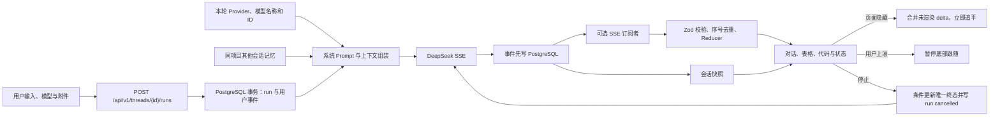

# Agent Workbench

中文单 Agent 对话工作台。正式运行在 `3100`，使用 Next.js、React、assistant-ui、DeepSeek、PostgreSQL 17 与 pgvector；浏览器、服务端运行、SSE、事件持久化和匿名会话恢复已经形成真实闭环。Python、LangGraph、万能搜索工具链和向量语义召回仍属于后续阶段。

## 当前能力

| 能力 | 当前实现 | 真实边界 |
|---|---|---|
| 模型对话 | 服务端调用 DeepSeek `/chat/completions`，按本轮真实模型 ID 流式输出 | 身份问题回答当前 Provider、模型名称和 ID；普通任务不重复自报 |
| 会话连续性 | 项目、会话、运行、AgentEvent、附件写入 PostgreSQL | 匿名模式不能跨设备恢复 |
| 匿名身份 | 256 位随机 `HttpOnly` Cookie；数据库只存 SHA-256 | 暂无登录、账号合并与权限管理 |
| URL 恢复 | `/workbench/p/{projectId}` 与 `/workbench/t/{threadId}` | 所有读取仍校验 `visitor_id`，URL 不是授权凭证 |
| 项目记忆 | 同访客、同项目跨会话召回，按数量和字符数限界 | 当前按时间召回；`embedding` 预留但尚未做向量排序 |
| 数据保留 | 最后活动超过 3 天的非运行会话自动删除 | 原始运行、事件、附件级联删除；有界项目记忆保留 |
| 消息编辑 | 被编辑运行及下游分支归档，界面和 Prompt 只读取活动分支 | 归档数据保留用于审计 |
| 附件 | 图片直接预览，文本附件以严格 UTF-8 拼入模型上下文 | 图片尚未作为多模态模型输入 |
| 结果展示 | LLM 按内容选择短段落、列表、步骤或 Markdown 表格 | 移动端表格在内容区内横向滚动 |
| 流式体验 | 页面关闭后服务端继续生成；后台标签立即追平；用户上滚后停止自动跟随 | 服务进程重启会把未完成运行标记失败，不自动重发模型请求 |
| 停止运行 | 收到真实 `runId` 后才显示停止；AbortController 中断上游；数据库原子抢占唯一终态 | 重复停止幂等返回当前终态；取消事件后不再写正文、完成事件或项目记忆 |
| 拖拽 | 项目直接拖动排序，会话可拖入、拖出或跨项目移动 | 使用专用手柄，排序和归属持久化 |

## 运行链路



模型运行属于服务端任务，不依赖页面或 SSE 是否存在。SSE 断开只移除订阅者；事件仍持续落库。重新打开会话时先读取 PostgreSQL 快照，再从活动运行序号继续订阅。停止、完成和失败使用 `status IN ('queued', 'running', 'waiting')` 条件更新竞争唯一终态，胜出者在同一事务写线程状态和终态事件。

## 本地运行

环境要求：Node.js 22 以上、npm、Docker，以及可用的 DeepSeek API Key。

```powershell
docker compose up -d
cd frontend
npm install
npm run dev
```

开发地址：[http://localhost:3100/workbench](http://localhost:3100/workbench)。生产方式：

```powershell
cd frontend
npm run build
npm run start
```

## 统一配置

真实配置只放在 `config/agent-runtime.local.json`，文件已被 Git 忽略。完整结构由 `frontend/src/server/config/runtime-config.ts` 严格校验：

```json
{
  "version": 1,
  "runtime": { "mode": "live" },
  "provider": {
    "type": "deepseek",
    "apiKey": "本地密钥",
    "endpoint": "https://api.deepseek.com/chat/completions",
    "defaultModel": "deepseek-v4-flash",
    "models": [
      {
        "id": "deepseek-v4-flash",
        "name": "DeepSeek V4 Flash",
        "description": "低延迟通用模型",
        "reasoningEfforts": ["medium", "high"],
        "defaultReasoningEffort": "medium"
      }
    ],
    "request": { "timeoutMs": 120000, "maxRetries": 2 }
  },
  "database": {
    "url": "postgresql://workbench@127.0.0.1:5432/agent_workbench",
    "ssl": false,
    "poolMax": 10
  },
  "session": { "cookieName": "workbench_visitor", "ttlDays": 365 },
  "retention": {
    "threadTtlDays": 3,
    "cleanupIntervalMinutes": 15,
    "projectMemoryMaxItems": 120,
    "projectMemoryRecallItems": 24,
    "projectMemoryMaxChars": 16000
  },
  "generation": { "temperature": 0.6, "maxTokens": 4096, "thinkingEnabled": true },
  "assistant": { "systemPrompt": "系统提示词" }
}
```

不要把密钥写入 README、Issue、日志、截图、测试、客户端代码或任何 `NEXT_PUBLIC_` 字段。

## 验证

```powershell
cd frontend
npm test
npm run typecheck
npm run lint
npm run build
npm run test:e2e
```

Playwright 在 `3110` 使用确定性 mock，不消耗真实 API；正式 live 服务固定为 `3100`。真实会话连续性按 [阶段 1 开发记录](docs/development/2026-07-26-001-workbench-continuity.md) 验证，动态身份和分层记忆按 [阶段 2 开发记录](docs/development/2026-07-26-002-model-identity-memory.md) 验证。

真实 PostgreSQL 分层记忆契约默认不随普通单测执行，显式验证：

```powershell
cd frontend
$env:WORKBENCH_LIVE_INTEGRATION='1'
npx vitest run src/server/live/store.integration.test.ts
```

## 文档

- [当前交接](HANDOFF.md)
- [Agent 开发手册](docs/README.md)
- [阶段 1 研究与实施](docs/workbench-continuity/RESEARCH.md)
- [阶段 2 模型身份与记忆](docs/model-identity-memory/RESEARCH.md)
- [万能搜索 Agent 设计](docs/08-universal-search-agent.md)
- [逐功能开发记录](docs/development/README.md)

## 开发门禁

一次只允许一个 GitHub Issue 和一个功能处于执行状态。开发前必须有可测试验收条件与 `Execution Gate: allowed`；功能、测试、HANDOFF 和中文开发记录同批更新；验证后停止，等待用户明确验收，再创建下一项功能。

公开仓库：[github.com/LuzernRR/agent-workbench](https://github.com/LuzernRR/agent-workbench)
