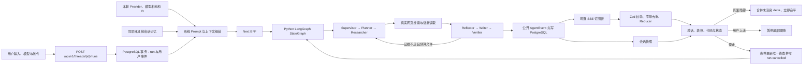

# Agent Workbench

中文多 Agent 搜索工作台。生产入口为
[https://luzern.cc.cd/workbench](https://luzern.cc.cd/workbench)，宿主机只在
`127.0.0.1:3000` 暴露 Web、在 `127.0.0.1:8080` 暴露 Search Agent 健康/调试
入口。系统使用 Next.js、React、assistant-ui、DeepSeek、Python 3.12、
LangGraph、PostgreSQL 17、Milvus 与真实多渠道搜索；一次运行已形成“Agent
公开文段 → 搜索工具 → 有效来源 → 反思/核验 → 最终回答”的可恢复闭环。

## 当前能力

| 能力 | 当前实现 | 真实边界 |
|---|---|---|
| 模型对话 | 服务端调用 DeepSeek `/chat/completions`，按本轮真实模型 ID 流式输出 | 身份问题回答当前 Provider、模型名称和 ID；普通任务不重复自报 |
| 会话连续性 | 项目、会话、运行、AgentEvent、附件写入 PostgreSQL | 匿名模式不能跨设备恢复 |
| 匿名身份 | 256 位随机 `HttpOnly` Cookie；数据库只存 SHA-256 | 暂无登录、账号合并与权限管理 |
| URL 恢复 | `/workbench/p/{projectId}` 与 `/workbench/t/{threadId}` | 所有读取仍校验 `visitor_id`，URL 不是授权凭证 |
| 项目记忆 | 同访客、同项目跨会话召回，按数量和字符数限界 | 当前按时间召回；`embedding` 预留但尚未做向量排序 |
| 数据保留 | 最后活动超过 3 天的非运行会话自动删除 | 原始运行、事件、附件级联删除；有界项目记忆保留 |
| 消息编辑 | 被编辑运行及下游分支归档，界面和 Prompt 只读取活动分支 | 归档数据保留用于审计 |
| 附件 | 图片直接预览，文本附件以严格 UTF-8 拼入模型上下文 | 图片尚未作为多模态模型输入 |
| 结果展示 | LLM 按内容选择短段落、列表、步骤或 Markdown 表格 | 移动端表格在内容区内横向滚动 |
| 流式体验 | 页面关闭后服务端继续生成；后台标签立即追平；用户上滚后停止自动跟随，点击“滚动到底部”后恢复持续跟随 | 服务进程重启会把未完成运行标记失败，不自动重发模型请求 |
| 停止运行 | 收到真实 `runId` 后才显示停止；AbortController 中断上游；数据库原子抢占唯一终态 | 重复停止幂等返回当前终态；取消事件后不再写正文、完成事件或项目记忆 |
| 拖拽 | 项目直接拖动排序，会话可拖入、拖出或跨项目移动 | 使用专用手柄，排序和归属持久化 |
| LangGraph 编排 | Supervisor、Planner、Researcher、Reflector、Writer、Verifier 通过条件边形成有界循环 | 公开的只是各 Agent 结构化 LLM 摘要，不保存或展示私有思维链 |
| 真实搜索 | Researcher 自主选择 Web、X 或小红书；每个 `toolCallId` 保留 started/progress/completed 幂等账本 | 当前产品配置为 `forceSearch: true`；零结果或证据不足时可改写查询、换渠道并在三轮硬预算内补搜 |
| 过程展示 | 按真实 seq 显示各 Agent 的公开自然语言文段，思考与核验通过持久 `thinking.delta` 渐进呈现 | 当前步骤展开；自身完成后不立即折叠，直到下一个不同步骤出现。连续同类输出留在同一区域，不折叠后重开；不展示私有 CoT |
| 搜索展示 | 同一连续搜索段随真实 `tool.progress` 增加为“找到 N 条结果，读取 M 个来源”；相关且已读的来源由 Source Curator 生成 `tool.source.delta` 并逐字增长 | 规范 URL 与发现 URL 使用同一安全身份关联；展开链接是已读来源的相关安全子集，未读候选、无效过程文案及只作排除依据的来源不会投影到会话 |
| 最终回答 | BFF 原子持久化 `message.started → message.delta → message.completed`，浏览器按多个绘制帧渐进显示 | 完成事件保留同一全文用于刷新恢复，不会在 delta 之前整段覆盖 |
| 证据记忆 | 已核验证据可写入 D 盘 Milvus，并按访客、项目、类型和 embedding 版本过滤 | Milvus 不可用时发布 degraded，主搜索继续运行 |

## 运行链路



模型运行属于服务端任务，不依赖页面或 SSE 是否存在。Next BFF 只接收 Python Agent 的严格 NDJSON 白名单事件，持久化后再发布 SSE；刷新时由 PostgreSQL 事件重放得到同一投影。每个真实工具调用仍保留独立 `toolCallId`、幂等账本和来源；前端只对相邻同类活动做连续段归并，因此既能压缩重复行，也不会破坏 `思考 → 搜索 → 思考 → 核验` 的真实顺序。最终回答也先以 durable `message.delta` 进入同一渲染队列，再用 `message.completed` 原子收口。

## 本地运行

环境要求：Node.js 22 以上、npm、Docker，以及可用的 DeepSeek API Key。

```powershell
docker compose --env-file config/deploy.local.env -f deploy/compose.yaml up -d --build
cd apps/web
npm install
npm run dev
```

本地开发地址仍为
[http://localhost:3100/workbench](http://localhost:3100/workbench)；Compose 生产
入口为 [http://127.0.0.1:3000/workbench](http://127.0.0.1:3000/workbench)，
公网由 Cloudflare Tunnel 映射到
[https://luzern.cc.cd/workbench](https://luzern.cc.cd/workbench)。生产方式：

```powershell
cd apps/web
npm run build
npm run start
```

## 统一配置

真实密钥只放在 `config/agent-runtime.local.json`，搜索/预算/循环配置位于 `config/search-agent.json`，部署变量位于被忽略的 `config/deploy.local.env`。浏览器不能读取这些配置，也禁止任何密钥进入 `NEXT_PUBLIC_`。

```json
{
  "version": 1,
  "runtime": { "mode": "live" },
  "provider": {
    "type": "deepseek",
    "apiKey": "本地密钥",
    "endpoint": "https://api.deepseek.com/chat/completions",
    "defaultModel": "deepseek-v4-flash",
    "models": [
      {
        "id": "deepseek-v4-flash",
        "name": "DeepSeek V4 Flash",
        "description": "低延迟通用模型",
        "reasoningEfforts": ["medium", "high"],
        "defaultReasoningEffort": "medium",
        "capabilities": { "imageInput": false }
      }
    ],
    "request": { "timeoutMs": 120000, "maxRetries": 2 }
  },
  "database": {
    "url": "postgresql://workbench@127.0.0.1:5432/agent_workbench",
    "ssl": false,
    "poolMax": 10
  },
  "session": { "cookieName": "workbench_visitor", "ttlDays": 365 },
  "retention": {
    "threadTtlDays": 3,
    "cleanupIntervalMinutes": 15,
    "projectMemoryMaxItems": 120,
    "projectMemoryRecallItems": 24,
    "projectMemoryMaxChars": 16000
  },
  "generation": { "temperature": 0.6, "maxTokens": 4096, "thinkingEnabled": true },
  "assistant": { "systemPrompt": "系统提示词" }
}
```

不要把密钥写入 README、Issue、日志、截图、测试、客户端代码或任何 `NEXT_PUBLIC_` 字段。

## 验证

```powershell
cd apps/web
npm test
npm run typecheck
npm run lint
npm run build
npm run test:e2e
$env:LIVE_SEARCH_E2E='1'
npm run test:e2e:live

cd ../../services/search-agent
.\.venv\Scripts\python.exe -m pytest -q
.\.venv\Scripts\python.exe -m ruff check .
```

Playwright 在 `3110` 使用确定性 mock，不消耗真实 API；生产 live 验收默认访问
`127.0.0.1:3000`，也可通过 `PLAYWRIGHT_LIVE_BASE_URL` 指向
`https://luzern.cc.cd`。最新公开文段流式展示、真实搜索进度与有效来源验收记录在
[Issue #9 开发记录](docs/development/2026-07-29-008-streamed-process-effective-sources.md)。

## 模块目录

| 目录 | 职责 |
|---|---|
| `apps/web/` | Next.js 前端、BFF、现有 live/mock 运行时与 Web 测试 |
| `services/search-agent/` | 已接入的 Python/FastAPI/LangGraph Search Agent、Prompt、工具、抓取、Milvus 与测试 |
| `packages/contracts/` | TypeScript/Python 共享 Schema、fixture 与契约消费者 |
| `deploy/` | Docker Compose、镜像与运维部署资产 |
| `config/` | 本地运行配置与示例；密钥只允许进入忽略的 `*.local.json` |

真实 PostgreSQL 分层记忆契约默认不随普通单测执行，显式验证：

```powershell
cd apps/web
$env:WORKBENCH_LIVE_INTEGRATION='1'
npx vitest run src/server/live/store.integration.test.ts
```

## 文档

- [当前交接](HANDOFF.md)
- [Agent 开发手册](docs/README.md)
- [阶段 1 研究与实施](docs/workbench-continuity/RESEARCH.md)
- [阶段 2 模型身份与记忆](docs/model-identity-memory/RESEARCH.md)
- [万能搜索 Agent 端到端开发流程](docs/万能搜索Agent端到端开发流程.md)
- [万能搜索 Agent 研究底稿](docs/08-universal-search-agent.md)
- [逐功能开发记录](docs/development/README.md)

## 开发门禁

一次只允许一个 GitHub Issue 和一个功能处于执行状态。开发前必须有可测试验收条件与 `Execution Gate: allowed`；功能、测试、HANDOFF 和中文开发记录同批更新；验证后停止，等待用户明确验收，再创建下一项功能。

公开仓库：[github.com/LuzernRR/agent-workbench](https://github.com/LuzernRR/agent-workbench)
