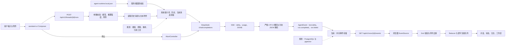

# Agent Workbench

中文单 Agent 工作台。当前版本已接通 DeepSeek 真实流式对话，前端使用 Next.js、React、assistant-ui 与 AgentEvent 事件协议；项目、会话和运行记录仍由进程内存保存，持久化与万能搜索 Agent 尚未实现。

## 当前状态

| 能力 | 状态 | 真实边界 |
|---|---|---|
| DeepSeek 对话 | 已接通 | 服务端读取本地 JSON，调用真实 `/chat/completions` |
| 流式回复 | 已接通 | DeepSeek SSE 转 AgentEvent，再由浏览器 EventSource 消费 |
| 项目与会话 | 可操作 | 当前保存在 Next.js 进程内存，服务重启后恢复种子数据 |
| 模型选择 | 已接通 | 模型列表来自统一配置，密钥不下发浏览器 |
| 附件 | 部分真实 | 上传与文本附件上下文可用，持久化与图片模型输入待实现 |
| 工具、计划、成果 | 演示实现 | 自动化测试使用脚本事件，真实工具运行时待实现 |
| 万能搜索 Agent | 未实现 | 需在持久化和工具协议稳定后进入开发 |

## 完整链路



## Prompt 组装

真实调用在 `frontend/src/server/mock/engine.ts` 完成，顺序固定：

1. `assistant.systemPrompt`：统一 JSON 中的系统提示词。
2. 已完成历史：从 AgentEvent 回放用户与助手消息，编辑消息时截断旧分支。
3. 当前用户消息：保留界面原文。
4. 文本附件：UTF-8 严格解码后追加；无法解码的文件只发送文件名。
5. 生成参数：模型、temperature、maxTokens、thinking、reasoningEffort 均由统一配置和用户选择共同决定。

模型的隐含思考不展示给用户。当前自然语言回复允许 Markdown；工具参数、计划、引用和持久化写入必须使用受 Zod 或 JSON Schema 约束的结构化对象，不能依赖从自由文本中猜测字段。

## 本地运行

环境要求：Node.js 22 以上、npm、可用的 DeepSeek API Key。

```powershell
cd frontend
npm install
npm run dev
```

默认地址：[http://localhost:3100](http://localhost:3100)。

真实配置文件为 `config/agent-runtime.local.json`，该文件已被 Git 忽略。字段由 `frontend/src/server/config/runtime-config.ts` 校验，至少包含：

```json
{
  "version": 1,
  "runtime": { "mode": "live" },
  "provider": {
    "type": "deepseek",
    "apiKey": "本地密钥",
    "endpoint": "https://api.deepseek.com/chat/completions",
    "defaultModel": "deepseek-v4-flash",
    "models": [
      {
        "id": "deepseek-v4-flash",
        "name": "DeepSeek V4 Flash",
        "description": "低延迟通用模型",
        "reasoningEfforts": ["medium", "high"],
        "defaultReasoningEffort": "medium"
      }
    ],
    "request": { "timeoutMs": 120000, "maxRetries": 2 }
  },
  "generation": {
    "temperature": 0.6,
    "maxTokens": 4096,
    "thinkingEnabled": true
  },
  "assistant": { "systemPrompt": "系统提示词" }
}
```

不要把真实密钥写入 README、Issue、日志、截图、测试、浏览器环境变量或 `NEXT_PUBLIC_` 字段。

## 验证命令

```powershell
cd frontend
npm test
npm run typecheck
npm run lint
npm run build
npm run test:e2e
```

端到端测试在 `3110` 端口启动隔离的模拟模型服务，不消耗真实 API 额度；正式服务固定使用 `3100`。

## 文档导航

- [交接状态](HANDOFF.md)
- [Agent 开发手册](docs/README.md)
- [平台架构](docs/agent-platform-design.md)
- [模型 API 与 Prompt](docs/01-model-api-and-prompts.md)
- [LangGraph 运行时](docs/02-langgraph-agent-runtime.md)
- [记忆与 RAG](docs/03-memory-and-rag.md)
- [评测、安全与可观测性](docs/04-evaluation-security-and-observability.md)
- [开发路线](docs/05-development-roadmap.md)
- [前端工作台](docs/06-frontend-workbench.md)
- [配置与调优](docs/07-configuration-and-tuning.md)
- [逐功能开发记录](docs/development/README.md)

## 开发与验收规则

1. 每次只允许一个功能处于开发状态。
2. 开发前创建 GitHub Issue，写明 Scope、Non-Goals、可测试验收条件和执行门。
3. 功能代码、测试与对应中文开发记录必须在同一提交中更新。
4. 完成验证后停止，等待用户明确验收。
5. 用户未验收前，不创建下一功能的实现提交。
6. 失败与未实现内容必须写入 HANDOFF，不能用规划描述替代真实能力。

## 公开仓库

[github.com/LuzernRR/agent-workbench](https://github.com/LuzernRR/agent-workbench)
