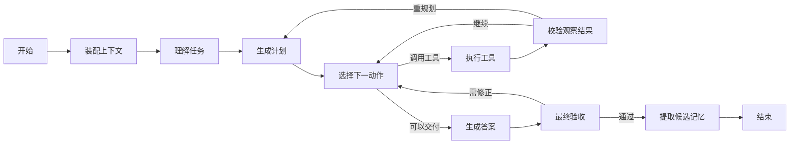
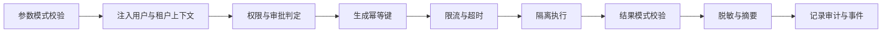

# LangGraph Agent 运行时

## 1. 为什么使用状态图

Agent 的本质是受约束的循环：读取状态，选择动作，执行动作，观察结果，判断是否完成。LangGraph 把循环拆成明确节点和条件边，并为检查点、中断、恢复和流式更新提供统一运行时。

单次简单问答不需要图；具备工具、长任务、审批、恢复或持久状态时才使用 LangGraph。

## 2. 图的基本模型



节点负责完成一项工作，状态负责传递事实，条件边负责选择下一步。禁止把整个循环藏在单个节点中，否则无法观察、暂停和恢复。

## 3. 状态设计

状态只保存恢复运行所需的事实，不保存数据库连接、SDK 客户端和大文件正文。

```python
from typing import Annotated, Literal, TypedDict
from langgraph.graph.message import add_messages

class PlanStep(TypedDict):
    id: str
    title: str
    status: Literal["todo", "in_progress", "done", "blocked"]
    completion_check: str

class AgentState(TypedDict, total=False):
    messages: Annotated[list, add_messages]
    run_id: str
    user_id: str
    project_id: str | None
    goal: str
    constraints: list[str]
    plan: list[PlanStep]
    active_step_id: str | None
    retrieved_chunk_ids: list[str]
    tool_call_count: int
    validation_failures: list[str]
    final_answer: str | None
    status: Literal["running", "waiting", "completed", "failed", "stopped"]
```

设计要求：

- `messages` 使用 reducer 追加，不能由并行节点互相覆盖。
- 计划更新使用完整快照并带版本号，便于客户端重建。
- 大型工具结果存数据库或对象存储，状态只保存引用和摘要。
- 运行预算、尝试次数和校验失败必须进状态，循环才能确定终止。
- 用户权限从受信任的运行配置取得，不能从消息内容取得。

## 4. 节点契约

每个节点都应声明：

| 项目 | 含义 |
| --- | --- |
| 输入字段 | 节点会读取哪些状态 |
| 输出字段 | 节点允许更新哪些状态 |
| 外部依赖 | 模型、数据库、工具或存储 |
| 副作用 | 是否写数据、发请求或产生费用 |
| 超时 | 单次最大执行时间 |
| 重试 | 可重试错误和最大次数 |
| 幂等 | 重放时如何避免重复副作用 |
| 事件 | 开始、进度、完成、失败会发出什么 |
| 测试 | 正常、空结果、超时、取消和注入样本 |

节点返回局部状态更新，不能原地修改输入状态。

## 5. 构建图

```python
from langgraph.graph import END, START, StateGraph

builder = StateGraph(AgentState)
builder.add_node("load_context", load_context)
builder.add_node("understand", understand_task)
builder.add_node("plan", build_plan)
builder.add_node("act", choose_action)
builder.add_node("tools", execute_tools)
builder.add_node("verify", verify_observation)
builder.add_node("finalize", generate_final_answer)
builder.add_node("final_check", final_check)
builder.add_node("memory", extract_memory_candidates)

builder.add_edge(START, "load_context")
builder.add_edge("load_context", "understand")
builder.add_edge("understand", "plan")
builder.add_edge("plan", "act")
builder.add_conditional_edges(
    "act",
    route_after_action,
    {"tools": "tools", "finalize": "finalize", "fail": END},
)
builder.add_edge("tools", "verify")
builder.add_conditional_edges(
    "verify",
    route_after_validation,
    {"continue": "act", "replan": "plan", "finalize": "finalize", "fail": END},
)
builder.add_edge("finalize", "final_check")
builder.add_conditional_edges(
    "final_check",
    route_after_final_check,
    {"repair": "act", "complete": "memory", "fail": END},
)
builder.add_edge("memory", END)
```

路由函数必须是小型、可测试的纯函数。能用确定性规则判断的状态，不额外调用模型。

## 6. 任务理解

任务理解节点将自然语言变成结构化契约：

- 用户最终目标。
- 明确限制和隐含限制。
- 需要的交付物。
- 是否需要外部数据、文件或工具。
- 风险等级和审批条件。
- 完成检查。

简单问答可以跳过详细计划。判断标准应配置化，例如预计工具调用不超过一次、没有文件成果、没有高风险动作时直接进入动作节点。

## 7. 计划任务

好的计划满足：

- 三到七步，步骤之间有清晰依赖。
- 每步以可观察动作命名。
- 每步有完成检查，不以“继续分析”作为完成条件。
- 只计划当前可见范围，不虚构尚未获得的数据。
- 工具结果改变前提时允许重规划。

计划不是模型的装饰文本，而是运行状态。执行节点每次只把一个步骤设为 `in_progress`，完成校验后再设为 `done`。

## 8. 动作选择

动作节点只能返回以下决策之一：

```python
from typing import Literal
from pydantic import BaseModel

class NextAction(BaseModel):
    action: Literal["tool", "answer", "ask_user", "fail"]
    tool_name: str | None
    tool_arguments: dict
    summary: str
    completion_claim: bool
```

`ask_user` 只用于缺失信息会实质改变结果，且无法通过已有上下文或安全工具获得的情况。不要用追问代替可以自主完成的工作。

## 9. 工具执行器

工具执行分为固定管线：



工具注册信息示例：

```python
from dataclasses import dataclass
from typing import Awaitable, Callable

@dataclass(frozen=True)
class ToolPolicy:
    permission: str
    timeout_seconds: float
    max_retries: int
    requires_approval: bool
    idempotent: bool
    max_result_bytes: int

@dataclass(frozen=True)
class RegisteredTool:
    name: str
    input_model: type
    output_model: type
    policy: ToolPolicy
    handler: Callable[[dict], Awaitable[object]]
```

### 工具错误分类

- `invalid_input`：模型参数错误，允许模型修正一次。
- `permission_denied`：权限不足，立即结束当前动作。
- `approval_required`：进入中断，不视为失败。
- `not_found`：业务无结果，可改写查询。
- `rate_limited`：按服务端建议等待并受总时限约束。
- `transient`：无副作用或有幂等保障时重试。
- `permanent`：直接进入降级或失败路径。
- `cancelled`：用户停止，禁止继续生成最终答案。

## 10. ReAct 循环

ReAct 可以理解为“推理决定动作，动作产生观察，再根据观察决定下一步”。工程实现不需要把模型的隐藏推理写入状态，只需记录：

- 当前计划步骤。
- 动作摘要。
- 工具名称与参数摘要。
- 观察结果摘要。
- 校验结论。
- 下一条路由。

每个循环必须受以下预算限制：

| 限制 | 初始值 |
| --- | --- |
| 最大动作轮数 | 8 |
| 最大工具调用数 | 12 |
| 同时工具调用数 | 3 |
| 单工具默认超时 | 30 秒 |
| 单次运行软时限 | 120 秒 |
| 单次运行硬时限 | 180 秒 |
| 最终修复次数 | 1 |
| 相同错误连续次数 | 2 |

初始值需要按任务类型覆盖。达到上限时返回已完成内容、未完成原因和继续方式，不能无限循环。

## 11. 结果校验

校验按可靠性从高到低组合：

1. 结构校验：Pydantic、JSON Schema、文件格式、必填字段。
2. 确定性规则：数值范围、总和、唯一性、权限、资源存在性。
3. 证据校验：结论是否引用已召回片段，引用是否覆盖关键声明。
4. 交叉验证：使用第二个数据源或重新查询关键事实。
5. 模型评审：仅检查语义覆盖、矛盾和表达，不替代确定性规则。

```python
class ValidationResult(TypedDict):
    passed: bool
    recoverable: bool
    failures: list[str]
    suggested_action: Literal["continue", "replan", "repair", "fail"]
```

不要让生成答案的同一次模型调用同时给自己打满分。高风险成果应使用独立评审提示词，必要时使用不同模型或人工复核。

## 12. 人工审批

LangGraph `interrupt()` 可以保存检查点并暂停节点：

```python
from langgraph.types import Command, interrupt

def approval_gate(state: AgentState) -> dict:
    decision = interrupt({
        "title": "确认执行此操作",
        "risk": "将向外部系统写入数据",
        "tool_call_id": state["pending_tool_call_id"],
        "allow_always": False,
    })
    if decision["value"] == "deny":
        return {"status": "running", "approval_denied": True}
    return {"status": "running", "approval_denied": False}

config = {"configurable": {"thread_id": thread_id}}
await graph.ainvoke(Command(resume={"value": "allow_once"}), config=config)
```

中断节点恢复时可能从节点开头重新执行，因此中断前的副作用必须移到独立节点，或具备幂等保障。

## 13. 检查点与长期存储

```python
from langgraph.checkpoint.postgres.aio import AsyncPostgresSaver
from langgraph.store.postgres.aio import AsyncPostgresStore

async with (
    AsyncPostgresSaver.from_conn_string(database_url) as checkpointer,
    AsyncPostgresStore.from_conn_string(database_url) as store,
):
    await checkpointer.setup()
    await store.setup()
    graph = builder.compile(checkpointer=checkpointer, store=store)
```

- Checkpointer 保存线程内图状态，用于短期记忆、恢复和时间回溯。
- Store 保存跨线程的用户偏好、事实和应用数据。
- 业务表保存会话、运行、事件、成果和审计记录。
- 三类存储可以在同一 PostgreSQL 集群中，但表、权限和保留策略必须分离。

`thread_id` 是恢复游标，不是用户标识。每次运行还需要独立 `run_id`。

## 14. 流式运行

服务端同时消费三类流：

- `messages`：模型文本增量。
- `updates`：节点对状态的局部更新。
- `custom`：工具进度、下载进度和业务事件。

```python
async for stream_part in graph.astream(
    graph_input,
    config={"configurable": {"thread_id": thread_id}},
    stream_mode=["messages", "updates", "custom"],
):
    event = event_mapper.to_public_event(stream_part)
    await event_store.append(event)
    await event_bus.publish(event)
```

模型原始事件不能直接暴露给前端。事件映射层负责稳定命名、脱敏、排序和版本兼容。

## 15. 并行执行

只有互相独立、无共享写入的工具可以并行。常见例子是查询多个只读数据源。并行结果合并需要：

- 固定的结果标识和来源。
- 每个分支独立超时。
- 部分成功策略。
- reducer 明确定义合并方式。
- 总并发和供应商限流。

有副作用的操作默认串行。不要让模型自行决定无限并发。

## 16. 取消与停止

停止流程：

1. API 把运行标记为 `stopping`。
2. 向当前图任务发送取消信号。
3. 模型流、HTTP 工具、数据库查询和子进程响应取消。
4. 等待短暂清理窗口。
5. 提交已产生消息和工具状态。
6. 写入 `run.stopped` 最终事件。

不可中断的外部副作用要记录“结果未知”，并提供后续核对任务，不能直接显示已停止即未执行。

## 17. 恢复与幂等

推荐键设计：

| 场景 | 幂等键 |
| --- | --- |
| 创建运行 | `client_request_id` |
| 工具调用 | `run_id + tool_call_id` |
| 外部写入 | `tenant_id + tool_call_id + operation` |
| 成果版本 | `run_id + artifact_key + version` |
| 记忆写入 | `user_id + normalized_memory_hash` |

恢复时按照检查点、工具调用表、外部副作用回执和事件序号四方核对，不能只相信内存状态。

## 18. 测试策略

每个节点至少覆盖：

- 固定状态输入得到预期局部更新。
- 模型返回结构错误。
- 工具成功、空结果、超时、限流和永久失败。
- 审批允许、拒绝和恢复。
- 在检查点后崩溃并重启。
- 同一幂等键重复请求。
- 达到循环和预算上限。
- 用户停止时不再产生新副作用。
- 恶意文档要求忽略系统规则。

图级测试使用伪模型和伪工具保证确定性；少量集成测试才调用真实模型。

## 19. 常见反模式

- 一个节点包含全部规划、工具循环和最终回答。
- 把完整工具结果无限追加到消息历史。
- 用自然语言字符串决定图路由。
- 在 `interrupt()` 之前执行不可重复副作用。
- 只限制单次模型输出，不限制整次运行预算。
- 工具错误全部转成相同文本，模型无法选择恢复策略。
- 前端断线后重新创建运行，而不是按事件序号恢复。
- 把用户长期记忆、会话检查点和知识库文档放在同一集合检索。
