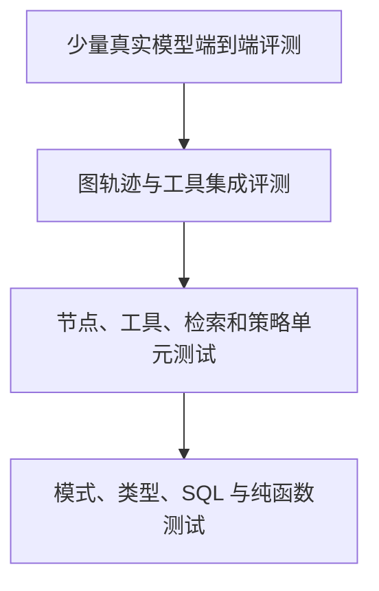

# 评测、安全与可观测性

## 1. 质量目标

Agent 质量不能只看最终文字是否“像对的”。需要同时评估：

- 任务是否完成。
- 计划是否覆盖目标。
- 工具是否选择正确。
- 参数是否正确且最小化。
- 轨迹是否高效。
- 证据是否充分、真实、可追溯。
- 权限和审批是否正确。
- 最终答案是否准确、完整、清晰。
- 延迟、成本和错误率是否可接受。
- 停止、恢复和幂等是否可靠。

## 2. 评测金字塔



底层测试数量最多且确定，顶层测试数量较少但覆盖真实行为。不能只依赖端到端模型评测定位问题。

## 3. 评测数据集

评测样本应来自：

- 产品核心用户故事。
- 线上脱敏失败样本。
- 工具边界和错误路径。
- 权限、审批和安全攻击样本。
- 长上下文、文件、表格和多轮对话。
- 无答案、歧义和互相冲突的证据。

推荐结构：

```json
{
  "case_id": "plan-and-export-001",
  "category": "artifact",
  "input": {
    "messages": [{"role": "user", "content": "整理需求并生成实施计划"}],
    "attachments": [],
    "user_context": {"permission_mode": "ask_for_risky_actions"}
  },
  "fixtures": {
    "tool_results": {},
    "retrieval_scope": []
  },
  "expected": {
    "required_tools": [],
    "forbidden_tools": ["shell_execute"],
    "required_artifacts": ["implementation_plan"],
    "approval_count": 0,
    "must_include": ["目标", "阶段", "验收"],
    "must_not_include": ["未授权数据"]
  },
  "tags": ["zh-CN", "core", "single-agent"]
}
```

训练、调试和最终回归集分开。提示词调优过程中不能反复查看最终保留集并针对性修改。

## 4. 确定性评测

优先使用代码断言：

- JSON Schema 和 Pydantic 校验。
- 是否调用允许的工具。
- 工具调用次数和顺序。
- 参数枚举、范围和资源标识。
- 是否在高风险动作前产生审批。
- 运行是否在预算内结束。
- 引用是否对应真实片段。
- 文件是否存在、可打开并满足格式。
- 事件序号是否连续且没有重复终止事件。
- 停止后是否仍产生副作用。

确定性规则可复现、成本低，不能用模型评审替代。

## 5. 轨迹评测

轨迹评测关注过程：

| 指标 | 计算方式 |
| --- | --- |
| 工具选择准确率 | 正确工具调用数除以应调用工具数 |
| 参数准确率 | 满足标准参数约束的调用占比 |
| 非必要调用率 | 不影响结果的工具调用占总调用比例 |
| 恢复成功率 | 可恢复失败后最终完成的比例 |
| 审批正确率 | 应审批且确实审批的比例，同时检查误审批 |
| 计划完成率 | 完成且通过检查的计划步骤比例 |
| 循环效率 | 达成任务所需动作轮数分布 |
| 停止可靠性 | 停止后没有新增副作用的运行比例 |

轨迹不要求与标准轨迹逐步完全一致。只要满足安全边界、必要动作和最终结果，可以允许多条合理路径。

## 6. 模型评审

模型评审适合语义正确性、覆盖度、清晰度和引用忠实度，不适合判断权限、数值精确性和副作用是否发生。

评审提示词应包含：

- 明确评分维度和等级定义。
- 用户输入和期望结果。
- 候选答案与允许证据。
- 每项评分的短理由。
- 无法判断时的专用状态。
- 禁止以篇幅、语气或格式华丽程度代替正确性。

使用双盲顺序或随机交换候选答案，降低位置偏差。关键评测由人工抽样校准模型评分，计算评审者一致性。

## 7. RAG 评测

RAG 分层评测：

1. 摄取：解析和切片是否保留答案。
2. 召回：目标片段是否进入候选。
3. 重排：目标片段是否进入最终上下文。
4. 生成：答案是否只使用证据并正确引用。

主要指标包括 Recall@k、MRR、nDCG、上下文精确率、上下文召回率、答案正确性、忠实度、引用覆盖率和无答案准确率。

## 8. 发布回归门槛

每次模型、提示词、工具、切片、嵌入或索引变更都运行同一回归集。初始门槛示例：

| 指标 | 门槛 |
| --- | --- |
| 核心任务成功率 | 不低于基线，且达到产品目标 |
| 高风险审批漏检 | 0 |
| 跨租户数据泄露 | 0 |
| 工具参数模式通过率 | 100% |
| RAG 权限泄露 | 0 |
| 引用可追溯率 | 100% |
| 停止后副作用 | 0 |
| 第 95 百分位延迟 | 不超过既定服务等级目标 |
| 单任务成本 | 不超过任务类型预算 |

任何安全硬门槛失败都阻止发布，不能用平均质量提升抵消。

## 9. 在线指标

| 类别 | 指标 |
| --- | --- |
| 使用 | 新建会话、任务完成、重试、停止、审批决定 |
| 质量 | 用户修正、重新生成、失败后放弃、成果下载 |
| 运行 | 排队、首事件、首文本、总时长、恢复次数 |
| 模型 | 请求数、输入输出令牌、缓存、限流、拒绝 |
| 工具 | 成功率、超时、重试、错误分类、审批率 |
| RAG | 候选数、相似度、重排分、无答案率、引用点击 |
| 成本 | 每运行、每成功任务、每工具和每租户成本 |
| 安全 | 注入检测、权限拒绝、敏感输出拦截、异常下载 |

用户停用记忆、删除会话或拒绝审批也是重要产品信号，不能只观察点赞。

## 10. 分布式追踪

一个运行对应一条根追踪，主要跨度：

```text
run
├─ load_context
├─ understand_task
├─ build_plan
├─ model_call
├─ tool_call
│  ├─ authorization
│  ├─ execution
│  └─ validation
├─ retrieval
│  ├─ query_rewrite
│  ├─ keyword_search
│  ├─ vector_search
│  └─ rerank
├─ final_check
└─ memory_extraction
```

每个跨度记录：

- `trace_id`、`run_id`、`thread_id`、节点名和尝试序号。
- 模型角色、实际模型、提示词版本和工具集合版本。
- 延迟、令牌、费用、缓存和停止原因。
- 工具名、权限级别、结果状态和脱敏错误。
- 检索配置版本、候选数和片段标识。
- 输出模式校验结果。
- 部署版本和功能开关。

正文、提示词和工具结果默认不进入常规日志。需要调试内容时使用受控采样、脱敏、短保留期和访问审计。

## 11. 日志等级

| 等级 | 内容 |
| --- | --- |
| 调试 | 本地开发的状态路由和模拟事件，不含密钥 |
| 信息 | 运行开始结束、节点、耗时、状态和版本 |
| 警告 | 可恢复错误、重试、降级、预算接近上限 |
| 错误 | 运行失败、数据一致性问题、外部服务不可用 |
| 安全 | 权限拒绝、注入、敏感数据和异常副作用尝试 |

错误必须包含稳定错误码供聚合，同时前端映射为简洁中文，不暴露堆栈、类名和数据库细节。

## 12. 威胁模型

主要风险：

- 提示注入和间接提示注入。
- 工具权限过大或参数越权。
- 敏感信息进入提示、日志、记忆或引用。
- 不安全输出触发脚本、SQL、命令或网络请求。
- SSRF、任意文件访问和路径穿越。
- 不受控的模型和工具成本。
- 供应链、模型供应商和第三方工具风险。
- 向量库或缓存跨租户泄露。
- 过度信任模型判断权限和完成状态。

安全边界由代码和基础设施执行，模型只能提供建议。

## 13. 提示注入防护

防护需要多层组合：

1. 系统规则与外部内容使用不同通道和明确边界。
2. 文档、网页、邮件、工具结果都标记为不可信数据。
3. 工具选择仍经过服务端允许列表和权限判定。
4. 敏感工具不向不需要它的任务暴露。
5. 模型不能读取密钥、原始鉴权头和系统环境变量。
6. 外部内容要求泄露提示词、改变权限或执行命令时触发安全事件。
7. 最终输出做敏感内容与危险链接检查。
8. 使用专门攻击集持续回归。

提示注入检测模型只能作为信号，不能成为唯一防线。

## 14. 工具安全

### 网络工具

- 域名允许列表或受控代理。
- DNS 解析后阻止私有、环回和元数据地址。
- 限制重定向次数并重新校验每次目标。
- 限制响应大小、类型和下载时间。
- 禁止自动提交凭据到未知域名。

### 文件工具

- 存储键与显示名称分离。
- 使用安全基目录和规范化路径。
- 限制文件类型、大小、压缩展开比和文件数量。
- 上传后病毒扫描，解析器在隔离进程运行。
- 下载地址短时有效并校验主体权限。

### 代码和命令工具

- 在一次性受控容器或沙箱运行。
- 默认无网络、只读文件系统和非特权用户。
- 限制 CPU、内存、进程、磁盘和时间。
- 不挂载宿主密钥、Docker 套接字和用户目录。
- 命令参数结构化传递，不拼接未经验证的 shell 字符串。
- 输出大小受限并进行敏感信息扫描。

### 数据写入工具

- 模型只提交业务参数，用户和租户由服务端注入。
- 修改前重新读取资源版本，使用乐观锁。
- 高风险动作展示具体对象、字段和影响范围。
- 使用事务、幂等键和审计表。

## 15. 数据安全

- 所有业务表包含租户边界，查询层强制过滤。
- PostgreSQL 使用最小权限角色，摄取、检索和应用写入分权。
- 生产传输和静态数据加密。
- 密钥由密钥管理系统注入并定期轮换。
- PII 分类和保留期写入数据治理规则。
- 记忆、会话、文档、追踪和备份都支持删除流程。
- 测试数据不复制真实敏感内容。
- 导出和下载产生独立审计事件。

## 16. 预算和滥用控制

每次运行限制：

- 模型调用次数。
- 输入输出令牌。
- 工具调用次数和并发。
- 外部下载字节。
- 总时间和空闲时间。
- 重试次数。
- 生成文件数量和大小。

同时设置用户、租户和系统级速率限制。达到软限制时降级或提示，达到硬限制时安全结束并保留当前成果。

## 17. 可靠性模式

- 超时：连接、首字节、总请求和工具分别配置。
- 重试：只重试明确的临时错误，使用指数退避和随机抖动。
- 熔断：下游连续失败时快速失败并显示降级状态。
- 隔舱：模型、检索、代码执行和文件解析使用独立并发池。
- 背压：SSE 消费慢时合并文本增量，不无限缓存。
- 降级：重排器不可用时回退混合排序；长期记忆不可用时仍可完成当前会话。
- 对账：未知副作用状态进入核对队列，不直接重试。

## 18. 事故响应

1. 通过功能开关停用相关工具、模型或数据源。
2. 保存受影响运行、版本、事件和审计标识。
3. 阻断进一步副作用和跨租户访问。
4. 判断是否需要撤销动作、轮换密钥或通知用户。
5. 建立最小复现样本并加入回归集。
6. 修复代码、策略或数据后重新跑完整安全门槛。
7. 发布复盘，区分根因、放大因素和检测缺口。

## 19. 上线检查表

- [ ] 核心与失败路径回归通过。
- [ ] 高风险动作全部经过权限与审批策略。
- [ ] 租户隔离和对象权限有自动化测试。
- [ ] 工具调用、事件和副作用具备幂等。
- [ ] 停止、断线恢复和服务重启验证通过。
- [ ] 模型、提示词、工具、切片和索引版本可追踪。
- [ ] 关键指标、告警、仪表盘和运行手册就绪。
- [ ] 数据保留、删除、导出和备份恢复经过演练。
- [ ] 预算、限流、熔断和功能开关可用。
- [ ] 桌面和移动端关键交互通过真实浏览器验证。

