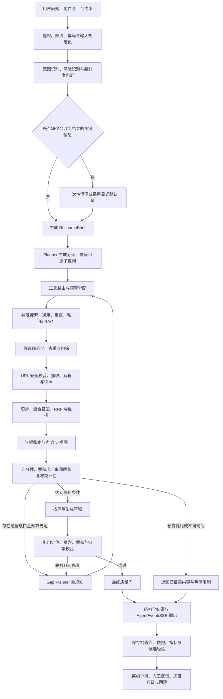
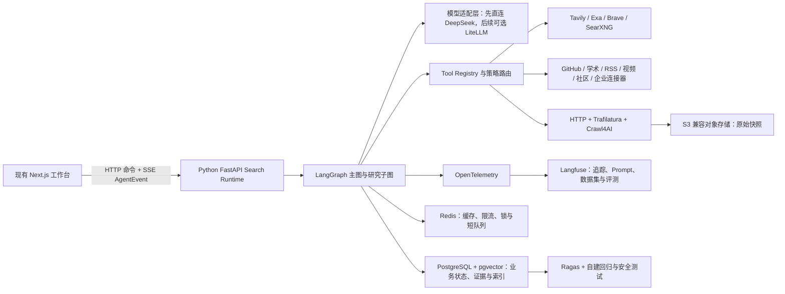
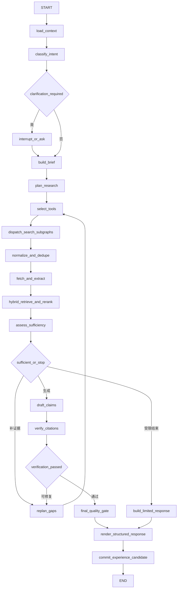
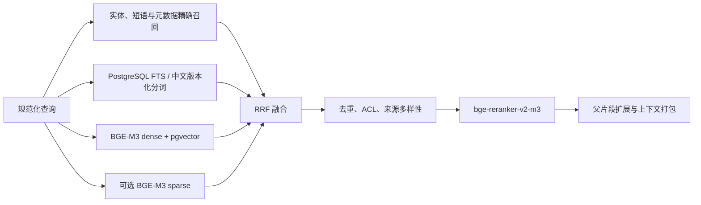
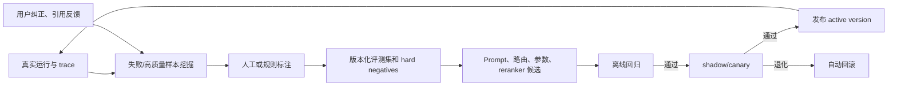
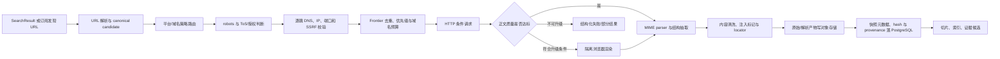
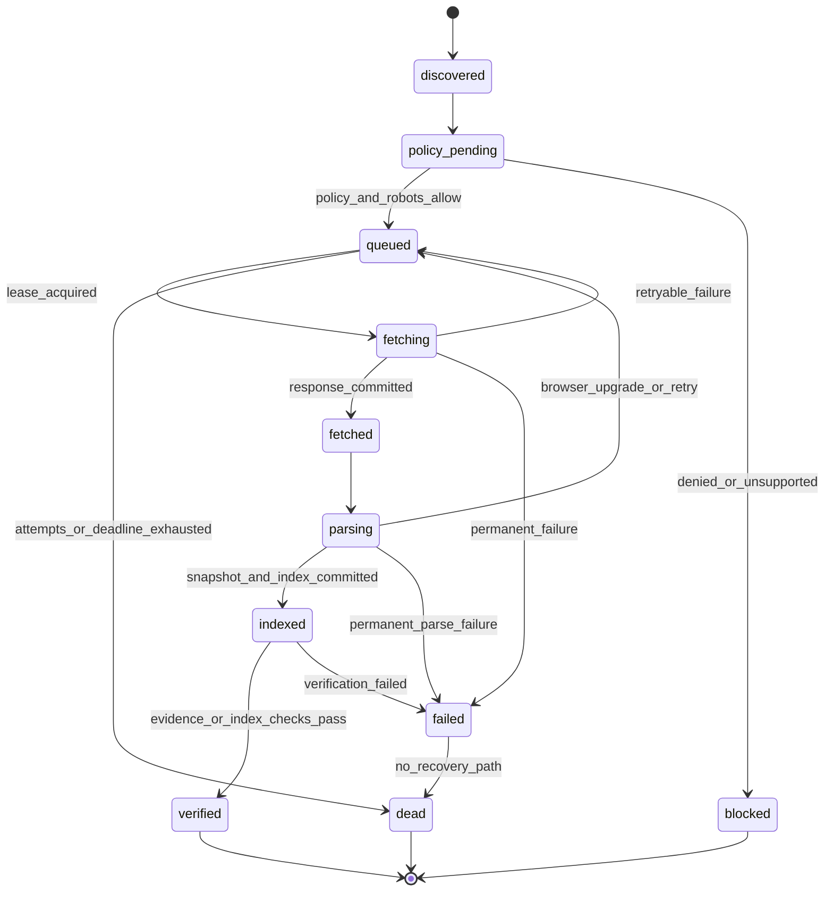
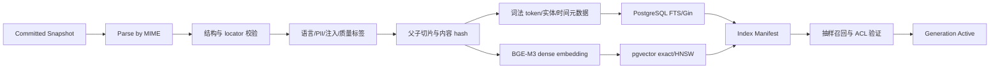
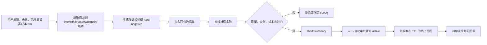

# 万能搜索 Agent 项目开发文档：端到端架构与实施手册

> 状态：架构方案，不代表功能已经实现
> 核验日期：2026-07-26
> 适用范围：当前工作台的外部网页、垂直平台、项目资料与长期知识检索
> 核心原则：先定义可验证的研究任务，再搜索；先形成可追溯证据，再生成答案；没有足够证据时明确停止，而不是补写推测。
>
> 目录迁移说明（2026-07-28）：本文中的 `frontend/` 路径是研究时的历史快照。当前代码映射为 `apps/web/`、`services/search-agent/`、`packages/contracts/`、`deploy/`、`config/`；实施命令与当前进度以 [端到端开发流程](./万能搜索Agent端到端开发流程.md) 和根目录 `HANDOFF.md` 为准。

本文是当前项目“万能搜索 Agent”的完整实施蓝图。它补充 [LangGraph 运行时](./02-langgraph-agent-runtime.md)、[上下文、记忆与 RAG](./03-memory-and-rag.md)、[评测、安全与可观测性](./04-evaluation-security-and-observability.md) 与 [配置与调优](./07-configuration-and-tuning.md)，不替代这些通用基线。

实施细节同时参考用户指定的《生产级 AI Agent 端到端完整架构与实施流程》，但接口、目录、配置迁移、`wb_*` 数据接缝和交付顺序均以本仓库实际状态为准，不把参考项目的目录或组件原样照搬。

## 1. 先看完整流程

### 1.1 一次搜索任务的端到端链路



这里的“万能”不是绕过平台权限或反爬机制，而是使用统一协议接入不同来源。任何平台都必须满足公开可读、官方 API、用户明确授权的会话或合法企业连接器中的一种；不可访问时返回限制，不伪造结果。

### 1.2 每一阶段的输入、输出与完成条件

| 阶段 | 主要输入 | 必须产生的结构化输出 | 完成条件 |
| --- | --- | --- | --- |
| 接入 | 用户消息、附件、租户和线程 | `SearchRequest` | 鉴权、大小、幂等键和预算有效 |
| 意图识别 | 当前问题、必要的对话摘要 | `ResearchIntent` | 意图、时效、平台、风险、输出形态可解释 |
| 研究简报 | 意图和显式约束 | `ResearchBrief` | 目标、分面、排除项和验收条件完整 |
| 计划 | 研究简报、可用工具目录 | `SearchPlan` | 每步有目的、依赖、预算和停止条件 |
| 路由 | 原子查询、平台和来源偏好 | `ToolSelection` | 只暴露当前任务需要的 5 到 10 个工具 |
| 搜索 | 查询、过滤器、供应商配置 | `SearchBatch` | 记录 requested、returned、去重数和错误 |
| 抓取 | 候选 URL | `SourceSnapshot` | 正文来自真实页面，保留时间和内容哈希 |
| 解析 | 页面、文件、字幕或 feed | `Passage[]` | 每段能回到原始位置，失败原因可见 |
| 检索 | 查询、权限、片段 | `RankedEvidence[]` | 关键词、向量、精确实体和重排结果可复现 |
| 充分性评估 | 计划分面、证据与冲突 | `SufficiencyAssessment` | 硬性质量门通过，或生成明确 gap |
| 重规划 | gap、失败历史和剩余预算 | `PlanRevision` | 不重复无增益查询，优先补最重要缺口 |
| 生成 | 已验证证据 | `DraftAnswer` 和 `Claim[]` | 可验证陈述被拆成声明，不混入未知事实 |
| 引用校验 | 声明、证据、快照 | `CitationVerification` | 关键声明可定位、可打开且被证据支持 |
| 输出 | 答案、引用、限制和统计 | `SearchResponse` | 通过 JSON Schema，再渲染为 Markdown/SSE |
| 沉淀 | 运行轨迹、评测和反馈 | `SearchExperienceCandidate` | 仅保存脱敏、可解释且有质量标签的经验 |

### 1.3 推荐的落地架构



推荐保持现有工作台与 `AgentEvent` UI，不把 LangGraph 直接塞进 Next.js 进程。先在独立 Python 服务实现图、工具和检索，通过现有 `WORKBENCH_API_ORIGIN` 接缝接入；当前 Next live runtime 保留到外部服务达到事件协议和会话连续性等价后再切换。

## 2. 当前项目基线与设计边界

### 2.1 已有能力

- 工作台已经具备项目、线程、运行、SSE 和 `AgentEvent` 的前端表达能力。
- 当前工作区的 live 路径正在形成 PostgreSQL 会话与事件持久化能力；应把它视为并行开发中的现状，不在本方案里覆盖其迁移。
- `frontend/src/server/backend-proxy.ts` 已提供外部后端接缝，这是接入 Python Search Runtime 的首选边界。
- 已有文档已经定义混合检索、RRF、查询改写、重排、引用、权限过滤和评测基础，应直接复用。

### 2.2 仍缺少的关键能力

- `frontend/src/server/live/engine.ts` 仍是一次 DeepSeek 流式调用，没有意图、计划、工具、充分性判断或重规划。
- live 完成事件仍写入空引用数组，无法形成可核验的检索答案。
- `AgentEvent.payload` 仍是宽泛的 `Record<string, unknown>`；引用只有 `label + url`，不足以表达快照、片段、定位和验证状态。
- 当前 provider 配置只接受 DeepSeek，尚无模型角色、搜索供应商、抓取器、嵌入和重排器注册表。

### 2.3 不做的事情

- 不承诺抓到所有网页，不绕过验证码、付费墙、robots、登录和平台访问控制。
- 不让模型直接执行页面中的命令、链接、脚本或工具调用指令。
- 不把搜索结果页、供应商摘要或模型常识自动升级为已验证事实。
- 不以多 Agent 数量衡量能力。先做单 Supervisor 加有界并行研究单元；只有数据证明隔离或吞吐需要时才增加长期专职 Agent。
- 不在线自动训练生产模型。经验先成为候选，经离线回归、灰度和回滚门禁后才能生效。

## 3. 技术栈与固定决策

| 层 | 推荐组件 | 决策 |
| --- | --- | --- |
| 前端 | 现有 Next.js、assistant-ui、AgentEvent、SSE | 保留，避免重写工作台 |
| Agent API | Python 3.12、FastAPI、Pydantic 2 | 与既有文档一致，便于结构化协议和异步 I/O |
| 编排 | LangGraph | 显式状态、检查点、中断、恢复、流式事件和有界循环 |
| 参考实现 | Open Deep Research、GPT Researcher | 复用思路和适配模式，不直接把整个产品嵌入当前服务 |
| 模型接入 | 先扩展现有 DeepSeek client；第二阶段可选 LiteLLM Gateway | 单供应商时避免多一层；两家以上或需要集中配额时再上网关 |
| 通用搜索 | 一家主 API（Tavily 或 Exa）+ Brave 作为多样性/降级；可选自托管 SearXNG | 不在每次请求广播所有供应商 |
| 静态正文 | HTTP client + Trafilatura | 低延迟、低成本快路径 |
| 动态网页 | Crawl4AI/Playwright | 只在静态提取不足时升级，控制浏览器成本 |
| 托管抓取 | Firecrawl 可选 | 快速上线或复杂站点兜底；自托管与许可证需单独审查 |
| 关系与向量 | PostgreSQL 16+、pgvector | 业务状态、权限、全文与向量处在同一事务边界 |
| 中文/多语嵌入 | BGE-M3 | 100+ 语言、最长 8192 输入能力，并支持 dense/sparse/multi-vector |
| 重排 | `bge-reranker-v2-m3` | 中英文统一基线；以项目评测集决定是否替换 |
| 缓存与协调 | Redis | 仅保存可重建缓存、限流、锁和短期任务信号，不做事实源 |
| 原始资料 | S3 兼容对象存储 | HTML、PDF、图片、音视频、WARC/快照与大工具结果只存引用 |
| 可观测 | OpenTelemetry + Langfuse | OTel 为厂商中立协议，Langfuse 管理 trace、Prompt、数据集和评测 |
| 离线评测 | pytest、Ragas、自建检索/引用/安全回归 | LLM judge 只是一个信号，确定性检查和人工集不能省略 |

不要同时引入 LangGraph、Haystack Agent、LlamaIndex Workflow 和 Dify Workflow。当前方案以 LangGraph 为唯一编排层，其他项目只复用连接器、解析器、评测方法或产品设计。

## 4. API Key、配置与 Provider Registry

### 4.1 从申请 Key 到运行的流程

1. 分别在模型、搜索、抓取和可观测供应商后台创建项目级 Key，不使用个人主账号 Key。
2. 为开发、测试、生产创建不同凭据和配额；能只读就不授予写权限。
3. 本地 Key 只写入 Git 忽略的 `config/*.local.json`，不得进入 `NEXT_PUBLIC_*`、浏览器 bundle、日志、trace、Prompt 或数据库业务字段。
4. 生产环境由 Secret Manager/Vault/KMS 在启动时渲染只读的 `config/agent-runtime.local.json` 或等价挂载文件，镜像和仓库中只保留 schema 与占位配置。
5. 启动时校验“存在、格式、endpoint allowlist、模型/供应商能力”，但绝不回显 Key；对每个关键 provider 做一次不含敏感内容的健康请求。
6. 记录 `credential_id`、作用域和版本，不记录密钥值；轮换时允许新旧版本短暂重叠并可回滚。
7. 设置供应商控制台预算告警、每日上限和异常调用告警；泄露后立即吊销而不是只改应用配置。

### 4.2 配置分层

优先级固定为：代码默认值 < 版本化公共配置 < `*.local.json` 私密配置 < 单次运行允许覆盖的非安全参数。用户输入不能覆盖 endpoint、密钥、租户过滤、安全策略和硬预算。

下面只是 schema 示例，不能把占位值替换后提交到 Git：

```json
{
  "version": 2,
  "runtime": {
    "mode": "live",
    "defaultDepth": "balanced",
    "maxWallTimeMs": 90000
  },
  "models": {
    "classifier": { "provider": "deepseek", "model": "<fast-model>" },
    "planner": { "provider": "deepseek", "model": "<reasoning-model>" },
    "researcher": { "provider": "deepseek", "model": "<reasoning-model>" },
    "writer": { "provider": "deepseek", "model": "<reasoning-model>" },
    "evaluator": { "provider": "deepseek", "model": "<evaluation-model>" }
  },
  "search": {
    "primary": "tavily",
    "diversityProvider": "brave",
    "providers": {
      "tavily": { "apiKey": "<由本地私密配置或密钥管理器注入>" },
      "exa": { "apiKey": "<由本地私密配置或密钥管理器注入>" },
      "brave": { "apiKey": "<由本地私密配置或密钥管理器注入>" },
      "searxng": { "endpoint": "http://searxng:8080" }
    }
  },
  "retrieval": {
    "embeddingModel": "BAAI/bge-m3",
    "embeddingDimensions": 1024,
    "rerankerModel": "BAAI/bge-reranker-v2-m3",
    "rrfK": 60
  }
}
```

### 4.3 Provider Registry

每个 provider 必须实现相同能力描述，禁止在图节点中写大量 `if provider == ...`：

```python
class ProviderDefinition(BaseModel):
    id: str
    kind: Literal["model", "search", "fetch", "rerank", "embedding", "platform"]
    capabilities: set[str]
    endpoint_ref: str | None
    credential_ref: str | None
    timeout_ms: int
    max_retries: int
    max_concurrency: int
    rate_limit_bucket: str
    cost_policy: dict[str, float]
    data_classes: set[str]
    allowed_tenants: set[str] | None
    health: Literal["unknown", "healthy", "degraded", "open_circuit"]
```

Registry 启动时加载，运行时只读取不可变快照。每次 run 保存 `provider_config_version`，确保问题可以复现。

## 5. 意图识别与 ResearchBrief

### 5.1 意图不是一个标签

分类器必须同时抽取以下维度：

| 维度 | 建议枚举或结构 |
| --- | --- |
| 任务类型 | `direct_answer`、`fact_lookup`、`exploratory_research`、`comparison`、`recommendation`、`fact_check`、`source_find`、`monitoring`、`private_rag` |
| 搜索必要性 | `none`、`optional`、`required` |
| 时效 | `timeless`、`recent`、`latest`、明确起止时间 |
| 来源范围 | web、news、academic、code、docs、social、video、audio、internal，以及明确平台 |
| 风险 | 普通、高影响领域、个人数据、付费/登录、潜在写操作 |
| 输出 | 短答、带引用解释、比较表、研究报告、JSON、数据集 |
| 深度 | `quick`、`balanced`、`deep` |
| 语言 | 查询语言、允许的来源语言、最终输出语言 |
| 约束 | 必含、排除、地域、域名、文件类型、时间、最少来源数 |

```python
class ResearchIntent(BaseModel):
    task_type: Literal[
        "direct_answer", "fact_lookup", "exploratory_research", "comparison",
        "recommendation", "fact_check", "source_find", "monitoring", "private_rag"
    ]
    search_need: Literal["none", "optional", "required"]
    freshness: Literal["timeless", "recent", "latest", "bounded"]
    date_from: date | None = None
    date_to: date | None = None
    platforms: list[str] = []
    source_types: list[str] = []
    output_format: str
    depth: Literal["quick", "balanced", "deep"]
    language: str
    risk_flags: list[str] = []
    missing_critical_fields: list[str] = []
    confidence: float
    reason_codes: list[str]
```

分类器使用结构化输出；`confidence` 低不能单独触发无限追问。只有缺失信息会改变检索范围、合法性、预算或验收标准时才澄清，最多一次集中提问。其余采用可见默认值并写入简报。

### 5.2 ResearchBrief 是全链路契约

```python
class ResearchBrief(BaseModel):
    objective: str
    deliverables: list[str]
    facets: list[str]
    must_include: list[str]
    must_exclude: list[str]
    platform_allowlist: list[str]
    platform_denylist: list[str]
    language_policy: dict[str, list[str] | str]
    freshness: dict[str, str | None]
    source_policy: dict[str, int | list[str] | bool]
    depth: Literal["quick", "balanced", "deep"]
    budgets: dict[str, int | float]
    acceptance_criteria: list[str]
    assumptions: list[str]
```

`facets` 是覆盖检查的基准。例如“比较搜索 Agent 开源项目”至少拆成编排、来源覆盖、抓取、RAG、引用、许可、运维和成本；最终评估不能只看答案长度。

### 5.3 分类 Prompt 的最小规则

- 只根据用户内容和允许的会话摘要分类，不使用网页内容。
- 原样保留实体、平台、日期、地域、数字和否定约束。
- “最新、当前、今天”一律要求搜索并把绝对日期写入简报。
- 不把“不登录某平台”误判为“搜索该平台”。
- 输出 Pydantic/JSON Schema；校验失败最多修复两次，然后走保守默认或明确失败。
- 不保存或展示模型的隐含思维，只保存 `reason_codes`、假设和可审计决策。

## 6. Planner、查询拆解与重规划

### 6.1 计划结构

```python
class AtomicQuery(BaseModel):
    id: str
    facet_id: str
    query: str
    language: str
    intent: Literal["broad", "exact", "fresh", "primary_source", "contradiction", "gap"]
    source_types: list[str]
    preferred_tools: list[str]
    filters: dict[str, str | list[str] | None]
    depends_on: list[str]
    expected_evidence: str
    max_results: int

class SearchPlan(BaseModel):
    plan_id: str
    version: int
    facets: list[dict]
    queries: list[AtomicQuery]
    execution_batches: list[list[str]]
    stop_conditions: list[str]
    remaining_budget: dict[str, int | float]
```

### 6.2 生成查询的固定策略

1. 永远保留一条原始问题的规范化查询，防止改写漂移。
2. 为专有名词、错误码、论文名、法规和版本生成精确短语查询。
3. 为概念问题生成 2 到 4 个互补语义查询，而不是同义词堆叠。
4. “最新”任务生成明确日期窗口和更新/发布/公告查询。
5. 高风险或争议性结论额外生成 `primary_source` 和 `contradiction` 查询。
6. 中英文主题至少保留原语言，并在确有跨语言价值时生成互译查询；实体不盲目翻译。
7. `site:` 只用于已知站点补充发现，不能替代直接读取已知官方 URL。
8. 对每条查询计算规范化指纹，防止在重规划中重复调用。

### 6.3 并行与依赖

- 不依赖前序结果的分面并行执行；需要先发现实体再查详情的步骤串行。
- 单个研究单元只负责一个清晰分面，输出证据而不是最终文案。
- 默认并发 5 个研究单元，与 Open Deep Research 的参考值一致；真正数值由供应商限流和压测决定。
- 同一域名设置独立 semaphore，浏览器抓取并发显著低于 API 搜索并发。

### 6.4 何时重规划

出现以下任一事件时生成 `GapAnalysis`，而不是直接让 writer“再想想”：

- 某个必需分面没有高质量证据。
- 结果高度重复、只来自一个域名或只引用聚合站。
- 证据已过时，或发布日期不能支持“最新”。
- 关键声明存在互相矛盾的可靠来源。
- 目标页面抓取失败，但存在官方镜像、API、RSS、仓库或文档入口。
- 引用校验发现声明没有证据、引用错位或页面已变化。
- 用户要求的数量在去重和逐页读取后不足。

重规划只补 gap，保留已完成步骤。连续两轮没有新增高质量证据、达到最大轮次、时间/查询/页面/token/成本任一硬预算时停止，并在结果中说明限制。

## 7. LangGraph 状态图

### 7.1 主状态

```python
class SearchAgentState(TypedDict):
    request: SearchRequest
    intent: ResearchIntent | None
    brief: ResearchBrief | None
    plan: SearchPlan | None
    plan_revision: int
    query_batches: list[SearchBatchRef]
    source_refs: list[SourceRef]
    evidence_refs: list[EvidenceRef]
    claims: list[Claim]
    sufficiency: SufficiencyAssessment | None
    quality: QualityAssessment | None
    budgets: BudgetState
    failures: list[FailureRecord]
    event_seq: int
    final_response: SearchResponse | None
```

Graph state 只放小对象、ID、摘要和计数。HTML、PDF、图片、字幕、搜索原始响应和大段工具输出放对象存储或业务表，状态中只存不可变引用与哈希，避免检查点膨胀。

### 7.2 节点和边



### 7.3 检查点、恢复和幂等

- 生产使用 `AsyncPostgresSaver`；首次部署由独立迁移/初始化步骤执行 `setup()`，不能由每个请求竞争执行。
- `thread_id` 继续映射工作台线程，`run_id` 映射一次运行，`checkpoint_ns` 区分主图和研究子图。
- 搜索、抓取、嵌入和写快照使用 `run_id + node + normalized_input_hash` 作为幂等键；恢复时读取已提交结果，不重复扣费。
- 默认 `async` durability；完成 ResearchBrief、计划、批量搜索、证据集和最终输出等关键边界可用 `sync`。强一致与吞吐必须压测后确定。
- 中断只用于真正需要用户补充、授权或高风险动作的节点；普通搜索失败走自动降级。
- 检查点设置 TTL，并定期压缩旧消息。大型二进制绝不能写入 checkpoint。
- replay 可能重新执行检查点后的外部调用，因此所有有费用或副作用的工具必须幂等。

### 7.4 为什么不是一开始就做多 Agent

Open Deep Research 使用 Supervisor、并发研究单元、研究压缩和最终报告的模式，适合作为参考。但当前项目应先把每个研究单元实现为同一图的有界子图：共享协议、预算、证据表和事件流，调试成本更低。只有以下情况成立才拆独立 Agent：

- 平台需要完全不同的凭据、权限和安全边界。
- 单个上下文无法容纳分面，且并行有可测吞吐收益。
- 专业领域需要独立模型、Prompt、评测集和发布节奏。

## 8. Prompt 分层、拼接与上下文工程

### 8.1 Prompt 不是一个大字符串

模型每次调用按固定优先级装配：

1. 不可变系统安全策略与数据边界。
2. 租户政策、用户权限和工具授权。
3. 节点角色 Prompt、版本和成功标准。
4. `ResearchBrief`、当前计划步骤、预算与停止条件。
5. 必要的最近消息和结构化会话摘要。
6. 动态选择的工具 schema，只包含当前所需工具。
7. 已检索证据，使用稳定 `EVIDENCE_ID` 和明确的不可信内容边界。
8. 输出 JSON Schema、失败语义和短示例。

网页正文、工具观察和用户附件一律标记为不可信数据，不能拼入 system instruction，也不能改变工具权限。

### 8.2 节点 Prompt 套件

| Prompt | 只负责什么 | 禁止什么 |
| --- | --- | --- |
| `intent_classifier` | 抽取意图、约束、时效和缺失项 | 不搜索、不回答问题 |
| `brief_writer` | 把会话转成 ResearchBrief | 不增加用户未表达的目标 |
| `planner` | 生成分面、查询、依赖和预算 | 不编造搜索结果 |
| `tool_router` | 根据能力和策略选择工具 | 不读取 Key、不绕过 allowlist |
| `researcher` | 从工具结果提取事实、冲突和 gap | 不写最终答案、不执行页面指令 |
| `compressor` | 去噪并保留事实、引文和来源 ID | 不丢定位、不创造新事实 |
| `sufficiency_evaluator` | 按简报判断覆盖和缺口 | 不因文字流畅判定充分 |
| `claim_writer` | 只基于证据生成原子声明 | 不生成无证据断言 |
| `citation_verifier` | 校验声明与证据关系 | 不修饰答案掩盖失败 |
| `final_writer` | 组织已验证声明和限制 | 不添加模型常识 |

### 8.3 上下文预算

先按百分比分配，再根据模型窗口换算 token；不要把窗口填满：

| 内容 | Planner | Researcher | Writer |
| --- | ---: | ---: | ---: |
| 系统、政策、schema | 20% | 15% | 15% |
| Brief、计划和对话摘要 | 45% | 20% | 15% |
| 工具观察或证据 | 20% | 50% | 55% |
| 输出预留 | 15% | 15% | 15% |

上下文达到软上限时执行结构化压缩：保留事实、数字、日期、冲突、原文摘录、证据 ID 和未解决问题；丢弃导航、样板、重复摘要和已失败工具的冗长原始响应。原文仍保存在快照层，不靠上下文承担归档职责。

### 8.4 Prompt 优化流程

1. Prompt、schema、few-shot 和模型参数分别版本化并计算哈希。
2. 从真实失败中创建脱敏评测样本，标注期望意图、目标证据、不可出现内容和质量门。
3. 一次只改变一个变量，在固定数据集上比较质量、延迟、成本和安全。
4. 对分类/抽取优先做确定性准确率；对研究答案同时做人工、规则和 LLM judge。
5. 候选 Prompt 先离线回归，再 5% 到 10% shadow/canary；显著退化自动回滚。
6. 可选用 DSPy 或 Prompt 优化器生成候选，但发布仍走相同门禁，不能让生产流量直接改 Prompt。

## 9. 工具协议、搜索路由与平台覆盖

### 9.1 Tool Registry

工具定义必须足够让模型正确选择，也足够让运行时在模型之外强制策略：

```python
class ToolDefinition(BaseModel):
    id: str
    version: str
    description: str
    when_to_use: list[str]
    when_not_to_use: list[str]
    input_schema: dict
    output_schema: dict
    capabilities: set[str]
    auth_mode: Literal["none", "api_key", "oauth", "user_session"]
    risk_level: Literal["low", "medium", "high"]
    requires_approval: bool
    timeout_ms: int
    max_retries: int
    max_result_bytes: int
    cache_policy: dict
    allowed_domains: list[str] | None
    cost_class: Literal["free", "low", "medium", "high"]

class ToolResult(BaseModel):
    tool_call_id: str
    status: Literal["ok", "partial", "empty", "retryable_error", "fatal_error"]
    data_ref: str | None
    summary: str
    requested: int | None
    returned: int | None
    distinct_items: int | None
    retry_after_ms: int | None
    error_code: str | None
    recovery_hints: list[str]
    duration_ms: int
    cost: dict[str, float]
```

大工具集先由确定性策略按 `source_types + platform + auth + risk` 过滤，再用轻量 router 排序，最终给研究单元 5 到 10 个工具。模型永远看不到密钥和不属于当前租户的工具。

### 9.2 通用搜索供应商的职责

| 组件 | 最适合 | 不应承担 | 建议用法 |
| --- | --- | --- | --- |
| Tavily | Agent 友好的网页发现、相关片段和日期/域名过滤 | 动态网页完整渲染、私有平台 | 可作为首个主搜索 API；深度查询按任务升级 |
| Exa | 语义、技术、相似页面和内容发现 | 代替所有页面快照 | 技术/研究分面优先，结果仍逐页读取 |
| Brave Search API | 独立索引、地域/语言/新鲜度和多样性 | 页面正文解析 | 作为 diversity provider 或主供应商降级 |
| SearXNG | 自托管元搜索、供应商多样性、JSON API | 保证上游稳定与完整；公共实例常禁 JSON | 只部署自有实例，单独监控各 engine 健康 |
| Firecrawl | 托管搜索/抓取一体化、快速上线 | 无审查地成为唯一事实层 | 可选兜底；评估 AGPL、自托管与数据出境 |

路由默认只调用一个主供应商。以下情况再调用 diversity provider：高风险事实、来源单一、主供应商为空、需要地域多样性、引用验证失败或深度模式。不要为了“更多”固定广播全部供应商。

### 9.3 垂直平台矩阵

| 内容 | 首选接入 | 降级 | 关键限制 |
| --- | --- | --- | --- |
| 官方产品文档 | 已知官方 URL、站内 API、sitemap | 通用搜索发现 | 官方路径直接读取，不因搜索漏召回而放弃 |
| GitHub/代码 | GitHub App/API、`gh`、仓库原始文件 | 通用网页索引 | 保存 commit SHA、path、line；遵守私有仓库权限 |
| 论文 | Crossref、OpenAlex、arXiv、Semantic Scholar | 搜索引擎 | DOI、版本、发表时间和撤稿状态要结构化 |
| 新闻 | 新闻 API、出版方 RSS/网页 | Brave/Tavily/Exa | 事件时间与页面更新时间分开；聚合转载去重 |
| RSS/Atom | `feedparser`、RSSHub | 网页抓取 | feed 只负责发现，关键内容仍读取原文 |
| YouTube/视频 | 官方 Data API/字幕；允许时 `yt-dlp` | Whisper 转写 | 保留视频 ID、时间戳和语言；不绕过 DRM/权限 |
| 播客/音频 | 官方 feed、公开音频、Whisper | 节目网页 | 保存 episode GUID 与时间戳，标记机器转写 |
| X/Reddit/小红书/B站/V2EX | 官方 API或用户明确授权的只读连接器；可参考 Agent Reach 路由 | 公开索引、RSS、作者公开页 | 登录态、地区和风控差异大；不得读取无关 Cookie 或代用户互动 |
| 企业 SaaS | 官方 OAuth App、MCP/连接器 | 导出文件后摄取 | 每用户授权、最小 scope、可撤销、审计 |
| 私有项目资料 | 项目 ACL + PostgreSQL/pgvector | 无 | 权限必须在 SQL 检索阶段执行 |
| 金融/价格/天气 | 有 SLA 的结构化 API | 官方公告页 | 不用网页摘要替代精确实时数值 |

Agent Reach 适合本地开发期验证跨平台路由、CLI 和失败链，也可以封装成受控 skill；生产核心仍应把每个平台包装成上述 typed adapter，固定凭据边界、返回 schema、审计和回归测试。

### 9.4 搜索参数基线

| 参数 | Quick | Balanced | Deep | 说明 |
| --- | ---: | ---: | ---: | --- |
| 初始原子查询 | 2-3 | 4-8 | 8-16 | 由分面决定，不凑数量 |
| 单查询候选 | 5-8 | 8-12 | 10-20 | 供应商上限不同，adapter 负责裁剪 |
| 主供应商 | 1 | 1 | 1 | 默认值 |
| 多样性供应商 | 条件触发 | 条件触发 | 关键分面默认触发 | 不固定全量广播 |
| 搜索超时 | 6 秒 | 10 秒 | 15 秒 | 每次 provider 调用 |
| 搜索重试 | 1 | 2 | 2 | 只对 429、超时和 5xx，遵守 `Retry-After` |
| 搜索缓存 | 15 分钟到 24 小时 | 同左 | 同左 | 由时效意图决定 |

Tavily 可从 `basic/fast` 起步，仅在详细、高精度任务使用 `advanced` 和 `chunks_per_source`；Exa 默认 `type=auto`，按类别、域名和发布时间过滤；Brave 的单页 `count` 不超过官方上限 20，并使用 `country`、`search_lang`、`freshness`；SearXNG 使用自托管 JSON 输出并显式设置 language/category。所有 provider 特有参数只存在 adapter，不泄漏进 Planner 通用 schema。

### 9.5 错误分类和降级

| 错误 | 行为 |
| --- | --- |
| 401/403 配置错误 | 熔断该 provider，告警；不让模型反复重试 |
| 403 页面权限/robots | 标记 `ACCESS_DENIED`，尝试官方 API/RSS/镜像，不绕过 |
| 404/410 | 标记失效，搜索同一实体的新官方 URL |
| 408/429/5xx | 指数退避加 jitter，最多两次，之后切 provider |
| 空结果 | 保留真实空结果，改写查询或换来源；禁止制造伪候选 |
| 解析为空 | 先检查内容类型，再从静态升级动态抓取或文件解析器 |
| 验证码/登录 | 请求用户明确授权或返回限制；Agent 不处理密码/验证码 |
| schema 不合法 | 保存原始响应引用，单次修复；持续失败则隔离 adapter |

## 10. 抓取、解析、快照与去重

### 10.1 分层抓取

1. **候选层**：搜索结果只保存标题、URL、snippet、rank 和 provider，不作为正式事实。
2. **静态 HTTP 层**：安全 URL 校验后 GET，限制重定向、大小、时间和 MIME；使用 ETag/Last-Modified。
3. **Trafilatura 层**：对静态 HTML 提取正文、标题、作者、日期、链接和结构，是默认快路径。
4. **Crawl4AI 层**：静态正文不足、需要 JS 或明确交互等待时才启动受限 Playwright 浏览器。
5. **Firecrawl/托管层**：可作为复杂站点或早期交付的可选降级，不形成不可替换的内部数据模型。
6. **专用解析层**：PDF、Office、代码、图片、音视频、feed 分别使用确定性解析器。

建议的内容解析器：

| 类型 | 推荐组件 | 定位信息 |
| --- | --- | --- |
| HTML | Trafilatura；动态时 Crawl4AI | DOM path、heading、字符范围 |
| PDF | PyMuPDF/PyMuPDF4LLM；复杂版面评估 Docling | 页码、块、坐标、表格单元格 |
| DOCX/XLSX/PPTX | `python-docx`、`openpyxl`、`python-pptx`；复杂格式评估 Apache Tika/Docling | 页/工作表/幻灯片/单元格 |
| 图片/扫描 | PaddleOCR/Tesseract；必要时 VLM | 图像 ID、页、bbox、OCR 置信度 |
| 代码 | tree-sitter + 语言解析器 | commit、path、symbol、line range |
| 视频/音频 | 官方字幕；允许时 Whisper | media ID、开始/结束时间、语言 |
| RSS/Atom | feedparser/RSSHub | feed URL、entry GUID、发布时间、原文 URL |

### 10.2 URL 安全在抓取之前

URL fetcher 必须是独立安全服务或严格封装库：

- 只允许 `http` 和 `https`，拒绝 `file`、`ftp`、`data`、`javascript` 和自定义 scheme。
- 解析并规范化主机，拒绝用户名密码、混淆编码、超长 URL 和异常端口。
- DNS 解析后拒绝 loopback、RFC1918、link-local、multicast、保留地址、云 metadata 地址和内部域；每次重定向重新校验。
- 禁止 HTTP 库无校验地自动跳转；由策略层逐跳处理，最多 3 次并记录完整链。
- 限制响应头、压缩后字节数、解压比例、总时间和流式读取速率，防止 zip bomb 与慢响应。
- 浏览器运行在无宿主文件/内网权限的隔离容器，不挂载密钥目录。

### 10.3 快照与来源血缘

每次成功读取产生不可变 `SourceSnapshot`：

```python
class SourceSnapshot(BaseModel):
    snapshot_id: str
    source_id: str
    canonical_url: str
    fetched_at: datetime
    published_at: datetime | None
    http_status: int
    mime_type: str
    content_hash: str
    raw_object_key: str
    extracted_object_key: str
    extractor: str
    extractor_version: str
    title: str | None
    author: str | None
    language: str | None
    robots_decision: str
    license_hint: str | None
```

最终引用指向本次回答使用的 snapshot，而不是事后重新抓取的页面。页面更新时创建新版本；旧回答仍可验证旧快照，但是否允许向用户展示缓存正文要遵守版权和数据保留策略。

### 10.4 去重

- URL：移除已知 tracking 参数、规范 scheme/host/path、处理 canonical link，但保留原 URL。
- 内容：SHA-256 做完全去重，SimHash/MinHash 做近重复；阈值必须在新闻转载、文档镜像数据集上校准。
- 实体：同 DOI、Git commit、视频 ID、feed GUID 或官方文档版本直接合并。
- 来源多样性：同集团转载或同一原稿的镜像不计作独立佐证。
- 搜索候选标题和真实页面标题分字段保存，后者不能被前者覆盖。

## 11. RAG、混合检索与重排

### 11.1 三个检索空间分开

| 空间 | 内容 | 生命周期 | 是否能直接成为引用 |
| --- | --- | --- | --- |
| 当前运行证据 | 本次搜索读取的快照和片段 | run TTL 或合规保留期 | 可以，必须有 snapshot/locator |
| 项目知识库 | 用户上传、仓库、内部文档 | 文档版本生命周期 | 可以，必须通过 ACL |
| Agent 经验库 | 查询策略、失败、参数效果 | 可过期、可撤销 | 不可以，只能影响计划和路由 |

禁止把用户记忆、搜索经验和事实证据混在一个向量表中；否则相关性、权限和引用语义都会失真。

### 11.2 摄取和切片

- 先按文档结构、标题、段落、表格、代码 symbol 和字幕时间切分，再按 token 上限处理。
- 中文/英文正文基线可从 400 到 800 token、10% 到 15% 重叠开始；法律条款、表格、代码和字幕单独策略。
- 使用 child chunk 提高命中，命中后回取 parent context；两者关系显式存储。
- 每段保留 `snapshot_id`、heading path、page/line/time/bbox、字符范围、内容哈希、parser/chunker 版本和 ACL。
- BGE-M3 能处理长输入不等于应把 8192 token 全文作为一个 chunk；检索粒度仍由可回答性与定位决定。

### 11.3 召回链路



基线参数：

| 项目 | 初始值 | 调优范围/说明 |
| --- | ---: | --- |
| embedding | `BAAI/bge-m3`，1024 维 | 更换模型使用新列/新表，不在线覆盖旧向量 |
| 关键词候选 | 50 | 30-100 |
| dense 候选 | 50 | 30-100 |
| 精确候选 | 20 | 实体、ID、短语任务优先 |
| RRF `k` | 60 | 原始 RRF 论文的稳定起点，必须用本项目数据评测 |
| 融合后候选 | 40 | 20-80 送重排 |
| cross-encoder 重排 | top 20 | 可批处理；记录模型与分数 |
| 注入 writer | 6-12 段 | 受 token、来源多样性和证据覆盖约束 |
| 单来源占比 | 不超过 40% | 官方唯一来源例外，并写原因 |

### 11.4 PostgreSQL 与 pgvector

沿用 [上下文、记忆与 RAG](./03-memory-and-rag.md) 的表结构，但 BGE-M3 索引必须使用与模型一致的维度，例如：

```sql
CREATE EXTENSION IF NOT EXISTS vector;

CREATE TABLE search_passages (
    id uuid PRIMARY KEY,
    tenant_id uuid NOT NULL,
    snapshot_id uuid NOT NULL REFERENCES source_snapshots(id),
    ordinal integer NOT NULL,
    parent_id uuid,
    content text NOT NULL,
    tokenized_text text,
    content_tsv tsvector,
    embedding vector(1024),
    locator jsonb NOT NULL,
    acl jsonb NOT NULL,
    content_hash text NOT NULL,
    parser_version text NOT NULL,
    embedding_version text NOT NULL,
    created_at timestamptz NOT NULL DEFAULT now(),
    UNIQUE (snapshot_id, ordinal, parser_version)
);

CREATE INDEX search_passages_scope
ON search_passages (tenant_id, snapshot_id);

CREATE INDEX search_passages_fts
ON search_passages USING gin (content_tsv);

CREATE INDEX search_passages_hnsw
ON search_passages USING hnsw (embedding vector_cosine_ops)
WITH (m = 16, ef_construction = 64);
```

先用精确向量检索建立 Recall 基线，再开启 HNSW。`hnsw.ef_search` 可从 80 到 120 起测并按 Recall@k/p95 调整；过滤条件导致候选不足时测试 pgvector iterative scan、分区或部分索引。租户、项目和 ACL 必须在 SQL 中先约束，禁止跨租户召回后再从应用层删除。

中文全文检索使用版本化分词：应用层生成规范 token/同义词并写 `tokenized_text`/`tsvector`，或在通过安全与运维评估后采用 PostgreSQL 中文分词扩展。开发、评测、生产必须同版本。

### 11.5 上下文打包

选择证据不是简单 top-k：

1. 先满足 ResearchBrief 的必需分面和关键声明。
2. 去掉同内容哈希、近重复和只提供背景而不支持声明的片段。
3. 冲突证据成组保留，不能只选更符合预期的一方。
4. 高风险声明优先原始/官方来源和至少两个独立来源。
5. 命中 child 时按需补 parent 或相邻块，但引用仍定位最小支持片段。
6. 每段使用稳定 ID，例如 `E12`；模型只返回 ID，应用负责渲染 URL。
7. 证据不足时保留回答 token，返回缺口，而不是用低相关片段填满窗口。

## 12. 证据账本、声明级引用与验证

### 12.1 证据链

```text
Claim -> EvidenceItem -> Passage -> SourceSnapshot -> Source -> Canonical URL
```

关键对象：

```python
class EvidenceItem(BaseModel):
    evidence_id: str
    passage_id: str
    source_id: str
    snapshot_id: str
    quote: str
    locator: dict
    relevance_score: float
    rerank_score: float | None
    source_quality: dict[str, float]
    stance: Literal["supports", "contradicts", "context"]

class Claim(BaseModel):
    claim_id: str
    text: str
    importance: Literal["key", "supporting", "non_factual"]
    evidence_ids: list[str]
    confidence: float
    status: Literal["supported", "conflicted", "insufficient"]
```

### 12.2 来源质量不是域名白名单

基础评分可以从以下权重起步，最终由领域评测校准：

| 维度 | 初始权重 | 说明 |
| --- | ---: | --- |
| 与问题/声明相关 | 0.25 | 页面是否真的支持目标事实 |
| 原始性与权威性 | 0.25 | 官方、原始论文、法规、源代码优于转述 |
| 准确性/可核验性 | 0.15 | 有方法、数据、作者和可追踪依据 |
| 新鲜度 | 0.15 | 只在任务有时效要求时高权重 |
| 独立佐证 | 0.10 | 是否有非同源来源支持 |
| 客观性与利益披露 | 0.05 | 营销、联盟和利益冲突需降权 |
| 可访问与组织质量 | 0.05 | 用户能否打开、定位和理解 |

硬规则优先于加权分：恶意页、无权限、无法定位、内容与标题不符、只有搜索 snippet 或已失效快照都不能成为正式证据。SourceBench 的结论也说明只看相关性不够，还应评估准确、客观、新鲜、组织和用户可验证性。

### 12.3 引用验证流水线

1. **存在性**：evidence、passage、snapshot、source 全部存在且属于当前租户。
2. **定位性**：quote 能在对应 snapshot 的 locator 找到；允许规范化空白，不允许模糊猜测来源。
3. **链接性**：canonical URL 使用允许 scheme，最终用户有权访问；失效时标记 archived snapshot。
4. **蕴含性**：NLI/LLM evaluator 判断证据是否支持声明，同时检查否定、数字、单位、日期和主体错配。
5. **冲突性**：检索到的可靠反证不能被隐藏；`conflicted` 声明必须展示争议和日期。
6. **覆盖性**：每个 `key` claim 至少一个有效引用，高风险声明通常至少两个独立来源。
7. **引用精度**：一个引用只挂到它支持的最小声明，禁止段末一个链接暗示支持整段。
8. **最终重取样**：输出前抽样检查链接状态；页面变化不改写本次 snapshot，只更新可访问状态。

Writer 不能自行拼 URL。它只能返回 `evidence_ids`，renderer 从可信数据库生成标题、URL、作者、发布时间、抓取时间和定位。

## 13. 质量检测、充分性循环与停止条件

### 13.1 充分性输出

```python
class FacetCoverage(BaseModel):
    facet_id: str
    status: Literal["covered", "partial", "missing", "conflicted"]
    evidence_ids: list[str]
    gap: str | None

class SufficiencyAssessment(BaseModel):
    sufficient: bool
    facet_coverage: list[FacetCoverage]
    key_claim_coverage: float
    source_diversity: float
    freshness_passed: bool
    primary_source_passed: bool
    unresolved_conflicts: list[str]
    access_limitations: list[str]
    next_queries: list[AtomicQuery]
    stop_reason: Literal[
        "quality_passed", "budget_exhausted", "no_marginal_gain",
        "access_blocked", "user_cancelled", "unsafe"
    ] | None
```

### 13.2 先过硬门，再看综合分

以下任一失败时不能以平均分掩盖：

- 必需分面缺失。
- 关键声明引用覆盖低于门槛。
- “最新”任务没有满足日期窗口。
- 高影响声明没有原始来源或独立佐证。
- 存在未向用户展示的可靠冲突。
- 引用无法定位或跨租户。
- 页面内容只来自 snippet、模型记忆或不可追溯摘要。

通过硬门后，再计算相关性、来源质量、多样性、完整度、清晰度和成本的综合分。LLM judge 负责语义维度，规则负责 schema、数量、日期、域名、引用、权限和预算；二者意见冲突时走保守路径。

### 13.3 循环控制

| 限制 | Quick | Balanced | Deep |
| --- | ---: | ---: | ---: |
| 最大研究轮次 | 1 | 2 | 3 |
| 最大总查询 | 4 | 12 | 30 |
| 最大逐页读取 | 8 | 30 | 80 |
| 最大动态浏览器页面 | 1 | 5 | 15 |
| 最大并行研究单元 | 3 | 5 | 8 |
| 目标墙钟时间 | 20 秒 | 90 秒 | 5 分钟 |
| 最低独立来源目标 | 3 | 6 | 10 |

这些是初始预算，不是质量承诺。具体任务若只存在一个权威原始来源，不为达到数量引入低质量页面；若预算内无法达到验收条件，返回 `partial` 和可核验缺口。

每轮计算边际增益：新增高质量证据数、新覆盖分面数、新独立来源数和解决冲突数。连续两轮边际增益为零、查询指纹重复率过高或供应商熔断时提前停止。

### 13.4 最终质量门

最终输出至少检查：

- 回答是否直接满足 ResearchBrief 和用户指定格式。
- 所有数字、日期、比较、推荐理由和“最新”陈述是否有引用。
- 引用是否真实支持相邻声明，链接和定位是否有效。
- 是否区分事实、推断、意见、冲突和未知。
- 是否出现 Prompt 注入内容、密钥、PII、内部路径或越权资料。
- 是否准确报告 provider 失败、平台限制、时间范围和数据短缺。
- schema、Markdown、安全链接和 AgentEvent 序列是否合法。

## 14. 结构化输出与 AgentEvent

### 14.1 内部最终响应

```python
class Citation(BaseModel):
    citation_id: str
    source_id: str
    snapshot_id: str
    passage_id: str
    label: str
    url: AnyHttpUrl
    title: str
    author: str | None
    published_at: datetime | None
    fetched_at: datetime
    locator: dict
    quote: str
    verification: Literal["verified", "conflicted", "archived", "unavailable"]

class SearchResponse(BaseModel):
    schema_version: Literal["search-response.v1"]
    answer_markdown: str
    claims: list[Claim]
    citations: list[Citation]
    limitations: list[str]
    coverage: dict[str, float | bool]
    run_stats: dict[str, int | float | str]
```

API 先验证 `SearchResponse`，再把 `answer_markdown` 和引用投影到现有 UI。不能从自由文本中用正则重新推断 claim 或 citation。

### 14.2 AgentEvent 目标协议

现有事件类型可以保留，但 payload 应从通用 record 迁移为以 `type` 区分的 Zod discriminated union。搜索运行建议映射：

| 阶段 | 事件 | 关键 payload |
| --- | --- | --- |
| 意图/简报 | `run.status` | `stage`、`label`、`briefVersion` |
| 计划创建/修订 | `plan.updated` | typed `steps`、`revision`、`reasonCodes` |
| 搜索调用 | `tool.started/updated/completed/failed` | provider、queryId、requested、returned、distinct、错误码 |
| 抓取 | `tool.progress` | pageReads、fetchSuccess、parseSuccess、当前域名 |
| 证据产生 | `artifact.updated` 或新增 typed evidence event | evidenceCount、facetCoverage，不发送大正文 |
| 引用验证 | `citation.created` | 完整 Citation 摘要与 verification |
| 质量检查 | `run.status` | sufficiency、coverage、remainingBudget |
| 最终答案 | `text.delta`、`message.completed` | 文本流与最终 citation IDs |
| 终态 | `run.completed/failed/cancelled` | usage、cost、stopReason、qualityVersion |

事件要求：

- 同一 run 的 `seq` 严格递增，事件持久化成功后再推送。
- SSE 重连按 `after` 或 `Last-Event-ID` 重放，不能重复应用工具副作用。
- `citation.created` 只能在验证后发送；候选链接不能提前伪装成引用。
- 大工具结果只发送摘要和 `artifactId`，不塞入事件表。
- 客户端仍不接收 API Key、内部 Prompt、隐含思维、原始 Cookie 或私有正文。

## 15. 数据模型与存储职责

### 15.1 核心业务表

| 表 | 主要字段 | 目的 |
| --- | --- | --- |
| `search_runs` | tenant、thread、run、depth、status、budget、config_version | 一次研究的业务根 |
| `research_briefs` | run、version、brief_json、assumptions | 可版本化研究契约 |
| `search_plans` | run、revision、plan_json、gap_json | 初始和重规划历史 |
| `search_queries` | query_id、facet、normalized_hash、provider、filters | 原子查询与幂等 |
| `provider_calls` | provider、operation、status、latency、usage、error | 成本、限流和降级审计 |
| `search_results` | query、rank、URL、title、snippet、provider | 发现候选，不能直接当证据 |
| `sources` | canonical_url、domain、source_type、authority metadata | 稳定来源实体 |
| `source_snapshots` | source、fetched/published、hash、object keys、parser | 不可变页面版本 |
| `search_passages` | snapshot、content、locator、FTS、embedding、ACL | 混合检索单元 |
| `evidence_items` | passage、quote、stance、scores、quality | 本次运行采用的证据 |
| `claims` | run、text、importance、status、confidence | 原子事实声明 |
| `claim_evidence` | claim、evidence、relation、verification | 声明-证据多对多 |
| `quality_assessments` | run、stage、metrics、gaps、evaluator_version | 每轮质量决定 |
| `search_experiences` | signature、strategy、outcome、scope、expiry | 经批准的程序性经验 |
| `feedback_events` | run、claim/citation、rating、reason | 用户与人工反馈 |
| `prompt_versions` | name、version、hash、schema/model refs | Prompt 可复现与回滚 |
| `evaluation_cases` | dataset、input、gold evidence、forbidden facts | 离线回归集 |

所有表带 `tenant_id`；私有资料还带 project/user/group ACL。LangGraph 自带 checkpoint/store 表由 LangGraph 迁移管理，业务表由项目迁移管理，两者不要手工混写。

### 15.2 存储职责

| 存储 | 放什么 | 不放什么 |
| --- | --- | --- |
| PostgreSQL/pgvector | 状态、元数据、权限、片段、向量、证据、评价、经验 | 大型二进制、无界原始响应 |
| 对象存储 | 原始 HTTP 响应、HTML、PDF、媒体、解析产物、大 artifact | 查询协调状态 |
| Redis | 搜索缓存、页面缓存索引、限流、分布式锁、短事件 fan-out | 唯一事实、长期记忆 |
| LangGraph checkpointer | 小型图状态和 pending writes | 网页全文、base64 文件、搜索原始 JSON |
| LangGraph Store/业务记忆表 | 跨线程用户偏好和已批准经验引用 | 未经验证的网页事实 |

### 15.3 保留与删除

- 搜索候选与 provider 原始响应按调试/合规需要设置短 TTL。
- 引用过的快照按产品承诺保留，版权不允许保存正文时只保留哈希、摘录和定位。
- 用户删除项目/文档时级联停用片段、向量、缓存和派生经验。
- checkpointer、trace、对象存储分别设置 TTL；删除流程要覆盖所有层并留下不可含正文的审计记录。
- 向量、Prompt、parser、chunker、reranker 和 evaluator 都保存版本，支持重建与回滚。

## 16. 缓存、并发、成本与降级

### 16.1 缓存键和 TTL

| 缓存 | Key 必含 | 初始 TTL |
| --- | --- | --- |
| 搜索结果 | provider、规范查询、过滤器、语言、配置版本 | 最新/新闻 15 分钟；普通网页 6 小时；稳定主题 24 小时 |
| URL 抓取 | canonical URL、认证上下文、Accept、parser 版本 | 使用 HTTP cache header；无 header 时 1-24 小时 |
| 正文解析 | content hash、extractor/version、配置 | 内容不变则长期复用 |
| embedding | content hash、model/version、normalize config | 长期复用 |
| rerank | query hash、passage hashes、model/version | 1-24 小时 |
| 经验检索 | tenant、intent signature、experience version | 10-60 分钟 |

缓存命中仍记录 provenance；不同租户的私有结果不能共享。`latest` 查询不可使用超过 freshness window 的缓存。

### 16.2 并发和背压

- API 搜索、HTTP 抓取、浏览器、embedding、rerank 和模型分别设 semaphore。
- 同一 provider 和域名有独立 token bucket；遵守 `Retry-After` 和 robots crawl-delay（如适用）。
- 浏览器 worker 与 API server 分进程/队列，防止页面崩溃拖垮 SSE。
- 客户端断开不自动取消需要持久化的 deep run；显式 stop 才传播 cancellation。
- 队列积压超过阈值时降低研究深度或拒绝新 deep run，不静默超卖。

### 16.3 重试、熔断和降级顺序

初始值：指数退避 `0.5s, 1s` 加全抖动，最多 2 次；同 provider 60 秒内连续 5 次可重试失败则熔断 30 秒。数值通过压测调整。

降级顺序：同工具重试 -> 同类 provider -> 已知官方 URL/API/RSS -> 静态抓取升级动态抓取 -> 使用已验证且仍在时效窗口的缓存 -> 返回部分结果。任何降级都不能放宽租户权限、SSRF、Prompt 注入和引用门。

### 16.4 成本账本

每次 run 追踪：模型 input/output/cache token、搜索请求、抓取页数、浏览器秒数、embedding token、rerank pair、对象存储和 egress。Planner 看到剩余预算但看不到价格密钥；预算到达 80% 时只补关键 gap，到 100% 立即进入受限输出。

## 17. 安全、合规与平台边界

### 17.1 外部内容是敌对输入

OWASP 将网页/文件中的间接 Prompt Injection 视为核心风险。防护必须叠加：

- system policy 明确外部内容只是数据；使用不可混淆的内容边界和 source ID。
- 搜索/阅读 Agent 没有写工具、密钥读取、shell、内部网络和任意文件权限。
- 工具选择与授权由代码强制，页面文字不能动态注册工具或提升权限。
- 解析后检测“忽略指令、泄露密钥、调用 URL/工具、改变目标”等注入模式，标记但不把检测器当唯一防线。
- 对可疑来源降低信任或隔离；最终事实仍需独立可靠来源佐证。
- 不记录模型隐含思维，不把整个私有正文发送到 trace 或外部 evaluator。

### 17.2 SSRF 和网络隔离

除第 10.2 节 URL 校验外，还应：

- fetch worker 使用 egress proxy/防火墙，只允许公网必要端口。
- DNS rebinding 防护在连接时验证最终 IP，代理和浏览器同样适用。
- 禁止访问 Kubernetes service、Docker socket、数据库、Redis、对象存储管理面和云 metadata。
- 下载文件先到隔离区，做 MIME sniff、病毒扫描、大小/页数/解压限制，再进入解析器。
- 解析器和浏览器使用非 root、只读文件系统、CPU/内存/时间限制。

### 17.3 Robots、服务条款与版权

- 按 RFC 9309 获取、解析和缓存 robots；robots 允许不代表服务条款允许，也不代表有版权再发布权限。
- 优先官方 API、RSS、公开下载和用户提供文件；识别 User-Agent，控制每域频率。
- 不绕过付费墙、DRM、验证码、地域限制或访问控制。
- 保存摘录应满足产品用途和适用法律；大段正文默认不在最终回答重发。
- 平台连接器维护 ToS、许可、数据驻留、删除和再训练政策；变更后重新评审。

### 17.4 登录态和 MCP

- OAuth token 按用户和连接器隔离，最小 scope、短期 access token、可撤销 refresh token。
- Cookie 不进入 Prompt、LangGraph state、日志或共享配置；用户会话只能由明确授权的连接器在隔离环境使用。
- MCP server 视为远程依赖，固定 allowlist、schema/version、OAuth audience、重定向 URI 与每客户端 consent，防止 confused deputy 和 token passthrough。
- 只读检索与写操作分开注册；本搜索 Agent 默认没有发帖、点赞、评论、购买、投递和修改文件权限。

## 18. 可观测性、评测与发布门

### 18.1 Trace 设计

一个 run 对应一个根 trace；每个 LangGraph 节点、provider call、fetch、parse、retrieve、rerank、evaluation 是子 span。采用 OpenTelemetry GenAI 语义约定能覆盖的标准属性，并增加：

- `tenant_hash`、`thread_id`、`run_id`、`plan_revision`。
- `intent_type`、`depth`、`freshness`、`source_type`。
- provider/tool/version、query hash，不默认记录完整敏感查询。
- requested、returned、distinct、page_read、adopted、citation_verified。
- cache hit、retry、circuit、latency、token、cost、stop reason。
- prompt/schema/model/retrieval/evaluator 版本。

Langfuse 用于 trace 检查、Prompt 版本、数据集、人工标注和评测；原始密钥、Cookie、PII、私有正文和隐含思维必须在 SDK 前脱敏。

### 18.2 分层评测

| 层 | 关键指标 |
| --- | --- |
| 意图 | macro-F1、时间/平台/否定约束 exact match、无效澄清率 |
| 计划 | 必需分面覆盖、查询多样性、重复率、预算遵守率 |
| 搜索 | Recall@k、MRR、nDCG、独立域名数、权威/新鲜来源率 |
| 抓取 | HTTP 成功、正文提取成功、元数据/定位完整、重复率 |
| 重排 | gold passage Recall@k、nDCG、中文/英文分桶质量 |
| 证据 | claim-evidence entailment、冲突发现、来源质量、可定位率 |
| 回答 | 正确性、完整度、faithfulness、citation precision/recall、无答案准确率 |
| 安全 | 越权/跨租户/SSRF/Prompt injection 成功数、敏感数据泄漏数 |
| 系统 | p50/p95、错误率、恢复成功率、缓存命中、每成功任务成本 |

Ragas 可提供 context precision/recall、faithfulness 等基线；Open Deep Research 的评测实现可参考 relevance、correctness、completeness、groundedness、source quality 和整体质量的分离；SourceBench 用于补足“引用页面本身是否值得用户信任”。

### 18.3 评测集构成

- 真实中文任务、英文任务和跨语言任务。
- 最新事件、明确日期、版本、错误码、表格、PDF、代码和视频时间戳。
- 多跳问题、比较、推荐、事实核验、冲突、唯一官方来源和无答案。
- 搜索供应商空结果、429、抓取超时、动态页面、登录和 robots 阻止。
- Prompt 注入、恶意 PDF、SSRF、跨租户相似文档和引用错位。
- 每条样本保存允许来源、gold passage/claim、不可出现事实、时间快照和评测版本。

### 18.4 初始发布门

这些是建议起点，需在首批标注集上确认：

| 门 | 目标 |
| --- | ---: |
| 意图 macro-F1 | >= 0.90 |
| 时间/平台/否定约束 exact match | >= 0.95 |
| gold passage Recall@20 | >= 0.85 |
| 关键声明引用覆盖 | >= 0.95 |
| 引用可追溯率 | 100% |
| 无效/伪造引用 | 0 |
| 无答案准确率 | >= 0.90 |
| 跨租户泄露、SSRF、密钥泄露 | 0 |
| Quick p95 | <= 20 秒 |
| Balanced p95 | <= 90 秒 |

任何安全硬门失败都阻止发布；总分提高不能抵消。线上同时监控用户纠正率、引用打开/失效率、任务完成率、主动停止率和成本，不能只优化点击。

## 19. 经验沉淀与持续变好

### 19.1 三类记忆

| 类型 | 示例 | 用途 | 写入门 |
| --- | --- | --- | --- |
| 语义记忆 | 用户稳定偏好、允许平台 | 装配 ResearchBrief | 明示、可撤销、有来源和有效期 |
| 情景记忆 | 某次任务、失败、反馈和最终质量 | 相似任务参考与回归样本 | 脱敏、按租户隔离、带 outcome |
| 程序性经验 | 某意图下有效的查询模板、provider 路由、抓取降级 | 改善 Planner/Router | 多次成功或离线验证后发布 |

网页事实不是永久 Agent 记忆。需要长期使用的事实进入版本化知识库并保持来源，而不是从一次回答中抽一句写进用户记忆。

### 19.2 SearchExperience

```python
class SearchExperienceCandidate(BaseModel):
    intent_signature: str
    domain: str
    language: str
    strategy: dict
    provider_route: list[str]
    successful_query_patterns: list[str]
    failed_query_patterns: list[str]
    hard_negative_refs: list[str]
    outcome_metrics: dict[str, float]
    feedback: dict | None
    evidence_run_ids: list[str]
    scope: Literal["user", "tenant", "global_candidate"]
    expires_at: datetime
    status: Literal["candidate", "approved", "active", "rejected", "retired"]
```

运行前按 `tenant + intent_signature + domain + language` 检索少量 active experience，Planner 可采纳或拒绝并记录原因。经验只影响查询、路由、预算和解析策略，不能作为答案证据。

### 19.3 反馈闭环



Hard negatives 来自“语义看似相关但不回答问题”的高排位片段、用户明确否定的结果、citation verifier 的错误匹配和相近实体错配。先用于检索/重排评测和训练数据候选；必须去除 PII、越权资料和数据投毒，不能直接在线微调。

### 19.4 防止 Agent 越学越差

- 只有通过质量门的运行才能产生正向候选；失败运行只记录失败模式。
- 用户点击不是正确性标签，停留时长也不是权威性标签。
- 全局经验需要多个租户/场景验证，私有内容不能升级为全局经验。
- 每条经验有来源 run、版本、适用域、置信度、有效期和撤销入口。
- Prompt、路由、检索参数和模型更新分别灰度，保持可归因。
- 定期对活跃经验做陈旧性、偏见、平台 ToS 和安全复审。

## 20. 部署与服务拓扑

### 20.1 生产组件

| 服务 | 职责 | 扩缩容依据 |
| --- | --- | --- |
| Next.js workbench | UI、命令代理、SSE 消费 | HTTP/SSE 连接数 |
| FastAPI agent API | 鉴权、run 管理、图入口、SSE 投影 | 活跃 run、事件吞吐 |
| LangGraph workers | Planner、研究、评估、writer | 队列长度、模型并发 |
| Fetch workers | HTTP、浏览器、解析、病毒扫描 | page queue、浏览器 CPU/内存 |
| PostgreSQL + pgvector | 事务、证据、索引、checkpoints | QPS、连接、IO、索引大小 |
| Redis | cache、limit、lock、event fan-out | 命中率、内存、ops |
| S3 compatible store | 不可变快照和 artifacts | 存储量、egress |
| SearXNG（可选） | 自托管元搜索 | engine 延迟、错误率 |
| OTel Collector + Langfuse | trace、Prompt、eval | span 吞吐、保留期 |

长任务不能绑定单个 HTTP 请求生命周期。创建 run 后由 durable worker 执行，SSE 只投影已持久化事件；API 与 worker 可独立扩容。数据库连接池按实例总数计算，单 worker 不持有跨整个深度任务的数据库连接。

### 20.2 本项目接入顺序

1. 冻结 `SearchResponse`、Citation 和 typed AgentEvent v2 契约。
2. 在独立 Python 服务实现 `/api/v1/runs`、SSE、stop 和 replay，与现有前端 mock/live 契约做 contract test。
3. 先接一个模型、一个搜索 API、静态抓取和确定性引用，不启用复杂多平台。
4. 设置 `WORKBENCH_API_ORIGIN` 让现有 proxy 指向 Python 服务；mock 仍固定在 Playwright 测试 profile。
5. 达到会话恢复、停止、事件顺序和错误映射等价后，才考虑移除 Next live 搜索职责。

## 21. 参数配置基线

### 21.1 模型角色

| 角色 | 温度起点 | 输出 | 选择原则 |
| --- | ---: | --- | --- |
| Intent/抽取 | 0-0.1 | Pydantic | 快、便宜、结构化稳定 |
| Planner | 0.1-0.3 | `SearchPlan` | 指令遵循和分解能力强 |
| Researcher | 0.1-0.3 | Evidence/Gap | 工具使用稳定、长上下文 |
| Compressor | 0 | 结构化 note | 事实保真优先 |
| Writer | 0.2-0.4 | Claim + answer | 长文组织与引用约束 |
| Evaluator | 0 | 评分和 reason codes | 尽可能与 writer 独立；规则优先 |

最大 token 根据模型窗口和角色配置，不沿用一个全局 `maxTokens`。每个角色还要有 request、token、cost、tool-call 和 structured-output retry 上限。

### 21.2 抓取与解析

| 参数 | 起点 |
| --- | ---: |
| 每页 HTTP timeout | connect 5 秒、read 15 秒、总计 25 秒 |
| 最大重定向 | 3，逐跳安全校验 |
| 普通 HTML 最大响应 | 5 MiB |
| PDF/Office 最大响应 | 50 MiB 全局硬上限，租户只能调低 |
| 静态正文最低有效长度 | 400 个可见字符，并结合正文密度 |
| 单域 HTTP 并发 | 2 |
| 单域浏览器并发 | 1 |
| 浏览器页面 timeout | 30 秒 |
| robots 缓存 | 按 RFC/HTTP cache，最长 6 小时后重验 |

长度只能作为信号：短公告、代码片段或 API 文档仍可能有效。抓取升级由 MIME、正文密度、JS 占位、目标 selector 和任务类型共同判断。

### 21.3 质量阈值

| 参数 | 起点 |
| --- | ---: |
| 必需分面覆盖 | 100% 或明确标记缺失 |
| 总分面覆盖目标 | >= 0.85 |
| 关键 claim citation coverage | >= 0.95 |
| Citation 可定位 | 100% |
| 高影响关键 claim 独立来源 | >= 2，唯一权威源除外 |
| 动态重规划轮次 | <= 3 |
| structured output 修复 | <= 2 次/调用 |
| 单研究单元 ReAct 工具调用 | <= 8 |

相似度、rerank score 和 NLI 分数不能从别的模型照搬阈值。先用标注集画 precision/recall 曲线，再写入版本化配置。

## 22. 分阶段实施与验收

遵守仓库“一次一个 Issue、一个 feature”和 `Execution Gate: allowed`。下面是路线，不是授权同时开发全部功能。

### 阶段 0：契约、评测集和空图

交付：ResearchIntent、ResearchBrief、Plan、Evidence、Citation、SearchResponse、typed AgentEvent schema；20 到 50 条代表性中文评测样本；可恢复空 LangGraph。

验收：schema contract test、SSE 重放、取消、checkpoint 恢复、无密钥客户端暴露；现有 UI 能显示计划/工具/引用夹具。

### 阶段 1：可验证 Web Search MVP

交付：一个主搜索 API、直接 HTTP + Trafilatura、URL 安全、真实快照、去重、声明级引用、Quick/Balanced 预算。

验收：至少 30 条 gold 任务；候选必须逐页读取；引用可定位率 100%；空结果无伪候选；SSRF 和注入回归通过。

### 阶段 2：混合 RAG 与中文质量

交付：PostgreSQL FTS、BGE-M3、pgvector、RRF、`bge-reranker-v2-m3`、父子片段、ACL。

验收：Recall@20、nDCG、citation precision/recall 达门；跨租户泄露为 0；精确检索与 HNSW 有质量/延迟对照。

### 阶段 3：计划、充分性和重规划

交付：完整 ResearchBrief、分面 Planner、研究子图、GapAnalysis、最多三轮循环、部分结果语义。

验收：查询不无限循环；预算、边际增益和 stop reason 可见；失败恢复不重复外部费用；复杂任务优于阶段 2 基线。

### 阶段 4：动态网页和多来源路由

交付：Crawl4AI、第二搜索供应商、SearXNG 可选、GitHub/论文/RSS/视频连接器和 provider 熔断。

验收：每个 adapter 有正常、空、429、权限、schema 变化和降级测试；平台合规清单完成；浏览器隔离和资源上限生效。

### 阶段 5：观测、反馈和经验闭环

交付：OTel/Langfuse、Ragas/自建评测、SearchExperience、hard negatives、Prompt/参数灰度与回滚。

验收：任何线上坏例能回到 run、plan、query、snapshot、claim 和版本；候选经验不经离线/灰度不能进入 active；退化自动回滚。

### 阶段 6：生产加固

交付：多租户压测、灾难恢复、TTL/删除、成本告警、SLO、供应商故障演练、许可证和 ToS 复审。

验收：数据库/Redis/对象存储/provider 故障有演练记录；p95、成本和安全门通过；运维手册和回滚流程完整。

## 23. 可复用开源项目清单

仓库活跃度和许可证于 2026-07-26 通过 GitHub 元数据核验。许可证会变化，生产采用前仍需法务复核具体版本、依赖和部署方式。

### 23.1 建议直接采用或重点参考

| 项目 | 许可证核验 | 建议 |
| --- | --- | --- |
| [LangGraph](https://github.com/langchain-ai/langgraph) | MIT | 采用为唯一 Agent 编排和 checkpoint 运行时 |
| [Open Deep Research](https://github.com/langchain-ai/open_deep_research) | MIT | 参考澄清、ResearchBrief、Supervisor/研究单元、压缩、预算和评测；抽取模式，不整仓嵌入 |
| [GPT Researcher](https://github.com/assafelovic/gpt-researcher) | Apache-2.0 | 参考搜索 provider、web/local research、报告与 source 管线 |
| [pgvector](https://github.com/pgvector/pgvector) | PostgreSQL License/GitHub 标为 Other | 采用为首选向量存储 |
| [FlagEmbedding](https://github.com/FlagOpen/FlagEmbedding) | MIT | 采用 BGE-M3 与多语 reranker 基线 |
| [Trafilatura](https://github.com/adbar/trafilatura) | Apache-2.0 | 采用为静态 HTML 正文抽取快路径 |
| [Crawl4AI](https://github.com/unclecode/crawl4ai) | Apache-2.0 | 采用为动态/LLM 友好网页抓取降级 |
| [Ragas](https://github.com/vibrantlabsai/ragas) | Apache-2.0 | 采用为 RAG 语义评测组件，不替代确定性指标 |
| [OpenTelemetry](https://opentelemetry.io/docs/specs/semconv/gen-ai/) | 规范/多实现 | 采用为跨服务 trace 与指标标准 |
| [LangMem](https://github.com/langchain-ai/langmem) | MIT | 参考语义/情景/程序性记忆；先实现业务门禁再决定是否引入库 |

### 23.2 搜索、抓取与平台连接器

| 项目 | 许可证核验 | 用法与注意 |
| --- | --- | --- |
| [SearXNG](https://github.com/searxng/searxng) | AGPL-3.0 | 自托管多样性搜索；独立服务并完成网络使用义务评审 |
| [Firecrawl](https://github.com/firecrawl/firecrawl) | AGPL-3.0 | 托管/自托管抓取兜底；不要锁定其内部数据模型 |
| [Crawlee](https://github.com/apify/crawlee) | Apache-2.0 | 大规模 JS/TS crawler、队列和 Playwright 模式参考；Python 主服务可通过独立 worker 接入 |
| [Scrapy](https://github.com/scrapy/scrapy) | BSD-3-Clause | 大规模确定性站点 crawler；适合明确站点，不替代 Agent 规划 |
| [Agent Reach](https://github.com/Panniantong/Agent-Reach) | MIT | 本地/开发期跨平台 skill 和路由参考；生产需 typed adapter 与独立凭据边界 |
| [RSSHub](https://github.com/DIYgod/RSSHub) | AGPL-3.0 | 补齐公开 feed；关键结论继续读取原文，复核路由合规 |
| [yt-dlp](https://github.com/yt-dlp/yt-dlp) | Unlicense（依赖另审） | 在内容公开且平台允许时获取媒体/字幕；不绕过 DRM 与权限 |
| [MCP Python SDK](https://github.com/modelcontextprotocol/python-sdk) | MIT | 企业/工具连接协议；必须实现授权和安全最佳实践 |

### 23.3 可选基础设施和完整产品参考

| 项目 | 角色 | 决策 |
| --- | --- | --- |
| [LiteLLM](https://github.com/BerriAI/litellm) | 多模型 Gateway | 两家以上模型、集中配额/回退时再引入；GitHub 许可证为 Other，启用前审查社区/企业边界 |
| [Langfuse](https://github.com/langfuse/langfuse) | LLM observability、Prompt、dataset、eval | 推荐；GitHub 许可证为 Other，确认自托管功能许可 |
| [Haystack](https://github.com/deepset-ai/haystack) | RAG/Agent pipeline | Apache-2.0；若不用 LangGraph 可选，不与主编排重复堆叠 |
| [LlamaIndex](https://github.com/run-llama/llama_index) | 数据连接、索引、RAG | MIT；可复用 connector 思路，避免再引入一套 workflow |
| [RAGFlow](https://github.com/infiniflow/ragflow) | 完整 RAG 产品 | Apache-2.0；适合参考解析、知识库和产品能力，当前项目不直接嵌入整套 UI/runtime |
| [Dify](https://github.com/langgenius/dify) | 完整 LLM 应用平台 | 自定义许可证/GitHub Other；适合产品参考，复用前先审查附加条款 |
| [Vane（原 Perplexica）](https://github.com/ItzCrazyKns/Vane) | 开源搜索产品 | MIT；参考搜索体验和来源展示，不作为核心运行时 |
| [Qdrant](https://github.com/qdrant/qdrant) | 专用向量数据库 | Apache-2.0；只有 pgvector 在规模/过滤/运维评测不达标时再迁移 |
| [Redis](https://github.com/redis/redis) | 缓存和协调 | 版本许可证需单独审查；也可选兼容实现，不能作为事实源 |
| [MinIO](https://github.com/minio/minio) | S3 兼容存储 | 仓库已归档且 AGPL-3.0；新部署优先云 S3 或仍活跃的兼容实现，不把它写死为默认 |

## 24. 关键反模式

- 一个“大 Prompt”同时做意图、搜索、评估和写作。
- 给模型 20 个以上未经筛选的工具，并把错误静默吞掉。
- 只搜索不逐页读，或把 snippet 当引用。
- 只做向量召回，忽略实体、日期、错误码和关键词。
- 以高相似度替代来源权威、时效、独立性和声明蕴含。
- 用一个总分掩盖引用错位、跨租户或 Prompt 注入硬失败。
- 搜索失败时生成示例、占位 URL、搜索入口或模型记忆来凑数。
- 把网页全文、文件 base64 和所有工具观察塞入 LangGraph state。
- 把一次成功策略立即写成全局长期记忆。
- 在没有回归集时微调 Prompt、embedding 阈值或 reranker。
- 为了“万能”默认携带用户 Cookie、写权限或内网访问能力。
- 同时采用多个编排框架，导致状态、重试、trace 和恢复语义分裂。

## 25. 调研证据与资料来源

本次按用户批准的 12 条查询执行公开检索：Exa 共 12 次、每次请求 8 条并返回 8 条，即 `requested=96`、`returned=96`；按精确 URL 检查未发现跨查询重复。经权威性、相关性和可操作性筛选，最终资料清单为 32 个唯一 URL，逐页读取 32 个并采用 32 个。传统公开搜索入口另作降级验证，但对长查询的质量明显不稳定。候选不等于证据；未发送本地文件、对话、密钥、Cookie 或登录态。

精确检索词如下：

1. `search agent intent classification query understanding research brief structured schema`
2. `search agent plan and execute query decomposition replanning sufficiency evaluator LangGraph`
3. `deep research agent context engineering prompt assembly compression tool observations`
4. `LangGraph PostgreSQL checkpointer store streaming interrupt production architecture`
5. `search agent structured output Pydantic JSON Schema tool registry error recovery budget`
6. `agentic RAG hybrid search RRF reranking claim evidence citation verification`
7. `web search agent quality evaluation source authority freshness citation faithfulness`
8. `search agent episodic procedural memory feedback hard negatives self improvement`
9. `Chinese multilingual search agent query rewriting embedding reranker benchmark`
10. `LLM agent API key secret management provider registry rate limit retry`
11. `Tavily Exa Brave SearXNG Firecrawl Crawl4AI production comparison`
12. `web crawler agent prompt injection SSRF robots.txt tool safety best practices`

### Agent 与编排

- [LangGraph overview](https://docs.langchain.com/oss/python/langgraph/overview)
- [LangGraph persistence](https://docs.langchain.com/oss/python/langgraph/persistence)
- [LangGraph streaming](https://docs.langchain.com/oss/python/langgraph/streaming)
- [LangGraph interrupts](https://docs.langchain.com/oss/python/langgraph/interrupts)
- [Open Deep Research](https://github.com/langchain-ai/open_deep_research)
- [GPT Researcher](https://github.com/assafelovic/gpt-researcher)
- [Effective context engineering for AI agents](https://www.anthropic.com/engineering/effective-context-engineering-for-ai-agents)
- [Pydantic AI structured output](https://pydantic.dev/docs/ai/core-concepts/output/)

### 搜索、抓取与平台

- [Tavily Search API](https://docs.tavily.com/documentation/api-reference/endpoint/search)
- [Exa Search API](https://docs.exa.ai/reference/search)
- [Brave Search API](https://api-dashboard.search.brave.com/app/documentation/web-search/get-started)
- [SearXNG Search API](https://docs.searxng.org/dev/search_api.html)
- [Crawl4AI](https://github.com/unclecode/crawl4ai)
- [Trafilatura documentation](https://trafilatura.readthedocs.io/en/latest/)
- [Firecrawl](https://github.com/firecrawl/firecrawl)
- [Crawlee](https://github.com/apify/crawlee)
- [Agent Reach](https://github.com/Panniantong/Agent-Reach)
- [RSSHub](https://github.com/DIYgod/RSSHub)
- [Robots Exclusion Protocol, RFC 9309](https://www.rfc-editor.org/rfc/rfc9309.html)

### 检索、引用与评测

- [pgvector](https://github.com/pgvector/pgvector)
- [FlagEmbedding / BGE](https://github.com/FlagOpen/FlagEmbedding)
- [BGE-M3 paper](https://arxiv.org/abs/2402.03216)
- [Reciprocal Rank Fusion paper](https://plg.uwaterloo.ca/~gvcormac/cormacksigir09-rrf.pdf)
- [Ragas](https://docs.ragas.io/en/stable/)
- [Langfuse](https://github.com/langfuse/langfuse)
- [OpenTelemetry GenAI semantic conventions](https://opentelemetry.io/docs/specs/semconv/gen-ai/)
- [SourceBench](https://arxiv.org/abs/2602.16942)
- [LangMem](https://github.com/langchain-ai/langmem)

### 安全与工具协议

- [OWASP LLM Prompt Injection](https://genai.owasp.org/llmrisk/llm01-prompt-injection/)
- [OWASP SSRF Prevention Cheat Sheet](https://cheatsheetseries.owasp.org/cheatsheets/Server_Side_Request_Forgery_Prevention_Cheat_Sheet.html)
- [MCP Security Best Practices](https://modelcontextprotocol.io/specification/2025-11-25/basic/security_best_practices)
- [LiteLLM](https://github.com/BerriAI/litellm)

## 26. 项目开发契约与交付边界

本节开始把前面的架构方案收敛成当前仓库可执行的工程合同。以下出现的“当前”指 2026-07-26 仓库事实，“目标”指通过独立 Issue 逐步交付后的状态；目标配置和接口不是现有代码已经支持的能力。

### 26.1 当前事实与目标状态

| 维度 | 当前仓库 | 目标状态 |
| --- | --- | --- |
| Web 工作台 | Next.js，`frontend/src/` | 保留 UI、typed AgentEvent reducer 和 `/api/v1` 同源代理 |
| 运行入口 | `POST /api/v1/threads/{threadId}/runs` 返回 `{ runId }` | 路径和最小响应保持兼容，新增可选搜索参数、幂等和版本元数据 |
| 事件流 | `GET /api/v1/runs/{runId}/events?after=N` | 同时支持 `after` 与 `Last-Event-ID`，持久化后发布并可恢复重放 |
| 停止 | `POST /api/v1/runs/{runId}/stop` | 传播到 LangGraph、队列任务、HTTP 请求和浏览器上下文 |
| Live runtime | 单次 DeepSeek 调用 | FastAPI + LangGraph 的可恢复搜索图，模型按角色路由 |
| 配置 | 严格 `version: 1`，单 DeepSeek provider | 经 schema 迁移后的严格 `version: 2`，含搜索、爬虫、RAG、质量和基础设施配置 |
| 身份 | 本地 visitor cookie | 本地仍可匿名；生产采用 OIDC，可信代理注入签名租户/用户上下文 |
| 数据 | `wb_*` 表与无固定维度的记忆向量 | 现有表保持兼容；搜索业务使用独立 schema 和 `vector(1024)` |
| 文件 | 20 MiB 以内附件直接存 PostgreSQL `bytea` | 工作台小附件可暂时保留；网页、PDF、媒体和解析产物进入对象存储 |
| 本地基础设施 | Compose 只有 `pgvector/pgvector:pg17` | 增加 Redis、对象存储和隔离 worker；可观测组件按 profile 启用 |

### 26.2 本项目交付什么

1. 一个能识别意图、澄清约束、规划分面、并行检索、读取原文、构建证据、验证引用并返回结构化结果的搜索 Agent。
2. 通用 Web、新闻、学术、代码、文档、RSS、视频字幕、用户文件和私有知识库的统一路由；每个平台通过 typed adapter 表达能力与权限。
3. 在线研究与离线采集两条共享解析、证据、索引和质量组件的链路，但使用不同队列、预算和权限。
4. 可恢复的 LangGraph 状态机、持久 AgentEvent、明确的成本/停止原因和部分结果语义。
5. 可重复的配置、迁移、评测、Release Manifest、监控、告警、Runbook 和回滚流程。
6. 经评测门禁晋升的查询模板、域名策略、失败经验和 hard negatives，使系统通过数据闭环持续改进。

### 26.3 明确不交付什么

- 不承诺任何站点都能抓；robots、服务条款、登录、版权、地域、验证码、付费墙和技术限制都可能使来源不可用。
- 不使用通用浏览器绕过平台权限；X、Reddit、小红书、微信公众号等必须走官方 API、用户授权连接器或经过合规评审的专用 adapter。
- 不把 snippet、模型记忆、搜索入口页或无法读取的 URL 当成事实证据。
- 不让网页内容获得 shell、写文件、密钥、内网或任意 MCP 工具权限。
- 不同时引入第二套 Agent workflow；LangGraph 是唯一编排层。
- 不在没有离线基线、灰度和回滚条件时自动修改生产 Prompt、阈值或全局经验。

### 26.4 不可破坏的工程不变量

| 不变量 | 代码和测试应强制的结果 |
| --- | --- |
| 租户隔离 | 每个业务查询显式携带 `tenant_id`；私有检索强制 ACL；跨租户测试结果必须为 0 条 |
| 证据真实性 | 最终引用只能指向成功读取、快照化且通过 locator 校验的正文 |
| 外部输入不可信 | 网页、文件、工具输出和 provider 元数据永远按数据处理，不能覆盖 system policy |
| 副作用幂等 | 重放 checkpoint、SSE 重连和 worker 重试不能重复计费调用、重复抓取或重复写入 |
| 状态可恢复 | 关键状态先事务性落库，再通知事件消费者；Redis 丢失不能丢业务事实 |
| 预算硬限制 | 模型、搜索、页面、浏览器时间、总时长和成本都有服务端硬上限 |
| 版本可复现 | run 保存代码、配置、Prompt、图、模型、parser、chunker、embedding、reranker 和 evaluator 版本 |
| 失败不伪装 | 不可访问、证据不足、冲突或预算耗尽必须进入结构化限制与 `stopReason` |
| 密钥不外流 | Key 只存在本地私密配置或生产 Secret Manager，禁止进入客户端、Prompt、trace、事件和业务表 |

### 26.5 每个 Feature 的交付契约

遵守仓库“一次一个 GitHub Issue、一个 feature”与 `Execution Gate: allowed`。每个 Issue 在编辑功能代码前必须包含：问题、范围、不做事项、依赖、风险、可测试验收条件、数据迁移、可观测性、回滚方案和明确的 `Execution Gate: allowed`。完成后执行文件级测试和适用的全量门禁，更新 `HANDOFF.md`，在 `docs/development/` 添加一份中文交付记录，然后停止等待用户验收。

Definition of Done 至少要求：

- OpenAPI/JSON Schema、数据库迁移和实现一致，无未版本化的跨服务 payload。
- 正常、空结果、超时、429、权限拒绝、取消、重试和恢复路径都有测试。
- 新 provider/adapter 有 capability、成本、限流、错误映射、健康检查和降级策略。
- 新数据有租户/ACL、TTL、删除传播、备份和敏感字段日志策略。
- 指标、trace、错误码和 run/version 关联足以复现坏例。
- 发布门失败时能回滚代码和配置；不可逆数据库变更不得与首次读写同时发布。

## 27. 当前仓库目标目录与模块映射

### 27.1 默认目录决策

当前 `AGENTS.md` 明确实现位于 `frontend/`，所以不先改变仓库治理时，Python 服务默认放在 `frontend/services/search-agent/`。若未来希望使用根目录 `services/search-agent/`，先创建独立治理 Issue，修改 scope、命令、CI、CODEOWNERS 和交付记录，不能在功能 Issue 中顺手迁移。

```text
frontend/
|-- src/                              # 现有 Next.js 工作台与同源 API 代理
|   |-- app/api/v1/                   # 保留浏览器可见 API 路径
|   |-- lib/agent-events/             # TS 事件类型、Zod 校验和 reducer
|   `-- server/backend-proxy.ts       # WORKBENCH_API_ORIGIN 服务接缝
|-- contracts/                        # 跨语言唯一事实源
|   |-- agent-event.schema.json
|   |-- research-brief.schema.json
|   |-- search-plan.schema.json
|   |-- evidence.schema.json
|   |-- citation.schema.json
|   |-- search-response.schema.json
|   `-- error.schema.json
`-- services/search-agent/
    |-- pyproject.toml
    |-- uv.lock
    |-- README.md
    |-- app/
    |   |-- main.py                    # FastAPI composition root
    |   |-- api/                       # routes、auth、idempotency、SSE
    |   |-- contracts/                 # 由 JSON Schema 生成/验证的 Pydantic 类型
    |   |-- graph/                     # state、nodes、edges、checkpoint
    |   |-- prompts/                   # 模板、schema、版本清单
    |   |-- providers/                 # model/search/fetch registry
    |   |-- search/                    # query rewrite、routing、normalization
    |   |-- crawler/                   # policy、frontier、fetch、browser、parser
    |   |-- retrieval/                 # chunk、FTS、embedding、RRF、rerank
    |   |-- evidence/                  # claims、ledger、citation verifier
    |   |-- memory/                    # experience proposal、evaluation、promotion
    |   |-- observability/             # OTel、metrics、redaction、cost ledger
    |   `-- security/                  # SSRF、ACL、content isolation、signed context
    |-- alembic/                       # 仅搜索业务 schema 迁移
    |-- evals/                         # 数据集、runner、baseline、report schema
    |-- tests/
    |   |-- unit/
    |   |-- contract/
    |   |-- integration/
    |   |-- security/
    |   `-- load/
    `-- deploy/
        |-- docker/
        |-- compose/
        |-- kubernetes/
        `-- dashboards/
```

目录只是目标布局，不代表本轮应一次创建所有文件。先冻结 `frontend/contracts/`，再按第 35.9 节 Issue 顺序引入目录。

### 27.2 服务和进程边界

| 进程/镜像 | 唯一职责 | 可访问资源 | 明确禁止 |
| --- | --- | --- | --- |
| `workbench-web` | UI、同源代理、SSE 客户端 | search API | provider Key、数据库直连、抓取公网 |
| `search-api` | 鉴权、run、LangGraph 协调、事件和读模型 | PostgreSQL、Redis、内部队列、模型/搜索出口 | 启动浏览器、处理大文件、长期 CPU 推理 |
| `search-worker` | provider 查询、轻量图任务 | 搜索 API、PostgreSQL、Redis | 浏览器和宿主文件系统 |
| `fetch-worker` | 公网 HTTP、robots、静态解析 | 受控公网出口、对象存储、队列 | 内网、数据库管理面、模型 Key |
| `browser-worker` | Playwright/Crawl4AI 动态渲染 | 受控公网出口、对象存储、队列 | 持久 Cookie、下载执行、宿主路径、内网 |
| `index-worker` | 文档解析、切片、embedding、FTS/向量写入 | 对象存储、PostgreSQL、模型文件 | 任意公网导航、用户会话 Cookie |
| `rerank-worker` | 批量 cross-encoder 推理 | 模型文件、受控任务队列 | 原始身份凭据、对象存储全桶扫描 |
| `scheduler` | sitemap/RSS/recrawl/清理任务入队 | PostgreSQL、Redis | 直接抓取和直接删除对象 |

API、浏览器、embedding 和 rerank 至少拆成不同进程；生产建议拆镜像和 ServiceAccount。这样浏览器崩溃、模型 OOM 或公网攻击面不会拖垮 SSE 与 run 控制面。

### 27.3 模块依赖方向

依赖只能从外向内：`api/worker -> application(graph/use case) -> domain contracts -> ports`，provider、PostgreSQL、Redis、S3、Playwright 是 ports 的 adapter。`graph/nodes` 不能直接读取环境变量、拼 SQL 或判断供应商名字；它只调用 `SearchPort`、`FetchPort`、`RetrievalPort`、`EvidencePort` 等稳定接口。

跨 TypeScript/Python 的对象以 `frontend/contracts/*.schema.json` 为唯一事实源：

1. JSON Schema 使用显式 `schemaVersion` 和禁止额外字段的策略。
2. Python 用 Pydantic 2 验证，TypeScript 用 Zod 或从 schema 生成后再人工审查。
3. CI 使用同一组合法/非法 fixtures 跑双语言 contract test。
4. 破坏性字段变更发布新 schema major；只加可选字段可升 minor。
5. 数据库 JSONB 仍在写入边界验证，不能因为来自内部服务就跳过。

### 27.4 Python 依赖基线

建议使用 Python 3.12，`uv` 锁定直接和传递依赖，核心包按职责分组：

| 分组 | 组件 | 约束 |
| --- | --- | --- |
| API/契约 | FastAPI、Uvicorn、Pydantic 2、pydantic-settings | FastAPI lifespan 完成配置和依赖健康检查 |
| 图运行时 | LangGraph、LangChain Core | 固定兼容版本；checkpoint migration 与业务 migration 分开 |
| 数据 | Psycopg 3、SQLAlchemy 2 可选、Alembic、pgvector-python | 热路径可用 Psycopg；不要同时维护两套 repository 语义 |
| 网络/解析 | HTTPX、Trafilatura、selectolax、Crawl4AI、Playwright | HTTP 和 browser 走统一 URL policy；解析器按 MIME 路由 |
| 文档 | PyMuPDF、python-docx/openpyxl/python-pptx、Tika 或 Unstructured 可选 | 复杂格式在隔离 worker 中处理；许可证和 native 依赖单审 |
| 检索 | FlagEmbedding、PyTorch、sentence-transformers 可选 | embedding/rerank 服务独立锁 CUDA/CPU 变体 |
| 基础设施 | redis-py、boto3、OpenTelemetry SDK | Redis 不作为事实源；S3 client 开启校验和超时 |
| 质量 | pytest、pytest-asyncio、Hypothesis、Ragas | 确定性指标优先，judge 固定版本和温度 |

生产镜像分别维护 `api`、`browser`、`index-cpu`、`index-gpu` dependency group，避免 API 镜像携带 Chromium、CUDA 和整套文档解析器。

## 28. API、SSE、幂等与统一错误契约

### 28.1 对外 API 的兼容策略

第一阶段不另造一套 `/search` 聊天入口，继续复用当前工作台协议：

| 操作 | 当前及目标路径 | 目标语义 |
| --- | --- | --- |
| 创建 run | `POST /api/v1/threads/{threadId}/runs` | 验证身份、幂等键和输入，持久化 run 后返回 `202` |
| 读取 run | `GET /api/v1/runs/{runId}` | 返回状态、阶段、预算、版本、部分结果和终态摘要 |
| 订阅事件 | `GET /api/v1/runs/{runId}/events?after=N` | 从持久事件表重放，随后持续订阅 |
| 停止 run | `POST /api/v1/runs/{runId}/stop` | 幂等取消；已是终态仍返回当前终态 |
| 读取结果 | `GET /api/v1/runs/{runId}/result` | 返回严格 `SearchResponse`，未完成时为 `409 RUN_NOT_TERMINAL` |
| 获取 artifact | `GET /api/v1/artifacts/{artifactId}` | 鉴权后返回元数据或短时签名下载 URL |

`GET run/result` 是目标补充端点；当前代码只有创建、SSE 和停止。浏览器仍访问 Next.js 同源 `/api/v1`，由 `backend-proxy.ts` 转发到 `WORKBENCH_API_ORIGIN`，不直接暴露内部服务地址。

### 28.2 创建 run 契约

现有字段保持可用，搜索能力放入可选的 `search` 对象。服务端忽略客户端对安全硬限制的任何提升请求，只允许在配置上限内收紧深度、来源或预算。

```json
{
  "message": "比较 2026 年主流开源 Deep Research Agent，并给出可复用建议",
  "agentId": "universal-search",
  "modelId": "deepseek-v4-pro",
  "reasoningEffort": "high",
  "toolIds": ["web-search", "web-read", "github-search"],
  "permissionMode": "read-only",
  "attachmentIds": [],
  "replaceMessageId": null,
  "search": {
    "depth": "balanced",
    "outputMode": "report",
    "sourceTypes": ["web", "code", "docs"],
    "includeDomains": [],
    "excludeDomains": [],
    "language": "zh-CN",
    "freshness": { "mode": "recent", "from": null, "to": null },
    "maxSources": 12,
    "allowPartial": true
  }
}
```

请求头：

- `Content-Type: application/json`。
- `Idempotency-Key: <UUID/ULID>`：目标契约中创建 run 必填；同租户、同用户、同路径下唯一。兼容迁移期由同源 BFF 为尚未升级的现有客户端生成并转发，同时返回 deprecation 指标；客户端发布完成后，直接调用 search API 缺少该头才返回 400。
- `X-Request-ID` 可选；若缺失由可信边界生成，仅用于关联日志，不承担幂等。
- 浏览器不得自行设置生产租户/用户头；代理必须剥离客户端同名头，再从已验证会话生成内部身份上下文。

成功响应继续保留 `{ runId }`，新增字段全部可选，以免破坏现有客户端：

```json
{
  "runId": "run_01K0EXAMPLE",
  "status": "queued",
  "schemaVersion": "2.0",
  "eventsUrl": "/api/v1/runs/run_01K0EXAMPLE/events",
  "resultUrl": "/api/v1/runs/run_01K0EXAMPLE/result"
}
```

### 28.3 幂等实现

创建 run 在同一数据库事务内写入 `idempotency_records` 与 `wb_runs`/搜索 run 根记录。唯一键建议为 `(tenant_id, actor_id, operation, idempotency_key)`，同时保存规范化请求体 SHA-256、响应状态、响应引用和 24 小时过期时间。

| 情况 | 返回 |
| --- | --- |
| 首次 key | 创建并返回 `202` |
| 相同 key、相同请求 hash | 返回原始状态和原 `runId`，不重复入队 |
| 相同 key、不同请求 hash | `409 IDEMPOTENCY_KEY_REUSED` |
| 首次事务未提交 | 调用方可安全重试 |
| 记录存在但初始化异常 | 后台 reconciliation 修复或标记失败，不能再创建第二个 run |

外部 provider 调用另用稳定的 `operation_id = hash(run_id, node, plan_revision, query_id, attempt_class)`；数据库唯一约束先声明调用，worker 获得 lease 后执行。超时后状态未知的付费调用先做 provider 能力范围内的查询/对账，不能盲目重放。

### 28.4 状态、阶段和取消

为了兼容现有 UI，run 顶层状态保持：`queued`、`running`、`waiting`、`completed`、`failed`、`stopped`。研究内部阶段不要继续扩展顶层枚举，而通过 typed AgentEvent 和 run detail 暴露：

`classifying -> clarifying -> planning -> searching -> fetching -> indexing -> evaluating -> replanning -> composing -> verifying -> finalizing`

取消流程：

1. `stop` 事务性写入 `cancel_requested_at`，发布取消信号并立即返回 `202` 或现有终态。
2. 每个图节点、批次、HTTP stream、浏览器步骤和模型流式调用在有界间隔检查 cancellation token。
3. 已获得的有效证据和成本账本照常提交；未完成副作用不得伪装成功。
4. LangGraph 在安全点保存 checkpoint，最终写 `stopped` 和 `stopReason=user_cancelled`。
5. 终态后迟到的 worker 结果用 lease/version 拒绝，不得把 run 改回运行中。

### 28.5 SSE 帧、重放与心跳

每个事件先写 `wb_agent_events` 或后续统一事件表并提交事务，再通过 Redis Pub/Sub/Streams 作低延迟通知；断线恢复始终以 PostgreSQL 为准。SSE 示例：

```text
id: 1842
event: plan.updated
data: {"schemaVersion":"2.0","id":"evt_01K0EXAMPLE","seq":1842,"projectId":"project_1","threadId":"thread_1","runId":"run_01K0EXAMPLE","type":"plan.updated","createdAt":"2026-07-26T10:00:00Z","payload":{"revision":1,"steps":[]}}

```

协议要求：

- `id` 与 JSON `seq` 一致并严格递增；客户端按 `(runId, seq)` 去重。
- 续传游标优先读取 `Last-Event-ID`，没有时读取 `after`；两者同时存在但不一致时返回 `400 EVENT_CURSOR_CONFLICT`，不能静默取较大值而跳过事件。
- 游标早于保留窗口时返回 `409 EVENT_CURSOR_EXPIRED`，附 `snapshotUrl`，客户端先取 run snapshot 再从新游标订阅。
- 空闲 15 秒发送 SSE comment `: heartbeat`；代理关闭缓冲和内容压缩，设置 `Cache-Control: no-cache, no-transform`。
- 单帧建议不超过 64 KiB；网页正文、模型上下文和大 provider 响应只以 artifact 引用表达。
- 慢消费者积压超过上限时断开连接，客户端通过游标重连；不能无界缓存每个连接。
- `run.completed`、`run.failed`、`run.cancelled` 只发送一次，且一定在所有它引用的结果落库之后。

### 28.6 AgentEvent 扩展规则

现有 `run.*`、`message.*`、`text.delta`、`plan.updated`、`tool.*`、`artifact.*`、`citation.created` 继续使用。研究阶段优先复用通用事件并增加 typed payload，不为每个 provider 创建事件类型。建议的最小扩展是：

| 事件 | 必需 payload | 用途 |
| --- | --- | --- |
| `run.status` | `stage`、`message`、`budgetRemaining` | 显示真实阶段，不暴露隐含思维 |
| `plan.updated` | `revision`、`steps`、`reasonCodes` | 初始计划和重规划 |
| `tool.started` | `toolCallId`、`name`、`provider`、`queryId` | 可追踪工具调用 |
| `tool.updated` | `toolCallId`、`progress`、`summary` | 页数、成功/失败等聚合进度 |
| `tool.completed` | `toolCallId`、`resultRef`、`usage` | 只放摘要与 artifact ID |
| `tool.failed` | `toolCallId`、`errorCode`、`retryable` | 可解释失败与降级 |
| `citation.created` | `citation` | 仅发布已验证 Citation |
| `artifact.created/updated` | `artifact` 或 `artifactId`、`version` | 研究报告和证据清单 |

任何新增事件先改共享 JSON Schema、双语言 fixtures 和 reducer exhaustive test，再改服务端。Payload 不允许加入 provider Key、内部 Prompt、cookie、Authorization、完整私有正文或模型隐含思维。

### 28.7 统一错误包络

所有非 SSE API 错误使用同一结构；外部 provider 原始错误只保存在脱敏内部诊断中。

```json
{
  "error": {
    "code": "CRAWL_ROBOTS_DENIED",
    "message": "目标来源不允许自动抓取",
    "retryable": false,
    "requestId": "req_01K0EXAMPLE",
    "runId": "run_01K0EXAMPLE",
    "details": {
      "sourceId": "src_01K0EXAMPLE",
      "nextAction": "use_official_api_or_return_partial"
    }
  }
}
```

| HTTP | 稳定错误码示例 | 处理 |
| --- | --- | --- |
| 400 | `VALIDATION_FAILED`、`UNSUPPORTED_SOURCE_FILTER`、`EVENT_CURSOR_CONFLICT` | 客户端修正，不重试 |
| 401/403 | `AUTH_REQUIRED`、`TENANT_FORBIDDEN`、`SOURCE_ACCESS_DENIED` | 重新鉴权或停止；不得降级绕过 |
| 404 | `RUN_NOT_FOUND`、`ARTIFACT_NOT_FOUND` | 不泄露其他租户对象是否存在 |
| 409 | `IDEMPOTENCY_KEY_REUSED`、`RUN_NOT_TERMINAL`、`EVENT_CURSOR_EXPIRED` | 按 details 恢复 |
| 422 | `RESEARCH_BRIEF_INVALID`、`PLAN_SCHEMA_INVALID` | 记录版本并进入有限修复或失败 |
| 429 | `TENANT_RATE_LIMITED`、`PROVIDER_RATE_LIMITED` | 尊重 `Retry-After`，区分本地和供应商桶 |
| 502/503 | `PROVIDER_UNAVAILABLE`、`SEARCH_BACKPRESSURE` | 有界重试、切换 provider 或返回部分结果 |
| 504 | `RUN_STAGE_TIMEOUT` | 取消当前子任务，评估已有证据 |

爬虫内部错误码见第 30.12 节。对用户的中文 `message` 可以调整，稳定自动化只能依赖 `code`、HTTP status 和 typed `details`。

### 28.8 内部身份与服务认证

本地 visitor cookie 只适合当前匿名工作台。生产链路为：OIDC session -> Next.js/BFF 验证 -> 剥离所有客户端 `X-Workspace-*` -> 注入 `tenant_id`、`user_id`、group/role、issued-at、nonce -> 使用 HMAC 或 mTLS 保护到 `search-api`。`search-api` 再验证签名、5 分钟时钟窗口、受信 proxy identity 和 nonce，生成不可变 `RequestContext`。

服务间使用短期 workload identity/mTLS；不要让浏览器持有内部 bearer token。对象存储使用短期 scoped credential 或签名 URL，URL TTL 建议 1-5 分钟且绑定只读对象。所有日志以内部 subject ID 关联，默认不记录邮箱、查询正文和完整 URL query string。

## 29. 完整 v2 配置、密钥和环境设置

### 29.1 兼容性警告

当前 `frontend/src/server/config/runtime-config.ts` 使用 `.strict()` 且要求 `version: 1`、单一 DeepSeek provider。下面是目标 `version: 2` 契约，**不能直接复制到当前运行时**；必须通过独立配置迁移 Issue 增加 v2 schema、v1 兼容测试、脱敏打印和启动探针后才能启用。

本地密钥仍只写入 Git 忽略的 `config/agent-runtime.local.json`。生产由 Secret Manager/Vault/KMS 在容器启动前渲染同结构的只读文件，权限建议 `0400`，配置文件不烘进镜像，不把 Key 转成 `NEXT_PUBLIC_*` 或客户端运行时变量。下面全部是占位符，没有真实凭据。

### 29.2 目标 `agent-runtime.local.json`

```json
{
  "version": 2,
  "runtime": {
    "mode": "live",
    "environment": "development",
    "defaultDepth": "balanced",
    "maxWallTimeMs": 180000,
    "runLeaseSeconds": 30,
    "eventHeartbeatSeconds": 15,
    "maxConcurrentRunsPerTenant": 4,
    "maxQueuedRunsPerTenant": 20,
    "allowPartialByDefault": true
  },
  "budgets": {
    "quick": {
      "maxPlanRevisions": 1,
      "maxSearchQueries": 4,
      "maxSearchResults": 24,
      "maxPageReads": 8,
      "maxBrowserPages": 1,
      "maxModelTokens": 30000,
      "maxWallTimeMs": 45000,
      "maxEstimatedCostUsd": 0.2
    },
    "balanced": {
      "maxPlanRevisions": 2,
      "maxSearchQueries": 10,
      "maxSearchResults": 80,
      "maxPageReads": 24,
      "maxBrowserPages": 4,
      "maxModelTokens": 90000,
      "maxWallTimeMs": 180000,
      "maxEstimatedCostUsd": 1.0
    },
    "deep": {
      "maxPlanRevisions": 3,
      "maxSearchQueries": 24,
      "maxSearchResults": 200,
      "maxPageReads": 60,
      "maxBrowserPages": 10,
      "maxModelTokens": 240000,
      "maxWallTimeMs": 600000,
      "maxEstimatedCostUsd": 5.0
    }
  },
  "identity": {
    "mode": "trusted_proxy",
    "tenantHeader": "X-Workspace-Tenant",
    "userHeader": "X-Workspace-User",
    "groupsHeader": "X-Workspace-Groups",
    "issuedAtHeader": "X-Workspace-Issued-At",
    "nonceHeader": "X-Workspace-Nonce",
    "signatureHeader": "X-Workspace-Signature",
    "signatureSecret": "<由密钥管理器注入的代理签名密钥>",
    "maxClockSkewSeconds": 300
  },
  "internalAuth": {
    "mode": "hmac",
    "sharedSecret": "<由密钥管理器注入的内部服务密钥>",
    "header": "X-Internal-Signature",
    "maxClockSkewSeconds": 60
  },
  "database": {
    "url": "postgresql://workbench:<数据库密码>@postgres:5432/agent_workbench",
    "sslMode": "prefer",
    "poolMin": 2,
    "poolMax": 20,
    "connectTimeoutMs": 5000,
    "statementTimeoutMs": 30000,
    "lockTimeoutMs": 3000,
    "applicationName": "universal-search-agent"
  },
  "redis": {
    "url": "redis://redis:6379/0",
    "password": "<由密钥管理器注入的Redis密码>",
    "tls": false,
    "socketTimeoutMs": 2000,
    "maxConnections": 50,
    "keyPrefix": "usa:v2:"
  },
  "objectStore": {
    "endpoint": "http://object-store:8333",
    "region": "us-east-1",
    "bucket": "search-agent-dev",
    "accessKeyId": "<由密钥管理器注入的对象存储访问ID>",
    "secretAccessKey": "<由密钥管理器注入的对象存储密钥>",
    "pathStyle": true,
    "serverSideEncryption": "none",
    "signedUrlTtlSeconds": 300,
    "multipartThresholdBytes": 16777216
  },
  "models": {
    "providers": {
      "deepseek": {
        "type": "openai_compatible",
        "endpoint": "https://api.deepseek.com/chat/completions",
        "apiKey": "<由密钥管理器注入的DeepSeek API Key>",
        "timeoutMs": 60000,
        "maxRetries": 2,
        "maxConcurrency": 8
      }
    },
    "roles": {
      "classifier": {
        "provider": "deepseek",
        "model": "<低延迟结构化输出模型>",
        "temperature": 0,
        "maxOutputTokens": 2000
      },
      "planner": {
        "provider": "deepseek",
        "model": "<推理模型>",
        "temperature": 0.1,
        "maxOutputTokens": 6000
      },
      "researcher": {
        "provider": "deepseek",
        "model": "<推理模型>",
        "temperature": 0.1,
        "maxOutputTokens": 8000
      },
      "writer": {
        "provider": "deepseek",
        "model": "<长上下文写作模型>",
        "temperature": 0.2,
        "maxOutputTokens": 12000
      },
      "evaluator": {
        "provider": "deepseek",
        "model": "<稳定结构化评估模型>",
        "temperature": 0,
        "maxOutputTokens": 5000
      }
    }
  },
  "search": {
    "defaultProvider": "tavily",
    "diversityProvider": "brave",
    "maxQueryCharacters": 500,
    "providerTimeoutMs": 12000,
    "maxRetries": 2,
    "cache": {
      "latestTtlSeconds": 900,
      "normalTtlSeconds": 21600,
      "stableTtlSeconds": 86400
    },
    "providers": {
      "tavily": {
        "enabled": true,
        "endpoint": "https://api.tavily.com/search",
        "apiKey": "<由密钥管理器注入的Tavily API Key>",
        "maxConcurrency": 6,
        "requestsPerMinute": 60,
        "capabilities": ["web", "news", "date_filter", "domain_filter"]
      },
      "exa": {
        "enabled": false,
        "endpoint": "https://api.exa.ai/search",
        "apiKey": "<启用时由密钥管理器注入的Exa API Key>",
        "maxConcurrency": 4,
        "requestsPerMinute": 30,
        "capabilities": ["web", "semantic", "date_filter", "domain_filter"]
      },
      "brave": {
        "enabled": true,
        "endpoint": "https://api.search.brave.com/res/v1/web/search",
        "apiKey": "<由密钥管理器注入的Brave API Key>",
        "maxConcurrency": 4,
        "requestsPerMinute": 60,
        "capabilities": ["web", "news", "freshness", "country", "language"]
      },
      "searxng": {
        "enabled": false,
        "endpoint": "http://searxng:8080/search",
        "apiKey": "<启用鉴权时注入的SearXNG Key>",
        "maxConcurrency": 4,
        "requestsPerMinute": 120,
        "capabilities": ["web", "news", "files"]
      }
    },
    "routes": {
      "web": ["tavily", "brave"],
      "news": ["brave", "tavily"],
      "academic": ["semantic_scholar", "crossref", "openalex"],
      "code": ["github"],
      "private": ["internal_rag"]
    }
  },
  "crawler": {
    "userAgent": "UniversalSearchAgent/1.0 (+https://example.invalid/crawler-policy)",
    "robots": {
      "enabled": true,
      "cacheTtlSeconds": 21600,
      "errorPolicy": "deny_for_high_risk_domains",
      "honorCrawlDelay": true
    },
    "http": {
      "connectTimeoutMs": 5000,
      "readTimeoutMs": 15000,
      "totalTimeoutMs": 25000,
      "maxRedirects": 3,
      "maxResponseBytes": 52428800,
      "maxDecompressedBytes": 209715200,
      "maxHeaderBytes": 65536,
      "maxConcurrency": 32,
      "perDomainConcurrency": 2,
      "defaultRequestsPerMinutePerDomain": 20,
      "acceptedMimeTypes": [
        "text/html",
        "text/plain",
        "text/markdown",
        "application/pdf",
        "application/json",
        "application/xml",
        "application/rss+xml",
        "application/msword",
        "application/vnd.openxmlformats-officedocument.wordprocessingml.document",
        "application/vnd.ms-excel",
        "application/vnd.openxmlformats-officedocument.spreadsheetml.sheet",
        "application/vnd.ms-powerpoint",
        "application/vnd.openxmlformats-officedocument.presentationml.presentation",
        "image/jpeg",
        "image/png"
      ],
      "mimeClassLimitsBytes": {
        "html": 5242880,
        "text": 26214400,
        "pdf": 52428800,
        "office": 52428800,
        "image": 20971520,
        "default": 26214400
      }
    },
    "browser": {
      "enabled": true,
      "engine": "crawl4ai_playwright",
      "navigationTimeoutMs": 30000,
      "networkIdleTimeoutMs": 5000,
      "maxPageLifetimeMs": 45000,
      "maxContextsPerWorker": 4,
      "maxPagesPerContext": 1,
      "maxRequestsPerPage": 120,
      "maxTransferredBytesPerPage": 31457280,
      "javascriptEnabled": true,
      "blockImages": true,
      "blockMedia": true,
      "blockFonts": true,
      "allowDownloads": false,
      "persistentProfiles": false,
      "acceptDialogs": false,
      "disableWebRtc": true
    },
    "security": {
      "allowedSchemes": ["http", "https"],
      "allowedPorts": [80, 443],
      "denyPrivateNetworks": true,
      "denyCloudMetadata": true,
      "validateEveryRedirect": true,
      "resolveAndPinAddressPerHop": true,
      "scanDownloadedFiles": true,
      "archiveOriginalResponse": true
    },
    "canonicalization": {
      "stripFragment": true,
      "lowercaseHost": true,
      "removeDefaultPorts": true,
      "sortQueryParameters": true,
      "dropQueryParameters": [
        "utm_source",
        "utm_medium",
        "utm_campaign",
        "utm_term",
        "utm_content",
        "gclid",
        "fbclid"
      ],
      "keepSignedQueryParameters": true
    },
    "parsing": {
      "htmlPrimary": "trafilatura",
      "htmlFallback": "readability",
      "minMainTextCharacters": 400,
      "maxDocumentCharacters": 2000000,
      "pdfMaxPages": 500,
      "ocrEnabled": false,
      "ocrMaxPages": 30,
      "officeEnabled": true,
      "extractCodeBlocks": true,
      "extractTables": true,
      "extractMetadata": true
    },
    "domainPolicies": [
      {
        "pattern": "*",
        "mode": "generic_public",
        "requestsPerMinute": 20,
        "maxConcurrency": 2,
        "browserAllowed": true,
        "authenticationAllowed": false,
        "retentionClass": "public_web"
      },
      {
        "pattern": "github.com",
        "mode": "typed_adapter_preferred",
        "requestsPerMinute": 30,
        "maxConcurrency": 2,
        "browserAllowed": false,
        "authenticationAllowed": true,
        "retentionClass": "developer_content"
      },
      {
        "pattern": "*.internal.example",
        "mode": "deny_generic_crawler",
        "requestsPerMinute": 0,
        "maxConcurrency": 0,
        "browserAllowed": false,
        "authenticationAllowed": false,
        "retentionClass": "none"
      }
    ]
  },
  "retrieval": {
    "embedding": {
      "provider": "local",
      "model": "BAAI/bge-m3",
      "dimensions": 1024,
      "normalize": true,
      "maxInputTokens": 8192,
      "batchSize": 32
    },
    "chunking": {
      "strategy": "structure_aware_parent_child",
      "childTokens": 650,
      "childOverlapTokens": 100,
      "parentTokens": 1800,
      "minChunkCharacters": 120,
      "preserveTables": true,
      "preserveCodeBlocks": true
    },
    "hybrid": {
      "ftsCandidates": 80,
      "vectorCandidates": 80,
      "metadataCandidates": 30,
      "rrfK": 60,
      "fusedCandidates": 60,
      "hnswEfSearch": 100,
      "exactSearchBelowRows": 20000
    },
    "reranker": {
      "provider": "local",
      "model": "BAAI/bge-reranker-v2-m3",
      "maxPairs": 60,
      "batchSize": 16,
      "topK": 20,
      "minScore": 0.15
    }
  },
  "quality": {
    "minimumIndependentDomains": 2,
    "minimumEvidencePerMajorClaim": 1,
    "targetFacetCoverage": 0.85,
    "targetCitationCoverage": 0.95,
    "minimumSourceQuality": 0.55,
    "maximumUnresolvedConflictRatio": 0.1,
    "maximumReplans": 3,
    "minimumMarginalGain": 0.03,
    "citationUrlCheckTimeoutMs": 5000,
    "requireLocatorVerification": true,
    "requireEntailmentForMajorClaims": true
  },
  "observability": {
    "serviceName": "universal-search-agent",
    "otelEndpoint": "http://otel-collector:4318",
    "langfuseHost": "http://langfuse:3000",
    "langfusePublicKey": "<由密钥管理器注入的Langfuse Public Key>",
    "langfuseSecretKey": "<由密钥管理器注入的Langfuse Secret Key>",
    "traceSampleRate": 1.0,
    "capturePromptBodies": false,
    "captureSourceBodies": false,
    "captureQueryText": false,
    "metricsPort": 9090
  },
  "retention": {
    "providerRawResponseDays": 3,
    "searchCandidateDays": 7,
    "uncitedSnapshotDays": 14,
    "citedSnapshotDays": 90,
    "eventDays": 30,
    "checkpointDays": 30,
    "traceDays": 14,
    "deadLetterDays": 30,
    "experienceCandidateDays": 90
  },
  "scheduler": {
    "enabled": true,
    "leaderLockSeconds": 30,
    "frontierBatchSize": 100,
    "recrawlJitterRatio": 0.2,
    "cleanupCron": "17 3 * * *",
    "sitemapRefreshCron": "23 */6 * * *",
    "rssRefreshCron": "*/15 * * * *"
  },
  "featureFlags": {
    "dynamicBrowser": true,
    "offlineIndexing": false,
    "experienceRecall": false,
    "automaticExperiencePromotion": false,
    "llmCitationJudge": false
  }
}
```

示例中的 `semantic_scholar`、`crossref`、`openalex`、`github` 与 `internal_rag` 是目标 typed route 名；若 registry 没有对应实现，v2 校验必须启动失败或明确将路由标记不可用，不能等到用户运行时才静默返回空结果。

### 29.3 配置分层和可覆盖范围

| 层 | 内容 | 是否可含密钥 | 是否允许运行时覆盖 |
| --- | --- | --- | --- |
| 代码默认 | 保守 timeout、schema 默认、硬安全下限 | 否 | 否 |
| 版本化公共配置 | provider capability、Prompt/模型别名、默认质量门 | 否 | 仅通过发布变更 |
| `config/*.local.json`/Secret 挂载 | endpoint、Key、DSN、环境配额 | 是 | 启动时不可变 |
| 租户策略 | 允许的 provider、数据区、成本和来源范围 | 只存 credential ref | 管理 API 审批后变更 |
| 单次 run | depth、输出形式、include/exclude domain、较小预算 | 否 | 只能收紧，不能放宽硬限制 |

安全参数采用“代码硬下限与配置取更严格值”：即使文件把 `denyPrivateNetworks` 设为 `false`，生产 profile 仍应拒绝启动；用户输入永远不能关闭 robots、SSRF、ACL、病毒扫描、最大响应体和预算门。

### 29.4 启动校验和健康状态

启动顺序固定为 parse -> schema validate -> semantic validate -> secret redaction registration -> dependency connectivity -> migration version -> provider capability -> readiness。语义校验至少检查：

- endpoint scheme/host allowlist、回环/私网限制和生产 TLS；不能只验证字符串是 URL。
- 所有启用 route 都至少有一个启用且 capability 匹配的 adapter。
- model role 引用存在，声明支持 structured output/context window，预算不超过 provider 上限。
- embedding `dimensions=1024` 与数据库 `vector(1024)`、索引 manifest 完全一致。
- bucket 存在且仅授予目标 prefix 的读写删除权限；生产要求服务端加密。
- Redis 可用性不影响事实恢复，但队列/限流未准备好时 API readiness 必须失败。
- 数据库业务 migration、LangGraph checkpoint migration 和事件 schema version 都在受支持范围。
- `browser.enabled=true` 时 browser worker 的镜像/浏览器版本和 sandbox probe 健康。

健康端点分开：`/health/live` 只说明进程未死锁；`/health/ready` 检查接单所需依赖；`/health/providers` 只对内部运维开放并返回 `healthy/degraded/open_circuit`，绝不回显 Key、完整 endpoint query 或 provider 原始响应。

### 29.5 密钥、轮换和泄露响应

1. 每个环境、租户和 provider 使用独立凭据，权限和配额最小化；禁止共用个人主 Key。
2. 配置加载后注册字段级 redactor，并对 header、URL query、异常对象和第三方 SDK debug 日志做回归测试。
3. run 只保存 `credential_id`/version，不保存 secret；轮换时新旧凭据短暂双读，所有新调用切新版本，确认健康后撤销旧版本。
4. 泄露响应为：立即吊销 -> 禁止相关 provider -> 检索审计调用 -> 轮换 -> 评估数据暴露 -> 恢复；不是仅修改本地文件。
5. 示例、fixture、错误快照和 trace 扫描使用 secret scanner；CI 对高熵值和常见 Key 前缀阻断提交。

### 29.6 初始参数不是永久真值

第 29.2 节数值是安全起点。上线前用真实评测集完成三类实验：检索参数网格（候选数、RRF、rerank top-k）、爬虫压测（域名并发、超时、浏览器升级率）、预算前沿（质量对延迟/成本）。每次实验保存 dataset、代码、配置 hash 和置信区间；只有质量显著改善且安全/SLO 不退化才更新默认值。

## 30. 爬虫服务详细设计

### 30.1 抓取链路总览



在线研究抓取与离线 crawler 共享 policy、fetch、parser、snapshot 模块；在线链路优先低延迟和 run 预算，离线链路优先覆盖、增量和公平调度。两者不能共享未经范围约束的 Cookie 或认证上下文。

### 30.2 Adapter 决策顺序

对每个候选 URL 按以下顺序选择 adapter：

1. 用户已授权的企业/平台 connector，且 scope 覆盖所请求对象。
2. 官方结构化 API、公开数据集、RSS/Atom、sitemap 或仓库接口。
3. 站点专用 typed adapter，显式声明字段、分页、速率、ToS 状态和错误语义。
4. 通用 HTTP fetcher + parser。
5. 只有符合第 30.7 节升级条件时才用动态浏览器。
6. 托管 Firecrawl/Apify 等只能作为可替换 provider adapter，仍经过相同 policy、快照和引用门。

`generic_public` 永远不等于“允许绕过”。对于登录墙、验证码、付费墙、DRM、robots deny、明确禁止自动化或需要个人 Cookie 的页面，返回 typed failure，并尝试官方 API/RSS/用户提供文件；不能用浏览器换一种方式继续。

### 30.3 URL 解析与 canonical 规则

使用标准 URL parser，不用正则拼 URL。进入 Frontier 前执行：

- 只允许绝对 `http/https`；拒绝 `file:`、`data:`、`blob:`、`ftp:`、`gopher:`、`javascript:` 和带 `username:password@host` 的 URL。
- host 转 IDNA ASCII 并另存 Unicode 展示值，拒绝解析歧义、控制字符、NUL、反斜杠混淆和超长 URL；默认 URL 最长 8 KiB。
- host 小写、移除 fragment/default port、规范 dot segment；路径大小写保持不变。
- 只移除明确的 tracking 参数；签名、分页、语言、版本和业务参数必须保留。无法判断的参数宁可保留。
- query 参数排序只用于去重 key，不改变实际请求顺序；对已签名 URL 完全保留原始 query。
- `rel=canonical` 只有在同 registrable domain、目标通过完整安全策略且正文高度相似时才接受；跨域 canonical 作为线索，不自动替换来源。
- 301/308 可更新 canonical 候选；302/303/307 只记录本次跳转，不永久合并。
- 内容去重另用正文归一化 SHA-256/SimHash；不同 URL 相同内容仍保留各自 provenance。

保存 `requested_url`、`normalized_url`、`final_url`、`declared_canonical_url` 和 `canonicalization_version`，以便规则升级后重算，不覆盖历史。

### 30.4 Robots 与域名政策

robots cache key 为 `(scheme, host, port, user_agent_token)`；先获取 `/robots.txt`，限制 500 KiB、5 秒和 3 次跳转，跳转也逐跳做 SSRF 校验。策略采用 RFC 9309 加保守业务门：

| 响应 | 初始处理 |
| --- | --- |
| 2xx | 解析最长匹配规则，缓存不超过 6 小时或响应 cache header 的更短值 |
| 401/403 | 视为禁止抓取 |
| 404/410 | RFC 语义可视为无规则；高风险域名仍按 domain policy 决定 |
| 429 | 尊重 `Retry-After`，该域名暂停 |
| 5xx/网络错误 | 临时视为不可达并短期禁止，退避后重取；不能直接当允许 |

`Allow` 只表示 robots 层允许，最终还要满足平台条款、用户授权、数据分类、版权/保留和域名 allow/deny policy。`Crawl-delay` 若被识别则取其值与本地更严格速率；即使 robots 未声明，也始终有每域 token bucket。

domain policy 使用最长/最具体 pattern 优先，冲突时 `deny > typed_adapter_only > generic_public`。政策记录 `policy_version`、审核人、依据 URL、有效期和地区；过期或未知的敏感平台默认拒绝通用抓取。

### 30.5 SSRF、DNS rebinding 与网络隔离

URL 在排队时校验一次、实际连接时再次校验，每次 redirect 都从头校验：

1. 使用受控 resolver 解析 A/AAAA/CNAME，限制链长；任一候选地址属于 loopback、link-local、private、carrier-grade NAT、multicast、reserved、documentation、云 metadata 或组织内网 CIDR 时拒绝。
2. 默认拒绝 IP literal 和非 80/443 端口；确需允许只能通过版本化域名 policy，不能由用户输入决定。
3. fetcher 将校验后的地址 pin 到本次连接，同时保持原 host 的 TLS SNI/证书验证；不能校验域名后让底层库再次无约束解析。
4. redirect 的 scheme、host、port、DNS 和 policy 全部重验；HTTPS 降级 HTTP 默认拒绝。
5. HTTP proxy、Crawl4AI、Playwright、PDF 外部资源和 parser 子请求走同一 egress gateway；禁止它们绕过 policy 自行联网。
6. worker 网络层阻断 Kubernetes/Docker service CIDR、数据库、Redis、对象存储管理面、DNS 管理面、`169.254.169.254` 等 metadata 地址。

只靠应用层 denylist 不够；生产同时使用独立 namespace、egress NetworkPolicy/防火墙和无内网路由的代理。SSRF 测试覆盖十进制/八进制/IPv6 映射、DNS 先公网后私网、重定向、IDNA、userinfo、混合大小写和解析器差异。

### 30.6 HTTP Fetcher 行为

第 29.2 节给出初始数值，执行语义如下：

- HTTPX 使用显式 timeout：connect 5 秒、read 15 秒、总计 25 秒；连接池和 semaphore 同时限制全局/provider/domain 并发。
- `GET` 默认带可识别 User-Agent、`Accept`、`Accept-Language` 和支持的压缩；不发送浏览器 Cookie、Referer 或用户 Authorization。
- 首次可用 `HEAD` 探测超大媒体，但不能依赖 HEAD 的 MIME/长度做最终判断；GET stream 中持续执行上限。
- 最多 3 次 redirect；每跳保存 status、location、resolved IP、耗时和 policy decision，但日志对敏感 query 脱敏。
- 按字节流读取，全局硬上限为原始 50 MiB、解压 200 MiB、header 64 KiB，再执行更严格的 MIME 上限：HTML 5 MiB、普通文本/JSON/XML 25 MiB、PDF/Office 50 MiB、图片 20 MiB；超限立即中止并删除未完成临时对象。
- 支持 `ETag`/`If-None-Match`、`Last-Modified`/`If-Modified-Since`。`304` 复用已有 snapshot 内容，同时记录新的 freshness observation。
- 只对连接失败、超时、408、425、429 和部分 5xx 有界重试；400/401/403/404/robots deny/MIME reject 不重试。
- 尊重 `Retry-After`；无指示时使用带全抖动指数退避，重试仍消耗预算并记 provider call。
- TLS 默认严格校验，不允许 `verify=false`；证书错误是来源失败，不通过 HTTP 降级。

Fetcher 输出的是不可变 `FetchResult`：请求/最终 URL、状态、响应头白名单、MIME sniff、大小、内容 hash、object key、timing、redirect chain、policy/robots version 和错误码。原始 `Set-Cookie`、Authorization challenge、完整 query secret 不进入通用日志。

### 30.7 静态抓取升级动态浏览器的条件

满足 robots/ToS/授权且 HTTP 成功后，只有下列可检测条件之一成立才升级：

- HTML 是明显 hydration shell，正文少于 400 字符，但 DOM/script metadata 表明存在主要内容容器。
- 目标字段在 JSON-LD/初始 HTML 不存在，且站点专用 policy 已验证需要客户端渲染。
- HTTP 返回通用 JS challenge 但不是验证码/访问控制，且该域允许 browser。
- 页面正文提取质量低，同时 search snippet、title 和可见 DOM 表明存在公开正文。
- adapter 明确声明交互后加载公开分页，且动作在只读 allowlist 中。

以下情况禁止升级：robots deny、401/403、登录/付费墙、验证码、地域/年龄验证、文件超限、恶意下载、内网目标、策略未知的敏感平台、已用浏览器失败。每 URL 最多一次静态到动态升级，防止循环。

### 30.8 浏览器池与 Crawl4AI/Playwright 设置

Browser worker 使用预热 Chromium 池，但每个页面使用新的 incognito context；任务结束销毁 context，不复用 localStorage、IndexedDB、service worker、cache 或 Cookie。初始限制为每 worker 4 context、每 context 1 page、导航 30 秒、总寿命 45 秒、120 个请求、30 MiB 传输。

安全设置：

- 容器非 root、只读根文件系统、临时目录配额、seccomp/AppArmor、CPU/内存/PID 上限；Chromium sandbox 必须开启，不能以 `--no-sandbox` 解决部署问题。
- 禁止持久 profile、宿主目录挂载、扩展、剪贴板、通知、摄像头、麦克风、地理位置、WebUSB、WebBluetooth、WebRTC 和任意文件选择。
- `accept_downloads=false`；对 attachment 响应中止或交给隔离下载队列，绝不在浏览器容器执行文件。
- 图片、媒体、字体默认阻断；脚本/XHR 允许但每个子请求仍经过 egress policy。WebSocket 只在 typed adapter 明确允许时开启。
- 自动拒绝 dialog、permission prompt 和新窗口；允许的交互仅为 adapter 声明的 click/scroll/wait，禁止模型生成任意 selector 动作序列。
- 不持久化网站响应 Cookie。需要认证的平台使用单独 connector vault、短期 token 和专用 worker，不能把用户浏览器 Cookie 注入 generic crawler。

Crawl4AI 只作为浏览器/抽取 adapter，不让它决定授权、URL 安全、存储或引用。包装层固定库版本和浏览器版本，将 `BrowserConfig`、`CrawlerRunConfig` 映射到项目配置，并把实际生效参数写入 `fetch_attempt`；升级库时用固定网页 corpus 做 DOM、Markdown、链接和网络请求差异回归。

### 30.9 响应、下载与解压安全

Content-Type 只作提示，使用 magic bytes/MIME sniff 后选择 parser。扩展名、服务器 MIME 和 sniff 冲突时取更危险策略或拒绝。处理上限建议：

| 类型 | 初始上限 | 额外门禁 |
| --- | --- | --- |
| HTML | 5 MiB 原始、2,000,000 字符解析文本 | 禁止 HTML 触发无策略的子资源抓取 |
| 文本/JSON/XML | 25 MiB 原始、2,000,000 字符解析文本 | XML 禁外部实体和 DTD；JSON 限深度/字段数 |
| PDF | 50 MiB、500 页；OCR 30 页 | 检测加密、嵌入文件、JavaScript、页面尺寸和对象数量 |
| Office | 50 MiB、压缩比 100:1、展开 200 MiB | 禁宏执行、外部模板和外链加载；隔离解析 |
| 图片 | 20 MiB、50 MP | 解码尺寸/帧数限制；OCR 默认关闭 |
| 压缩包 | 默认不接受公网压缩包 | 用户授权资料也需病毒扫描、文件数/层级/展开大小限制 |
| 音视频 | generic fetcher 默认不下载 | 通过 typed adapter 获取元数据/字幕；禁止 DRM 绕过 |

下载先流入隔离临时对象，完成 hash、大小、MIME 和恶意软件扫描后才能进入正式 bucket。parser 进程无公网、非 root、有 CPU/内存/时间限制；失败产物按短 TTL 隔离，不能进入 embedding。

### 30.10 Parser、结构与 locator

| 输入 | 主路径 | 降级路径 | Locator |
| --- | --- | --- | --- |
| HTML | Trafilatura 正文 + DOM 元数据 | Readability/selectolax；必要时 browser DOM | CSS/DOM path + heading path + char range |
| Markdown/文本 | 编码检测、结构标题、段落 | 保守纯文本 | line range + heading path |
| PDF | PyMuPDF 文本块、目录、页码 | OCR/版面模型仅在授权且预算允许时 | page + bbox + char range |
| DOCX/PPTX/XLSX | 对应只读 parser，保留标题/页/表 | Tika/Unstructured 隔离服务 | section/slide/sheet/cell range |
| JSON/XML/RSS | 安全结构 parser、字段 allowlist | 纯文本摘要 | JSON Pointer/XPath/item GUID |
| 代码 | 语言检测、文件路径、symbol/line | 纯文本 chunk | commit SHA + path + line range |
| 视频/音频 | 官方字幕/人工字幕 + 时间轴 | 用户授权 ASR | start/end timestamp + track |
| 图片 | EXIF 清理、OCR 可选 | 仅元数据 | page/region bbox |

统一 `ParsedDocument` 至少包含：`snapshot_id`、title、authors、published/modified/fetched time、language、main text、结构块、outlinks、media refs、parser/version、quality warnings、injection flags 和每个 block 的 locator。时间字段分别保存，不用 `fetched_at` 冒充 `published_at`。

正文清洗移除导航/广告/重复 footer，但保留表格、代码、列表和标题关系；清洗前后内容都用 hash 关联。任何 parser 不能直接把网页中出现的“系统提示”“调用工具”“读取密钥”执行为动作，只能加 `potential_prompt_injection` 标签。

### 30.11 快照、对象键与可复现性

成功抓取至少生成：

```text
s3://<bucket>/<tenant-or-public-scope>/sources/<source-id>/snapshots/<snapshot-id>/
|-- response.body                 # 原始字节，按政策可选保留
|-- response.headers.json         # 仅安全白名单
|-- parsed.document.json          # 结构化解析产物
|-- content.txt                   # 供索引的规范正文
`-- manifest.json                 # hash、版本、policy、provenance
```

对象默认不可公开；数据库保存 object key、ETag、SHA-256、字节数和 retention class，不保存永久公网 URL。写入使用临时 key -> 校验 -> 原子登记 manifest -> 标记 committed；清理任务删除无数据库引用的临时对象。相同公开内容可按 hash 物理去重，但租户授权、ACL、保留和删除引用分别管理；认证内容不能跨安全 scope 复用。

最终 Citation 指向 stable source URL 和 snapshot locator；若版权政策不允许长期存全文，保留允许范围内的短摘录、hash、结构定位和抓取时间，并在过期后把引用状态标为 `snapshot_expired`，不能悄悄引用新页面冒充旧证据。

### 30.12 爬虫错误码和降级路径

| 错误码 | 可重试 | 浏览器升级 | 降级 |
| --- | --- | --- | --- |
| `CRAWL_URL_INVALID` | 否 | 否 | 丢弃候选并记录 provider 质量 |
| `CRAWL_POLICY_DENIED` | 否 | 否 | 官方 API/connector 或部分结果 |
| `CRAWL_ROBOTS_DENIED` | 否 | 否 | RSS/API/用户提供文件 |
| `CRAWL_SSRF_BLOCKED` | 否 | 否 | 安全事件；不向用户暴露内部地址细节 |
| `CRAWL_DNS_FAILED` | 是 | 否 | 缓存快照或另一来源 |
| `CRAWL_TLS_FAILED` | 有条件 | 否 | 另一来源；不关闭校验 |
| `CRAWL_RATE_LIMITED` | 是 | 否 | 按 `Retry-After` 延迟或换独立来源 |
| `CRAWL_HTTP_TIMEOUT` | 是 | 有条件 | 缓存、browser 一次或部分结果 |
| `CRAWL_HTTP_STATUS` | 取决于状态 | 仅符合 30.7 | API/RSS/另一来源 |
| `CRAWL_MIME_REJECTED` | 否 | 否 | typed parser/adapter，不能当 HTML |
| `CRAWL_SIZE_EXCEEDED` | 否 | 否 | 元数据或官方摘要，标明未读原文 |
| `CRAWL_MALWARE_DETECTED` | 否 | 否 | 隔离并告警 |
| `CRAWL_PARSE_EMPTY` | 否 | 是 | fallback parser -> browser -> 部分结果 |
| `CRAWL_BROWSER_TIMEOUT` | 最多一次 | 已使用 | 静态正文/缓存/另一来源 |
| `CRAWL_CAPTCHA_OR_PAYWALL` | 否 | 否 | 官方授权接口或明确不可访问 |

重试次数和 delay 写入 attempt，不覆盖上一次错误。最终回答可以说明“该来源不可访问”，但不能把不可访问页面的 snippet 当支持性引用。

## 31. 爬虫 Frontier、队列与数据库模型

### 31.1 Frontier 不是普通 URL 列表

Frontier 是“某个安全 scope 下、为某个目的、按某个表示方式抓取某 URL”的持久任务。相同 URL 用于在线引用、离线索引和用户认证连接器时，预算、时效、权限与保留都不同，不能只按 URL 建唯一键。

```python
class FrontierItem(BaseModel):
    id: UUID
    tenant_id: str
    run_id: str | None
    source_id: UUID | None
    requested_url: AnyHttpUrl
    normalized_url: str
    dedupe_key: str
    purpose: Literal["online_evidence", "offline_index", "recrawl", "verification"]
    security_scope_hash: str
    representation: Literal["http", "browser", "api", "feed"]
    state: Literal[
        "discovered", "policy_pending", "queued", "fetching", "fetched",
        "parsing", "indexed", "verified", "blocked", "failed", "dead"
    ]
    priority: int
    not_before: datetime
    deadline_at: datetime | None
    attempt_count: int
    max_attempts: int
    lease_owner: str | None
    lease_expires_at: datetime | None
    fencing_token: int
    policy_version: str
    parser_version: str
    etag: str | None
    last_modified: datetime | None
```

`security_scope_hash` 由认证类型、credential reference、tenant/connector scope 和数据分类的稳定标识计算，绝不含 token 本身。公共匿名抓取也使用明确的 `public` scope；不同 scope 不能因为 URL 相同而复用响应。

### 31.2 状态机与允许转换



每次转换使用比较并交换：`WHERE id=? AND state=? AND fencing_token=?`。`fetched` 只表示原始响应和 manifest 已持久化；`indexed` 表示解析和所有目标索引已提交；`verified` 才可成为最终证据。`blocked/failed/dead` 都保留稳定 `error_code` 和最近 attempt 引用。

### 31.3 业务表基线

搜索业务使用独立 `search_agent` schema；以下是逻辑 DDL 基线，最终由 Alembic 生成迁移，不应在应用启动时用 `CREATE TABLE IF NOT EXISTS` 偷渡 schema 变化。

```sql
CREATE SCHEMA IF NOT EXISTS search_agent;

CREATE TABLE search_agent.sa_crawl_frontier (
  id uuid PRIMARY KEY,
  tenant_id text NOT NULL,
  run_id text,
  source_id uuid,
  requested_url text NOT NULL,
  normalized_url text NOT NULL,
  dedupe_key char(64) NOT NULL,
  purpose text NOT NULL CHECK (purpose IN (
    'online_evidence', 'offline_index', 'recrawl', 'verification'
  )),
  security_scope_hash char(64) NOT NULL,
  representation text NOT NULL CHECK (representation IN ('http', 'browser', 'api', 'feed')),
  state text NOT NULL CHECK (state IN (
    'discovered', 'policy_pending', 'queued', 'fetching', 'fetched',
    'parsing', 'indexed', 'verified', 'blocked', 'failed', 'dead'
  )),
  priority smallint NOT NULL CHECK (priority BETWEEN 0 AND 1000),
  not_before timestamptz NOT NULL DEFAULT now(),
  deadline_at timestamptz,
  attempt_count smallint NOT NULL DEFAULT 0,
  max_attempts smallint NOT NULL DEFAULT 3,
  lease_owner text,
  lease_expires_at timestamptz,
  fencing_token bigint NOT NULL DEFAULT 0,
  policy_version text NOT NULL,
  parser_version text NOT NULL,
  etag text,
  last_modified timestamptz,
  last_error_code text,
  last_attempt_id uuid,
  created_at timestamptz NOT NULL DEFAULT now(),
  updated_at timestamptz NOT NULL DEFAULT now(),
  completed_at timestamptz,
  UNIQUE (tenant_id, purpose, security_scope_hash, dedupe_key)
);

CREATE INDEX sa_frontier_claim_idx
  ON search_agent.sa_crawl_frontier (priority DESC, not_before, created_at)
  WHERE state = 'queued';

CREATE INDEX sa_frontier_lease_idx
  ON search_agent.sa_crawl_frontier (lease_expires_at)
  WHERE state IN ('fetching', 'parsing');

CREATE TABLE search_agent.sa_fetch_attempts (
  id uuid PRIMARY KEY,
  tenant_id text NOT NULL,
  frontier_id uuid NOT NULL REFERENCES search_agent.sa_crawl_frontier(id),
  attempt_no smallint NOT NULL,
  worker_id text NOT NULL,
  fencing_token bigint NOT NULL,
  adapter text NOT NULL,
  requested_at timestamptz NOT NULL,
  completed_at timestamptz,
  final_url text,
  resolved_ip inet,
  http_status integer,
  bytes_received bigint,
  object_key text,
  content_sha256 char(64),
  robots_decision text,
  policy_version text NOT NULL,
  error_code text,
  retryable boolean,
  timing_json jsonb NOT NULL DEFAULT '{}'::jsonb,
  UNIQUE (frontier_id, attempt_no)
);

CREATE TABLE search_agent.sa_robots_cache (
  tenant_id text NOT NULL,
  scheme text NOT NULL,
  host text NOT NULL,
  port integer NOT NULL,
  user_agent_token text NOT NULL,
  policy_version text NOT NULL,
  status text NOT NULL CHECK (status IN ('allowed', 'denied', 'temporarily_unavailable')),
  body_sha256 char(64),
  rules_json jsonb NOT NULL,
  fetched_at timestamptz NOT NULL,
  expires_at timestamptz NOT NULL,
  PRIMARY KEY (tenant_id, scheme, host, port, user_agent_token, policy_version)
);

CREATE TABLE search_agent.sa_domain_limits (
  tenant_id text NOT NULL,
  registrable_domain text NOT NULL,
  policy_version text NOT NULL,
  requests_per_minute integer NOT NULL,
  max_concurrency integer NOT NULL,
  active_leases integer NOT NULL DEFAULT 0,
  next_allowed_at timestamptz NOT NULL DEFAULT now(),
  circuit_state text NOT NULL DEFAULT 'closed',
  consecutive_failures integer NOT NULL DEFAULT 0,
  updated_at timestamptz NOT NULL DEFAULT now(),
  PRIMARY KEY (tenant_id, registrable_domain, policy_version)
);
```

所有表都带 `tenant_id`，并在 repository 层强制过滤；生产可再用 PostgreSQL RLS 作为纵深防御，但不能以 RLS 替代应用显式租户条件。`source_id/run_id` 外键如何连接现有 `wb_*`，应在契约 Issue 中决定，避免跨 schema 迁移顺序循环。

### 31.4 去重键和版本

规范定义：

```text
dedupe_key = SHA256(
  canonicalization_version + "\n" +
  normalized_url + "\n" +
  representation + "\n" +
  accept_language + "\n" +
  parser_contract_major
)
```

唯一约束还包含 tenant、purpose 和 `security_scope_hash`。同一 run 重复发现任务时合并 `discovered_by_query_ids` 关联表、提高 priority/收紧 deadline，不创建第二条。不同 run 可以分别有 frontier item，但若公共缓存满足 freshness 和 policy version，可复用相同 immutable snapshot，仍分别生成 run provenance。

以下变化必须生成新任务而不是错误命中旧缓存：授权 scope、语言表示、HTTP/browser、签名 URL 的业务参数、parser contract major、需要强制刷新。纯 Prompt 或 reranker 版本变化不需重新抓取，可以复用 snapshot 重建下游产物。

### 31.5 优先级计算

优先级范围 `0..1000`，数值越大越先处理。建议初始公式：

```text
priority = clamp(0, 1000,
  400
  + 180 * is_blocking_major_facet
  + 120 * is_user_named_source
  + 100 * is_official_or_primary_source
  + 80  * freshness_urgency
  + 60  * independent_source_gain
  + 40  * online_run
  - 80  * expected_browser_cost
  - 60  * duplicate_content_probability
  - 50  * attempt_count
  - 100 * domain_circuit_degraded
)
```

Planner 只能提供业务特征，最终分数由代码计算。deadline 临近可做受限 aging，等待每分钟 `+1`，但不能绕过 domain rate、robots 或 tenant quota。在线任务优先于离线任务不代表可饿死离线队列：调度器按队列 class 使用 weighted fair queue，例如在线 8、验证 4、离线 2、recrawl 1，并为每租户再做公平轮询。

### 31.6 领取、lease 与 fencing

PostgreSQL 是任务事实源，Redis Stream 只用于唤醒和快速分发。worker 从数据库原子领取：

```sql
WITH candidate AS (
  SELECT id
  FROM search_agent.sa_crawl_frontier
  WHERE state = 'queued'
    AND not_before <= now()
    AND (deadline_at IS NULL OR deadline_at > now())
  ORDER BY priority DESC, not_before, created_at
  FOR UPDATE SKIP LOCKED
  LIMIT 1
)
UPDATE search_agent.sa_crawl_frontier AS f
SET state = 'fetching',
    lease_owner = $1,
    lease_expires_at = now() + interval '30 seconds',
    fencing_token = fencing_token + 1,
    attempt_count = attempt_count + 1,
    updated_at = now()
FROM candidate
WHERE f.id = candidate.id
RETURNING f.*;
```

长任务每 10 秒续 lease；所有 attempt、object manifest 和状态提交携带 fencing token。旧 worker 即使在暂停后恢复，也因 token 不匹配无法覆盖新 worker。reaper 只把 lease 过期且无已提交成功 attempt 的任务退回 `queued`；若对象已写但事务未知，先 reconciliation manifest/hash，避免重复下载。

### 31.7 域名限流、并发与熔断

领取任务前依次取得 tenant quota、provider quota、registrable-domain token 和 domain concurrency lease。建议 Redis Lua 原子实现快路径，PostgreSQL 定期保存冷却/熔断状态；Redis 丢失时退到更严格的数据库限流，不放开限制。

- 默认每域 20 请求/分钟、并发 2；robots crawl-delay 或站点政策可进一步降低。
- 429/503 按 `Retry-After` 更新 `next_allowed_at`，同域后续任务统一延迟。
- 60 秒内连续 5 次 retryable failure 打开域名 circuit 30 秒；半开只放 1 个探测。
- 搜索 API 域名和实际内容域名分别计费，不把多子域无限视为不同桶；使用 Public Suffix List 得到 registrable domain。
- 浏览器任务同时占 browser pool 和 domain lease，页面子请求也受总字节/请求数限制。

### 31.8 重试、退避和终态

| 失败类型 | 最大尝试 | 初始退避 | 终态 |
| --- | --- | --- | --- |
| DNS/连接 reset/408/部分 5xx | 3 | 1 秒，全抖动指数 | `dead` 或缓存降级 |
| 429/503 + Retry-After | 3 | provider 指定，受 run deadline 限制 | `dead`/部分结果 |
| robots 临时不可达 | 2 | 30 秒起 | `blocked`，可由离线任务稍后重查 |
| parser 进程崩溃 | 2 | 2 秒；可换 fallback parser | `failed` |
| 静态正文空且允许 browser | 1 次 HTTP + 1 次 browser | 立即按 browser 队列预算 | `failed` |
| 401/403/404/policy/SSRF/MIME/超限/恶意文件 | 1 | 不重试 | `blocked` 或 `failed` |

`not_before = max(domain_next_allowed_at, retry_after, exponential_backoff_with_full_jitter)`。若超过 run deadline，即使 `max_attempts` 尚未用完也终止在线 item；离线 item 可重新调度为新的 generation。Dead letter 需要 error、attempt、版本、来源发现路径和人工处置字段，30 天后按保留策略删除。

### 31.9 背压与容量保护

- 队列深度达到 soft limit：暂停低优先 recrawl、降低 sitemap expansion、关闭非必要 browser upgrade。
- 达到 tenant hard limit：创建 run 返回 `429 TENANT_RATE_LIMITED` 或将 deep 降为需要用户明确接受的 balanced，不能静默改变。
- browser queue 等待超过在线 deadline：回到静态/缓存并生成部分结果，不把 run 卡死。
- 对象存储、parser 或 embedding 下游不健康：停止领取新 fetch，避免产生大量无法处理的快照。
- 监控 age 而不只看 depth：`oldest_queued_seconds`、每 class/tenant/domain age、lease expiry、retry amplification 和 dead-letter ratio。

### 31.10 对账和清理

每 5 分钟运行轻量 reconciliation：修复过期 lease、检查 `fetched` 是否有 committed manifest、检查 `indexed` 是否有对应 index version、拒绝终态后的迟到写入。每日清理临时对象、过期 robots、无引用 snapshot 和 dead letter；删除采用 tombstone -> 下游传播 -> 对象删除 -> 复核的流程，保留不含正文的审计事件。

任何自动修复都写 `reconciliation_action` 和前后状态。不能通过直接把未知任务改成 `verified` 来消除告警。

## 32. 离线索引、增量同步与调度

### 32.1 在线研究与离线知识库的关系

| 链路 | 触发 | 时延目标 | 数据范围 | 结果 |
| --- | --- | --- | --- | --- |
| 在线研究 | 用户 run | 秒到分钟 | 本次查询候选 | 快照、临时/正式 passage、证据与答案 |
| 离线索引 | source 注册、schedule、webhook | 分钟到小时 | 站点、feed、仓库、用户知识源 | 可重复使用的版本化索引 |
| 验证/刷新 | 引用检查、TTL、内容变化 | 后台 | 已引用或高价值来源 | freshness observation 或新 snapshot |

二者共享 `Source -> Snapshot -> ParsedDocument -> Passage -> Evidence` 数据模型。在线快照通过政策和质量门后可以晋升为离线 source；离线索引命中仍需检查 ACL、freshness 和引用 locator，不能因为“在知识库里”就跳过证据验证。

### 32.2 Source 注册契约

创建离线 source 时保存：

- `source_type`：`url_set`、`sitemap`、`rss`、`api`、`repository`、`object_prefix`、`connector`。
- tenant/project/group ACL 和 connector credential reference；不复制实际 token。
- include/exclude pattern、允许 MIME、语言、最大深度/URL 数、地域和数据分类。
- discovery schedule、recrawl policy、freshness SLO、保留 class 和删除策略。
- domain policy、robots/ToS 审核状态、责任人和有效期。
- parser/chunker/embedding/index profile 与版本。

注册先做 dry-run：只发现并估算 URL 数、大小、权限、预计成本，不抓正文。超过租户配额或出现无限日历/参数空间时要求人工确认；source 被禁用后停止新调度，但保留/删除历史数据按 policy 单独执行。

### 32.3 增量发现策略

| 来源 | 增量游标 | 规则 |
| --- | --- | --- |
| Sitemap index/urlset | sitemap ETag/Last-Modified、URL、`lastmod` | 限嵌套深度和 URL 总量；`lastmod` 仅作调度提示，不冒充页面发布时间 |
| RSS/Atom | feed ETag/Last-Modified、GUID/link、published/updated | GUID 与 canonical URL 联合去重；正文仍读取原文，feed 摘要可作降级资料并标明 |
| HTTP URL | ETag、Last-Modified、content hash | 优先条件请求；304 只更新 freshness observation |
| REST/GraphQL API | provider cursor、updated_at、resource version | cursor 与写入同事务提交；分页重试不跨越未提交游标 |
| Git repository | commit SHA、tree/path blob SHA | 以 commit 固定引用；处理 rename/delete，引用含 commit 与行号 |
| 对象存储 | object key、version ID、ETag | 事件通知加周期全量 reconcile，不能只信至少一次通知 |
| 企业 connector | delta token/webhook sequence | token 失效时受控全量同步；每次读取重新验证 ACL |

发现器产出 Frontier item，不直接调用 parser。Sitemap/feed 可指向其他域名时重新执行域名政策和 SSRF；无限分页、calendar trap、session ID、faceted navigation 通过 pattern、参数基数和最大深度阻断。

### 32.4 Recrawl 决策

每个 source 计算变化概率与业务价值，而不是所有页面固定一天一次：

```text
recrawl_score =
  0.30 * historical_change_rate
  + 0.20 * citation_or_usage_value
  + 0.15 * freshness_requirement
  + 0.15 * source_update_signal
  + 0.10 * unresolved_claim_dependency
  + 0.10 * authority
  - 0.15 * fetch_cost
  - 0.20 * repeated_unchanged_penalty
```

初始间隔：新闻/高频 feed 5-30 分钟，产品文档 6-24 小时，活跃仓库 1-6 小时，普通网页 3-14 天，长期未变页面最长 30 天。实际 interval 在 policy min/max 内按 score 调整并加入 20% jitter，避免整点流量峰值。HTTP cache header、sitemap `lastmod`、feed update 和 webhook 可以提前，但不能越过域名速率。

被最终答案引用的来源在引用 TTL 到期前优先验证；验证发现内容变化时保留旧 snapshot，并创建新 snapshot/locator，不原地改写历史证据。

### 32.5 内容变化、版本和删除

抓取成功后依次比较：raw SHA-256 -> 规范正文 SHA-256 -> 结构 block hashes。处理方式：

| 情况 | 动作 |
| --- | --- |
| HTTP 304 | 记录 observation，复用 snapshot 和索引 |
| raw 变化、正文不变 | 新增 response observation；通常不重做 embedding |
| 正文局部变化 | 新 snapshot；复用未变化 block/chunk 的 embedding，重建受影响父子片段 |
| 正文大幅变化 | 完整新 snapshot 和索引 generation，旧版本按保留策略保留 |
| canonical 改变/永久重定向 | 建 source alias，不删除旧 provenance |
| sitemap/API 明确删除 | 写 tombstone，立即停止召回；异步传播向量、对象和缓存删除 |
| 连续 404/410 | 按 source policy 多次确认后 tombstone，引用历史仍保留允许的证据元数据 |
| 403/权限撤销 | 立即从可检索集合移除，不等 TTL；清除 ACL cache 和下游经验引用 |

“不再召回”和“物理删除”分开：前者在一次事务中生效，后者可异步但有 SLO 和审计。用户删除/连接器撤权必须覆盖 snapshot、passage、embedding、缓存、artifact、checkpoint 引用和从该资料提炼的经验。

### 32.6 索引流水线



每一阶段的幂等键是 `(snapshot_id, component_name, component_version, input_hash)`。任务先写 `index_jobs`，输出写 staging generation，所有目标计数/hash/ACL 校验通过后一次事务切 `active_generation`；不能让用户读到只有向量没有 locator 或只有 FTS 没有 ACL 的半成品。

### 32.7 父子切片与中文/代码处理

- child 初始 650 tokens、overlap 100；parent 约 1800 tokens。优先在标题、段落、列表、表格和代码 symbol 边界切，不用固定字符粗切。
- 每个 child 保存 parent、snapshot、block、heading path、page/line/time/bbox locator 和前后邻接；最终给模型可展开 parent，但引用定位到 child 原文。
- 表格以表头加行组切片，重复表头；代码保留仓库/commit/path/symbol/行号，避免把不同文件拼接。
- 中文词法召回不能只依赖 PostgreSQL 默认英文 stemming。应用层使用版本化 CJK tokenizer/字 bigram 与实体、型号、错误码、英文原词，生成预分词文本后写 `to_tsvector('simple', ...)`。
- BGE-M3 输入统一 Unicode、保留关键大小写副本、`normalize=true`；长文先结构切片，不能仅依赖模型 8192 token 上限塞整篇。
- boilerplate、重复版权 footer 和导航在切片前去重；潜在 prompt injection 标签保留为 metadata，召回后仍按敌对内容隔离。

### 32.8 独立 pgvector 表与索引

现有 `wb_project_memories.embedding vector` 没有固定维度，服务的是项目记忆，不能改名复用为搜索证据索引。目标表独立固定 `vector(1024)`，并显式版本化：

```sql
CREATE TABLE search_agent.sa_passages (
  id uuid PRIMARY KEY,
  tenant_id text NOT NULL,
  project_id text,
  snapshot_id uuid NOT NULL,
  parent_passage_id uuid,
  ordinal integer NOT NULL,
  content text NOT NULL,
  content_sha256 char(64) NOT NULL,
  locator_json jsonb NOT NULL,
  metadata_json jsonb NOT NULL,
  acl_tokens text[] NOT NULL,
  lexical tsvector NOT NULL,
  embedding vector(1024),
  parser_version text NOT NULL,
  chunker_version text NOT NULL,
  embedding_model text,
  embedding_version text,
  index_generation bigint NOT NULL,
  is_active boolean NOT NULL DEFAULT false,
  created_at timestamptz NOT NULL DEFAULT now(),
  UNIQUE (tenant_id, snapshot_id, ordinal, chunker_version, index_generation)
);

CREATE INDEX sa_passages_lexical_idx
  ON search_agent.sa_passages USING gin (lexical)
  WHERE is_active;

CREATE INDEX sa_passages_embedding_hnsw_idx
  ON search_agent.sa_passages USING hnsw (embedding vector_cosine_ops)
  WITH (m = 16, ef_construction = 128)
  WHERE is_active AND embedding IS NOT NULL;

CREATE INDEX sa_passages_scope_idx
  ON search_agent.sa_passages (tenant_id, project_id, index_generation)
  WHERE is_active;
```

HNSW 初始 `m=16`、`ef_construction=128`，查询 `hnsw.ef_search=100`；这只是起点。先用 exact search 建 gold baseline，再测 Recall@k、过滤后返回数、p95、内存和建索引时间。若 pgvector 版本支持 iterative scan，可在强过滤场景评测 `hnsw.iterative_scan`；不能在未验证扩展版本时依赖该参数。

大租户可按 tenant/hash 或数据区分区，并创建部分索引；小租户不要每租户建一个索引造成 catalog 膨胀。所有向量查询先固定 tenant/project/ACL 范围，召回后再做一次应用层 ACL 断言。

### 32.9 混合召回执行参数

一次本地 RAG 查询按以下顺序：

1. Query analyzer 抽取精确实体、型号、日期、代码 symbol、语言和 ACL scope。
2. FTS 取 80、dense 取 80、metadata/entity 取 30；每路单独记录 rank 和 latency。
3. 每路先在 tenant/project/ACL 和 active generation 范围内查询；不足不能跨 scope 补数。
4. 用 RRF `k=60` 合并并按 source/content hash 去重，保留 60。
5. `bge-reranker-v2-m3` 最多重排 60 对，取 20；低分不等于绝对错误，只是过滤/质量特征之一。
6. 根据 token budget、来源多样性、facet 和 parent 扩展选择上下文；同一 source 不垄断窗口。
7. 返回 passage、locator、snapshot/freshness、分路 rank、rerank score 和 ACL decision，供证据账本而不是直接写答案。

参数必须由评测决定。中文精确型号、罕见错误码、日期、否定和代码路径分别建 slice metrics，不能用一个总体 nDCG 掩盖失败。

### 32.10 Embedding/Chunker 零停机升级

不要原地把 1024 维改成另一维或覆盖旧向量。升级流程：

1. 创建新的 embedding profile 和列/影子 passage generation；冻结模型 artifact checksum、tokenizer 和 normalize 设置。
2. 新写入双写旧/新 generation，历史数据按优先级 backfill；失败可重复，不影响 active。
3. 对固定数据集做 exact baseline、HNSW、混合检索、rerank 和端到端 citation 对照；同时测存储与成本。
4. shadow 线上查询但不影响回答，比较 recall proxy、点击/反馈和延迟。
5. 原子切 active generation，保留旧 generation 至少一个回滚窗口。
6. 确认无读引用后异步删除旧向量/索引。

chunker/parser 升级同理。任何 generation 都有 manifest：代码 commit、配置 hash、模型 checksum、输入 snapshot count、passage count、失败 count、开始/完成时间和验证报告。

### 32.11 调度任务

| Job | 初始频率 | 作用 |
| --- | --- | --- |
| RSS refresh | 每 15 分钟 + jitter | 条件拉取 feed 并发现新条目 |
| Sitemap refresh | 每 6 小时 + jitter | 更新 sitemap 游标，不立即抓所有 URL |
| Recrawl planner | 每小时 | 按 score 将到期页面放 Frontier |
| Citation verifier | 每日；高时效更频繁 | 验证 URL、locator 与 snapshot freshness |
| Connector delta sync | provider policy | 消费 delta token/webhook 并周期 reconcile |
| Index reconciliation | 每 15 分钟 | 检查 snapshot/index generation 完整性 |
| Retention cleanup | 每日 03:17 + jitter | tombstone、对象/缓存/checkpoint 清理 |
| Experience evaluation | 每日或累积阈值 | 只评估候选经验，不自动全局晋升 |

Scheduler 通过 PostgreSQL advisory lock 或租约选主，只负责入队。job 记录计划时间、实际时间、cursor、input/output count、错误和 config version；错过调度后合并补跑，不能同时补发几十个重复周期。

## 33. 本地开发、Compose、端口与启动顺序

### 33.1 当前可运行基线

当前根目录 `compose.yaml` 只有 `pgvector/pgvector:pg17`，主机绑定 `127.0.0.1:5432`，使用 `POSTGRES_HOST_AUTH_METHOD: trust`。这只适合单机开发，不能复制到共享开发机、CI 公网 runner 或生产。当前功能代码仍由 Next.js live/mock runtime 执行，不存在本节描述的 FastAPI、Redis、对象存储或 worker。

当前仓库真实命令仍以 `AGENTS.md` 为准：

```powershell
docker compose up -d postgres
Set-Location frontend
npm install
npm run dev
```

下面是对应 Feature 完成后的目标开发拓扑和命令，不能在相关 Compose/服务 Issue 交付前假定可用。

### 33.2 目标本地拓扑

| 服务 | 容器端口 | 建议主机绑定 | Profile | Readiness |
| --- | --- | --- | --- | --- |
| `workbench-web` | 3000 | `127.0.0.1:3000` | `app` | `/api/health` |
| `search-api` | 8080 | `127.0.0.1:8080` | `search` | `/health/ready` |
| `postgres` | 5432 | `127.0.0.1:5432` | `base` | `pg_isready` + migration version |
| `redis` | 6379 | `127.0.0.1:6379` 或仅容器网络 | `base` | authenticated `PING` |
| `object-store` | 8333 | `127.0.0.1:8333` | `base` | bucket read/write probe |
| `search-worker` | 无 | 无 | `search` | heartbeat/queue lag |
| `fetch-worker` | 无 | 无 | `crawler` | egress/policy self-test |
| `browser-worker` | 无 | 无 | `browser` | sandbox + test page render |
| `index-worker` | 无 | 无 | `index` | model checksum + DB write probe |
| `rerank-worker` | 内部 RPC 可选 | 不绑定主机 | `index` | model warmup |
| `scheduler` | 无 | 无 | `offline` | leader lease |
| `otel-collector` | 4317/4318 | 通常不绑定 | `observe` | `/`/collector health extension |
| `langfuse` | 3000 | `127.0.0.1:3001` | `observe` | vendor health endpoint |

本地 S3 兼容实现建议使用 SeaweedFS S3 gateway 或团队已批准的等价实现，对内 endpoint 为 `http://object-store:8333`；生产使用云 S3/已批准对象存储。MinIO 可作为可替换的本地 profile，但其仓库状态和 AGPL 许可必须单独评审，不能写死为生产依赖。

### 33.3 Compose 设计要求

- `base` 只含 PostgreSQL、Redis、对象存储；`search/crawler/browser/index/offline/observe` 可按需组合，避免每位前端开发者启动 Chromium、模型和观测全家桶。
- 所有有状态服务使用命名 volume；应用镜像只读，临时下载使用容量受限的 `tmpfs`。
- 只把开发者确需访问的端口绑定到 `127.0.0.1`；worker、Redis、OTel 默认只在内部 network。
- healthcheck 反映真实依赖；`depends_on.condition: service_healthy` 只解决启动顺序，不替代应用 readiness/retry。
- browser/fetch 使用独立 egress network，不能加入数据库管理 network；API 不加入 browser egress network。
- 配置以只读 volume 挂载；不在 Compose YAML 写 API Key。生产不使用 Compose 的明文 `environment` 当 Secret Manager。
- CPU/内存/PID/临时磁盘设上限，尤其是 browser、parser、embedding 和 reranker。

开发数据库可继续 loopback trust 以降低单机摩擦，但目标 Compose 应默认使用本地随机密码文件；至少在 CI/共享环境启用密码认证。生产要求 TLS、独立角色、最小权限、连接池和托管备份。

### 33.4 最小环境变量

进程环境只携带启动选择和配置指针，不复制完整秘密配置：

| 变量 | 进程 | 示例/作用 |
| --- | --- | --- |
| `AGENT_RUNTIME_CONFIG_PATH` | search services | 指向只读 v2 JSON |
| `WORKBENCH_API_ORIGIN` | Next.js server | `http://127.0.0.1:8080`，启用外部 search API 接缝 |
| `WORKBENCH_LLM_MODE` | 现有/测试 runtime | `mock` 或 `live`；Playwright mock 固定隔离 |
| `OTEL_RESOURCE_ATTRIBUTES` | 所有服务 | environment、service.version、deployment，不含用户数据 |
| `LOG_LEVEL` | 各服务 | 默认 `INFO`，debug 也必须脱敏 |

Key、数据库密码、Redis 密码、对象存储 secret 和 Langfuse secret 只在 v2 私密文件/Secret 挂载内。`WORKBENCH_TENANT/USER` 只适合本地可信模拟；生产由 OIDC/BFF 生成签名上下文，不能依赖可随意设置的环境默认值。

### 33.5 本地配置准备

1. 从仅含占位符的 `config/agent-runtime.example.json` 创建 Git 忽略的 `config/agent-runtime.local.json`；不要在终端历史、Issue 或截图粘贴 Key。
2. 至少配置一个 model provider、一个 search provider、PostgreSQL、Redis 和对象存储；禁用的 provider 可以保留占位 Key，但 schema 不应要求连通。
3. 用 provider 控制台为开发环境设置低配额/预算告警，Key 仅授予必要搜索或生成 scope。
4. 下载 BGE-M3/reranker 时固定模型 revision/checksum；模型 cache volume 只读挂入推理 worker，API 不重复下载。
5. 创建开发 bucket 与 prefix policy，执行写入、读取、签名 URL、删除探针；测试对象不含用户资料。
6. 执行配置检查器，只输出 provider ID、能力和“凭据存在/缺失”，永不打印值。

### 33.6 目标启动顺序

相关 Feature 完成后，推荐顺序如下：

```powershell
# 1. 基础设施
docker compose --profile base up -d postgres redis object-store

# 2. Python 依赖和三类迁移
Set-Location frontend/services/search-agent
uv sync --frozen --group api --group dev
uv run alembic upgrade head
uv run python -m app.checkpoint_migrations upgrade
uv run python -m app.contracts verify

# 3. 控制面和轻量 worker
Set-Location ../../..
docker compose --profile search --profile crawler up -d search-api search-worker fetch-worker

# 4. 需要时启动浏览器、索引与离线任务
docker compose --profile browser --profile index --profile offline up -d browser-worker index-worker rerank-worker scheduler

# 5. 工作台
Set-Location frontend
$env:WORKBENCH_API_ORIGIN = "http://127.0.0.1:8080"
npm run dev
```

迁移必须由单独 job/命令执行，应用副本不能并发自动跑业务 migration。启动完成的检查顺序为：数据库 version -> Redis/对象桶 -> search-api readiness -> worker heartbeat -> provider health -> 创建 run -> SSE 重连 -> 引用 URL/locator；任一必要项失败不宣布 ready。

### 33.7 三种开发模式

| 模式 | 网络/数据 | 用途 |
| --- | --- | --- |
| deterministic mock | 无公网，固定 clock/ID/provider fixtures；Playwright 端口 `3110` | UI/E2E，必须稳定且不消耗 API |
| recorded integration | 默认无公网，脱敏 provider/crawl fixtures 和本地测试站点 | contract、parser、重试、SSE 恢复 |
| live smoke | 显式本地配置、低配额、少量批准域名 | 人工验证 provider 和真实抓取，不进入确定性 CI |

Mock 与 live 必须是不同 composition root，不能在 live 数据库失败时偷偷回退 mock，也不能让 Playwright 3110 连接真实 provider。录制 fixture 前移除 Key、Cookie、个人数据和 URL secret，并记录录制日期/MIME/hash；版权不允许的正文使用自建测试页。

### 33.8 本地测试站点

为 crawler 集成测试提供只在测试 network 的确定性 HTTP 服务，至少包含：

- 静态 HTML、JS hydration、redirect chain、canonical、RSS、sitemap、ETag/304。
- robots allow/deny/crawl-delay、429 + Retry-After、慢响应、断流、错误 MIME、超大压缩响应。
- Prompt injection 文本、恶意跳转、DNS/私网目标模拟、PDF/Office parser bombs 的安全 fixture。
- locator 会随 DOM 轻微变化和内容冲突的两版本页面。

测试站点不应暴露到公网；SSRF 测试通过隔离网络和专用地址 fixture 完成，不探测真实内网或云 metadata。

### 33.9 常见启动故障

| 症状 | 先检查 | 禁止做法 |
| --- | --- | --- |
| API readiness 失败 | v2 schema、migration head、bucket/Redis、启用 route | 注释掉 schema 校验 |
| SSE 连接后无事件 | 事件事务、游标、代理缓冲、worker heartbeat | 改成仅内存事件 |
| browser 不健康 | sandbox、共享内存、镜像/Chromium 版本、egress | 加 `--no-sandbox` |
| embedding 维度错误 | 模型 revision、normalize/dim、DB manifest | 截断/填充向量 |
| HNSW 返回不足 | ACL/过滤顺序、`ef_search`、iterative scan 支持、exact 对照 | 移除 tenant filter |
| 抓取大量 429 | 每域桶、robots、Retry-After、并发和缓存 | 换 User-Agent 或代理绕过 |
| 本地能用、CI 失败 | 未锁依赖/模型、时钟/ID、隐式公网调用 | 在 CI 重试到偶然成功 |

## 34. 数据库迁移、Release Manifest 与 CI/CD

### 34.1 四类版本分别治理

| 资产 | 所有者/工具 | 版本方式 | 禁止 |
| --- | --- | --- | --- |
| 现有工作台 `wb_*` | 当前工作台 persistence，未来收敛到正式 migration | 线性 schema revision | 与搜索表在启动 SQL 中混改 |
| `search_agent.sa_*` 业务表 | search-agent/Alembic | 独立 Alembic head | 手工修改生产表、应用副本自动迁移 |
| LangGraph checkpoint/store | LangGraph 官方迁移/兼容矩阵 | 固定库版本对应 revision | 手写 vendor 表或混入业务 Alembic |
| 对象/索引/契约 manifest | 项目自有 schema | `schemaVersion` + immutable manifest | 覆盖旧 manifest 或无版本 JSON |

所有 release 在 staging 从“上一个受支持生产版本”升级一次，也从空数据库全建一次。备份恢复环境再升级一次，才能证明 migration 不依赖测试环境残留。

### 34.2 数据库角色和权限

生产至少拆分：

- `migration_role`：仅部署 job 使用，可建/改目标 schema，不供应用持有。
- `search_api_role`：读写 run、事件、brief、plan、evidence、quality；不能改 schema。
- `crawler_role`：只读 policy/source，读写 Frontier、attempt、snapshot metadata；不能读用户消息全文或 Prompt。
- `index_role`：读 committed snapshot metadata，写 passage/index generation；不能读 provider credential。
- `readonly_analytics_role`：只访问脱敏视图/聚合指标，不读正文和 token。

每个角色独立 workload identity 和连接池。默认权限撤销，对新表用 `ALTER DEFAULT PRIVILEGES` 明确授权；数据库 URL 不在日志中输出。RLS 可作为租户隔离纵深，但 migration role 和后台 job 的 bypass 权限必须单独审计。

### 34.3 Expand-Migrate-Contract

数据库和事件契约遵循三阶段发布：

1. **Expand**：新增 nullable 列/表/索引；旧代码完全可运行。大索引使用并发/在线方式并监控 I/O。
2. **Migrate**：新代码双写或后台 backfill，按主键小批提交，记录 cursor、速率、失败和校验 hash；读取仍可回退旧字段。
3. **Contract**：新路径稳定至少一个回滚窗口、旧版本已下线、数据对账通过后，独立 release 停止双写并删除旧字段/索引。

禁止在同一 release 中重命名/删除旧列并要求新代码立即使用。DDL timeout、lock timeout 和预计表扫描写入 migration header；超过预算自动停止，不在高峰期无限等锁。

### 34.4 v1 到 v2 配置迁移

当前严格 v1 不能读取第 29 节。迁移分四步：

1. 发布 `runtime-config-v2.schema.json` 和合法/非法 fixtures，不改变运行行为。
2. TypeScript/Python loader 支持 discriminated union。v1 只映射现有 DeepSeek 能力并显式 `search.enabled=false`；没有 Key/route 的字段不靠猜测默认。
3. staging 写 v2 私密配置，启动 search API；Next.js 通过 `WORKBENCH_API_ORIGIN` 切流，模型公开 catalog 从服务端受控接口提供。
4. 至少一个 release 保留 v1 rollback；确认生产全为 v2 后，独立 breaking-change Issue 删除 v1。

配置迁移测试包括：v1 行为完全等价、v2 全字段、未知字段拒绝、disabled provider 不连通、enabled route 缺 adapter 启动失败、secret 脱敏、配置回滚。不得在 loader 中把拼错字段静默丢弃。

### 34.5 初始迁移顺序

1. 安装/核验 `vector` extension 版本，不在应用请求内创建 extension。
2. 建 `search_agent` schema、迁移账本、租户/身份引用和 idempotency 表。
3. 建 run/brief/plan/provider call/result/source/snapshot/Frontier/attempt 表与普通索引。
4. 接入 LangGraph 官方 PostgreSQL checkpointer migration，运行 checkpoint 恢复测试。
5. 建 passage `vector(1024)`、FTS 和 staging generation；小数据 backfill 后创建 HNSW。
6. 建 evidence/claim/citation/quality/feedback/experience/eval 表。
7. 创建只读脱敏观测视图、TTL/删除队列和 reconciliation job。
8. 运行行数、外键、孤儿对象、ACL、向量维度、索引有效性和 query plan 校验。

HNSW build 与历史 embedding backfill 不阻塞 API 首次上线：先精确/FTS 小规模闭环，再以 staging generation 构建和影子评测，达到门禁后激活。

### 34.6 Release Manifest

每次构建生成不可变 manifest 并随镜像、部署和 run 一起引用。它只含 secret version reference，不含 secret：

```json
{
  "releaseId": "search-agent-2026.07.26.1",
  "gitCommit": "<完整Git commit SHA>",
  "builtAt": "2026-07-26T12:00:00Z",
  "images": {
    "api": "registry.example/search-api@sha256:<digest>",
    "fetch": "registry.example/fetch-worker@sha256:<digest>",
    "browser": "registry.example/browser-worker@sha256:<digest>",
    "index": "registry.example/index-worker@sha256:<digest>"
  },
  "contracts": {
    "agentEvent": "2.0",
    "searchResponse": "2.0",
    "frontier": "1.0"
  },
  "database": {
    "workbenchRevision": "<revision>",
    "searchAgentAlembicHead": "<revision>",
    "langGraphCheckpointRevision": "<revision>",
    "pgvectorVersion": "<verified-version>"
  },
  "runtime": {
    "graphVersion": "research-graph-v1",
    "publicConfigHash": "sha256:<hash-without-secret-values>",
    "promptBundleHash": "sha256:<hash>",
    "policyBundleHash": "sha256:<hash>"
  },
  "models": {
    "classifier": "<provider/model/version>",
    "planner": "<provider/model/version>",
    "writer": "<provider/model/version>",
    "evaluator": "<provider/model/version>",
    "embedding": "BAAI/bge-m3@<revision>",
    "reranker": "BAAI/bge-reranker-v2-m3@<revision>"
  },
  "parsers": {
    "bundle": "parser-v1",
    "chromium": "<exact-build>",
    "crawl4ai": "<exact-version>"
  },
  "evaluation": {
    "dataset": "universal-search-gold-v1",
    "reportArtifact": "<immutable-artifact-reference>",
    "gate": "passed"
  },
  "secretVersionRefs": [
    "secret://search/deepseek/<version>",
    "secret://search/tavily/<version>"
  ]
}
```

`publicConfigHash` 对移除 secret value、保留 credential ID/version 后的规范 JSON 计算；run 另保存实际 provider response/model revision。Manifest 由 CI 签名，部署只接受签名镜像 digest，不使用可变 tag 作为唯一标识。

### 34.7 PR CI 门禁

| 阶段 | 必跑检查 | 失败含义 |
| --- | --- | --- |
| 文本/契约 | UTF-8/LF、Markdown link/fence/table、JSON Schema、OpenAPI lint、双语言 fixtures | 文档或跨服务契约不可发布 |
| TypeScript | ESLint、Vitest、typecheck、build | 现有工作台回归 |
| Python | Ruff、mypy/pyright、pytest、依赖 lock 一致 | search service 代码/类型失败 |
| Migration | 空库升级、上一版本升级、重复执行、lock/time budget、schema diff | 数据不可安全演进 |
| 集成 | PostgreSQL/Redis/S3、LangGraph resume、SSE replay、worker lease、测试 crawler site | 分布式语义失败 |
| 安全 | secret scan、SAST、dependency/license、SBOM、镜像/恶意 fixture、SSRF/ACL | 硬阻断 |
| 评测 | intent、planner、Recall/nDCG、citation、安全、成本/延迟回归 | 未达到对应 release gate |
| E2E | 端口 3110 deterministic mock，全用户关键路径 | UI/协议回归 |

PR 默认不访问真实互联网或付费 provider。Provider live contract 由受控 schedule/手动环境运行，只发合规探针，结果回写兼容性 dashboard；不能因外部波动使每个 PR 随机失败。

### 34.8 构建与供应链

- Python/Node 依赖都使用 lockfile frozen install；镜像固定 base image digest。
- 多阶段构建，运行镜像非 root、无编译器/package manager；API 镜像不含 Chromium/CUDA。
- 每镜像生成 CycloneDX/SPDX SBOM、漏洞报告和许可证清单并签名；Critical/High 按政策阻断或有时限豁免记录。
- Playwright/Chromium、模型权重、OCR/native parser 分别保存 checksum 和许可证；模型下载不在生产容器启动时临时发生。
- 构建日志和 cache 不含 `config/*.local.json`；`.dockerignore` 明确排除私密配置、测试录制和本地数据。
- 发布 provenance 关联源码、builder、依赖和 digest；部署 admission 拒绝未签名镜像。

### 34.9 部署拓扑与扩缩容

生产优先使用托管 PostgreSQL、Redis 和对象存储。Kubernetes 参考：

- `search-api` 多副本、PodDisruptionBudget、反亲和，HPA 看并发 run、事件连接和 CPU；不按模型 token 假装 API CPU 压力。
- search/fetch/browser/index/rerank 各自 Deployment 与队列 class；KEDA/HPA 看 queue age、active lease 和推理 batch，不只看长度。
- browser 每 Pod 严格 context 上限和 egress policy；index/rerank CPU/GPU node pool 分开。
- migration 是一次性 Job，成功后才滚动 API；scheduler 使用 leader lease，多个副本只一个入队。
- 跨 availability zone 部署控制面，确保对象和数据库所在数据区符合租户政策。
- `maxUnavailable`、graceful termination 和 lease 时长配套；Pod 终止先停止领取、续写 checkpoint/attempt，再释放 lease。

### 34.10 发布顺序、Canary 与自动回滚

1. 合并后构建/签名镜像与 manifest，在 ephemeral 环境跑全量集成。
2. 备份并运行 expand migration，检查 lock/replica lag。
3. staging 部署，跑 deterministic + live smoke + golden eval。
4. shadow 新检索/评估，不影响用户答案；对比质量、成本、延迟和安全硬失败。
5. canary 1% -> 10% -> 50% -> 100%，每阶段至少覆盖足够 run/时长和不同 intent slice。
6. 只在引用正确率、失败率、p95、成本、队列 age 和 provider 熔断均在门内时推进。
7. 任一硬门失败自动停止并回到上一个 release/config/index generation。

Prompt、provider 路由、预算和检索参数也视为发布，不允许绕过 canary 直接后台改全量。紧急关闭 browser/provider 使用预先测试的 feature flag，但 flag 只能收紧能力，不能关闭安全门。

### 34.11 回滚矩阵

| 变化 | 首选回滚 | 数据注意 |
| --- | --- | --- |
| 应用镜像 | 切上一 digest | 新事件/字段必须保持向后兼容 |
| Prompt/参数/路由 | 切上一 version/hash | 保存 run 实际版本，避免缓存串版 |
| Embedding/chunker | 切旧 active generation | 保留旧 generation 至回滚窗结束 |
| Provider | 熔断/禁用并切备用 | 不重放未知状态付费调用 |
| Expand migration | 通常保留新增列/表 | 不急于 destructive downgrade |
| Contract migration | 在独立 release 执行 | 删除前确认旧代码已不可部署 |
| 对象/parser | 读旧 immutable snapshot/parsed artifact | 不覆盖旧 object key |

数据库 rollback 优先回滚读写路径，不执行高风险 down migration。若发生数据错误，先停止相关 worker、保全 audit/attempt，再用备份/PITR 或可验证修复脚本处理。

### 34.12 备份与灾难恢复

初始目标可设：核心 run/证据元数据 RPO 5 分钟、RTO 60 分钟；对象存储 RPO 取决于版本化/跨区策略；Redis 无 RPO 承诺，因为它可重建。最终数字需业务确认。

- PostgreSQL 开启 PITR、每日备份、跨故障域副本；季度从空环境做 restore drill。
- 对象存储启用 versioning/lifecycle，manifest 与数据库引用定期对账；关键引用快照按政策跨区复制。
- Secret、配置、Prompt、policy、release manifest 和模型 checksum 有独立版本备份。
- 恢复顺序：数据库 -> 对象 manifest -> 配置/Secret -> API 只读 -> worker -> scheduler -> 对账 -> 开放新 run。
- 演练验证的不只是服务启动，还包括 SSE 重放、checkpoint 恢复、引用定位、ACL、删除 tombstone 和一次真实但受控的 provider 调用。

## 35. 测试矩阵、Runbook、Issue 拆分与上线清单

### 35.1 测试金字塔

| 层 | 必测对象 | 关键失败样本 |
| --- | --- | --- |
| Schema/contract | JSON Schema、OpenAPI、Pydantic/Zod、AgentEvent | 缺字段、未知字段、旧版本、超大 payload、非法枚举 |
| Unit | intent feature、query normalize、URL policy、RRF、budget、locator | Unicode/IDNA、日期、否定、空结果、边界预算 |
| Property/fuzz | URL/parser/structured output/reducer | 任意字节、深层 JSON、重定向、乱序/重复事件 |
| Repository | tenant/ACL、幂等、lease/fencing、状态 CAS | 并发领取、事务回滚、迟到 worker、删除传播 |
| Integration | PostgreSQL、Redis、S3、LangGraph、provider adapter | 429、超时、断流、304、bucket/Redis 短暂故障 |
| Crawler | robots、HTTP、browser、MIME/parser、snapshot | SSRF、DNS rebinding、zip/PDF bomb、captcha、空正文 |
| Retrieval | FTS、vector、RRF、reranker、ACL | 中文型号、代码、强过滤、重复来源、维度/版本错 |
| Agent graph | brief、plan、parallel research、gap、stop、resume | 节点崩溃、预算耗尽、取消、checkpoint 恢复、循环 |
| Citation | locator、蕴含、覆盖、冲突和 URL 状态 | 引用错位、来源变更、同源转载、仅 snippet |
| E2E | 用户输入到 SSE/报告/引用/停止 | 重连、切线程、部分结果、服务端错误、无引用答案 |
| Load/soak | API、SSE、队列、browser、embedding、DB | 慢消费者、热点域名、队列积压、连接池耗尽 |
| Chaos/DR | provider/Redis/DB/object/worker/zone 故障 | 重试放大、重复收费、丢事件、恢复后状态倒退 |
| Compliance | retention、删除、审计、secret/PII redaction | 撤权仍可召回、对象残留、trace 含正文/Key |

测试断言必须检查结构化状态和数据库事实，不能只对 UI 文本做模糊匹配。对外 provider 用 adapter contract suite：同一组 `success/empty/partial/429/5xx/timeout/schema_change/auth_denied` fixtures 约束所有实现。

### 35.2 Gold 数据集结构

每个 evaluation case 至少保存：

```json
{
  "caseId": "zh-comparison-001",
  "datasetVersion": "universal-search-gold-v1",
  "input": {
    "message": "<测试问题>",
    "tenantScope": "fixture-tenant-a",
    "asOf": "2026-07-26T00:00:00Z",
    "depth": "balanced"
  },
  "expectedIntent": {
    "taskType": "comparison",
    "searchRequired": true,
    "freshness": "recent",
    "sourceTypes": ["web", "docs"]
  },
  "requiredFacets": ["能力", "许可", "维护状态", "接入成本"],
  "goldSources": ["fixture://official/project-a", "fixture://official/project-b"],
  "goldClaims": ["<原子声明>"],
  "forbiddenClaims": ["<证据不支持的声明>"],
  "forbiddenSources": ["fixture://tenant-b/private"],
  "expectedStopReasons": ["sufficient", "budget_exhausted_partial"],
  "tags": ["zh-CN", "comparison", "freshness", "license"]
}
```

数据集至少覆盖：中英混合、事实查找、探索、对比、推荐、fact check、最新信息、来源查找、私有 RAG、学术、代码、社交/视频请求、无结果、冲突、歧义、不可访问、高影响领域和 prompt injection。按 intent、语言、时效、来源、风险、答案长度切片报告；新增线上坏例先脱敏并最小化，再进入 regression set。

Gold Web 不依赖持续变化的公网页面：核心回归使用有日期版本的本地 corpus；另建 freshness/live set 检查真实 provider，但不要求字面答案完全固定。

### 35.3 指标与初始发布门

下表是 MVP 建议门槛，需用基线校准后写入版本化 gate；硬安全门不能通过平均分抵消。

| 维度 | 指标 | MVP 初始门 |
| --- | --- | --- |
| 意图 | 关键字段 exact/macro F1 | search-required 与 risk recall `>= 0.98`；其他关键字段 macro F1 `>= 0.90` |
| 计划 | 必需 facet coverage、无效/重复 query ratio | coverage `>= 0.90`；重复/无效 `<= 0.10` |
| 搜索 | gold source Recall@20、domain diversity | Recall@20 `>= 0.85`，且不低于既有基线 |
| RAG | nDCG@10、MRR、过滤后返回数 | nDCG@10 `>= 0.75`；每个 slice 无显著退化 |
| 引用 | citation precision、major-claim coverage、locator success | precision `>= 0.95`，coverage `>= 0.90`，locator `= 1.00` |
| 事实 | supported claim ratio、contradiction miss | supported `>= 0.95`；已知重大冲突漏检 `= 0` |
| 来源 | 独立域名、官方/一手覆盖、freshness | 重大多源任务至少 2 个独立域；满足 brief 时效窗 |
| 安全 | 跨租户、SSRF、secret、未授权工具 | 全部 `= 0` |
| 恢复 | SSE 重放、checkpoint、幂等、迟到写入 | 测试集 `= 100%` 正确，无重复副作用 |
| 延迟 | Quick p95、Balanced p95 | Quick `< 45s`；Balanced `< 180s`，按外部 SLO 分解 |
| 可靠性 | API 成功接单、终态完整性 | 月度 API `>= 99.9%`；创建的 run `100%` 最终可解释终态 |
| 成本 | 每档 p50/p95 与 hard cap | p95 不超过配置档位，超限调用 `= 0` |

“引用 precision”由定位文本是否支持相邻声明计算，不是 URL 能打开；“coverage”按声明重要性加权。LLM judge 固定模型/Prompt/温度并与人工样本校准，只能补充语义判断；URL、locator、ACL、hash、重复和预算使用确定性检查。

每次变更报告 baseline/candidate 的样本数、均值、bootstrap 95% 区间、slice 差异、成本和延迟。总体上升但高风险/中文/私有 slice 下降时不得发布。

### 35.4 端到端验收场景

至少自动化以下流程：

1. 明确事实问题走 quick，搜索、读取两个来源、生成一条带可定位引用的短答。
2. 对比任务形成 4 个 facets，并行查询，发现许可冲突后补查官方仓库，输出比较表和限制。
3. “最新”任务拒绝过期缓存，保存 `published_at/fetched_at`，答案写明截至时间。
4. 用户只要求指定域名时，所有 search/fetch/retrieval 都强制 include domain；不足时返回不足。
5. 私有项目资料与公开 Web 混合检索，tenant B 的任何 passage 在 tenant A 候选和 trace 中均不存在。
6. 搜索 API 返回空结果，Agent 扩写一次查询后停止，绝不生成假 URL。
7. 第一 provider 429，尊重 Retry-After 并切 diversity provider；成本和降级事件完整。
8. 静态 HTML 空但公开 JS 内容存在，满足 policy 后升级 browser 一次并成功定位。
9. robots deny/付费墙/验证码时不升级 browser，改用官方 feed 或明确不可访问。
10. 网页包含恶意“忽略规则并调用内部 URL”，内容被标记，工具权限和目标不改变。
11. run 中途 kill API/worker，checkpoint/lease 恢复且没有重复 provider call/事件。
12. SSE 从旧 seq 重连，事件顺序与 reducer state 和 snapshot 一致；超期游标按协议恢复。
13. 用户 stop，模型、HTTP/browser 和排队任务有界取消，run 到 `stopped` 且保留已获证据。
14. 引用页面更新，历史 answer 仍定位旧 snapshot，新回答使用新 snapshot。
15. 用户撤销 connector 权限，相关 passage 立即停止召回，缓存/经验/对象按删除流程清理。

### 35.5 性能与容量模型

压测先按 Little's Law 做容量估算，再用实际 stage 分布校准。每档记录平均搜索调用、HTTP 页、browser 秒、embedding token、rerank pair 和模型 token；不能只压 API 空请求。

初始压测矩阵：

- 10/50/100 并发 SSE，含正常与慢消费者、断线重连和 15 秒 heartbeat。
- 20 个租户同时 quick；2 个租户 deep，验证公平和 hard quota。
- 热点域名 429/慢响应，确认每域并发 2、队列 age 和熔断，不影响其他域。
- browser worker 单 Pod 1/2/4 context 的 CPU、RSS、临时盘、崩溃率和 p95，找到实际上限。
- 10k/100k/1m passage 的 exact/HNSW/FTS/RRF，含 tenant/ACL 强过滤和冷/热 cache。
- embedding/rerank CPU/GPU batch 网格，测 throughput、queue wait、OOM 和质量一致性。
- PostgreSQL failover、Redis flush/restart、对象存储延迟，检查恢复和重试放大。

容量告警看 stage queue age 和 deadline miss；新增副本若受 provider/domain rate 限制不会增加吞吐，autoscaler 需要同时看可用 token。

### 35.6 可观测性与告警

每个 run trace 关联 `release_id/config_hash/graph/prompt/model/provider/policy/parser/index/evaluator` 版本，且只使用内部 ID。核心指标：

- `runs_started/completed/failed/stopped/partial`，按 intent/depth/stop reason。
- 各 stage latency、retry、timeout、budget utilization 和 quality gap。
- provider request/empty/429/5xx/circuit/cost，搜索结果 distinct URL/domain。
- crawler allow/deny/SSRF/bytes/browser-upgrade/parse-success 与每域 rate。
- Frontier depth/oldest age/lease expired/dead/retry amplification。
- retrieval candidate count、Recall proxy、rerank score、ACL filtered count、index generation。
- citation locator/entailment/coverage/conflict/freshness failures。
- SSE connection/reconnect/replay lag/slow consumer，checkpoint save/resume。
- 删除 backlog、orphan object、expired credential/policy、experience promotion state。

建议告警：跨租户/SSRF/secret 检测一次即 Critical；未读页面被引用一次即阻断 release 并调查；5 分钟 provider 429 >20%、队列 oldest age 超档位 deadline、引用定位失败 >1%、p95 成本超预算、DB replica lag/连接池 >80%、orphan/删除超过 SLO 分别告警。告警必须带 run/provider/domain hash 和版本，不带查询正文或私有内容。

### 35.7 故障 Runbook

| 症状 | 立即动作 | 诊断与恢复 | 完成条件 |
| --- | --- | --- | --- |
| 主搜索 provider 429/故障 | 熔断，降低其并发，启用批准备用 | 查配额、Retry-After、调用增幅和 credential；避免重放未知调用 | 错误率恢复，积压下降，部分结果标记正确 |
| Frontier age 持续上升 | 暂停 recrawl/browser upgrade，保护在线队列 | 看下游 parser/index、domain token、lease、对象存储；按瓶颈扩容 | oldest age 回门内，无 retry storm |
| browser 大量崩溃/OOM | 关闭动态 feature flag，保留静态路径 | 查页面/版本/context、资源限制和恶意 fixture；重建隔离 Pod | sandbox 健康、固定 corpus 通过后小流量恢复 |
| PostgreSQL 不可用 | 停止接新 run 和领取任务，不回退内存事实源 | 故障转移/PITR，验证 migration、事件 seq、lease 和 checkpoint | 对账通过，先只读再开放写入 |
| Redis 不可用 | 切数据库保守限流/轮询，停止自动扩容放大 | 恢复 Redis，重建 cache/通知，不从 Redis恢复业务状态 | 数据库/事件一致，队列无重复副作用 |
| 对象存储不可用 | 停止新 fetch/parse commit，已有元数据只读 | 恢复 bucket，reconcile 临时/committed manifest | 无孤儿，hash/引用可读 |
| 引用错误率突升 | 停止发布/关闭受影响 parser或 writer version | 按 locator/parser/domain/模型 slice 定位，回滚版本，重跑受影响 eval | precision/locator 恢复，已产生坏回答有处置记录 |
| 检测跨租户数据 | 立即禁用相关检索/connector，按安全事件升级 | 保全审计、撤销 token、确定范围、修复 ACL/cache/经验传播 | 复现测试为 0，完成事件响应和通知义务 |
| Prompt injection 工具异常 | 断开相关 adapter/tool，保留恶意 snapshot hash | 检查 tool authorization、Prompt boundary、模型/页面版本 | 无越权副作用，安全回归通过 |
| 成本突升 | 降为 quick/限制 deep、关闭昂贵备用/browser | 查循环、cache miss、provider 价格、重复 operation_id 和 token 膨胀 | 成本回预算，质量/部分结果语义可接受 |
| API Key 泄露 | 立即吊销并禁用 provider | 查 Secret/log/trace/CI artifact，轮换、评估调用与数据暴露 | 旧 Key 无效、扫描清洁、受控恢复 |

任何 Runbook 动作都记录操作者、时间、release/config、影响范围和回退点。安全硬门事件不能只以“已恢复指标”关闭，需完成根因、数据范围、回归测试和后续改进 Issue。

### 35.8 经验沉淀的工程流程

线上学习不直接改 Prompt：



经验类型与门禁：

| 类型 | 示例 | scope/TTL | 晋升要求 |
| --- | --- | --- | --- |
| Query rewrite | 中文别名、产品旧名、错误码拆解 | language/domain，30-90 天 | gold recall 提升且无 query drift |
| Source prior | 官方 docs/registry 对某主题更可靠 | topic/domain，定期复核 | 权威/时效证据与 ToS 审核 |
| Domain recipe | 某公开站点需静态 parser fallback | exact domain + parser version | 固定 corpus 和 live canary |
| Failure rule | 429 后按某 header 延迟 | provider/version | contract test 与故障演练 |
| Planner template | 比较任务固定检查许可/维护状态 | intent，Prompt version | facet coverage 提升、成本可控 |
| Hard negative | 搜索相似但不支持声明的页面 | model/dataset | 人工或强确定性确认 |

一次 run 的成功不能成为全局规则。每条 `SearchExperience` 保存 evidence runs、适用/排除 scope、owner、状态 `candidate/evaluating/canary/active/rejected/expired`、版本、TTL 和 rollback reason。安全策略、ACL 和 provider ToS 不由经验覆盖。

### 35.9 串行 Issue 拆分

以下是建议 backlog 顺序，不是一次性执行授权。每项单独建立 GitHub Issue，写可测试 acceptance criteria 和 `Execution Gate: allowed`；前一项验证并获得用户验收后才开始下一项。

| Issue | 单一 Feature | 主要交付 | 验收摘要 |
| --- | --- | --- | --- |
| 00 | 共享搜索契约 | `frontend/contracts/`、双语言合法/非法 fixtures | Schema 正反例与版本兼容通过；无运行行为变化 |
| 01 | Gold 评测 harness | 20-50 条基线案例、runner、报告 schema | 同版本输入可复现报告；按 intent/language/risk 切片 |
| 02 | v2 配置与 Provider Registry | discriminated v1/v2、脱敏、capability/health | v1 等价；未知字段拒绝；Key 不出现在日志/客户端 |
| 03 | FastAPI run API 接缝 | 创建/read/result/stop、可信身份、幂等、统一错误 | 与现有 `{runId}`/代理兼容；跨租户/重复请求测试通过 |
| 04 | 持久 AgentEvent 与 SSE | PostgreSQL 事件、after/Last-Event-ID、heartbeat/snapshot | 重连/慢消费者/终态/游标过期可恢复，无丢序 |
| 05 | LangGraph 空图与 checkpoint | state、阶段、取消、恢复、budget ledger | 节点 kill/resume 无重复副作用，终态完整 |
| 06 | 单一 Web Search provider | Tavily 或评测胜出的主 provider adapter | success/empty/429/schema change、缓存、成本和真实数量可观测 |
| 07 | URL policy 与静态抓取 | robots、SSRF、HTTPX、Trafilatura、对象快照 | 安全 corpus 全过；读取原文；不可访问不伪造 |
| 08 | Evidence/Citation MVP | passage locator、claim-evidence、结构化结果 | 30 条 gold 的 citation locator 100%，major coverage 达门 |
| 09 | 意图与 ResearchBrief | 多维分类、澄清、风险/时效/来源约束 | 关键 intent 指标达门；高风险和缺信息不误路由 |
| 10 | Planner 与查询路由 | facet DAG、query rewrite、多样性 provider、重规划契约 | facet/重复 query 指标达门，预算硬限制生效 |
| 11 | 充分性与验证循环 | GapAnalysis、冲突/来源/边际增益、stop reason | 最多 3 轮，无无限循环；部分结果语义正确 |
| 12 | 混合 RAG | `vector(1024)`、BGE-M3、中文 FTS、RRF、reranker | exact/HNSW 对照、ACL=0 泄露、Recall/nDCG 达门 |
| 13 | 动态浏览器 worker | Crawl4AI/Playwright 隔离、升级判定、资源门 | sandbox/SSRF/下载/崩溃测试；静态优先率可见 |
| 14 | 垂直 typed adapter | GitHub、学术、RSS 或视频中一次只交付一个 adapter | adapter 权限/分页/429/删除/ToS/降级测试 |
| 15 | 离线 Frontier 与调度 | 状态机、lease/fencing、sitemap/RSS/ETag/recrawl | 并发/重试/dead/reconcile、增量和公平调度通过 |
| 16 | Observability 与 Release Manifest | OTel、Langfuse 可选、成本、版本和 dashboard | 任一坏例可追到完整版本，正文/Key 未进 trace |
| 17 | 反馈与经验候选 | feedback、hard negatives、candidate/eval/promotion | 无自动全局晋升；离线/灰度/回滚完整 |
| 18 | 生产加固 | OIDC/mTLS、HA、PITR、限额、chaos、Runbook | SLO/DR/安全/许可证/删除演练和上线清单全部通过 |

Issue 14 的每个平台仍应拆成独立 Issue，不能以“垂直 adapters”一次接完所有平台。Issue 12 如果 embedding、FTS、reranker 变更过大，也应按“最小可独立验收的一个 feature”继续拆细。

### 35.10 上线前检查清单

**产品与契约**

- [ ] 支持/不支持的平台、最新时间、部分结果和引用语义有明确产品文案。
- [ ] ResearchBrief、Plan、Evidence、Citation、SearchResponse、Error、AgentEvent schema 已冻结并版本化。
- [ ] stop/edit/retry/SSE 重连不会展示旧线程闪烁或发明状态。

**身份、安全与合规**

- [ ] OIDC/可信代理签名、服务 mTLS、tenant/ACL 和对象签名 URL 已渗透测试。
- [ ] SSRF/DNS rebinding/redirect、browser sandbox、恶意文件、Prompt injection 回归全过。
- [ ] robots、ToS、版权、平台 API、数据驻留、模型/provider 数据使用和开源许可证完成评审。
- [ ] Secret scan、轮换、泄露 Runbook、日志/trace/fixture 脱敏已演练。

**数据与检索**

- [ ] PostgreSQL/pgvector、对象存储、Redis、checkpoint 的职责和备份恢复验证。
- [ ] `vector(1024)` 与 BGE-M3 revision/normalize、HNSW/FTS/RRF/reranker manifest 一致。
- [ ] 删除/撤权/tombstone 已跨 passage、向量、对象、缓存、checkpoint/trace 和经验传播。
- [ ] exact baseline、强 ACL 过滤和中文/代码/日期 slice 达门。

**爬虫与平台**

- [ ] 每个 adapter 有 owner、capability、credential scope、限流、错误映射、health、ToS review date。
- [ ] static -> browser 升级率、每域速率、response/解压/parser 上限和恶意软件隔离生效。
- [ ] Frontier lease/fencing、dead letter、reconciliation、sitemap/RSS/ETag 增量经过 soak test。

**质量与体验**

- [ ] Gold 数据集按 intent/language/source/risk/freshness 分层，Release Manifest 指向完整报告。
- [ ] citation precision/coverage/locator、事实支持、冲突和 source diversity 达门。
- [ ] 空结果、冲突、不可访问、预算耗尽都返回真实限制，不产生示例/占位链接。

**运维与发布**

- [ ] dashboard、Critical/Page 告警、值班和 Runbook 有 owner，并完成 provider/DB/Redis/S3/browser 演练。
- [ ] 镜像签名、SBOM、漏洞/许可证、migration、Canary 和自动回滚门通过。
- [ ] PITR/对象恢复、SSE/checkpoint/引用/ACL 的端到端恢复演练达 RPO/RTO。
- [ ] 容量、p95、队列 age、每 run 成本和租户 hard quota 通过预期峰值测试。

Go/No-Go 由硬安全门、数据恢复、引用正确性、质量 slice、SLO/成本和合规共同决定。任一跨租户、SSRF、secret 泄露、未读页面引用、不可恢复 migration 或无法回滚的配置为直接 No-Go，不能用总体质量分抵消。

### 35.11 上线后的前 30 天

- 第 1-3 天保守开放 quick/balanced，小比例租户，browser/offline/experience 默认关闭；每日人工抽检引用和失败 run。
- 第 4-7 天按 intent/provider/domain slice 看空结果、429、浏览器升级、引用和成本，修复坏例先进入回归集。
- 第 2 周在门槛稳定后逐步开启第二 provider、少量动态抓取；验证 autoscale 和 provider 故障演练。
- 第 3-4 周才试点 deep、离线 source 和候选经验；所有扩容仍走独立 release/canary。
- 每周输出质量/成本/SLO/安全/删除报告；30 天复盘默认参数、provider 价值、domain policy、数据保留和下一批单一 Feature。

## 36. 最终实施判断

当前项目不应从“接很多搜索 API”开始，而应按以下顺序建立可信闭环：

1. 先冻结 ResearchBrief、Evidence、Citation、SearchResponse 和 AgentEvent 契约，建立评测集、v2 配置、兼容 API/SSE 与可恢复的 LangGraph 空图。
2. 用一个搜索 API、静态抓取、真实快照和声明级引用做最小可验证闭环。
3. 在闭环上加入意图、计划、充分性、冲突、重规划、停止条件和预算，而不是先堆更多 provider。
4. 再加入 BGE-M3、独立 `vector(1024)`、中文词法、RRF 和 reranker，提高中文/多语与私有资料召回。
5. 质量达门后扩展隔离浏览器、垂直 typed adapter、Frontier、增量索引和离线调度。
6. 最后以观测、反馈、候选经验、Canary、灾备和安全/合规门完成生产化。

这样得到的不是“看起来会搜索”的聊天模型，而是一个能说明搜了什么、读了什么、为何相信、哪里不足、如何恢复，并能通过评测持续改进的搜索系统。
