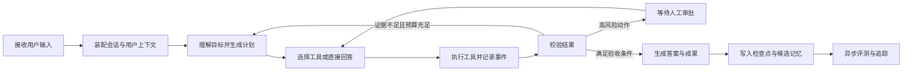

# Agent 开发手册

本目录是智能工作台的工程基线。当前仓库已实现 Next.js 服务端 DeepSeek 调用、PostgreSQL/pgvector 持久化、匿名会话与项目记忆；Playwright 才使用浏览器可访问的确定性 mock。后续编排服务按 Python、LangGraph、PostgreSQL 与 pgvector 路线迁移。

## 阅读顺序

1. [平台总体设计](./agent-platform-design.md)：边界、模块、状态流和数据流。
2. [模型 API 与提示词](./01-model-api-and-prompts.md)：从第一次模型调用到工具调用协议。
3. [LangGraph 运行时](./02-langgraph-agent-runtime.md)：计划、执行、循环、审批、恢复与流式事件。
4. [上下文、记忆与 RAG](./03-memory-and-rag.md)：切片、索引、检索、重排与用户记忆。
5. [评测、安全与可观测性](./04-evaluation-security-and-observability.md)：回归集、指标、追踪和风险控制。
6. [开发路线](./05-development-roadmap.md)：从前端样机到生产环境的阶段与验收门槛。
7. [前端工作台](./06-frontend-workbench.md)：页面布局、交互状态和事件映射。
8. [配置与调优](./07-configuration-and-tuning.md)：基线配置、压测方式和故障定位。
9. [万能搜索 Agent](./08-universal-search-agent.md)：从 API Key、意图、计划和工具路由到抓取、RAG、引用、质量循环、评测与经验沉淀。
10. [动态模型身份与分层记忆](./model-identity-memory/RESEARCH.md)：当前真实实现、隔离和生命周期契约。
11. [资料来源](./references.md)：本手册采用的官方文档与规范。

## 固定决策

| 项目 | 决策 |
| --- | --- |
| 产品形态 | 单助手对话工作台 |
| 当前实现 | Next.js 服务端调用 DeepSeek，PostgreSQL 持久化；mock 仅用于 Playwright |
| 前端 | Next.js 16、React 19、TypeScript、assistant-ui、TanStack Query、Zustand、Radix UI、Tailwind CSS |
| 未来服务端 | Python 3.12、FastAPI、LangGraph、Pydantic 2、Psycopg 3 |
| 数据 | PostgreSQL 16 与 pgvector，结构化数据和向量放在同一事务边界 |
| 通信 | JSON HTTP 负责命令，SSE 负责运行事件，文件走独立下载地址 |
| 编排 | 显式状态图，所有循环都有次数、耗时和预算上限 |
| 记忆 | 会话检查点、用户长期记忆、领域资料三类数据严格分离 |
| 检索 | 关键词与向量混合召回，元数据过滤，重排后注入模型 |
| 安全 | 工具最小权限，高风险动作人工审批，外部内容视为不可信输入 |
| 质量 | 离线回归、在线追踪、失败样本回流、版本化提示词 |

## 开发原则

- 单助手优先。只有事实证明单助手无法满足隔离、权限或并行协作时，才评估多助手。
- 确定性代码优先。解析、权限、金额、状态变更和格式校验不能交给模型猜测。
- 状态可恢复。每次运行都能停止、重试、审批后继续，并能从最后一个已提交检查点恢复。
- 工具可审计。每次调用保留名称、参数摘要、结果摘要、耗时、错误、重试和权限决策。
- 记忆可解释。每条长期记忆都有类型、来源、置信度、有效期和撤销入口。
- 检索可验证。回答引用具体片段，片段能追溯到文档版本和原始位置。
- 配置可替换。模型、嵌入、重排器、检索参数和预算不写死在工作流节点中。
- 先定义验收再调优。质量、延迟、成本和安全指标同时达标才允许发布。

## 一次任务的完整闭环

## 每个功能的完成定义

- 有明确输入、输出、错误和取消语义。
- 有至少一个正常样本、边界样本、工具失败样本和提示注入样本。
- 有事件流，可在前端观察当前阶段和耗时。
- 有幂等键，刷新或重连不会重复产生副作用。
- 有可复现的配置快照，包含模型、提示词、工具和检索版本。
- 有质量、延迟、成本和错误率结果，不能只凭人工体验判断。
