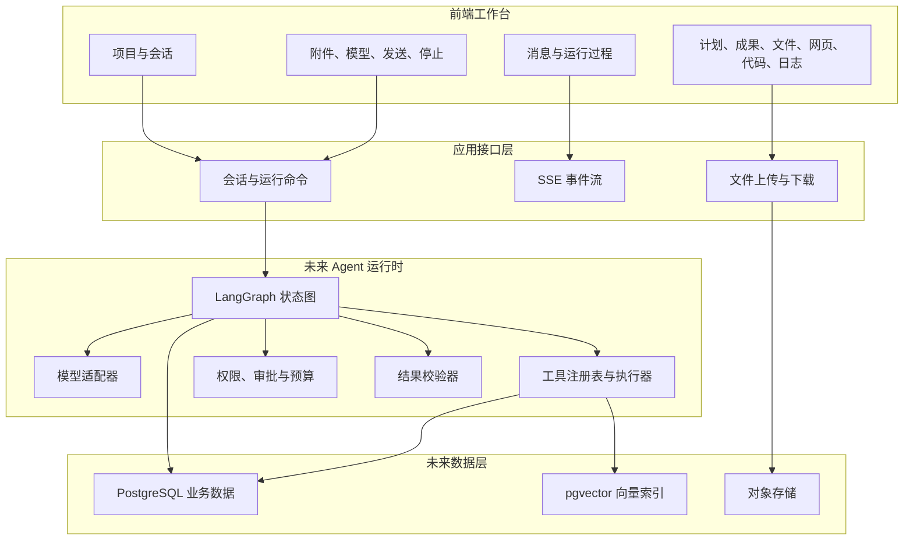
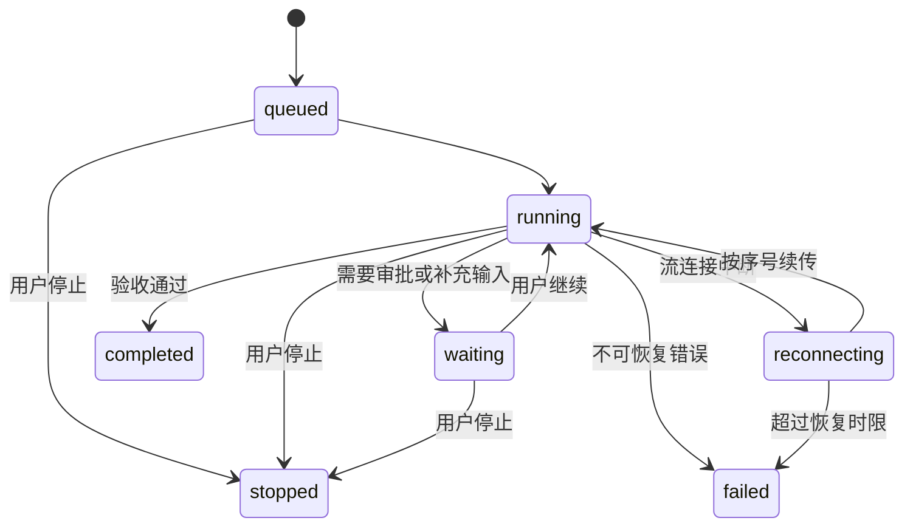

# 单助手工作台总体设计

## 1. 目标与边界

平台首先提供一个成熟的单助手工作台：用户在会话中描述任务，助手可规划步骤、调用工具、请求审批、流式输出，并把计划、成果、文件、代码和日志同步到工作区。

当前仓库只交付前端。浏览器调用的 `/api/v1` 路由是演示交互的本地模拟层，不代表正式服务端。正式服务端在后续阶段使用 Python、LangGraph、PostgreSQL 与 pgvector 实现。

本阶段不包含以下内容：

- 业务专用助手和自动分流。
- 多助手移交与层级式管理。
- 真实模型密钥、真实外部工具和真实数据库。
- 在浏览器保存敏感凭据。

## 2. 技术架构

## 3. 前端技术栈

| 层 | 技术 | 责任 |
| --- | --- | --- |
| 框架 | Next.js 16、React 19、TypeScript | 页面、路由、服务端渲染边界和类型安全 |
| 对话运行时 | assistant-ui | 消息、输入框、停止、消息操作和无障碍语义 |
| 服务端状态 | TanStack Query | 请求缓存、刷新、失效和错误状态 |
| 界面状态 | Zustand | 当前模型、工作区标签、选中成果和临时附件 |
| 基础交互 | Radix UI | 弹窗、气泡菜单、审批和标签页 |
| 布局 | react-resizable-panels | 左侧导航、会话区和右侧工作区 |
| 样式 | Tailwind CSS 与全局设计令牌 | 密度、颜色、字号、边界和响应式布局 |
| 内容渲染 | react-markdown、Shiki、Monaco | Markdown、代码高亮和代码预览 |
| 验证 | Vitest、Testing Library、Playwright | 单元、组件和真实浏览器回归 |

## 4. 未来服务端技术栈

| 层 | 推荐技术 | 说明 |
| --- | --- | --- |
| Web | FastAPI、Uvicorn | 异步 HTTP、SSE、文件上传、鉴权依赖 |
| 数据模型 | Pydantic 2 | 请求、状态、工具参数和结构化模型输出校验 |
| Agent 编排 | LangGraph | 显式节点、条件边、检查点、中断和流式执行 |
| 模型适配 | OpenAI Python SDK 与兼容适配层 | 模型调用、工具调用、结构化输出和用量统计 |
| 数据访问 | Psycopg 3、SQLAlchemy 2、Alembic | PostgreSQL 异步连接、事务和迁移 |
| 向量检索 | pgvector | 向量列、余弦距离、HNSW 与精确检索 |
| 文档解析 | pypdf、python-docx、openpyxl、python-pptx、BeautifulSoup | 按文件类型提取结构化内容 |
| 任务隔离 | 独立工具进程或受控容器 | 运行代码、命令和不可信文档转换 |
| 追踪 | OpenTelemetry 加 LangSmith 或 Langfuse | 跨请求追踪、模型与工具跨度、质量标签 |
| 测试 | pytest、pytest-asyncio、Testcontainers | 节点、工具、数据库和端到端验证 |

依赖必须锁定小版本并通过自动化升级验证。框架升级不能直接进入生产环境。

## 5. 核心领域对象

| 对象 | 关键字段 | 约束 |
| --- | --- | --- |
| 用户 | `id`、租户、权限、偏好 | 租户隔离贯穿所有查询 |
| 项目 | `id`、名称、成员、默认配置 | 项目只负责组织，不隐式改变权限 |
| 会话 | `id`、项目、标题、状态、更新时间 | 一个会话对应一个 LangGraph `thread_id` |
| 运行 | `id`、会话、状态、模型、预算、幂等键 | 同一会话默认只允许一个活动运行 |
| 消息 | `id`、运行、角色、内容、状态 | 流式增量最终合并为完整消息 |
| 工具调用 | `id`、名称、参数、结果、耗时、权限 | 参数和结果都按模式校验并脱敏 |
| 审批 | `id`、工具调用、风险、决定、决定人 | 审批后从检查点继续，不重放已完成副作用 |
| 计划 | 版本、步骤、状态、说明 | 每次更新是完整快照，便于前端重建 |
| 成果 | `id`、版本、类型、内容、下载地址 | 生成、校验、发布状态分离 |
| 文件 | `id`、名称、类型、校验和、存储键 | 下载地址短时有效，不暴露存储凭据 |
| 记忆 | 类型、内容、来源、置信度、有效期 | 用户可查看、修改和删除 |
| 文档片段 | 文档、版本、位置、正文、向量、元数据 | 引用必须能回到原始文档位置 |

## 6. 运行状态机

运行状态必须由服务端判定，前端只消费状态，不用本地计时猜测完成。

终止状态为 `completed`、`failed`、`stopped`。所有终止路径必须写入结束时间和最终事件。

## 7. 事件协议

每个事件包含 `id`、`runId`、`threadId`、单调递增 `seq`、`type`、`createdAt` 和 `payload`。客户端以 `(runId, seq)` 去重，并在断线后携带最后序号续传。

| 事件类型 | 作用 | 前端位置 |
| --- | --- | --- |
| `run.started` | 建立运行和计时 | 会话状态点 |
| `message.created` | 创建用户或助手消息 | 会话时间线 |
| `message.delta` | 追加流式文本 | 助手消息正文 |
| `message.completed` | 提交完整文本与引用 | 消息操作栏 |
| `tool.started` | 显示工具名称和输入摘要 | 可折叠运行过程 |
| `tool.progress` | 更新进度 | 运行过程详情 |
| `tool.completed` | 显示结果摘要和耗时 | 运行过程详情 |
| `tool.failed` | 显示安全化错误 | 运行过程详情 |
| `approval.requested` | 暂停并请求决定 | 会话审批行 |
| `approval.resolved` | 记录决定并继续 | 审批行 |
| `plan.updated` | 发布完整计划快照 | 工作区计划标签 |
| `artifact.upserted` | 新建或更新成果 | 工作区成果标签 |
| `file.upserted` | 新建或更新文件 | 工作区文件与代码标签 |
| `log.created` | 增加结构化日志 | 工作区日志标签 |
| `run.completed` | 正常结束 | 输入框恢复发送 |
| `run.failed` | 失败结束 | 中文错误与重试入口 |
| `run.stopped` | 用户停止 | 保留已有输出 |

事件中不能传递模型隐藏推理、密钥、完整鉴权头和未脱敏工具结果。

## 8. 一致性与恢复

- 创建运行使用客户端幂等键，网络重试不能创建两个运行。
- 工具副作用使用独立幂等键，图节点重放不能重复扣费、发信或写数据。
- 事件先持久化再发布。前端重连后从数据库读取缺失事件。
- 流式增量可以丢弃并由完整消息修复，最终完整消息不能缺失。
- 计划、成果和文件事件采用版本号，旧版本事件不能覆盖新版本。
- 停止是合作式取消。模型请求、工具进程和数据库查询都接收取消信号。
- 运行恢复前先检查已提交的工具调用和副作用记录，再决定是否重试节点。

## 9. 权限与审批

工具分四级：

| 等级 | 示例 | 默认策略 |
| --- | --- | --- |
| 读取 | 查询公开或已授权数据 | 自动执行，记录审计 |
| 受限读取 | 读取私密文件或客户数据 | 校验资源权限后执行 |
| 可逆写入 | 新建草稿、生成文件 | 可自动或按项目策略审批 |
| 高风险写入 | 发送、删除、付款、发布、执行命令 | 每次审批，明确展示影响范围 |

“始终允许”只能作用于精确的工具、资源范围和有效期，不能成为全局无限授权。

## 10. 非功能目标

| 指标 | 初始目标 |
| --- | --- |
| 首个可见事件 | 本地与同区域部署下小于 800 毫秒 |
| 首段模型文本 | 常规任务第 95 百分位小于 4 秒 |
| 停止反馈 | 点击后 300 毫秒内进入停止中状态 |
| SSE 恢复 | 断线后 5 秒内恢复，事件不重复展示 |
| 工具审计覆盖 | 100% 工具调用有开始与终止记录 |
| 引用可追溯 | 100% RAG 引用能定位文档版本和片段 |
| 失败可理解 | 所有用户可见错误为中文且包含下一步 |
| 浏览器回归 | 桌面、窄屏、移动端关键流程全部通过 |

这些数值是起始服务等级目标，必须根据真实流量基线调整。

