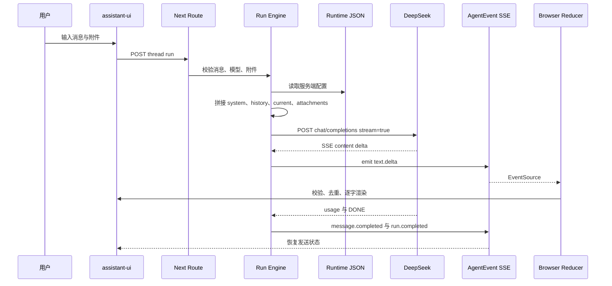

# 阶段 0：公开仓库、文档与交接基线

## 元数据

| 字段 | 内容 |
|---|---|
| 日期 | 2026-07-26 |
| Issue | [#1](https://github.com/LuzernRR/agent-workbench/issues/1) |
| 状态 | accepted |
| 目标环境 | local 与 GitHub public |

## 问题与目标

### 问题

项目已有大量代码与专题文档，但缺少根入口、实时交接账本、Agent 协作规则和逐功能验收记录。现有实现同时包含真实 DeepSeek 对话与模拟工具事件，如果不标明边界，接手者会误把内存存储当成持久化，把测试脚本当成真实 Agent 工具。

### 目标

建立安全的公开仓库和高密度交接基线，让人类开发者或 Agent 能从 README 确认架构，从 HANDOFF 确认现状，从开发记录还原每次变更，并严格遵守“一次一个功能、用户验收后继续”。

### 范围

- 根级 Git、安全忽略、UTF-8 与 LF 规则。
- 公开 GitHub 仓库与 Issue 门禁。
- README、HANDOFF、AGENTS。
- 开发记录索引、模板和首份记录。
- 当前 LLM、Prompt、SSE、AgentEvent、UI 链路说明。

### 非目标

- 不修改工作台功能与视觉。
- 不实现 PostgreSQL、pgvector、真实工具或万能搜索。
- 不提交 `agent-runtime.local.json`。

## 架构基线

## 真实 LLM 调用链路

### 1. 配置读取

- 文件：`config/agent-runtime.local.json`。
- 加载器：`frontend/src/server/config/runtime-config.ts`。
- 校验：Zod 检查版本、运行模式、Provider、HTTPS 接口、默认模型、推理强度、超时、重试、生成参数和系统提示词。
- 安全：文件命中 `config/.gitignore` 与根 `.gitignore`，不进入 Git；浏览器只收到公开模型定义。

### 2. 前端提交

- 输入组件：`AgentComposer.tsx`。
- assistant-ui 把输入转换为 `AppendMessage`。
- `Conversation.tsx` 调用 `onStartRun`。
- `use-agent-thread.ts` 将模型、推理强度、工具选择、权限模式和附件 ID 交给 `workbenchApi.startRun`。
- 首条消息先创建会话，再启动运行；已有会话直接启动运行。

### 3. Prompt 拼接

`engine.ts` 的顺序如下：

1. 系统提示词来自统一配置。
2. `completedConversation` 回放此前 `message.started`、delta 和 `message.completed`。
3. 编辑旧用户消息时，从被替换消息位置截断旧分支。
4. 历史最多保留 40 条、约 8 万字符，防止上下文无界增长。
5. 当前消息保持原文。
6. 文本附件在 64 KiB 内使用严格 UTF-8 解码并追加；其他附件只提供名称。
7. 模型选择不合法时回退统一配置中的默认模型。

实际请求包含 `model`、`messages`、`stream`、`stream_options`、`temperature`、`max_tokens`、`thinking` 和 `reasoning_effort`。

### 4. 思考与输出

- DeepSeek 的思考能力通过 `thinking` 与 `reasoning_effort` 控制。
- 隐含思维过程不转发到界面，客户端只消费 `delta.content`。
- 普通回复允许 Markdown，不强行转换为 JSON。
- 工具参数、计划、引用、文件与持久化命令必须使用独立结构化事件，不从自然语言正文提取关键字段。

### 5. SSE 解析

`deepseek-client.ts` 处理网络分块可能切在任意字符位置的情况：

1. `TextDecoder` 以流模式解码 UTF-8。
2. 缓冲区按空行拆出 SSE 事件块。
3. 只拼接 `data:` 行。
4. `[DONE]` 作为正常终点。
5. JSON 解析失败、空回复或无结束标记均转为安全中文错误。
6. 429、500、502、503、504 在尚未输出正文时指数退避重试。
7. 已输出正文后禁止自动重试，避免界面出现重复文本。
8. 停止按钮触发 `AbortController`，上游请求与本地运行同时终止。

### 6. AgentEvent 与浏览器状态

- `engine.ts` 将 Provider 流转换为 `text.delta`。
- `store.ts` 为每个事件分配单调序列号并推送订阅者。
- `/runs/{id}/events` 先补发 `after` 之后的历史，再订阅新事件，并发送心跳。
- 浏览器使用 `schema.ts` 验证事件包。
- `reducer.ts` 按 thread、project 和 seq 去重，更新消息与运行状态。
- `use-agent-thread.ts` 使用渲染队列逐字符更新，不改变持久事件序号。

## 防止乱码与非结构化污染

| 风险 | 当前防线 | 后续要求 |
|---|---|---|
| 密钥泄露 | 本地 JSON、Git 忽略、服务端读取 | CI 增加 secret scan |
| UTF-8 乱码 | `.editorconfig`、`.gitattributes`、fatal TextDecoder | 数据库统一 UTF8、接口固定 charset |
| SSE 半包 | 缓冲区跨 chunk 拼接 | 加入代理与断网故障注入 |
| 事件乱序 | 全局 seq、客户端去重 | 数据库使用 per-run sequence 唯一约束 |
| 结构化字段污染 | Zod AgentEvent、独立 payload | 工具输出增加版本化 JSON Schema |
| 数字类型漂移 | reducer 仅接受有限数字 | 金额、计数使用明确单位与范围校验 |
| Markdown 代码污染 | 渲染前 sanitize | 工具代码与展示代码分开存储 |
| 思维链泄露 | 忽略 reasoning_content | 日志也不得持久化隐含思考 |

## 当前数据状态

`store.ts` 使用 `globalThis` 中的 Map 保存项目、会话、运行和成果。它能跨 Next.js 热重载保持数据，但不是持久化：进程退出后会重新生成种子数据。后续 PostgreSQL 实现必须先定义表结构、事务边界、迁移、幂等和恢复，再替换该存储；不能仅把 Map 序列化为临时 JSON 冒充持久化。

## 阶段 0 文件

| 文件 | 用途 |
|---|---|
| `.gitignore` | 排除密钥、依赖、构建、日志、测试产物 |
| `.editorconfig` | UTF-8、LF、末尾换行 |
| `.gitattributes` | Git 文本行尾和二进制识别 |
| `README.md` | 架构、运行、边界、文档入口 |
| `HANDOFF.md` | 当前能力、缺口、下一顺序 |
| `AGENTS.md` | Agent 执行规则和验收门 |
| `docs/development/README.md` | 逐功能记录规范与索引 |
| `docs/development/TEMPLATE.md` | 后续记录统一模板 |

## 安全审计

首次公开前检查 93 个候选文件：

- 密钥值匹配：0。
- 可疑密钥文件名：0。
- 超过 20 MiB 文件：0。
- `agent-runtime.local.json` 被追踪：否。
- `node_modules`、`.next`、日志和 Playwright 产物被追踪：否。
- 严格 UTF-8 解码失败：0。

## 验证证据

| 验收项 | 命令或证据 | 当前结果 |
|---|---|---|
| 单元测试 | `npm test` | 59/59 |
| 类型 | `npm run typecheck` | 通过 |
| Lint | `npm run lint` | 通过 |
| 生产构建 | `npm run build` | 通过 |
| 端到端交互 | `npm run test:e2e` | 7/7 |
| 文档链接 | 扫描 17 份 Markdown 的本地链接 | 0 断链 |
| 公开仓库 | `gh repo create ... --public --push` | 已创建 |
| 密钥忽略 | `git check-ignore -v config/agent-runtime.local.json` | 命中规则 |
| 密钥扫描 | 扫描 Git 候选文件中的常见密钥值格式 | 0 命中 |
| UTF-8 | 严格 UTF-8 解码 Git 候选文本文件 | 0 失败 |

阶段 0 提交前后均已执行文档链接、安全扫描和 GitHub 远端状态验证；验证证据同步到 Issue #1，用户于 2026-07-26 明确验收后关闭 Issue。

## 回滚

- 文档变更可使用普通 `git revert` 回滚，不允许重写公开分支历史。
- GitHub 仓库是用户明确要求的公开交付物，不在自动回滚范围内。
- 本地密钥从未进入 Git，无需轮换；若后续扫描发现泄露，立即停止并轮换密钥。

## 用户验收

- 状态：用户已于 2026-07-26 明确回复“阶段 0 验收通过”。
- 验收证据：[Issue #1](https://github.com/LuzernRR/agent-workbench/issues/1) 与提交 `c42f5e7`。
- 下一功能：阶段 1，真实会话连续性与工作台交互修复。
- 下一功能执行门：用户已允许开始。
