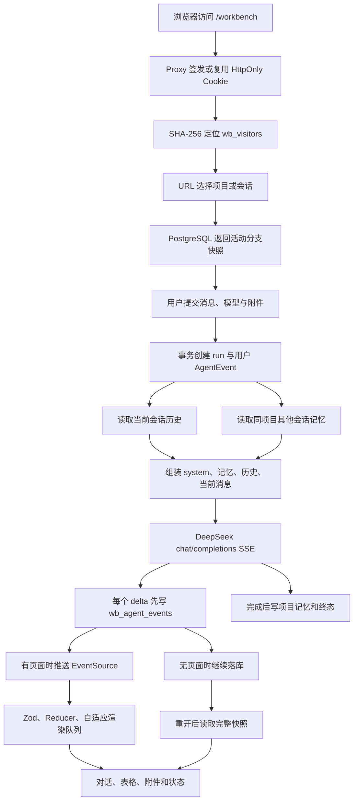

# 阶段 1：真实会话连续性与工作台交互

## 1. 元数据

| 字段 | 内容 |
|---|---|
| 日期 | 2026-07-26 |
| Issue | [#2](https://github.com/LuzernRR/agent-workbench/issues/2) |
| 执行门 | `allowed` |
| 环境 | local live `3100`、Playwright mock `3110`、GitHub public |
| 技术 | Next.js 16、React 19、assistant-ui、PostgreSQL 17、pgvector、DeepSeek SSE |
| 状态 | 最终验证后等待用户验收 |

## 2. 交付目标

本阶段把匿名身份、持久化、会话 URL、消息编辑、项目树、拖拽、附件、模型、无闪屏、项目记忆、3 天清理、结果结构、滚动和后台输出纳入同一会话真值。live 页面不得显示种子项目、模拟工具、虚构计划或不存在的能力。

## 3. 总体链路



## 4. 配置

### 4.1 文件与加载

- 真实文件：`config/agent-runtime.local.json`。
- Git 规则：`config/.gitignore` 只允许本地配置留在工作区，不进入提交。
- 加载与 Zod 校验：`frontend/src/server/config/runtime-config.ts`。
- 默认解析路径：从 `frontend/` 运行时读取 `../config/agent-runtime.local.json`。
- 可选覆盖：`AGENT_RUNTIME_CONFIG_PATH`，只用于服务端进程。
- mock 覆盖：`WORKBENCH_LLM_MODE=mock`；未设置时遵循 JSON 的 `runtime.mode`。

### 4.2 关键配置

| 分组 | 字段 | 作用 |
|---|---|---|
| `provider` | `apiKey`, `endpoint`, `defaultModel`, `models` | 模型调用和公开模型菜单 |
| `provider.request` | `timeoutMs`, `maxRetries` | 模型超时与有限重试 |
| `database` | `url`, `ssl`, `poolMax` | PostgreSQL 连接池 |
| `session` | `cookieName`, `ttlDays` | 匿名 Cookie 名称与浏览器寿命 |
| `retention` | `threadTtlDays` | 固定为 3 天 |
| `retention` | `cleanupIntervalMinutes` | 维护执行的最小间隔 |
| `retention` | `projectMemoryMaxItems` | 单项目持久记忆条数上限 |
| `retention` | `projectMemoryRecallItems` | 单轮召回条数上限 |
| `retention` | `projectMemoryMaxChars` | 注入 Prompt 的字符上限 |
| `generation` | `temperature`, `maxTokens`, `thinkingEnabled` | DeepSeek 生成参数 |
| `assistant` | `systemPrompt` | 对话基础系统提示词 |

密钥只在 `frontend/src/server/llm/deepseek-client.ts` 组装为 `Authorization: Bearer`。模型公开接口使用 `publicModelDefinitions()`，不返回密钥、数据库或系统 Prompt。

## 5. PostgreSQL 与 pgvector

### 5.1 本地容器

`compose.yaml` 使用 `pgvector/pgvector:pg17`，容器名 `agent-workbench-postgres`，端口只绑定 `127.0.0.1:5432`，数据放在命名卷。启动：

```powershell
docker compose up -d
docker ps --filter name=agent-workbench-postgres
```

### 5.2 幂等 schema

`frontend/src/server/persistence/database.ts` 在首次查询前：

1. 建立连接池。
2. 开启事务。
3. 获取 `pg_advisory_xact_lock(hashtext('agent-workbench-schema-v1'))`。
4. 执行 `frontend/src/server/persistence/schema.ts`。
5. 提交；失败时回滚并允许后续请求重试。

### 5.3 表职责

| 表 | 关键字段 | 约束 |
|---|---|---|
| `wb_visitors` | `id`, `token_hash`, `last_seen_at` | 哈希唯一，长度 64 |
| `wb_projects` | `visitor_id`, `name`, `sort_order` | 复合归属，稳定排序 |
| `wb_threads` | `project_id`, `status`, `updated_at` | 项目复合外键，TTL 依据 |
| `wb_project_memories` | `project_id`, `source_thread_id`, `source_run_id`, `role`, `content`, `embedding` | 同运行每角色唯一；`embedding vector` 可空 |
| `wb_runs` | `thread_id`, `model_id`, `status`, `archived_at` | 活动分支和终态 |
| `wb_agent_events` | `seq`, `run_id`, `event_type`, `payload`, `archived_at` | identity 单调序号，JSONB |
| `wb_attachments` | `thread_id`, `mime_type`, `kind`, `bytes` | 最大 20 MB，随会话级联 |

项目记忆不对 `source_thread_id` 建外键，原因是原始会话 3 天后可删除，而有界项目记忆需要继续服务同项目的新会话。它仍通过项目外键在删除项目时级联清理。

## 6. 匿名身份

### 6.1 签发

`frontend/src/proxy.ts` 匹配 `/`、`/workbench/*` 和 `/api/*`。首次页面响应使用 Web Crypto 生成 32 字节随机值，编码为 `wbv_` + 43 位 Base64URL，Cookie 参数：

- `HttpOnly`
- `SameSite=Lax`
- `Secure` 仅 HTTPS
- `Path=/`
- 浏览器寿命 365 天

### 6.2 解析

`frontend/src/server/session/visitor.ts` 从请求 Cookie 读取凭证，校验格式，计算 SHA-256，然后执行 upsert：已存在时只更新 `last_seen_at`。API 不信任客户端传来的访客 ID。

首次直接请求 API 会收到 401，因为本次响应新设的 Cookie 不能反向进入同一个请求；正常用户先访问页面再发 API。自动化测试必须先 `GET /workbench` 建立身份。

## 7. 路由与选择状态

`frontend/src/components/workbench/entry/WorkbenchEntry.tsx` 把路由解析为三种选择：

- `/workbench`：无项目草稿。
- `/workbench/p/{projectId}`：项目视图，不选择会话。
- `/workbench/t/{threadId}`：会话视图，项目归属由快照返回。

`frontend/src/lib/workbench-selection.ts` 负责纯函数转换和测试。切换使用 `router.push`，刷新直接由 URL 恢复。`projectId === undefined` 表示仍在解析，不能拿 `null` 的无项目语义代替。

## 8. live API

所有 Next route 进入 `frontend/src/server/backend-proxy.ts`，按 `runtimeMode` 分到 live 或 mock。live 统一由 `frontend/src/server/live/handler.ts` 处理：

| 方法 | 路径 | 作用 |
|---|---|---|
| GET/POST | `/api/v1/projects` | 列表与创建项目 |
| PATCH/DELETE | `/api/v1/projects/{id}` | 重命名与删除项目 |
| PATCH | `/api/v1/projects/reorder` | 持久项目顺序 |
| GET/POST | `/api/v1/threads` | 全部会话与无项目会话创建 |
| GET/PATCH/DELETE | `/api/v1/threads/{id}` | 快照、归属/标题、删除 |
| POST | `/api/v1/threads/{id}/runs` | 创建模型运行 |
| GET | `/api/v1/runs/{id}/events?after={seq}` | 持久回放 + live SSE |
| POST | `/api/v1/runs/{id}/stop` | 中止运行 |
| POST | `/api/v1/threads/{id}/attachments` | 上传附件 |
| GET | `/api/v1/attachments/{id}` | 按访客读取附件 |

## 9. 模型运行

### 9.1 创建

`prepareLiveRun()` 在一个事务内：

1. 锁定会话并拒绝重复运行。
2. 回放活动事件得到已完成历史。
3. 编辑消息时归档目标及下游分支。
4. 历史最多 40 条、80000 字符。
5. 召回同项目其他会话记忆。
6. 校验附件属于当前访客和会话。
7. 创建 `wb_runs` 并把会话置为 `running`。
8. 写 `run.created`、用户 `message.started/completed`。

### 9.2 Prompt

`frontend/src/server/live/prompt-policy.ts` 生成顺序：

1. 基础 system Prompt。
2. 结果呈现策略：表格、步骤、列表、短段落的选择条件。
3. 可选项目记忆 system message，明确为不可信事实背景。
4. 当前会话活动历史。
5. 当前用户消息和附件上下文。

Prompt 不要求展示模型内部推理。运行跨边界的状态通过 typed AgentEvent 和 Zod，不从自然语言中猜工具参数或状态。

### 9.3 DeepSeek SSE

`frontend/src/server/llm/deepseek-client.ts`：

- 请求体使用真实模型 ID、temperature、max_tokens、thinking 和 reasoning_effort。
- 只重试未收到内容前的 408、429 和 5xx。
- 收到部分内容后中断不会重放，避免重复文本。
- `TextDecoder` 按 UTF-8 流式解码，按空行拆 SSE block。
- 解析失败、空回复、超时和 Provider 状态转换为不含密钥的中文错误。

### 9.4 与页面解耦

`startLiveRun()` 创建 runtime 后调用 `void execute(...)`，POST 立即返回 `runId`。`execute` 持有 Provider stream 和 AbortController；`subscribers` 只是通知集合，可以为空。每个 delta 先 `persistLiveEvent()`，再遍历订阅者，因此关闭页面、关闭 EventSource 或没有前端都不会暂停模型。

服务重启会丢失内存中的 Provider 连接。`recoverInterruptedLiveRuns()` 把遗留 `queued/running/waiting` 标记失败，并写“服务重启导致上次生成中断”，不伪装续跑。

### 9.5 停止、事件顺序与唯一终态

涉及文件：

- `frontend/src/hooks/use-agent-thread.ts`
- `frontend/src/components/workbench/conversation/Conversation.tsx`
- `frontend/src/server/live/engine.ts`
- `frontend/src/server/live/store.ts`
- `frontend/src/server/live/handler.ts`
- `frontend/src/server/mock/engine.ts`

完整链路：

1. 发送请求返回真实 `runId` 后，hook 立即把它写入活动读模型并建立 SSE；请求尚未返回时只显示禁用的发送按钮。
2. 停止按钮可见即保证 `activeRunId` 存在，点击调用 `POST /api/v1/runs/{runId}/stop`。
3. runtime 同步设置 `cancelled=true`，调用 `AbortController.abort()`，Provider fetch、流读取和重试等待共用该信号。
4. `eventTail` 把持久事件和终态操作串行化；排队的 delta 在执行前再次检查取消标记。
5. `finalizeLiveRun()` 执行带活动状态条件的 `UPDATE ... RETURNING`。停止、完成、失败只有一个请求能抢占终态。
6. 胜出者在同一 PostgreSQL 事务更新线程状态并写终态事件；完成路径还在同一事务写 `message.completed` 与项目记忆。
7. 失败抢占者重新读取当前状态。重复停止返回 `stopped`，恰好已完成则返回 `completed`，均为 200 且不重复写事件。
8. mock 运行时采用相同幂等返回语义，3110 自动化与 3100 live 不会出现契约分叉。

关键不变量：`run.cancelled` 最多一个；它之后没有 delta、`message.completed` 或 `run.completed`；停止运行不写项目记忆；线程回到 `idle`；刷新后可继续发送。

## 10. SSE 与前端读模型

`frontend/src/hooks/use-agent-thread.ts`：

1. React Query 读取 PostgreSQL 快照。
2. 只在快照 thread ID 与当前 URL 一致时接受数据。
3. `lastSeqRef` 记录持久序号。
4. 活动运行使用 EventSource，从 `after=lastSeq` 继续。
5. 每个事件经 `parseAgentEvent()` Zod 校验。
6. `reduceAgentEvent()` 更新单一 `AgentThreadState`。
7. 终态关闭运行显示，SSE 清理由 effect 完成。

较旧快照不能覆盖较新的 SSE 状态；比较 `lastSeq` 后才更新。切换会话时立即清理旧 state、序号和订阅，壳层用骨架保持布局。

## 11. 渲染队列与后台页面

`frontend/src/lib/agent-events/typewriter-queue.ts` 解决两类冲突：

- 短 delta 每帧少量字符，保留逐字感。
- 大积压按目标帧数自适应增加每帧字符；终态已到达时进一步加速。

浏览器隐藏标签会暂停 `requestAnimationFrame`。因此 `visibilitychange` 进入 hidden 时：

1. `flush()` 取消计划帧。
2. 同一个持久 delta 的未渲染字符合并为一次 reducer 更新。
3. 保持原 durable seq，控制事件仍按顺序应用。
4. 本轮后续事件直接应用，不再依赖动画帧。
5. 下一轮 effect 重新创建队列并恢复逐字显示。

页面完全关闭时没有前端队列；重开直接读取完整数据库快照。

## 12. 用户滚动

`frontend/src/components/workbench/conversation/Conversation.tsx` 使用 `ThreadPrimitive.Viewport` 的 `isAtBottom`。assistant-ui 已具备以下行为：

- 初次打开和新运行开始时到底部。
- 位于底部时随内容增长。
- 用户向上滚动后取消跟随。
- 非底部时显示“滚动到底部”按钮。

原代码额外监听每个 `state.lastSeq` 并执行 `scrollTo({top: scrollHeight})`，覆盖用户操作。该 effect 已删除；没有第二个滚动所有者。

## 13. 项目记忆

### 13.1 写入

模型完成后 `rememberProjectExchange()` 保存本轮用户问题和助手回复，按 `source_run_id + role` 幂等。单条截断由 `projectMemoryMaxChars` 推导，项目总量按 `projectMemoryMaxItems` 删除最旧记录。

### 13.2 召回

`recallProjectMemory()` 条件：同访客、同项目、来源不是当前会话、`archived_at IS NULL`。先取最近 `projectMemoryRecallItems` 条，再按 `projectMemoryMaxChars` 限制字符，恢复时间顺序后注入 Prompt。

### 13.3 生命周期

- 编辑旧分支：归档对应记忆。
- 手动删除会话：删除来源记忆。
- 移出项目：归档活动记忆。
- 移入其他项目：迁移活动记忆到新项目。
- 自动 TTL：删除原始会话，不删除有界项目记忆。
- 删除项目：外键级联删除全部项目记忆。

## 14. 3 天清理

`ensureLiveRecovery()` 在 live 请求前调用维护。清理满足：

```sql
DELETE FROM wb_threads
WHERE updated_at < now() - ($1::int * interval '1 day')
  AND status NOT IN ('running', 'waiting');
```

`$1` 由 schema 固定为 3。进程记录上次清理时间，15 分钟内的请求不重复执行。该机制适合本地单实例；生产多实例应迁移到独立任务并增加租约和可观测指标。

## 15. 前端交互

### 15.1 左栏

`frontend/src/components/workbench/sidebar/WorkbenchSidebar.tsx` 使用 `tree/treeitem/group`：

- 项目标题点击选择项目，箭头只展开或收起。
- 所属会话只在项目子树显示一次。
- 无项目会话放在“会话”区域，不增加“独立会话”说明。
- 空列表不输出教程句。
- 会话标题强制单行 `text-clip`，不用 `...` 或 `…`。

### 15.2 拖拽

- 项目：`useSortable`。
- 会话：`useDraggable`。
- 项目与无项目区：`useDroppable`。
- PointerSensor：`distance: 3`，无长按延时。
- API：项目排序 PATCH；会话归属 PATCH。
- 缓存：onMutate 保存快照并乐观更新，onError 恢复。

### 15.3 顶栏

`frontend/src/components/workbench/app-shell/WorkbenchShell.tsx`：

- 项目按钮进入 `/workbench/p/{id}`。
- 会话按钮打开当前范围会话菜单。
- 项目会话不显示在其他项目或无项目范围。
- 无项目会话不显示项目名。
- 加载中显示无文字骨架，不猜“未归档”或旧标题。

### 15.4 模型与附件

`frontend/src/components/workbench/composer/AgentComposer.tsx`：

- 模型来自 `/api/v1/models`，菜单显示名称和真实 ID。
- 菜单打开时触发器显示“模型”，避免同名出现两次。
- 草稿图片使用 `blob:` 预览；持久图片使用附件 API。
- 图片只显示图像和移除按钮，不显示文件名。
- 文档显示文件名，因为用户需要识别下载内容。

### 15.5 焦点和空状态

`frontend/src/app/globals.css` 显式清理按钮、输入、链接和可聚焦元素的 UA outline 宽度、样式和聚焦阴影；新建项目输入与消息编辑 textarea 使用无边线类。项目、会话为空时列表保持空，不渲染“还没有项目”“创建第一个项目”“还没有会话”“开始第一个任务”。

## 16. Markdown 结果

`frontend/src/components/workbench/renderers/MarkdownRenderer.tsx` 使用 `remark-gfm` 与 `rehype-sanitize`。链接只允许 HTTP(S) 或同源绝对路径，图片也经过安全 URL 检查。表格保留原生语义并包在 `.markdown-table-scroll` 中，最小宽度 680px；窄屏只滚动表格，不让页面横向溢出。

## 17. 验证证据

### 17.1 自动化

| 层级 | 覆盖 |
|---|---|
| Vitest | 配置、访客 Token、schema、Reducer、typewriter、Markdown、Prompt、store |
| TypeScript | 全项目 `tsc --noEmit` |
| ESLint | 前端、服务端、测试与配置 |
| Next build | 生产路由、Proxy 与动态路由 |
| Playwright | 首页、空导航、焦点、运行、停止、模型、编辑、切换、URL、刷新、拖拽、CRUD、附件、移动端、滚动、后台帧冻结 |

最终全量结果：16 个 Vitest 文件共 76 项通过，`tsc --noEmit` 通过，全仓 ESLint 通过，Next 生产构建通过，16 项 Playwright 通过；`npm audit --omit=dev` 为 0 个漏洞。Git diff 无空白错误，117 个受检文本文件均为 UTF-8 无 BOM、LF，Markdown 本地链接无缺失，禁用 UI 文案与可见省略号扫描为零。

### 17.2 真实 DeepSeek

1. 项目 A 会话 1 写入随机代号。
2. 项目 A 会话 2 只问代号，准确召回。
3. 项目 B 同问，回答“不知道”。
4. 数据库比较问题自动选择 Markdown 表格。
5. 模型 ID 为公开配置中的 `deepseek-v4-flash`。

### 17.3 真实 PostgreSQL 保留

人工构造 4 天前已完成会话，清理前：1 会话、1 运行、9 事件、1 附件、2 项目记忆。重启服务触发维护后：会话、运行、事件、附件均为 0，项目记忆为 2。验证后删除临时访客和项目。

### 17.4 页面关闭

通过真实浏览器建立匿名身份并启动运行，保存 Cookie state 后关闭整个 context，不打开 SSE；数据库轮询得到 `completed`，447 个事件已持久化。重新创建浏览器 context 进入原 URL，直接看到完整回复。该结果证明运行不依赖前端页面。

### 17.5 刷新与身份

- 同一 Cookie 刷新前后不变。
- 新浏览器 context 得到不同 Cookie。
- Cookie 为 `HttpOnly`。
- 数据库 `token_hash` 长度固定 64。
- 非空会话刷新采样 14 次，没有首页招呼语、禁用空状态文字、乱码或错误项目名。
- 项目按钮与会话按钮各有一个独立可访问目标。
- 浏览器控制台和 pageerror 为空。

### 17.6 滚动与后台标签

- 预填 4 轮长历史，第 5 轮流式时滚到顶部。
- 等待 700ms 且分片持续到达，`scrollTop <= 2`。
- “滚动到底部”按钮可见，点击后才回到底部。
- 伪造 `visibilityState=hidden` 并冻结全部 rAF，第 1 轮仍完成、恢复发送并出现完整回复。

### 17.7 停止运行

- Playwright 人为延迟创建运行响应 300ms，响应前只显示禁用发送按钮，不提前暴露无 `runId` 的停止按钮。
- UI 点击停止返回 200；连续两次重复 stop 仍返回 200 和 `stopped`。
- SSE 仅一个 `run.cancelled`，其后没有正文、消息完成或运行完成；等待后事件数量不增长。
- 真实 DeepSeek UI 运行停止后，PostgreSQL 中 run 为 `stopped`、thread 为 `idle`、最后事件为唯一 `run.cancelled`。
- 真实数据库等待 2 秒仍为 6 个事件、最大序号不变，`source_run_id` 对应项目记忆为 0。
- 刷新原 URL 后成功发起第二次运行并再次停止；浏览器控制台与 pageerror 为空，验收数据随后删除。

## 18. 安全与数据审计

- `config/agent-runtime.local.json` 和密钥不提交。
- 不输出 Cookie 原值，只验证属性和相等关系。
- live 不调用 mock handler、seed 或 scripts。
- 附件读取同时校验访客。
- 项目记忆不能覆盖系统 Prompt。
- API 错误不回显 Provider body、密钥或数据库 URL。
- 所有临时真实验收项目在验证后删除。

## 19. 回滚与故障定位

| 症状 | 先检查 | 代码位置 |
|---|---|---|
| API 503 | PostgreSQL health、统一 JSON、server stderr | `database.ts`, `runtime-config.ts`, `handler.ts` |
| 回复失败 | run.failed payload、Provider 状态映射 | `deepseek-client.ts`, `engine.ts` |
| 重开缺消息 | `wb_agent_events` 活动分支与 seq | `store.ts`, `reducer.ts` |
| 串项目记忆 | visitor/project/source_thread 条件 | `recallProjectMemory()` |
| 切换闪旧内容 | snapshot/thread identity 与 Query cache | `use-agent-thread.ts`, `WorkbenchShell.tsx` |
| 后台恢复慢 | visibilitychange、queue.flush、终态顺序 | `typewriter-queue.ts`, `use-agent-thread.ts` |
| 停止后仍输出 | eventTail、cancelled 标记、终态条件更新、最后事件 | `engine.ts`, `store.ts`, `use-agent-thread.ts` |
| 滚动被抢 | 是否重新引入 lastSeq scroll effect | `Conversation.tsx` |
| 拖拽回跳 | optimistic cache、reorder payload、sort_order | `WorkbenchSidebar.tsx`, `store.ts` |

## 20. 当前边界与下一步

本阶段没有实现 Python/LangGraph、任务队列、checkpoint 恢复、真实搜索、抓取、RAG 向量召回、引用验证、登录和多租户。用户验收阶段 1 后，下一功能必须重新建立单一 Issue；建议先按 `docs/08-universal-search-agent.md` 的 Issue 00 实现共享搜索契约与 gold harness，不直接一次性接入全部工具。

## 21. 用户验收门

- 当前功能提交并推送后停止。
- Issue #2 保持打开，等待用户实际操作 `3100`。
- 只有用户明确回复阶段 1 验收通过，才能关闭 Issue #2 并建立下一功能执行门。
