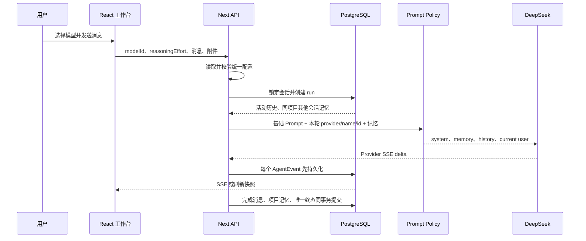

# 2026-07-26 开发记录 002：动态模型身份与分层记忆契约

## 1. 功能与门禁

- GitHub Issue：[阶段 2：动态模型身份与分层记忆契约](https://github.com/LuzernRR/agent-workbench/issues/3)
- Execution Gate：`allowed`
- 目标：模型依据本轮真实配置回答身份；证明当前会话历史和项目记忆在完整生命周期中的正确性。
- 非目标：Python、LangGraph、ReAct、搜索、RAG、embedding、登录与多租户。

用户已验收阶段 1，因此关闭 Issue #2 后创建 Issue #3。本次仍遵守“一次一个 Issue、一次一个功能”，本阶段交付后停止等待验收。

## 2. 开发前判断

当前系统已经具备真实 DeepSeek SSE、PostgreSQL AgentEvent、匿名访客、项目记忆和停止语义，但系统 Prompt 只称“通用助手”。用户询问身份时，模型不知道本轮实际模型名称和 ID。与此同时，已有项目记忆测试只覆盖写入和少量 SQL，不足以支撑后续 LangGraph checkpoint 与工具循环。

因此先完成身份和记忆契约，再迁移编排框架。原因是 LangGraph 会持久化更多状态；如果活动分支或隔离条件错误，错误也会被 checkpoint 固化。

## 3. 完整链路



## 4. 动态身份实现

### 4.1 文件

| 文件 | 作用 |
|---|---|
| `frontend/src/server/live/prompt-policy.ts` | 定义 `RuntimeModelIdentity` 并生成身份系统规则 |
| `frontend/src/server/live/engine.ts` | 从本轮 `runtime.run.modelId` 和统一配置读取公开身份 |
| `frontend/src/server/live/prompt-policy.test.ts` | 验证真实字段、模型切换、普通任务和记忆优先级 |

### 4.2 数据来源

1. API 接收浏览器提交的 `modelId`。
2. `startLiveRun()` 只允许使用统一配置 `provider.models` 中存在的模型；未知模型回退到真实默认模型。
3. 选定模型 ID 写入 `wb_runs.model_id`，成为本轮不可变身份。
4. `execute()` 使用运行记录中的 ID 查找模型名称，Provider 名称由已校验的 `provider.type` 映射。
5. 只把 Provider、模型名称、模型 ID 放入 Prompt，不包含密钥和 Endpoint。

### 4.3 Prompt 规则

身份块位于首个 system message。身份问题必须明确返回三项字段，不能只称通用助手；普通任务不主动重复。项目记忆位于第二个可选 system message，明示为不可信背景，因此不能覆盖身份。

## 5. 会话历史

`prepareLiveRun()` 从当前访客和会话的 `wb_agent_events` 读取 `archived_at IS NULL` 的活动事件。`completedMessages()` 只有看到 `message.started` 和对应 `message.completed` 才把消息加入历史；未完成 assistant 草稿、停止前残片和归档分支不会进入下一轮 Prompt。

历史限制：最多 40 条，正文合计超过约 80000 字符时从最旧消息移除。当前用户消息不写入 `history`，而是在历史之后单独追加，避免重复。

## 6. 项目记忆

### 6.1 写入

只有 completed 运行写入项目记忆。用户消息和最终助手消息各一条，以 `(source_run_id, role)` 幂等；写入、最终 assistant 事件、线程状态和 `run.completed` 位于同一事务。无项目、stopped 和 failed 运行不写。

### 6.2 召回

查询必须同时满足：

```sql
visitor_id = current_visitor
AND project_id = current_project
AND source_thread_id <> current_thread
AND archived_at IS NULL
```

这使当前会话依靠原始历史，同项目其他会话依靠项目记忆，避免同一内容重复进入上下文。当前按 `created_at DESC` 取最近条目，不执行向量搜索。

### 6.3 预算修正

旧逻辑在第一条记忆大于预算时仍会完整选入。修正后把“用户/助手标签、两个换行符、正文”全部计入预算；第一条过长时只截取可用正文，最终字符串长度不超过 `projectMemoryMaxChars`。

## 7. 生命周期

### 7.1 编辑

编辑定位原用户消息所属运行，使用运行创建时间归档该运行和所有下游运行、事件、项目记忆。新运行复用逻辑用户消息 ID，但重新生成运行和助手消息。快照、历史和召回都只读活动数据，因此旧事实立即失效。

### 7.2 移动

- 项目 A 直接移动到 B：会话、运行、事件和未归档来源记忆同步改为 B。
- 移出项目：会话、运行和事件归属变为 `NULL`，来源项目记忆归档。
- 从无项目移入项目：之前无项目运行本来不写项目记忆，不会凭空生成历史记忆。

### 7.3 停止与过期

停止只抢占 `stopped` 终态并写 `run.cancelled`，不传入完成消息或 memory。TTL 删除超过 3 天且非运行的 `wb_threads`；运行、事件和附件通过外键级联删除。项目记忆不对来源会话建外键，因此按每项目最大条数保留；删除项目或访客时再级联清理。

## 8. 自动化

| 层级 | 文件 | 覆盖 |
|---|---|---|
| Prompt 单测 | `prompt-policy.test.ts` | 身份字段、模型切换、普通任务、敏感字段、记忆注入 |
| Store 单测 | `store.test.ts` | 已完成历史、隔离 SQL、预算、编辑、迁移、移出、停止、TTL |
| PostgreSQL 集成 | `store.integration.test.ts` | 两个访客、两个项目、无项目、真实事务和真实级联 |

真实数据库集成测试默认跳过，避免普通单测依赖本地基础设施。显式命令：

```powershell
cd frontend
$env:WORKBENCH_LIVE_INTEGRATION='1'
npx vitest run src/server/live/store.integration.test.ts
```

## 9. 当前验证结果

### 9.1 真实模型身份

3100 生产服务使用本地统一配置执行两个真实模型：

| 本轮模型 | 身份回答命中 |
|---|---|
| DeepSeek V4 Flash | `DeepSeek`、`DeepSeek V4 Flash`、`deepseek-v4-flash` |
| DeepSeek V4 Pro | `DeepSeek`、`DeepSeek V4 Pro`、`deepseek-v4-pro` |

两次回复内容不同，证明身份跟随本轮模型，不是硬编码默认模型。临时会话与访客验证后已级联清理。

### 9.2 真实记忆

使用随机事实 `PJ-51062349` 验证：

- 刷新后快照仍定位同一会话并包含已完成历史。
- 同会话下一轮返回 `PJ-51062349`。
- 同项目另一会话返回 `PJ-51062349`。
- 其他项目返回 `UNKNOWN`，未出现该事实。
- 真实 PostgreSQL 集成测试同时验证不同访客、无项目、编辑、移动、移出、停止和 TTL。

### 9.3 自动化与扫描

| 门禁 | 结果 |
|---|---|
| Vitest | 16 个文件、85 项通过；真实集成文件默认跳过 |
| PostgreSQL 集成 | 1 个文件、1 项全生命周期场景通过 |
| TypeScript | 通过 |
| ESLint | 通过 |
| Next 生产构建 | 通过 |
| Playwright | 16 项通过，含桌面与移动端关键交互 |
| 生产依赖审计 | 0 个漏洞 |
| UTF-8/LF | 15 个改动文本文件均通过 |
| UI 禁用文案 | 0 处 |
| 可见省略号 AST | 0 处 |
| Markdown 本地链接 | 24 个文件，0 个缺失 |
| 3100 健康检查 | HTTP 200 |

## 10. 配置与调优

| 配置 | 当前值 | 调优依据 |
|---|---:|---|
| `projectMemoryMaxItems` | 120 | 限制每项目存储量；先看召回准确率再扩大 |
| `projectMemoryRecallItems` | 24 | 控制进入 Prompt 的候选数量 |
| `projectMemoryMaxChars` | 16000 | 控制项目背景占用，标签和分隔符计入 |
| 会话历史条数 | 40 | 在连续性和上下文成本之间取基线 |
| 会话历史字符 | 80000 | 超限移除最旧消息 |
| `threadTtlDays` | 3 | 删除原始会话链路，保留有界项目记忆 |

后续不能只提高这些阈值。正确顺序是建立记忆问答评测集，测量事实命中、错误召回、跨域泄漏、旧事实覆盖和 Token 成本，再决定摘要、事实提炼或语义召回。

## 11. 回滚

- 动态身份只修改 Prompt 组装，可独立回滚，不涉及数据库迁移。
- 记忆预算修正只缩短超预算背景，不改变存储内容。
- 新集成测试默认跳过，不影响生产运行。
- 若 Provider 对身份规则响应异常，可保留身份数据结构并调整措辞，不能退回硬编码单一模型。

## 12. 下一阶段建议

阶段 2 验收后创建一个新的单功能 Issue：以 Python 3.12、FastAPI、LangGraph 和 PostgreSQL checkpointer 建立最小运行图，只包含输入、模型调用、完成、失败、停止和 checkpoint 恢复，并把图事件适配为现有 `AgentEvent`。工具调用、搜索和 RAG 继续留在后续 Issue，避免一次迁移多个风险边界。
