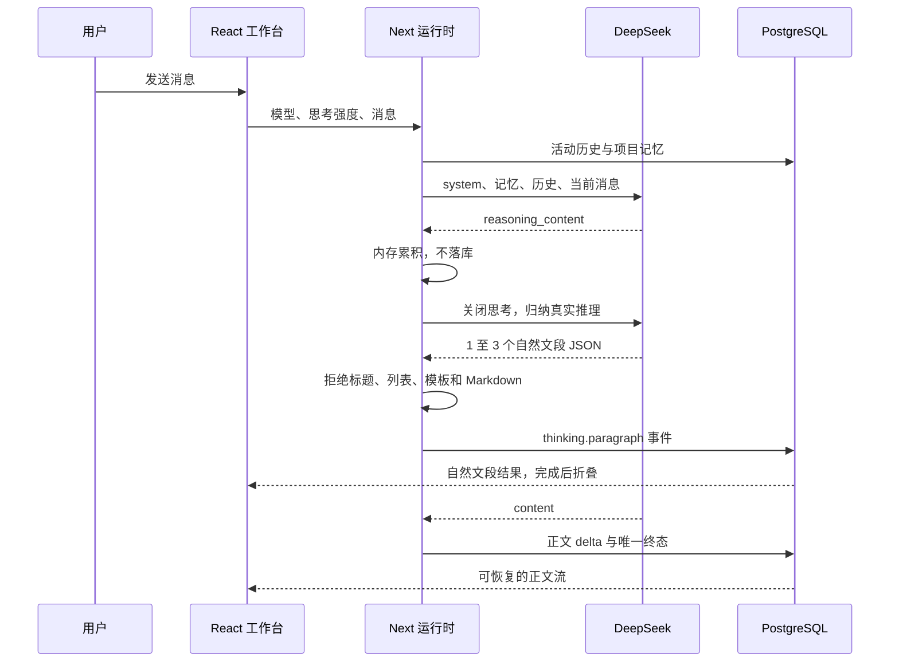

# 2026-07-26 开发记录 003：思考结果、完整项目记忆与稳定拖拽

## 1. 功能门禁

- GitHub Issue：[阶段 3：可见思考流、完整项目记忆与稳定拖拽](https://github.com/LuzernRR/agent-workbench/issues/4)
- Execution Gate：`allowed`
- 当前状态：实施中
- 非目标：Python/LangGraph 运行时、工具循环、搜索 Agent、embedding 生成、登录和多租户。

## 2. 开发前问题

| 领域 | 当前问题 | 根因 |
|---|---|---|
| 思考 | DeepSeek 已开启思考但 UI 没有阶段信息 | 客户端只解析 `delta.content` |
| 展示 | 原始推理不适合直接给用户 | 冗长、反复且不是稳定产品协议 |
| 记忆 | 新会话只能看最近 24 条，长会话中段会失忆 | 存储上限、召回上限和当前线程排除耦合 |
| 拖拽 | 卡片落下后回旧位置再跳转 | overlay 先清除，查询缓存后更新 |

## 3. 目标链路

## 4. 实施记录

### 4.1 思考双通道

- `frontend/src/server/llm/deepseek-client.ts` 分别解析 `delta.reasoning_content` 与 `delta.content`。
- 原始推理只存在于 `execute()` 当前运行的字符串变量中，不进入 AgentEvent、SSE、PostgreSQL、历史 Prompt 或项目记忆。
- 正文首个增量到达前，服务端使用相同模型发起关闭思考的 JSON 请求，将真实推理归纳为 `paragraphs`。

### 4.2 可见结果协议

- `frontend/src/lib/agent-events/types.ts` 定义 `thinking.started`、`thinking.paragraph`、`thinking.completed`。
- 每个 `thinking.paragraph` 只有 `paragraphId` 和模型返回的 `text`，没有本地标题或阶段字段。
- Zod 限制为 1 至 3 个自然文段，并拒绝换行列表、Markdown 和固定阶段标题。
- 摘要请求失败时不生成 fallback；零段完成事件使 Reducer 删除空块，正文仍可继续。

### 4.3 对话流

- `frontend/src/components/workbench/conversation/Conversation.tsx` 使用普通 `
` 渲染模型文段，不渲染阶段图标、列表或标题。
- 状态键从 `streaming` 变为终态时组件重新挂载为折叠态，避免 effect 级联更新；用户之后仍可手动展开。
- 已持久化的 paragraph 事件通过既有快照和 SSE 重连路径恢复，原始推理始终不可恢复也不可见。

### 4.4 验证证据

- 定向 Vitest：26 项通过，1 项 PostgreSQL 环境测试按条件跳过。
- 定向 ESLint：Provider、运行引擎、事件、Reducer、对话流和 Mock 均通过。
- TypeScript：`npm run typecheck` 通过。
- 负向测试确认标题式结果被拒绝，Reducer 确认摘要失败或思考中停止不会留下空块。
- 全量 Vitest：16 个测试文件共 90 项通过，默认仅跳过需要显式环境开关的真实数据库套件。
- 真实 PostgreSQL：设置 `WORKBENCH_LIVE_INTEGRATION=1` 后集成测试通过。
- 全量 UI：16 项 Playwright 全部通过，覆盖后台输出、停止、滚动、切换、刷新、直接拖拽、附件和移动端。
- 真实 Flash：SSE 顺序为 `thinking.started`、两个 `thinking.paragraph`、`thinking.completed`、正文增量和唯一 `run.completed`；SSE 与快照均不含 `reasoning_content`。
- 真实浏览器：3100 完成思考后按钮为折叠态，展开后只有模型自然段，控制台无错误，正文继续流式输出。
- 真实 Pro 停止：数据库观察到 `thinking.started` 后调用停止；事件固定为 6 条，等待 2 秒后数量和最大序号均不变；只有一个 `run.cancelled`，没有 `thinking.paragraph`、`run.completed`、空思考块、原始推理或项目记忆。
