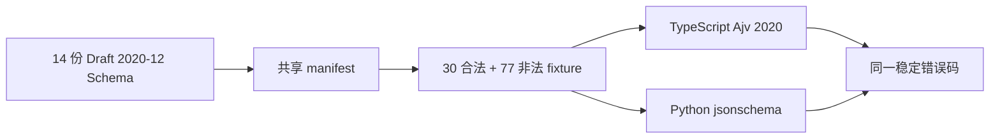

# S00 万能搜索 Agent 跨语言契约

## 元数据

| 字段 | 内容 |
|---|---|
| 日期 | 2026-07-26 |
| Issue | [#5 S00：冻结万能搜索 Agent 跨语言契约](https://github.com/LuzernRR/agent-workbench/issues/5) |
| 状态 | awaiting_acceptance |
| Execution Gate | allowed |
| 生产行为 | 未改变 |

## 一、为什么先做 S00

当前生产 AgentEvent 的 `payload` 仍是宽泛对象。若直接实现万能搜索运行时，TypeScript、Python、前端、数据库和评测会分别解释意图、计划、工具、证据、引用、预算与终态，后续无法可靠回放、迁移或对账。

S00 先以 JSON Schema Draft 2020-12 冻结跨语言唯一事实源：



JSON Schema 负责单对象结构、类型、枚举、格式和未知字段；小型语义验证器负责 DAG、scope、序列、引用、费用复算、生命周期和跨对象状态。两端读取同一 Schema、manifest 和 fixture，不在 Zod/Pydantic 中复制第二套业务合同。

## 二、范围与非目标

### 2.1 本次范围

- common、ResearchIntent、ResearchBrief、SearchPlan。
- ToolSpec、ToolCall、ToolResult、ToolError。
- Source、Snapshot、Evidence、Claim、Citation、SearchResponse。
- SteeringCommand、RunQueueEntry、QueueSnapshot、独立 ThreadQueueEvent。
- AgentState 的最小公共状态、checkpoint/fence/cancel/interrupt 引用。
- AgentEvent v2 的严格 envelope、节点/工具/上下文/预算/消息/验证/记忆/终态事件。
- 共享 manifest、合法/非法 fixtures、TypeScript/Python 消费端和稳定错误码。

### 2.2 明确非目标

- 不导入当前 v1 runtime、UI、API、数据库或 Provider。
- 不创建 migration、FastAPI、Python 服务、LangGraph、checkpoint 表、lease 或跨进程恢复。
- 不请求模型，不写 Prompt，不执行工具、搜索、抓取、RAG、MCP 或 Memory v2。
- 不实现 Ctrl/Cmd+Enter、IME/repeat 保护、队列 UI/API/数据库或运行时 steering。
- 不开始 S01 前端，也不开始 S02 Gold 评测基线。

## 三、目录与文件

### 3.1 唯一合同

目录：`frontend/contracts/v2/`

| Schema | 冻结内容 |
|---|---|
| `common.schema.json` | 版本、ID、时间、scope、SourceType、金额、Usage、Budget、ModelAttempt |
| `research-intent.schema.json` | 任务类型、搜索需求、时效、来源、输出、深度、风险、置信度 |
| `research-brief.schema.json` | 目标、交付物、facet、纳入/排除、来源/时效策略、验收、假设、约束 |
| `search-plan.schema.json` | revision、PlanStep、依赖 DAG、查询、工具、证据数量、状态、停止条件 |
| `tool.schema.json` | ToolSpec、参数/结果 Schema、effect/reversibility、调用、结果、可行动错误 |
| `evidence.schema.json` | Source/Snapshot/Evidence 与严格 Locator |
| `claim-citation.schema.json` | Claim 与自包含 Citation |
| `search-response.schema.json` | completed/partial/failed 统一响应 |
| `steering-command.schema.json` | expectedSteeringRevision、命令序号、幂等、scope |
| `run-queue-entry.schema.json` | RunQueueEntry 与 QueueSnapshot |
| `thread-queue-event.schema.json` | 无 runId/run seq 的线程队列独立事件流 |
| `agent-state.schema.json` | 状态图公共引用、checkpoint revision、fence、cancel、interrupt |
| `agent-event.schema.json` | 按 type/kind/status 严格判别的 AgentEvent v2 |
| `contract-bundle.schema.json` | 语义测试聚合对象 |

canonical `$id`：

```text
https://schemas.agent-workbench.invalid/contracts/v2/schemas/
```

`.invalid` 是保留的不可解析域名。两端预注册 14 份 Schema，禁止联网解析 `$ref`；`format` 在测试中真实启用。

### 3.2 消费端与测试

- TypeScript：`frontend/src/lib/contracts/search-agent-v2.ts`
- TypeScript 测试：`frontend/src/lib/contracts/search-agent-v2.contract.test.ts`
- Python：`frontend/contracts/python/search_agent_v2.py`
- Python 测试：`frontend/contracts/python/tests/test_contracts.py`
- Python 锁文件：`frontend/contracts/python/uv.lock`
- 入口：`frontend/contracts/v2/fixtures/manifest.json`
- 契约说明：`frontend/contracts/v2/README.md`
- Node 依赖：`ajv@8.20.0`、`ajv-formats@3.0.1`

## 四、关键合同决策

### 4.1 SourceType 单一事实源

仅在 common 定义：

```text
web
official_docs
news
academic
code
dataset
private
user_attachment
social
```

Intent、Brief、Tool、Evidence、Citation 和 SearchResponse 统一引用，不各自复制枚举。

### 4.2 金额、Usage 与 Budget

- USD 统一为 decimal string，避免 IEEE 754 浮点误差。
- Usage 拆分为 `ModelUsage`、`ToolUsage`、`RunUsage`；纯工具调用无需伪造 provider/model。
- `RunUsage` 汇总 model/tool breakdown；Token、调用、搜索、读取、并行峰值、时间和费用均可复算。
- 模型与工具的 unknown attempt 都计入 `possibleDuplicateCostUsd`；`actualCostUsd=null` 不得按零处理。
- Budget 满足 `remaining=max-used-reserved`，并与 RunUsage used 交叉复算；`parallelTools.used` 表示运行期峰值。
- 硬预算耗尽后同一 run 只能直接写唯一 terminal，不得再发布业务事件。

### 4.3 Tool 安全、可靠性与公开投影

ToolSpec 冻结严格 `parametersSchema` 与 `resultSchema`，并增加：

- effect：`read | write | external_side_effect`
- reversibility：`read_only | reversible | compensatable | irreversible`

不可逆工具不能配置 `approval=never`。参数和 Provider 输出都必须由 Tool Gateway 二次校验；动态参数/结果是严格 envelope 的明确例外，但内部对象仍必须关闭未知字段。

ToolResult first-class status：

```text
succeeded
failed
cancelled
unknown
```

unknown 表示远端写操作/调用结果和费用无法确认。它必须保留 operationRef，实际费用为 null，可能重复费用大于零；非幂等副作用工具不能盲重试。

ToolError category：

```text
invalid_arguments
permission_denied
auth_required
rate_limited
timeout
provider_unavailable
output_invalid
empty_result
not_found
conflict
cancelled
outcome_unknown
internal
```

ToolError nextAction：

```text
repair_arguments
request_approval
connect_account
retry_wait
retry_same
fallback_provider
replan
check_operation
stop
```

跨字段规则：

- invalid_arguments：非空 fieldPath/expected、不可自动重试、repair_arguments。
- rate_limited：非空 retryAfterMs、允许等待重试、retry_wait。
- outcome_unknown：不可自动重试、check_operation。
- permission_denied/auth_required：不得自动重试。

完整 ToolError 只留在受 ACL 保护的 ToolResult/Operation Ledger。AgentEvent 的 tool.unknown 只含 operationRef、stable errorCode、固定 check_operation、安全 ToolDisplay、Usage、耗时、attempt、publicText=null 与 reasonCodes，不泄露 Provider 原始错误。ToolDisplay 的参数、结果和错误摘要允许 null，且只能由 Gateway 白名单投影。

### 4.4 Evidence、Citation 与结果自包含

- 不传网页全文，只传 Source/Snapshot/Passage/Artifact 引用、hash、有限 quote 和 locator。
- Locator 使用 `html_paragraph | text_quote | pdf_page | code_line | media_timecode` 的严格分支。
- completed SearchResponse 不能包含 unsupported claim。
- Citation 自包含 title、canonicalUrl/artifactRef、sourceType、时间、locator 和 locatorVerified；S01 不需要再查询外部 Evidence 才能渲染或下载。
- Citation 必须投影自已读 Evidence；私有来源 URL 为 null，避免泄露不可访问地址。

### 4.5 AgentEvent、节点与终态

- envelope 固定 eventId、runId、scope、seq、timestamps、inputRevision、refs、source；`oneOf + const` 同时锁定 type、kind、status。
- `node.started` 与唯一 `node.completed | node.failed` 通过 nodeExecutionId 配对。
- model 节点必须有真实 ModelUsage/ModelAttempt；deterministic 节点不能伪造零调用 Provider Usage。
- tool.started、可选 updated/approval 与唯一 completed/failed/unknown 通过 toolCallId 配对。
- tool.started 与 terminal 不是同一原子事务；每条事件独立“先持久化、后发布”，生命周期由共享 ID、唯一终点和序列不变量闭合。
- assistant message 必须 started/completed 配对；completed/partial terminal 前必须有最新 inputRevision 的 verification 和已验证 message/response。
- memory.updated 只能位于已验证结果之后、run terminal 之前；cancelled/failed 不得写长期记忆。
- run terminal 是同一 run AgentEvent 的最后一条；独立 ThreadQueueEvent 可在 run terminal 后合法完成出队、暂停或自动启动。

### 4.6 可见过程与 publicText

公开过程不是 raw `reasoning_content` 或私有 CoT。全目录递归阻断：

```text
reasoning_content
chainOfThought
rawReasoning
rawCoT
```

- node.started 必须 publicText=null。
- model node.completed 必须为单个精简自然段，最长 500 字符，禁止换行、Markdown 标题、列表和代码围栏。
- deterministic node.completed 必须 publicText=null。
- node.failed 可为 null；非空时遵守相同单段限制。
- tool/context/budget/approval/clarification 使用结构化字段，publicText 必须 null。
- Schema 冻结形状；同次模型结果的投影蕴含门留给 S05。投影失败必须隐藏，不得用本地 fallback。

### 4.7 Context 与 Budget 事件

`context.usage.updated` 公开 model limit、estimate/actual Token、reserved output、安全余量、remaining、basis points、revision 和区段 retained/truncated/omitted 计数，不含正文、Prompt、历史、记忆、附件或推理。

同一 contextRevision 只能 estimate -> actual，不能退回估算；新上下文必须递增 revision。`budget.updated` 引用完整 Budget/RunUsage，费用、Token 和余额均可复算。

### 4.8 Steering、interrupt 与 FIFO

clarification/approval interrupt、活动 run steering、普通新消息 FIFO 是三类输入。

- SteeringCommand 使用 expectedSteeringRevision，不使用随图节点变化的 run/state revision。
- accepted 只表示命令持久化，不增加 steeringRevision。
- 同 base revision、安全点前的命令按 commandSeq 组成 batch；一次事务只把 revision 增加 1。
- cancel/权限收紧优先；非冲突字段合并；同一格式/范围后到者 supersede 先到者。
- batch 中新到达命令留到下一批；旧 revision 返回稳定冲突。
- revision 变化后旧 draft/verify/finalize 必须作废或重核。

ThreadQueueEvent 没有 runId/run seq，使用独立 cursor/revision。每线程最多一个 active run，普通消息 FIFO；completed 可按 `autoStartNext` 配置自动出队，stopped/failed 默认暂停。

### 4.9 AgentState

AgentState 冻结 `stateRevision/checkpointRevision/fencingToken/cancelRequested/currentNode/nextNode/pendingClarificationRef/pendingApprovalRef/steeringRevision/lastAppliedCommandSeq` 和小型 Artifact/Evidence 引用。

- waiting 节点必须有对应 pending ref，离开等待后清空，两个 pending 不能同时存在。
- checkpoint/fencing 单调，cancelRequested 不能 true -> false。
- terminal 时 nextNode 和 pending ref 必须为 null。
- 不包含线程队列，不保存网页正文、完整历史、Prompt、项目记忆或 CoT。

这些只是未来条件提交合同，不代表已有 checkpoint 表、lease、worker fencing 或重启恢复。

## 五、验证器与稳定错误码

### 5.1 执行顺序

两端按相同优先级返回第一个稳定错误：

1. 私有推理字段。
2. publicText。
3. 单个 AgentState 语义。
4. JSON Schema、format、未知字段。
5. bundle command scope。
6. bundle 通用 scope。
7. State 序列与 fence。
8. Plan DAG。
9. ToolError/策略/Schema/调用配对/参数/unknown 重试。
10. Evidence/Citation/Locator/Claim。
11. Usage。
12. Budget 与耗尽终态。
13. AgentEvent 的 Context/Usage、seq、terminal、tool/node/message/verification/memory。
14. 延后处理的 steering revision/terminal。
15. 独立 Queue revision/FIFO/单 active/pause。

### 5.2 37 项错误码

```text
SCHEMA_INVALID
PRIVATE_REASONING_FORBIDDEN
PUBLIC_TEXT_INVALID
SCOPE_MISMATCH
PLAN_STEP_DUPLICATE
PLAN_DEPENDENCY_MISSING
PLAN_CYCLE
TOOL_CALL_DUPLICATE
TOOL_CALL_DANGLING
TOOL_SCHEMA_INVALID
TOOL_POLICY_INVALID
TOOL_ERROR_INVALID
TOOL_ARGUMENTS_INVALID
TOOL_UNKNOWN_RETRY_FORBIDDEN
EVIDENCE_REFERENCE_INVALID
CITATION_UNVERIFIED
CITATION_PROJECTION_MISMATCH
LOCATOR_INVALID
UNSUPPORTED_CLAIM
USAGE_INVALID
BUDGET_INVALID
BUDGET_STOP_MISMATCH
CONTEXT_USAGE_INVALID
EVENT_SEQ_INVALID
EVENT_STATE_INVALID
DUPLICATE_TERMINAL
EVENT_AFTER_TERMINAL
MEMORY_WRITE_INVALID
COMMAND_REVISION_CONFLICT
COMMAND_AFTER_TERMINAL
COMMAND_SCOPE_MISMATCH
QUEUE_REVISION_CONFLICT
QUEUE_ORDER_INVALID
QUEUE_ACTIVE_RUN_CONFLICT
QUEUE_PAUSE_INVALID
STATE_TRANSITION_INVALID
STATE_FENCE_INVALID
```

`fixtures/manifest.json.errorCodes` 是共享事实源；TypeScript 的 `contractErrorCodes` 和 Python 的 `CONTRACT_ERROR_CODES` 必须与它逐项同序。禁止比较 Ajv/jsonschema 不稳定的原始错误文本。

## 六、Fixtures

`fixtures/manifest.json` 是测试唯一入口。每项包含：

- `id`
- `schemaId`
- `path`
- `expectedValid`
- `expectedErrorCode`
- `coveredInvariant`

冻结集合：107 项，30 项合法、77 项非法。覆盖：

- Intent/Brief/Plan 与 DAG。
- Tool 参数/结果严格 Schema、effect/reversibility、可行动错误、unknown 与费用。
- Evidence -> Claim -> Citation -> SearchResponse 完整引用。
- Node、Tool、Message、Verification、Memory、Context、Budget 和 run terminal 生命周期。
- 私有推理泄露、publicText、scope、Usage/Budget 算术、Citation 投影。
- Steering accepted/batch/supersede/revision/terminal/幂等。
- 独立 Queue 的无 active run 编辑/取消、FIFO、completed 自动启动、stopped/failed 暂停、双 active 冲突。
- AgentState waiting 引用、checkpoint/fence/cancel/terminal。

测试同时证明 manifest 无重复 ID、重复路径或漏收 fixture。

## 七、定向验证证据

已完成：

```powershell
cd frontend
npx vitest run src/lib/contracts/search-agent-v2.contract.test.ts
npm run typecheck

cd contracts/python
uv sync --locked
uv run pytest -q
```

结果：

- TypeScript：5/5 通过。
- Python：6/6 通过。
- `uv sync --locked` 与锁定环境测试通过。
- 14 份 Schema Ajv strict 离线编译通过。
- manifest 107 项逐条对账通过，无重复/漏路径。
- manifest 的 37 项 `errorCodes` 与 TypeScript/Python 导出逐项同序。
- TypeScript 类型检查通过。

协调审计后的完整门禁也已通过：

- `npm test`：17 个文件通过、1 个文件跳过；95 项通过、1 项跳过。
- `npm run typecheck`：通过。
- `npm run lint`：通过。
- `npm run build`：标准 Turbopack 生产构建通过。
- `npm run test:e2e`：标准脚本再次完成生产构建，16/16 Playwright 通过。
- `npm audit --omit=dev`：生产依赖 0 个漏洞。
- PostgreSQL 容器 healthy；最终构建后 3100 已恢复，`/workbench` 返回 HTTP 200。

## 八、数据、安全、兼容与回滚

- S00 没有读取、打印或修改 `config/*.local.json`。
- 原始推理、Provider 原始错误、网页全文、完整上下文和长期记忆不进入公开合同。
- Provider strict Beta 仍需服务端 Schema、ACL、审批、预算和操作账本。
- v2 合同没有被生产路径导入，没有 migration 或用户数据变更。
- 回滚仅需撤销 `frontend/contracts/`、TypeScript 消费测试、Ajv 开发依赖和本记录。

## 九、后续实现约束

以下为未来阶段约束，不代表 S00 已实现：

- 可见思考只消费真实 node/plan/tool/evidence/verification 事件；publicText 与严格结构化结果同次产生并过投影门。
- S05 的 internal NodeOutput 保存 `publicSupports[]`，以 JSON Pointer + relation 证明 publicText 受 result 支持；AgentEvent 不公开 supports。
- Router 区分 direct、simple one-tool、complex、clarification；简单任务不显示空计划，复杂任务才持久化计划。
- deterministic 节点不得伪造 ModelUsage；普通复杂路径起步 4 次模型调用，repair 路径 6 次，全 run 最多一次 schema repair，全部计预算。
- 会话上下文由 thread-scoped checkpointer 管理；同项目跨会话记忆由 `(tenant, actor/visitor-or-principals, project_id, generation)` Store + ACL 按需检索。
- 只有 verify passed/finalize 成功的目标、答案和确认事实可写长期记忆。
- 超长上下文按 keep -> compress -> replace-with-reference -> drop；安全规则、当前目标/引导、权限/预算、完整 Tool Call 消息组、interrupt 和 Evidence locator 不得静默删除；压缩记录版本/hash/来源并避免 summary-of-summary。
- 顺序固定：S00 用户验收后进入 S01 前端过程、结果、工具、引导与 FIFO；S02 Gold；S04 LangGraph；S05 真实 LLM；S06 项目 Memory Store。

## 十、官方依据

- [JSON Schema Draft 2020-12 Core](https://json-schema.org/draft/2020-12/json-schema-core)
- [JSON Schema Draft 2020-12 Validation](https://json-schema.org/draft/2020-12/json-schema-validation)
- [LangGraph Persistence](https://docs.langchain.com/oss/javascript/langgraph/persistence)
- [DeepSeek Thinking Mode](https://api-docs.deepseek.com/guides/thinking_mode/)
- [DeepSeek Tool Calls strict mode](https://api-docs.deepseek.com/guides/tool_calls/)

LangGraph 文档只用于确认未来 checkpointer 与 Store 分工；S00 不实现二者。DeepSeek `reasoning_content` 只允许在未来单次 Provider 适配器局部存在，不能进入 Event、SearchResponse、fixture、日志、历史 Prompt 或项目记忆。

## 十一、当前接手状态

- Issue #5 仍 OPEN，是唯一活动 Feature。
- S00 状态：awaiting_acceptance；完整门禁通过。
- Issue #5 保持 OPEN，等待用户明确验收。
- 用户验收前不得创建或启动下一 Feature。
- 用户验收 S00 后才可创建 S01 前端过程、结果、工具、引导与消息队列 Issue；S02 Gold 不得提前启动。
