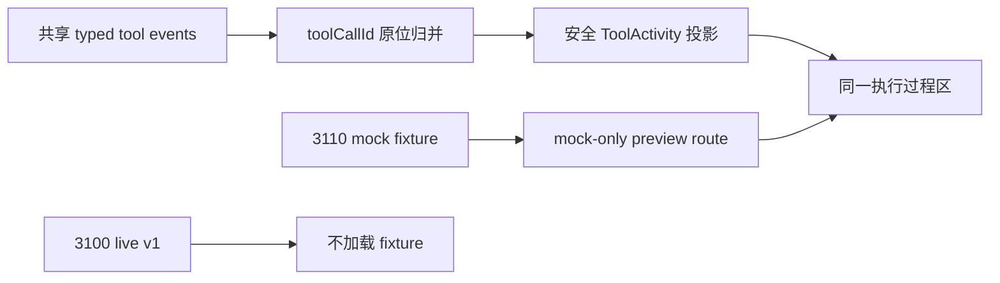
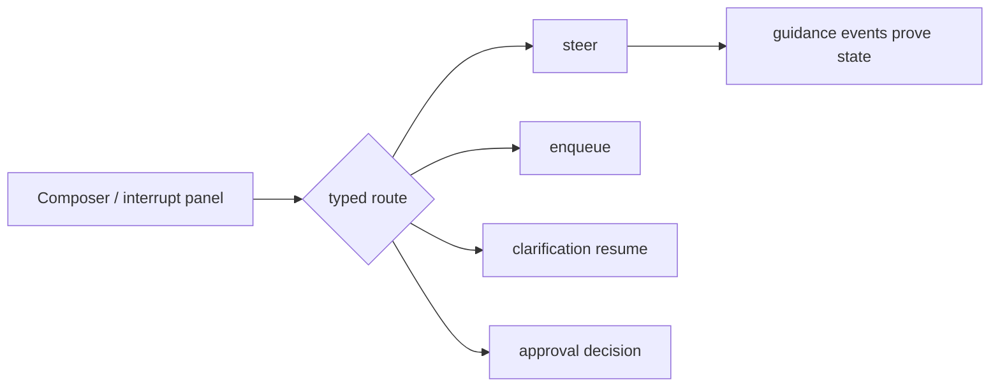

# 前端 Agent 工作台：过程、引导与消息队列

> 说明：历史切片名称保留在本记录中用于追溯；后续主开发路线以用户可见能力命名，见 `docs/万能搜索Agent端到端开发流程.md`。

## 元数据

| 字段 | 内容 |
|---|---|
| 日期 | 2026-07-27 |
| Issue | [#6：前端过程、结果、引导与消息队列](https://github.com/LuzernRR/agent-workbench/issues/6) |
| 状态 | awaiting_coordination_review |
| 当前切片 | 引导与中断交互：六项阻断已清零并完成全门禁，等待用户验收 |
| Execution Gate | allowed |

## 一、当前目标

共享 v2 JSON Schema、107 项 fixture 和 37 项稳定错误码已经验收。当前先用这些合同完成前端状态机和公开过程视图；真实结构化 LLM/LangGraph 接入时只替换事件来源，不重写用户交互。

切片 1 已完成事件归并内核，切片 2 已完成过程与核验视图，切片 3 已完成安全工具账本。切片 4 只在 3110 typed preview 内建立四路交互：





四条命令失败时互不降级。guidance accepted 只代表已持久化，只有 `guidance.applied` 才能显示已应用。

切片 3 只接受 S00 已冻结的 `progress/retrying/waiting_approval`。`rolling_back/compensating` 留给 S07/S16 的版本化 Saga 合同，不从自由文本、耗时或错误信息推断。

## 二、文件边界

- `apps/web/src/lib/agent-events/v2/adapter.ts`：浏览器可用的 v2 严格解析与 discriminated union。Ajv 执行 Draft 2020-12 条件 Schema 和离线 `$ref`，Zod 按事件 `type` 分派 envelope；不导入 Node `fs/path`。
- `apps/web/src/lib/agent-events/v2/run-reducer.ts`：run seq、terminal、原位过程条目和计划状态。
- `apps/web/src/lib/agent-events/v2/queue-reducer.ts`：独立 queue cursor/revision、FIFO 和唯一 active run。
- `apps/web/src/lib/agent-events/v2/snapshot-projector.ts`：snapshot、重放和实时增量的统一投影。
- `apps/web/src/lib/agent-events/v2/event-kernel.test.ts`：切片 1 定向测试。
- `apps/web/src/server/mock/s01-event-fixtures.ts`：只允许 mock/test 使用的版本化 fixture 源。
- `apps/web/src/lib/agent-events/v2/process-view-model.ts`：节点、计划、核验和最终答案资格的纯投影；未绑定 legacy 正文使用独立禁显判定。
- `apps/web/src/lib/agent-events/v2/process-panel-preference.ts`：按 runId 保存手动展开状态。
- `apps/web/src/components/workbench/process/V2ProcessPanel.tsx`：无嵌套卡片的单一过程折叠区。
- `apps/web/src/components/workbench/process/V2ToolActivityRow.tsx`：强类型、安全白名单工具行与详情。
- `apps/web/src/components/workbench/process/V2ToolActivityRow.test.tsx`：工具状态、失败、unknown、敏感字段与长文本测试。
- `apps/web/src/lib/agent-events/v2/composer-routing.ts`：运行态与非运行态的键盘/点击命令路由，不接触网络。
- `apps/web/src/lib/agent-events/v2/interaction-controller.ts`：四种强类型命令、SHA-256 hash、幂等 key、重试复用与安全 snapshot。
- `apps/web/src/lib/agent-events/v2/use-v2-preview-interaction.ts`：3110 deterministic adapter，把命令证据重新送入同一 reducer。
- `apps/web/src/components/workbench/process/V2GuidanceList.tsx`：按 commandSeq 显示真实 guidance 状态。
- `apps/web/src/components/workbench/process/V2InterruptPanel.tsx`：澄清恢复和 `allow_once|deny` 审批输入；edit 只读。
- `apps/web/src/components/workbench/composer/AgentComposer.tsx`：可选 preview runtime；null 时保持 v1 Composer 分支。
- `composer-routing.test.ts`、`interaction-controller.test.ts`、`use-v2-preview-interaction.test.tsx`、`AgentComposer.test.tsx`、`V2GuidanceList.test.tsx`、`V2InterruptPanel.test.tsx`：切片 4 定向行为测试。
- `apps/web/src/components/workbench/conversation/Conversation.tsx`：有 v1 用户消息时沿用 run 锚点；显式 fixture 且无锚点时只在 Composer 上方建立预览位。
- `apps/web/src/components/workbench/conversation/Conversation.test.tsx`：证明无锚点 fixture 可见，且 `fixture=null` 的生产空线程分支不变。
- `apps/web/src/app/workbench/s01-preview/page.tsx`：只在 mock 模式开放的 additive 预览路由。
- `apps/web/src/server/mock/s01-page-fixture.ts`：live 守卫与动态 fixture 加载。

现有 v1 `types/schema/reducer/use-agent-thread`、3100 live Provider/API/SSE/DB 不修改。根页面、`/workbench`、项目页和会话页不导入 fixture，也不增加 `force-dynamic`；只有 `/workbench/s01-preview` 在 mock 模式动态加载 S01 fixture。

## 三、归并不变量

- AgentEvent 与 ThreadQueueEvent 分别严格解析，拒绝未知版本、事件、字段和私有推理字段。
- run 只在成功解析并成功归并后推进 cursor；seq 必须连续。
- queue 只在成功解析并通过 expected previous revision、queue revision、FIFO 和唯一 active run 后推进独立 cursor/revision。
- run terminal 后拒绝同 run 业务事件；独立 queue stream 仍可更新。
- snapshot、顺序重放和实时逐条归并必须得到相同状态。
- direct 没有 `plan.updated` 就不创建空计划；complex 收到计划后才创建和更新计划。
- 节点 `publicText` 只读取合同允许字段，不生成本地模板或 fallback。
- fixture 统一 `source=fixture` 并标记 3110/mock；live v1 不展示未接入能力。

## 四、切片 1 测试矩阵

- AgentEvent / ThreadQueueEvent 合法、坏版本、坏 payload、未知字段。
- 坏事件后合法事件仍按原 cursor 归并。
- run cursor 与 queue cursor 相互独立。
- seq 缺口、重复事件、terminal 后事件不推进 cursor。
- snapshot、replay、逐条 merge 状态完全一致。
- direct 无计划，complex 计划原位更新。
- queue revision 冲突、FIFO 位置错误、双 active run 拒绝。
- fixture source 为 `fixture/mock/3110`，无 `reasoning_content`、Prompt、历史或敏感工具参数。

## 五、后续事务实现约束

以下是 S04/S07/S16 的实现边界，不代表切片 1 已经实现后端事务：

- 单库强事务必须在同一数据库事务内按序提交，任一步失败立即整体回滚。
- 跨系统强一致业务优先封装为一个服务端原子业务工具，模型不得拼接底层写工具冒充原子操作。
- 最终一致流程采用 Saga/补偿、Transactional Outbox/Inbox、幂等键、异步退避重试和死信/人工兜底。
- operation ledger、idempotency key、expected revision、lease/fencing、条件终态共同拒绝重复效果和迟到 worker。
- timeout/outcome unknown 必须先查询 operation 状态；有副作用操作禁止盲重试。
- 后续工具行必须诚实显示 retrying、rolling_back、compensating、unknown 和最终失败；accepted 只代表请求已持久化，不等于业务 completed。

## 六、切片 2 过程视图

- 每个预览 run 只有一个“执行过程”区，插在最新用户消息之后。
- active 默认展开；completed 默认折叠；failed、cancelled 和 waiting 默认展开。手动选择按版本化 localStorage 键保存，状态更新不覆盖用户选择。
- localStorage getter、读取或写入因隐私/配额策略抛错时，组件退化为当前 React state；只失去跨刷新持久化，不中断对话。
- 只投影最新 input revision 的 `node.completed.publicText`、当前 `plan.updated` 和 `verification.completed`；`publicText=null` 不生成替代文字。
- direct 不创建空计划；complex 计划按 revision 原位更新，被 guidance 作废的计划不再展示。
- 核验结论和 `reasonCodes` 均来自事件。原因使用穷尽的 `V2ReasonCode` 中文白名单并保留 `data-reason-code`，不解析自由字段。
- 事件按完整自然段出现，不实现逐字动画、人工延时或等待时长驱动的假过程。
- `finalAnswerVisible` 只说明 v2 状态已满足未来正文投影前置条件。当前切片没有 SearchResponse/content ref/hash 绑定，因此所有同 run 的 v1 assistant 正文在专用预览中隐藏，passed/partial 也不会借旧消息伪造最终答案。
- fixture 显式显示“测试数据”。live 模式 `loadS01PageFixture()` 返回 `null`，专用预览直接 `notFound`。

## 七、切片 3 工具账本

- `V2RunState.toolCalls` 只保存安全 ToolDisplay、必要 ToolUsage、审批摘要、operationRef/nextAction、首末 seq 和 input revision，不保存 arguments、Provider body、resultRef、input/output hash 或完整事件。
- `tool.started -> tool.updated* -> completed|failed|unknown` 按 `toolCallId` 原位更新；`toolOrder` 只在 started 时追加，因此并行工具不会因完成顺序或结果数变化跳位。
- `approval.required/decided` 关联既有工具行，不创建第二条工具记录。切片 3 只读展示 action/permission summary，不提供审批按钮或 API。
- `allow_once` 后 terminal display 必须为 `approved`；`deny` 后禁止继续 progress/retrying/completed/unknown，必须先归并规范化 `tool.failed`，否则 run terminal 也被拒绝且不推进 cursor。
- `edit` 保留为等待中的可审计决定；S00 未冻结其恢复序列，切片 3 不自行推断。
- completed 的 `resultCount=0` 显示为明确空结果；failed 只显示公开错误字段；unknown 显示“结果尚未确认”、operationRef、固定“查询操作状态”和 possible duplicate cost，不提供默认重试。
- 3110 新增 10 个 deterministic 场景：success、parallel、progress、retrying、waiting approval、approval decided、empty、failed、unknown、long。所有事件在投影前仍经过现有 Ajv + Zod 适配器。
- S00 没有 `rolling_back/compensating` typed phase；切片 3 不展示或猜测，留给 S07/S16。

## 八、非目标

- 不实现 FIFO QueueBar、Context/费用面板、真实 v2 命令 API 或 approval edit 参数合同。
- 不修改 S00 Schema。
- 不增加 FastAPI、LangGraph、migration、真实 steering/queue API。
- 不调用真实工具、搜索、RAG 或分布式事务执行器。
- 不开始 S02。

## 九、验证状态

切片 1、2、3 已通过协调审查。切片 4 的六项阻断修正、无锚点 3110 预览接缝、定向/全量门禁和桌面/移动浏览器验证均已完成，状态为 `awaiting_coordination_review`。Issue #6 继续保持开放，不 commit/push，不进入切片 5，等待用户明确验收。

| 检查 | 结果 |
|---|---|
| 切片 2 定向 Vitest | 3 个文件、48 项全部通过 |
| `npm run typecheck` | 通过 |
| 切片 2 目标 ESLint | 通过 |
| 生产页面隔离测试 | 四个既有页面无 fixture import、无新增 `force-dynamic` |
| live 守卫测试 | live 不返回 fixture；mock 可加载 direct/complex/failed/partial/waiting/stopped |
| 正文门禁测试 | passed/partial/failed/waiting/stopped 的未绑定 v1 assistant 正文均不可见 |
| 桌面视觉 | 1440x900，单一过程区、计划原位显示、completed 折叠和手动恢复正常 |
| 移动视觉 | 360x800，文段正常换行，页面与过程区 `scrollWidth === clientWidth` |
| 切片 3 定向 Vitest | 4 个文件、73 项全部通过 |
| 切片 3 reducer | 原位生命周期、并行稳定顺序、审批关联、deny 收口、旧 revision、terminal、原 state/cursor 拒绝均通过 |
| 切片 3 工具 UI | progress、retrying/429、waiting approval、approval decided、0 结果、failed、unknown、敏感字段禁显与长文本均通过 |
| 切片 3 typecheck / ESLint / diff | 全部通过 |
| 切片 3 桌面视觉 | 1440x900 unknown 状态无溢出，operationRef、查询动作和可能重复费用清晰可见 |
| 切片 3 移动视觉 | 360x800 长标题与摘要正常换行，`scrollWidth=360`，工具行右边界 348px |
| 切片 3 模式隔离 | 3110 mock preview 为 200；3100 相同 preview 为 404；未出现 private CoT 或未绑定正文 |
| 切片 4 定向 Vitest | 11 个文件、169 项全部通过 |
| 切片 4 Composer | Enter/Ctrl-Cmd+Enter/Shift+Enter、IME、repeat、防双提交、移动模式、独立 stop 均通过 |
| 切片 4 命令控制器 | 严格事件类型和 run/scope/command/hash/seq/revision/interrupt 相关性；双击共享 Promise；同内容失败重试复用 key/hash；晚到事件原位迁移均通过 |
| 切片 4 中断与停止 | clarification stale/重复/terminal，approval allow-once/deny/重复和 edit 只读；停止前多工具收口、并发停止与重复停止均通过 |
| 无锚点 preview | 显式 fixture 在 Composer 上方显示过程区；`fixture=null` 不显示过程区且保留生产欢迎态 |
| 全量 Vitest | 264 项通过、1 项跳过 |
| typecheck / ESLint / diff / build | 全部通过 |
| Playwright E2E | 首轮既有滚动用例出现一次时序失败；单独与全量复跑通过，最终原样 `npm run test:e2e`（含重建）16/16 干净通过 |
| 切片 4 桌面视觉 | 1440x1000，10 个目标场景均显示过程区，澄清/审批/入队/引导/停止可操作，无横向溢出 |
| 切片 4 移动视觉 | 360x800，10 个目标场景均在 12..348px 内容边界内，`scrollWidth === clientWidth` |
| 切片 4 模式隔离 | 3110 preview 为 200；3100 preview 为 404；未出现 `reasoning_content`、hash、idempotency key 或内部 ref |

切片 4 定向命令：

```powershell
cd apps/web
npx vitest run src/lib/agent-events/v2/event-kernel.test.ts src/lib/agent-events/v2/composer-routing.test.ts src/lib/agent-events/v2/interaction-controller.test.ts src/lib/agent-events/v2/use-v2-preview-interaction.test.tsx src/components/workbench/process/V2ProcessPanel.test.tsx src/components/workbench/process/V2ToolActivityRow.test.tsx src/components/workbench/process/V2GuidanceList.test.tsx src/components/workbench/process/V2InterruptPanel.test.tsx src/components/workbench/composer/AgentComposer.test.tsx src/components/workbench/conversation/Conversation.test.tsx src/server/mock/s01-page-fixture.test.ts
npm run typecheck
npm run lint
npm run build
npm run test:e2e
```

## 十、实现结果

- Adapter 直接消费 S00 的 `agent-event`、`thread-queue-event`、`run-queue-entry` 与 `common` Schema；条件分支和格式由 Ajv 2020-12 校验，未知字段与私有推理字段直接拒绝。
- Run reducer 只允许 `run.created/run.status/run terminal` 修改整轮状态；node、tool、plan、budget 的局部状态不会污染 runStatus。
- 消息、澄清、节点和工具均按稳定 ID 配对；`run.completed` 必须位于最新 revision 的核验和 verified assistant message 之后，且没有悬空 node/tool。
- `memory.updated` 只接受 passed verification 后的最终回答；terminal 再次检查所有记忆均属于最终 `responseId` 和最新 input revision。
- guidance 生效后，旧 revision 的 node、tool、context、verification、message、memory 和 finalize 产物拒绝且不吞 seq。
- Context usage 只允许同 revision 的 estimate 到 actual；Budget revision 严格递增；硬预算耗尽后只接受预算原因终态。
- Queue 使用独立 cursor/revision，校验 FIFO position 与 createdAt、唯一 active run、terminal trigger、暂停原因和 completed auto-start；manual pause 可只暂停后续 FIFO，不强制结束 active run。
- Snapshot、全量重放和逐条归并共用同一纯函数路径；拒绝事件返回原 state 引用，便于断线补发继续使用未消费 cursor。
- 过程 UI 只消费强类型 `V2RunState` 投影，不复用 v1 `ThinkingResult`，也不读取任意 JSON。
- 折叠偏好在绘制前恢复，避免 completed/active 的错误开合状态闪现；reduced-motion 下没有字符动画。
- `V2ReasonCode` 到中文原因使用穷尽映射，缺少或未知 reason code 不会由前端猜测。
- 3110 专用路由是 additive 接缝；3100 四个既有页面和缓存边界保持不变。
- 工具活动 state 和 UI 不保留或枚举任意 JSON；只渲染 S00 ToolDisplay 与显式 typed 字段。
- 工具 started/update/terminal 与审批事件按同一 `toolCallId` 归并为一行；并行显示顺序由 started seq 固定。
- deny/edit 都不是工具 terminal；任何 run terminal 前，所有 started 工具必须已进入 completed/failed/unknown。
- unknown 保持独立状态并计入 possible duplicate cost；不会被视作 failed/completed，也不会生成本地重试动作。
- Composer 的 v2 分支只在 preview runtime 存在时启用；运行中输入保持可编辑，stop 是独立 Square 按钮，移动端用显式模式选择器区分 enqueue 与 steer。
- 四种交互各自产生独立 typed command；同一网络重试复用原 request/key/hash，新内容生成新 key，任何错误都不降级到另一命令流。
- guidance accepted 只进入 `accepted_pending`；applied/superseded/rejected/failed 必须由 typed 事件或 typed adapter 结果决定。
- 澄清恢复只发送 clarification/checkpoint/state revision 与安全内容 hash；审批只支持 allow-once/deny，既有 edit 事件仅只读展示。
- 四类回执逐项校验 run/scope/type、commandId、idempotencyKey、contentHash、commandSeq、revision 和 interrupt 引用；错配事件不进入 reducer，也不推进 client command。
- 澄清与审批双击共享首个在途 Promise；失败重试在内容/决定不变时复用原 command/key/hash，只有逻辑输入变化才产生新命令。
- accepted 后的 applied/superseded/rejected/failed 通过同一 evidence reducer 原位迁移；失败草稿按“无新输入自动恢复、有新输入显式恢复”处理并保留附件快照。
- stop 与提交锁完全隔离；停止前先收口运行中或等待审批的工具，再归并 run.cancelled；旧提交完成不能覆盖停止后的新草稿。
- 3110 种子线程没有 v1 用户消息时，只因显式 fixture 建立 `above-composer` 预览位；生产 `fixture=null` 分支不创建过程状态、不伪造 live 能力。

## 十一、错误边界

Adapter 使用 `SCHEMA_INVALID`、`PRIVATE_REASONING_FORBIDDEN`。Run reducer 进一步区分 ID/scope/source/seq、terminal、input revision、node/tool/message/clarification lifecycle、plan/context/budget revision、预算耗尽、终态前置条件和记忆写入错误。Queue reducer区分 thread/scope/source、cursor/revision、FIFO、active run 与 pause 语义。错误只用于切片 1 前端归并诊断，不改写 S00 的 37 项跨语言错误码。

过程组件不接收未解析事件。坏事件由内核拒绝且不推进 cursor；UI 不显示被拒绝 payload、内部 ref/hash、原始推理或未核验正文。切片 4 的停止锁隔离、命令证据相关性、澄清/审批防双击、晚到事件迁移与草稿恢复、非运行态快捷键组件测试、停止前工具终态收口六项阻断已经全部清零；当前仍停止等待协调审查和用户明确验收，放行后才能进入切片 5。

## 十二、后端多次模型调用的后续边界

本轮只完善开发文档，不在 Issue #6 接入后端。前端验收后的首个后端功能应先实现无工具的真实多调用 run：`classify(调用 1) -> compose(调用 2) -> verify(调用 3)`，复杂路径增加 `plan`。每次调用有独立 ModelCall 账本、usage、费用、Prompt/Schema 版本和 checkpoint，后一次请求必须包含前序结构化结果。

该无工具链验收后，才加入一个确定性只读工具形成 `decide -> tool -> observe -> 再次模型调用`。LangGraph 条件边负责继续或停止，后台 Worker 负责执行，PostgreSQL checkpointer 负责恢复；浏览器只消费已持久化 typed AgentEvent。原始 `reasoning_content` 不进入前端、日志、事件、记忆或普通历史。详细合同见 `docs/万能搜索Agent端到端开发流程.md` 第 10.3 节。
