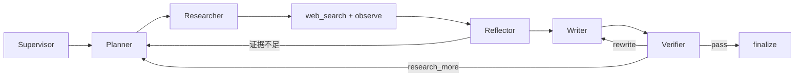

# 真实 LangGraph 多 Agent 搜索闭环与递增展示

## Issue 与门禁

- Issue：[#7 真实 LangGraph 多 Agent 搜索闭环与 3100 live 展示](https://github.com/LuzernRR/agent-workbench/issues/7)
- Execution Gate：`allowed`
- 当前状态：用户已于 2026-07-28 明确回复“通过”，Issue #7 验收完成
- 收口：允许关闭 Issue、提交并推送本交付；下一功能仍须新建唯一 Issue 与 Execution Gate

## 目标与验收口径

把 3100 从 Next 内部单次模型回答升级为真实 Python/LangGraph 搜索系统。用户必须看到可验证的“Agent 摘要 → 搜索 → 观察 → 反思/核验 → 回答”，但不能看到私有思维链。

最新 UI 口径：

1. 按真实时间顺序显示活动，只把相邻且同类型的活动归并：连续思考、连续搜索、连续核验各占一行。
2. 类型切换立即结束当前段；允许 `思考 → 搜索 → 思考 → 核验 → 搜索 → 思考`，后续摘要禁止回填搜索前的旧思考行。
3. 思考与核验独立显示；展开后只逐行展示对应 Agent 的结构化 LLM 公开摘要，不加固定阶段前缀。
4. 同一连续搜索段的数字随真实完成事件累加，例如 `5/1 → 10/3 → 15/4`；跨过思考或核验后再次搜索必须新开一行。
5. 搜索详情点击展开后只按文字逐行显示去重来源，不显示状态、搜索服务、耗时、查询或重复的 Agent 摘要。
6. 聚合只属于前端视图；底层每个 `toolCallId`、事件配对、幂等账本和来源审计必须保留。

## 修改前行为与根因

- 3100 只有 Next live 引擎，Python/LangGraph、真实工具循环和 Milvus 尚未接入。
- 初版真实链路把每次搜索分别渲染成一行，三次工具调用占三行；随后改成 run 级全局聚合，又会在搜索结束后回填上方旧思考，破坏真实时序。
- 工具 `tool.completed` 曾因 Python 按 Unicode 码点截断、JavaScript Zod 按 UTF-16 code unit 计数而拒绝合法 emoji 边界文本。
- CDN 压缩响应触发 `httpx.DecodingError`，导致官方网页无法形成 Evidence。
- Milvus 成功写入事件曾发送 `reasonCode: null`，与 Web 严格 optional string 契约冲突。
- 真实停止验收中，DeepSeek Planner 曾有一次没有返回可通过严格 Schema 校验的函数结果，原实现立即以 `RUNTIMEERROR` 结束，暴露了 Provider 结构化输出偶发漂移缺少有界修复的问题。

## 架构与状态图

`SearchState` 保存问题、历史、计划、查询、候选、Evidence、答案、核验决策、预算与公开步骤。条件边只读取结构化字段，不解析自由文本。所有循环受最大迭代、模型调用、工具调用、run/tool timeout、Token、费用、重复查询和无进展熔断限制。

`schema_repair_count` 是独立的 run 级硬边界：首次结构化校验失败时，只有在模型调用预算仍容纳两次请求的情况下，才向同一严格函数补充一次校验反馈并重试；成功后两次真实调用的 Token、费用和调用数合并进入 State，后续 Supervisor、Planner、Reflector、Writer、Verifier 均不能再次修复。第二次仍不合规则诚实失败，不使用固定摘要或默认 JSON 掩盖 Provider 错误。

本轮在修改时序前重新访问了 [LangGraph Streaming 官方文档](https://docs.langchain.com/oss/python/langgraph/streaming)（2026-07-28）。官方将 `updates`、`custom` 等定义为图执行期间按节点产生的增量流；据此，公开摘要必须在实际完成的节点位置追加，而不是先创建一个 run 级容器、再跨过工具事件回填旧位置。上线复核时又重新访问了 [DeepSeek Function Calling](https://api-docs.deepseek.com/guides/function_calling) 与 [LangChain Structured Output](https://docs.langchain.com/oss/python/langchain/structured-output)（2026-07-28）；后者明确给出 Schema validation error 的反馈与 retry 机制，因此结构化节点现在允许全 run 最多一次严格修复请求，不以本地默认值伪造结果。

## Agent Prompt

- Supervisor：理解目标并路由；当前搜索产品通过 `forceSearch: true` 强制进入检索。
- Planner：生成互补、去重、可执行的搜索查询。
- Researcher：只通过注册的 `web_search` 获取事实并观察 Evidence。
- Reflector：判断证据覆盖和缺口，必要时提出补搜。
- Writer：只依据已读取证据写带引用答案。
- Verifier：检查事实、引用和证据覆盖，输出 pass/rewrite/research_more。

Prompt 版本为 `2026-07-28.v4`。每个节点的 `summary` 是结构化模型输出，只允许一句公开自然中文；公共出口移除 Markdown、控制长度并拒绝私有字段。前端只提供“思考结果/核验结果”类型标题，详情正文不添加固定阶段模板。

## 工具、证据与记忆

- 搜索调用使用真实 Provider、严格参数、超时和唯一 `toolCallId`。
- started/completed/failed/unknown 按调用 ID 配对；幂等账本阻止恢复或重放产生重复费用。
- snippet 只是候选信息，只有实际读取的正文片段才能成为 Evidence。
- Writer 的事实声明必须指向 Evidence，Verifier 失败时只能补搜、改写或 partial。
- Milvus 数据位于 `D:/001-agent/milvus`，按 tenant/visitor/project/ACL/memory type/embedding version 过滤。
- Milvus 不可用时发布 degraded；成功写入时省略 reasonCode，禁止发送 `null` 破坏严格契约。

## 前端投影

`mapper.ts` 不再在 `node.started` 时预建思考项，而是在 `node.completed` 真正获得公开摘要时追加唯一活动原子；Verifier 的 `node.completed` 不进入思考，改由 `verification.completed` 创建独立核验原子。`conversation-view-model.ts` 对这些原子执行 run-length grouping，只合并时间上相邻的同类活动：

- 连续思考：合并成一行，保留每个唯一节点摘要；出现搜索或核验即封口。
- 连续搜索：`SearchActivitySummary` 只累计当前段的 `ToolItem`；结果数累计 `resultCount`，已读来源对 verified HTTP(S) URL 去重。
- 连续核验：合并成独立核验行，不混入思考；后续重写、补搜或再思考会另起新段。
- 搜索详情：只显示当前搜索段去重后的安全来源链接，一行一个；不显示状态、Provider、耗时、查询、表格或 Agent 摘要。

每个原子的 ID 包含 `runId + nodeRunId`，例如 `thinking:{runId}:{nodeRunId}` 或 `verification:{runId}:{nodeRunId}`。后续节点只能追加新原子，不能复用旧 ID；Reducer 和持久事件不做聚合，因此刷新后能从完整事件重建相同连续段，审计仍能定位每个节点与工具调用。

## 安全与协议修复

- Python 与 TypeScript 的文本/URL 上限统一按 Unicode 码点解释，避免 astral 字符被 JavaScript 误算两个字符。
- URL 只允许无凭据 HTTP(S)，脚本协议、内网、metadata、异常端口和危险重定向继续拒绝。
- 页面抓取请求显式使用 `Accept-Encoding: identity`，避免 CDN 压缩解码失败。
- 浏览器、公开事件、持久业务表和日志不得含 `reasoning_content`、Authorization、API Key、系统 Prompt、Provider body 或原始工具参数。
- 结构化输出修复只回传通用 Schema 约束提示，不回传、记录或公开 Provider 原始响应与解析错误正文。

## 主要文件

- `services/search-agent/app/graph/build.py`：StateGraph、条件边、节点事件。
- `services/search-agent/app/graph/nodes.py`：Agent 节点、工具循环、Evidence、核验与 Milvus。
- `services/search-agent/app/prompts/agents.py`：六类版本化 Prompt。
- `services/search-agent/app/events/runtime.py`：公开事件与摘要清理。
- `apps/web/src/server/search-agent/`：NDJSON 契约、映射与 BFF 消费。
- `apps/web/src/components/workbench/conversation/`：run 级时间线聚合。
- `apps/web/src/components/workbench/activity-row/ActivityRow.tsx`：递增搜索摘要与逐行详情。
- `config/search-agent.json`：搜索、模型、预算、循环、Milvus 配置。
- `deploy/compose.yaml`：Web、Search Agent、PostgreSQL、Milvus、etcd、MinIO。

## 验证证据

- 2026-07-28 schema repair 发布后的最终全门禁真实运行：`run_8ead15d354b04844b5f40377038a3999`。PostgreSQL seq 为首段思考 `648–653`、三次工具调用 `654–659`、搜索后新思考 `660–668`、独立核验 `669–671`；3100 DOM 严格对应 `思考 → 搜索 → 思考 → 核验`。
- 该真实搜索段累计 `15` 条候选、`7` 个 verified 去重来源；展开区只有 `13` 条去重来源链接，无状态、Provider、耗时、查询、阶段标签或表格；刷新后活动段顺序与计数不变。
- 新增单元/集成回归覆盖 `思考×2 → 搜索×2 → 思考 → 核验×2 → 搜索 → 思考`，证明只有连续同类合并，跨类型后新开行。
- Python：`90 passed`；新增结构化输出单次修复、无修复预算和 run 级额度/计费回归；Ruff 与 compileall 通过。
- Web：本轮新增用例后 `317 passed, 1 skipped`；typecheck、lint、生产 build 通过。
- 生产依赖：`npm audit --omit=dev` 为 0。
- 3110 deterministic：`16 passed, 2 skipped`。
- 3100 live：`2 passed`，覆盖真实思考→多次搜索→再思考、递增计数、结构化展开详情、来源、刷新恢复、停止、唯一取消终态和继续发送。
- Compose：Web、Search Agent、PostgreSQL、Milvus、etcd、MinIO 全部 healthy。
- 截图：`docs/development/evidence/2026-07-28-issue-7-desktop.png` 与 `2026-07-28-issue-7-mobile.png`。

## 回滚与未包含项

- 回滚前端聚合只需恢复 conversation view selector 和 SearchActivitySummary；不能删除底层工具事件或账本。
- Search Agent 可通过旧镜像回滚，PostgreSQL 与 D 盘 Milvus 数据不需删除；禁止 `docker compose down -v`。
- 本功能不增加写操作、支付、邮件、账号权限变更等副作用工具。
- 完整 FIFO、Context Window、费用产品面板和登录权限系统仍不在 Issue #7 范围。

## 验收结论

用户于 2026-07-28 明确回复“通过”。Issue #7 可以关闭，本交付可以提交并推送；后续 X、小红书与更多搜索渠道属于新功能，必须在 Issue #7 收口后建立新的唯一 Issue，不能混入本提交。
