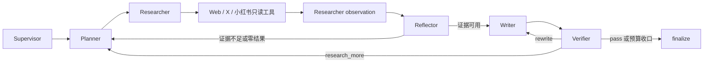

# LangGraph 自适应多渠道搜索 Agent

## Issue 与门禁

- Issue：[#8 多渠道搜索 Agent、X/小红书与智能活动展示](https://github.com/LuzernRR/agent-workbench/issues/8)
- Execution Gate：`allowed`
- 当前状态：实现与技术验收完成，用户已于 2026-07-29 显式验收
- Git 边界：获验收后允许按 AGENTS.md 完成一次受控
  stage、commit、push 与 Issue close

## 目标

在 Issue #7 的真实 LangGraph 搜索闭环上增加 Web、X、小红书三类只读渠道，让
Supervisor、Planner、Researcher、Reflector、Writer、Verifier 根据问题和真实
工具反馈自适应决定后续动作。前端只展示 Agent 生成的安全公开摘要，并把真实
活动按时间顺序压缩为易读的单行过程：

- 当前节点自动展开并显示“思考中 / 搜索中 / 核验中”。
- 节点结束后折叠为“思考结束 / 核验结束”；搜索结束保留真实累计数字。
- 只合并时间上相邻的同类活动；类型交替后必须在下方新开一行。
- 搜索详情只显示模型基于真实候选润色的逐行来源说明，不显示固定模板或表格。

## 调研与选型

实现前重新核对了以下资料：

- [LangGraph 官方 Graph API](https://docs.langchain.com/oss/python/langgraph/graph-api)：
  使用 StateGraph、条件边和小型结构化 State 组织可循环 Agent。
- [LangGraph 官方 Streaming](https://docs.langchain.com/oss/python/langgraph/streaming)：
  使用真实节点和自定义事件增量更新 UI，不通过前端计时器伪造过程。
- [Agent Reach](https://github.com/Panniantong/Agent-Reach)：
  参考其按内容平台路由的思路，但本项目重新实现严格渠道白名单、证据协议和
  SSRF/robots 边界，没有直接执行其安装脚本或复制凭据。
- [xpzouying/xiaohongshu-mcp](https://github.com/xpzouying/xiaohongshu-mcp)：
  选用 Apache-2.0 项目作为用户授权登录态的小红书只读后端。仓内固定上游提交
  `a5bb5b872b1670e8ce557c1942c149f74dfd8246`，构建时执行全部 Go 测试。

本机 `luz-crawl` 技能中可复用的渠道预检和来源路由规则已整理到
`services/search-agent/app/tools/luz_crawl/`；不复制 Cookie、密钥、浏览器
Profile 或机器专属配置。

## LangGraph 自适应链路

这不是固定的“思考 → 搜索 → 思考 → 核验”脚本。Planner 输入包含每次真实
工具调用的 `channel/resultCount/evidenceCount/errorCode/limitation`；
Reflector 和 Verifier 可以返回新的 `{query, channel}`。零结果会触发改写查询
或选择互补渠道，直到证据充分、达到最大轮次、无进展熔断或预算边界。

Prompt 版本为 `2026-07-29.v7-adaptive-feedback-loop`。所有公开思考和核验正文
均来自对应 LangGraph Agent 的结构化输出；前端只添加类型标题、状态和分组，
不生成思考内容。结构化 Reflector 偶发不合规时只允许一次严格修复；仍失败但
已有 Evidence 时继续安全收口，不使用本地模板冒充模型摘要。

## 渠道与真实证据

### Web

- Tavily 为主、DuckDuckGo 为允许的降级发现渠道。
- URL 通过协议、凭据、端口、DNS/IP、重定向和 robots 检查。
- 搜索 snippet 只算候选；实际读取到正文才计入 Evidence。

### X

- Planner 在问题包含 X、Twitter、推文、账号或 `x.com` 时选择 `x`。
- 通过公开索引发现真实 `x.com/.../status/...` URL，再按 robots 策略尝试正文。
- robots 拒绝时诚实显示“找到 N 条，读取 0 个来源”，不把搜索摘要冒充正文。
- 真实运行 `run_768aa1e23bd147599b2ad56fbb320f0e` 对“搜索 x 上分享的赚钱方法”
  执行 4 次工具调用，发现 18 条候选并读取 1 个来源，最终以 partial 收口。

### 小红书

- Planner 在问题包含小红书、RED、笔记或 `xiaohongshu.com` 时选择
  `xiaohongshu`。
- 首选用户明确授权的内部 `xiaohongshu-mcp`，不可用时降级公开索引。
- Search Agent 适配器只允许登录状态、二维码、搜索、详情和用户主页。
  发布、评论、回复、点赞、收藏、删除 Cookie 均在网络请求前拒绝。
- MCP 服务自身也只注册这五个只读工具和 HTTP 路由；`tools/list` 的五项均带
  `readOnlyHint`，写路由运行态验证全部为 404。
- Cookie 仅保存在 Docker 私有 volume
  `001-agent-live-xiaohongshu-session-v2`；MCP 不发布宿主机端口，Web 不加入
  MCP 私网。二维码、Cookie、`xsec_token` 不进入事件、日志、模型工具消息或
  公开 URL。
- 上游搜索页会先创建空数组再异步填充结果；仓内补丁改为等待非空 feeds，
  避免“接口成功但 0 条”的假结果。
- 完整“搜索 + 详情读取”在 Search Agent 内串行化，防止多个 run 同时启动
  浏览器导致会话争用。每次工具调用还有 run 级硬超时，必须为 Reflector、
  Writer、Verifier 保留 60 秒；时间不足时返回 `RUN_TIME_RESERVE` 并生成
  partial，不再让整个 run 进入 `RUN_TIMEOUT`。
- 浏览器 HTTP panic 始终返回稳定 500；MCP 工具 panic 只记录错误类型并返回
  固定文字。响应与日志不记录原始 panic、堆栈或带签名 URL；因此 Search Agent
  可以按受限策略重试瞬时连接重置，同时不泄漏访问令牌。
- 当前部署镜像版本为 `v2.2.6-agent-workbench.3`，启动日志确认只注册 5 个
  read-only MCP 工具。

真实登录态烟测搜索 `LangGraph` 返回 5 条候选并读取 3 条正文。3100 最终
Playwright 运行 `run_8451e6fc42d04674ad7c3d24ae3bf0f7` 自适应执行三次
小红书检索，累计发现 11 条候选、读取 6 次正文；活动顺序为：

`思考 × 2 → 搜索 × 2 → 思考 × 2 → 搜索 → 思考 × 4（含独立核验）`

该 run 因 Verifier 仍要求更多证据且已到最大研究轮次，诚实以
`MAX_ITERATIONS / partial` 收口，没有伪装为完全核验。

用户再次确认登录后，3100 运行
`run_1d33f93254cb41048d4d23f31efb749a` 完整成功。事件账本保存了 4 个不同
`toolCallId`；每次真实 `xiaohongshu-mcp` 调用均发现 5 条候选、读取 3 条
正文。前端没有把交替后的活动回填到旧行，而是依次显示：

`思考 → 搜索（10 条/5 个来源）→ 思考 → 搜索（10 条/6 个来源）→ 思考 → 核验`

两次搜索页连接错误先由 MCP 返回稳定 500，随后 Search Agent 在同一受限策略
内重试成功。4 个 `tool.presented` 投影分别生成 5、4、5、4 条基于真实候选
URL 的逐行说明；最终答案提供 11 个可核验小红书引用。运行窗口内 MCP 日志
没有出现 `xsec_token=`。

## 前端事件与交互

- `tool.completed` 保存每个真实 `toolCallId`、渠道、候选数、Evidence 数和来源。
- `tool.presented` 只允许覆盖真实候选 URL 的 LLM 润色说明，不能新增 URL。
- Conversation 视图执行 run-length grouping：相邻同类归并，交替活动新开段。
- 搜索行的结果数累加完成事件；已读来源按 verified 安全 URL 去重。
- 活动进行中强制展开；结束后自动折叠，用户可手动重新展开。
- 刷新后从 PostgreSQL 事件重建相同顺序、计数和开合状态。

截图：

- `docs/development/evidence/2026-07-29-issue-8-desktop.png`
- `docs/development/evidence/2026-07-29-issue-8-mobile.png`

## 模块与配置

- Web/BFF：`apps/web/`
- Python/LangGraph：`services/search-agent/`
- 小红书 MCP 固定源码：`services/xiaohongshu-mcp/`
- 共享合同：`packages/contracts/`
- 数据库迁移：`database/`
- 部署：`deploy/`
- 非密钥配置：`config/search-agent.json`、`config/deploy.env.example`
- 密钥与本地端口覆盖：仅 `config/*.local.json` / 被忽略的本地 env

Milvus 继续使用 `D:/001-agent/milvus`，只在 Verifier 通过且存在项目上下文时
写入按 tenant/visitor/project/embedding version 过滤的证据记忆。

## 验证

- 小红书上游镜像构建：`go test ./...` 全部通过；新增只读工具集合、写路由
  404、稳定 500 和敏感日志扫描回归。
- Search Agent：`128 passed`，Ruff、compileall 通过。
- Web：`325 passed, 1 skipped`；typecheck、ESLint、生产 build 通过。
- 3110 deterministic Playwright：`16 passed, 2 skipped`。
- 3100 live：
  - 自适应小红书搜索、真实计数、来源展开、活动顺序、刷新和移动端：通过。
  - 真实停止、唯一终态、刷新后继续发送：通过。
- Compose：PostgreSQL、Milvus、etcd、MinIO、Search Agent、Web、
  `xiaohongshu-mcp` 均 healthy。
- 正式本机入口：[http://localhost:3100/workbench](http://localhost:3100/workbench)。

## 安全与已知边界

- Search Agent 只公开到宿主机 loopback；PostgreSQL、Milvus 管理端口同样不对
  公网开放；小红书 MCP 完全无宿主机端口。
- 登录态只授权读取，不授权任何平台互动或内容发布。
- X 和公开小红书来源会受 robots、登录态、地区和平台风控影响；系统必须显示
  真实限制，不绕过 CAPTCHA 或伪造已读来源。
- `luzern.cc.cd` 在 2026-07-29 实时解析到 Cloudflare，但 HTTPS 返回 `502`；
  本机有 `cloudflared` 可执行文件却没有可验证的 Tunnel 配置目录。
  `127.0.0.1:8080` 还被仓库外容器 `kanna-workbench-backend-1` 占用。没有
  Tunnel/反向代理控制和不影响其他项目的端口方案前，不能宣称公网域名已上线。

## 验收结论

Issue #8 的代码、真实登录态搜索、浏览器交互和本机 3100 部署已经完成技术
验收。用户于 2026-07-29 明确回复“验收通过”；本功能允许按 AGENTS.md 完成
一次受控 stage、commit、push 与 Issue close。后续体验升级必须另建唯一
Feature Issue 和 `Execution Gate: allowed`。
