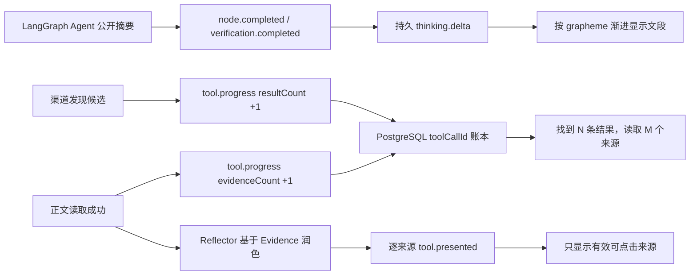

# Agent 公开文段流式展示与有效来源增量

## Issue 与门禁

- Issue：
  [#9 Agent 公开过程流式展示、有效来源增量与生产域名切换](https://github.com/LuzernRR/agent-workbench/issues/9)
- Status：`ready`
- Execution Gate：`allowed`
- 当前状态：代码与生产部署已完成技术验收，等待用户显式验收
- Git 边界：验收前不 stage、commit、push 或关闭 Issue

## 目标与非目标

本功能把 Issue #8 的活动标题式界面升级为更接近真实 Agent 工作过程的时间线：

- 思考和核验在折叠区显示 LangGraph Agent 生成的自然语言公开摘要；
- 每个摘要通过持久 typed delta 事件渐进显示，多次连续思考保留在同一展开区；
  当前步骤完成后不立即折叠，直到下一个不同步骤出现；
- 搜索行继续显示“找到 N 条结果，读取 M 个来源”，但数字必须在真实工具执行中
  增长，来源链接文字也必须逐字流式进入；
- 展开区不得出现未读候选及“正文未读取、仅发现候选、尚未核验”等无效文案；
- 发布到 `luzern.cc.cd`，并在可回滚前提下停止旧
  `kanna-workbench-backend-1` 容器。

本功能不展示模型原始推理、`reasoning_content` 或隐藏 CoT；不使用 fixture、
前端业务计时器或固定阶段模板伪造 Agent 输出和搜索数字；不删除旧容器、镜像、
卷、数据库、Milvus 数据或小红书登录态。

## 修改前行为与根因

1. `ThinkingResult` 原先在每个节点自身完成时立即折叠。连续两个同类 Agent
   摘要会出现“展开 → 折叠 → 再展开”，用户来不及读完第一段。
2. Search Agent 只在工具结束时发布完整 `tool.completed`。虽然最终账本是真实
   的，前端在执行期间没有候选发现和正文读取增量，只能一次性跳到最终数字。
3. Reflector 允许为当前轮所有候选生成 `source_presentations`。未读取候选只能
   描述访问限制，因此大量出现“帖子详情/正文内容未读取”一类没有信息价值的
   行。
4. `tool.presented` 把完整来源说明一次交给 Web，来源链接文字会整段跳入。
5. Cloudflare Tunnel 已存在且域名指向 `127.0.0.1:3000`，但项目仍运行在
   `3100`，导致公网返回 502；`127.0.0.1:8080` 被旧容器占用。

## 架构决策

### 公开文字与流式边界

Prompt 版本升级为 `2026-07-29.v12-cross-channel-recovery`。公开文字仍只来自
Supervisor、Planner、Researcher、Reflector、Writer、Verifier 的版本化结构化
输出。BFF 把每个 `node.completed` 或 `verification.completed` 投影为：

```text
thinking.started
thinking.delta
thinking.completed
```

这个 delta 持久化到 PostgreSQL AgentEvent 账本。浏览器沿用统一渲染队列按
Unicode grapheme 渐进消费，不生成新文字；刷新时重放同一持久事件得到相同全文。
`ThinkingResult` 以“思考中/核验中”展开当前区域，完成后显示“思考结束/核验
结束”，但不会因自身 terminal 立即折叠。Conversation 从真实时间线选择当前
活动：相邻同类节点归为同一时间段并保持展开，只有搜索、核验或最终回答等下一个
步骤真正出现，上一段才折叠。每个 Agent 输出仍是独立自然段，类型交替后在下方
新开区域，不回填旧段。用户可以在步骤结束后手动展开查看。

### 真实工具进度

所有渠道统一接受 `ChannelProgressReporter`：

- 发现一个候选时增加 `result_count`；
- 成功读取一个正文时增加 `evidence_count` 并附带对应 verified 来源；
- `tool.progress` 沿用当前调用的原始 `toolCallId`；
- 缓存命中没有实时渠道回调时，按已结算的真实结果账本重放相同增量；
- BFF、Reducer 均使用 `max(previous, incoming)`，迟到或重复事件不能让数字倒退。

Web、X、小红书公开读取和 `xiaohongshu-mcp` 均实现该协议。前端只对时间上连续
的搜索调用累加显示，底层工具事件、幂等键和每个 `toolCallId` 仍保持独立。

### 有效来源投影

Reflector Prompt 明确规定 `source_presentations` 只能使用当前轮真实 Evidence
URL，不能为候选索引生成说明。Python 侧再次做 URL 白名单交集，并过滤无效说明；
每个有效来源单独发布一个 `tool.presented`。若当前轮已有合格 Evidence、但
Reflector 没有生成任何有效说明，受限的 Source Curator Agent 只基于这些已读
正文补齐说明。BFF 将 `tool.presented` 投影成 presentation start、持久
`tool.source.delta` 和 presentation end；链接文字与思考共用 grapheme 队列，
最后一个字符先获得独立绘制帧，下一步骤才可令搜索行折叠。Mapper、Reducer 和
Conversation UI 再各做一层防护：

- URL 必须是无凭据的 `http/https`；
- 来源必须 `verified=true`；
- 必须已有 LLM 生成的非空 `displayText`；
- 含“未读取、未加载、未获取、未核验、仅发现候选、受详情上限”等语义的说明
  不进入会话；
- 展开详情不显示 Provider、状态、耗时、查询、内部限制或表格。

候选数仍可以大于已读来源数，用于真实呈现搜索覆盖面；未读候选只保留在受控工具
账本中，不成为对用户没有帮助的详情行。

## 主要修改

### Search Agent

- `app/tools/channels/base.py`：新增统一进度模型和 reporter。
- `app/tools/channels/{web,x_public,xiaohongshu_public,xiaohongshu_mcp}.py`：
  在真实发现/读取位置上报增量。
- `app/tools/channels/registry.py`、`app/tools/search_tool.py`：把 reporter 贯穿
  渠道注册表和工具执行入口。
- `app/graph/nodes.py`：发布 `tool.progress`，缓存结果按真实账本重放；Reflector
  只投影当前轮 Evidence，并逐来源发送 `tool.presented`；必要时调用 Source
  Curator，平台连续零证据时允许第三轮跨渠道补证。
- `app/graph/schemas.py`、`app/prompts/agents.py`：增加进度事件合同并收紧有效来源
  Prompt。

### Web/BFF

- `src/server/search-agent/events.ts`：严格校验 `tool.progress`。
- `src/server/search-agent/mapper.ts`：投影持久 `thinking.delta`、渐进工具数字和
  `tool.source.delta`；拒绝无效来源说明。
- `src/lib/agent-events/reducer.ts`：累加公开文段、单调合并工具数字与来源。
- `src/lib/agent-events/typewriter-queue.ts`：用同一 durable delta 队列渐进渲染
  `thinking.delta` 与 `tool.source.delta`，在最后字符和折叠事件之间保留绘制帧。
- `src/components/workbench/conversation/Conversation.tsx`：思考/核验显示 Agent
  文段，并根据下一个真实步骤控制自动折叠，不按当前段 terminal 抖动。
- `src/components/workbench/activity-row/ActivityRow.tsx`：工具运行中只要已有真实
  数字就立即显示累计摘要；详情只显示有效已读来源。
- `e2e/live/search-agent-live.spec.ts`：从持久 SSE 账本计算预期时序、单调数字和
  来源集合，记录思考/来源文字的每一帧长度与折叠变化，并在公网入口执行真实
  多轮搜索、刷新、移动端和停止验收。

### 小红书有效正文与受控恢复

- 纯标题、话题标签、`@` 提及和表情不再计为 Evidence；清洗后正文至少包含
  12 个信息字符。
- 登录状态不再等待搜索页 network idle，生产探测约 1 秒完成。
- 搜索页被平台重定向到安全验证时立即返回 `CAPTCHA_REQUIRED`，不绕过验证码、
  不在同一页重试，也不把验证页当来源。
- Reflector Prompt 禁止连续建议同一受限渠道；配置将硬上限扩为三轮、连续三轮
  无进展才停止，使 Agent 能转向官方 Web 或其他可读取公开资料。

### 配置与部署

- `config/deploy.env.example`、`deploy/new-local-env.ps1`：正式宿主机端口改为
  Web `3000`、Search Agent `8080`。
- `deploy/compose.yaml`：只绑定 `127.0.0.1:3000` 与
  `127.0.0.1:8080`；容器内端口保持 Web `3100`、Search Agent `8100`。
- Cloudflare Tunnel 只发布 `luzern.cc.cd` 和 `www.luzern.cc.cd` 的 HTTPS
  Web 入口，不发布 Search Agent、PostgreSQL、Milvus、MinIO、etcd 或 MCP。
- 旧容器 `kanna-workbench-backend-1` 只执行 stop，未删除任何对象；恢复命令为
  `docker start kanna-workbench-backend-1`。

## 事件与状态流



终止、失败、刷新和停止仍沿用既有唯一终态与恢复语义。未完成运行被停止后只允许
一个 `run.cancelled`；刷新不会把已停止 run 继续写成 completed。

## 安全边界

- API Key 只在 `config/*.local.json`，没有进入客户端或 `NEXT_PUBLIC_`。
- 小红书 Cookie 只在私有 volume
  `001-agent-live-xiaohongshu-session-v2`；二维码、Cookie、`xsec_token` 和签名
  查询参数不进入事件、来源 URL、日志或截图。
- 搜索详情只接受经过现有 SSRF/URL 边界验证的公开 URL。
- 公网只开放 Cloudflare HTTPS 到 Web；内部服务继续使用 loopback 或 Docker
  私网。
- 停止旧容器属于可恢复替换；没有执行 `docker rm`、`down -v` 或数据迁移。

## 验收证据

- Search Agent：`138 passed`；Ruff 与 compileall 通过。
- Web：`339 passed, 1 skipped`；typecheck、ESLint、production build 通过。
- 3110 deterministic Playwright：`16 passed, 2 skipped`。
- 真实生产 Playwright：
  - 小红书受限后跨渠道补证、公开文段、动态数字、链接文字逐字流出、同组思考
    不提前折叠、刷新与移动端通过；
  - 停止、唯一终态、刷新后继续发送通过。
- 截图：
  - `docs/development/evidence/2026-07-29-issue-9-desktop.png`
  - `docs/development/evidence/2026-07-29-issue-9-mobile.png`
- Compose 七个服务均 healthy；`https://luzern.cc.cd` 与 `/workbench` 返回 HTTP
  200；Web/Search Agent 只绑定 loopback，内部服务无公网端口。
- Web、Search Agent、xiaohongshu-mcp 的发布窗口日志没有未处理异常，也没有
  `xsec_token=` 或敏感字段值。

## 回滚与已知边界

- Web/Search Agent 回滚时使用前一镜像，保留 PostgreSQL schema、工具账本和
  Milvus collection。
- 域名回滚时先从 Cloudflare Tunnel 移除本项目 ingress，再恢复旧入口。
- 旧容器恢复命令：
  `docker start kanna-workbench-backend-1`。它与本项目 Search Agent 都需要
  `127.0.0.1:8080`，因此不能同时绑定该端口。
- X 和小红书仍受公开平台、robots、登录态、地区、频率和 CAPTCHA 影响；这些
  限制会保留在内部工具账本用于 Agent 改写查询，但不会冒充有效来源展示。

## 验收结论

Issue #9 的功能、自动化和生产运行证据已经达到技术验收门。当前停在用户确认门，
不宣称用户已验收；只有用户明确回复“通过”后，才允许执行一次受控
stage、commit、push 与 Issue close，并开始下一功能。
