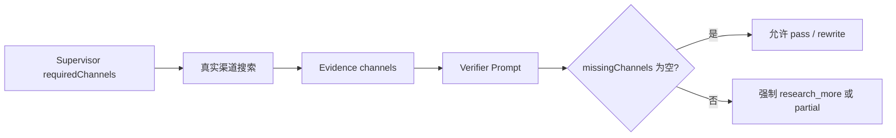

# X 正文证据与指定渠道硬门槛

## 元数据

| 字段 | 内容 |
|---|---|
| 日期 | 2026-07-31 |
| Issue | https://github.com/LuzernRR/agent-workbench/issues/9 |
| 状态 | accepted-awaiting-close |
| 目标环境 | local / production |

## 问题与目标

### 问题

X 公开索引能发现真实帖子 URL，但 FxTwitter 公共 JSON API 被误当网页抓取套用
robots.txt，导致候选无法变成正文 Evidence。同时 Verifier 只检查“是否存在任意
Evidence”，会把缺少用户指定渠道正文、但有其他渠道资料的回答误判为 completed。

### 目标

- X 公共 API 返回的真实帖子正文必须成为 `channel=x` 的 Evidence。
- 用户要求的每个渠道都必须有对应 Evidence，缺失时 Verifier 不能 `pass`。
- 前端仍按真实工具事件展示递增候选数、正文来源和唯一终态。

### 范围

- `XPublicChannel` 的公共 API 与网页 robots 边界。
- LangGraph Verifier 的渠道覆盖输入、Prompt 与确定性门槛。
- Search Agent 回归测试、生产 live 案例卡验收和交接记录。

### 验收条件

1. FxTwitter `/2/status/{id}` 真实返回 1 条 X Evidence。
2. `missingChannels` 非空时，即使模型返回 pass，运行也必须 partial。
3. completed 的案例必须有主渠道 `tool.completed.evidenceCount > 0`。
4. Search Agent、Web、确定性 E2E 和生产 live E2E 全部通过。

## 根因

`api.fxtwitter.com/robots.txt` 以爬虫语义禁止所有路径，但该集成使用的是受限公共
JSON API，不是抓取页面。另一方面，`verify()` 没有比较
`state.intent.channels` 与 `state.evidence[].channel`，所以任意渠道 Evidence 都能
满足旧门槛。

## 方案与取舍

- 只对白名单中的 `https://api.fxtwitter.com` JSON API 跳过网页 robots 检查；任意
  其他 origin 仍 fail closed。
- Verifier 仍生成公开核验摘要，但后端计算
  `requiredChannels/evidenceChannels/missingChannels` 并执行硬门槛。
- 模型输出与硬门槛冲突时，抑制该条不一致的公开摘要，不用前端模板替代。
- Prompt 升级为 `2026-07-31.v17-required-channel-evidence`。

## 逐文件修改

| 文件 | 修改 | 原因 |
|---|---|---|
| `services/search-agent/app/tools/channels/x_public.py` | 区分公共 JSON API 与网页 robots 门禁 | 恢复真实 X 正文读取 |
| `services/search-agent/app/graph/nodes.py` | 计算并强制渠道 Evidence 覆盖 | 防止跨渠道假通过 |
| `services/search-agent/app/prompts/agents.py` | v17 Verifier 渠道覆盖规则 | 让模型决策与硬门槛一致 |
| `services/search-agent/tests/test_x_public_channel.py` | 增加真实响应形状和门禁测试 | 防止 X 退回候选-only |
| `services/search-agent/tests/test_graph_runtime.py` | 增加缺渠道时模型误判 pass 的回归 | 证明确定性门槛生效 |
| `apps/web/e2e/live/search-prompt-examples-live.spec.ts` | completed 必须有主渠道 Evidence | 生产入口验收不再只看工具启动 |

## 验证证据

| 验收项 | 证据 | 结果 |
|---|---|---|
| X 真实状态读取 | `https://x.com/PCMag/status/2050557187089465497` 返回 1 条 Evidence | 通过 |
| X 通用查询 | 4 条候选、1 条真实 X Evidence | 通过 |
| Search Agent | `156 passed`，Ruff、compileall 通过 | 通过 |
| Web | `352 passed, 1 skipped`，typecheck、lint、build 通过 | 通过 |
| 确定性 E2E | `16 passed, 3 skipped` | 通过 |
| 生产案例卡 E2E | `1 passed`，三案例共 6.9 分钟 | 通过 |
| X 生产运行 | `run_9b5bc0ea48df4f2188e0e65919b2d126`，15 条 X Evidence，VERIFIED | 通过 |
| 小红书缺正文 | `run_5ebf10ff69774e58ab0f60692b2c3e30`，XHS Evidence 为 0，partial | 通过 |

## 部署与回滚

- Search Agent 镜像已构建并部署到 `127.0.0.1:8080`，容器 healthy。
- 回滚镜像：`agent-workbench/search-agent:pre-v17-20260731`。
- Web 继续由 `127.0.0.1:3000` 服务，并通过 `https://luzern.cc.cd/workbench` 暴露。

## 未解决问题

- 小红书登录态详情读取仍可能超时，当前会诚实 partial，不再由 Web Evidence 冒充
  小红书正文。
- 奖学金案例在 16 个 Web Evidence 后因 `MODEL_CALL_LIMIT` partial；答案质量门槛
  正常，但仍有减少重复反思与模型调用的优化空间。

## 用户验收

- 状态：用户已于 2026-07-31 明确验收通过
- 验收反馈：通过 Issue #9
- 下一功能执行门：完成本 Issue 的受控提交、推送和关闭后，另建唯一 Issue 并设置 `Execution Gate: allowed`
