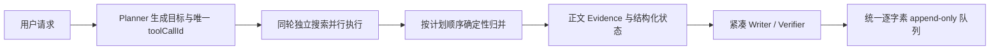

# 真实逐字流式响应、端到端延迟与小红书正文可靠性

## 元数据

| 字段 | 内容 |
|---|---|
| 日期 | 2026-08-01 |
| Issue | https://github.com/LuzernRR/agent-workbench/issues/10 |
| 状态 | accepted |
| 目标环境 | local / production |

## 问题与目标

### 问题

修改前的生产小红书运行 `run_840f4680494946b4b63da4f453b7ba63` 首个公开字需要
2.2 秒、首个工具需要 4.9 秒，但整轮耗时 194.6 秒：16 次模型调用、5 次工具
调用，第一次 MCP 等待 64.9 秒后超时，第二次等待 42.1 秒后仍只有候选、没有
正文 Evidence，最终以 `RUN_TIME_RESERVE / partial` 收口。单独适配器基线也会在
35.4 秒后返回 `ok=true`、5 个候选和 0 Evidence，却把 MCP 超时藏在 provider 与
limitation 文本中。

运行链路还存在三类体验和可信度问题：Planner 已经确定 query/channel 后，
Researcher 仍调用模型复述固定工具参数；同轮独立搜索顺序等待；浏览器端每帧可
追加 32 个字符，`completed`、快照或重连可用终态全文覆盖已经显示的前缀。公开
过程也会重复描述同一个证据缺口，降低可读性。

### 目标

- 消除没有决策价值的模型调用，并行执行同轮独立只读搜索，降低端到端延迟。
- 让授权只读小红书搜索真实发现候选并稳定读取正文 Evidence。
- 失败时返回稳定、类型化、可重试判断明确的结构化错误；fallback 成功也保留
  原始失败和 `degraded` 状态。
- 思考摘要、来源说明和最终回答全部按 Unicode grapheme 每帧只追加一个字素，
  后续事件永不改写已经显示的前缀。
- 只展示安全、简洁、非重复的公开过程摘要，不请求、保存或展示私有思维链与
  `reasoning_content`。

### 范围

- Search Agent 的路由、Planner/Researcher 执行、同轮并发归并、预算、Writer 与
  Verifier 安全收口。
- `xiaohongshu-mcp` 的只读登录态、站内搜索、详情正文读取、浏览器生命周期和
  错误分类。
- Python 渠道结果、类型化 AgentEvent、BFF Zod/mapper、事件账本、Reducer、
  React 渲染队列和生产 E2E。
- Compose 重建、本机 3000/8080 与 `luzern.cc.cd` 部署验证。

### 非目标

- 本 Issue 不实施 HarnessRunner、LangGraph 图级 fan-out/fan-in、通用
  ToolGateway、LangSmith tracing/eval、记忆或完整评测框架。
- 不增加小红书发布、评论、点赞、收藏等写操作，不绕过验证码、风控、robots 或
  平台权限。
- 不把 fixture、候选标题、标签、模板文案或前端推测冒充真实正文 Evidence。
- 不请求、持久化或展示 Cookie、`xsec_token`、密钥、Provider 原始响应、私有
  CoT 或 `reasoning_content`。

### 验收条件

1. 生产小红书案例首个公开字不超过 5 秒、首个工具不超过 10 秒、整轮不超过
   90 秒。
2. 同轮独立搜索并发执行并按原计划顺序归并；每次真实工具调用保留唯一
   `toolCallId` 和配对账本。
3. 生产案例不超过 10 次模型调用和 4 次工具调用；同 run 的 MCP 首次结构化故障
   后不重复进入相同慢路径。
4. 连续两次小红书只读烟测均发现至少 3 个真实候选，且至少一次读取到正文
   Evidence；URL 必须是 `xiaohongshu.com/explore/...`。
5. CAPTCHA、AUTH、TIMEOUT、RATE_LIMIT、NETWORK、OUTPUT_INVALID 等错误具有
   稳定 `reasonCode/retryable/nextAction/safeMessage`；fallback 结果保持
   `degraded`、primary/effective provider 和原始原因。
6. `thinking.delta`、`tool.source.delta`、`message.delta/text.delta` 在可见浏览器
   中每帧只增加一个 Unicode grapheme；completed、snapshot、reconnect 不覆盖
   已显示前缀。
7. 搜索统计只由真实 completed 事件与 verified URL 产生；停止、恢复、预算和非法
   渠道等安全语义不回归。
8. Search Agent、Web、确定性 E2E、生产 live E2E、部署和文档门禁全部通过。

## 修改前证据

| 指标 | 修改前结果 |
|---|---|
| 生产运行 | `run_840f4680494946b4b63da4f453b7ba63` |
| 首个公开字 / 首工具 | 2.2 秒 / 4.9 秒 |
| Agent 终态 | 194.6 秒 |
| 模型 / 工具调用 | 16 / 5 |
| 小红书正文 Evidence | 0 |
| 终态 | `RUN_TIME_RESERVE / partial` |
| 适配器单测基线 | 35.4 秒、5 候选、0 Evidence，失败原因未结构化 |

## 根因

- 强制搜索仍经过 Supervisor 模型路由；Planner 已确定目标后，Researcher 再调用
  模型把 query/channel 复述成固定工具参数，增加模型 RTT 和失败面。
- 同轮互不依赖的搜索目标顺序执行，Web、X 与小红书等待时间直接相加。
- 小红书详情读取对页面数据源、浏览器会话和超时边界处理不足；MCP 故障后同 run
  仍可能再次进入同一慢路径。
- 渠道结果只用 `ok/errorCode` 表达成功与失败，fallback 会吞掉 primary provider
  的失败原因，BFF 和 UI 无法可靠区分成功、降级与失败。
- 前端队列按字符块消费，终态事件又允许用完整快照覆盖增量文本，无法保证
  append-only。
- Writer 以 schema 长度硬拒绝超长结果，结构化输出失败会放大为运行失败；公开
  摘要和最终回答也缺少跨渠道证据约束与确定性压缩。

## 方案与取舍

- 强制搜索跳过 Supervisor 模型路由；Planner 确定参数后直接产生真实唯一
  `toolCallId`，不再由 Researcher 调模型复述固定参数。
- 同轮独立目标并发执行，完成结果仍按 Planner 原始顺序归并；小红书共享浏览器
  会话继续串行，避免不安全的页面并发。
- 运行预算收紧为 2 轮、10 次模型、4 次工具、150 秒。首次 MCP 结构化故障后，
  同 run 的后续小红书请求开启受控 circuit-open，避免重复慢路径。
- 小红书 MCP 直接解析真实搜索与详情数据源，复用受控浏览器生命周期，并将
  CAPTCHA、授权、超时、限流、网络和输出格式问题映射为稳定错误契约。
- 渠道结果显式区分 `success/degraded/failed`，同时保留 primary/effective
  provider、`reasonCode`、`retryable`、`nextAction` 和安全 message；BFF、事件
  账本、Reducer 与 UI 全链路透传。
- 思考、来源与回答共用一个 grapheme 队列；每个绘制帧只追加一个 Unicode
  grapheme。终态、快照和重连只补尚未显示的后缀，前缀不一致时拒绝回写。
- Prompt 升级为 `2026-08-01.v20-channel-aware-compact-answer`。Writer 显式接收
  required/evidence/missing channels，不能用 Web/X Evidence 冒充小红书；输出
  在 Verifier 前按完整句或 Markdown 行边界确定性压缩到 760 字符。Writer
  结构化输出失败以 `OUTPUT_INVALID / partial` 安全收口，不升级为 `run.failed`。

## 配置

| 配置 | 修改前 | 修改后 |
|---|---:|---:|
| `maxIterations` | 3 | 2 |
| `maxModelCalls` | 20 | 10 |
| `maxToolCalls` | 6 | 4 |
| `maxRunSeconds` | 240 | 150 |
| 小红书 `requestTimeoutMs` | 75000 | 30000 |
| 小红书 `detailTimeoutMs` | 18000 | 16000 |
| 小红书 `maxAttempts` | 2 | 1 |
| `ANSWER_MAX_CHARS` | 无确定性边界 | 760 |
| Writer token 上限 | 原配置 | 2048 |

## 逐文件修改

| 文件 | 修改 | 原因 |
|---|---|---|
| `services/search-agent/app/graph/{build,nodes,state,schemas}.py` | 直达 Planner、并发搜索、确定性归并、预算、渠道约束、回答压缩和安全 partial | 降低延迟并保持可验证终态 |
| `services/search-agent/app/prompts/agents.py` | v20 紧凑、渠道感知 Prompt | 去重公开摘要，禁止跨渠道冒充 |
| `services/search-agent/app/llm/deepseek.py` | Writer token 预算调整 | 支持结构化短回答 |
| `services/search-agent/app/tools/channels/{base,xiaohongshu_mcp}.py` | 结构化 success/degraded/failed、熔断和 MCP 映射 | 保留真实失败与降级语义 |
| `services/search-agent/app/tools/search_tool.py` | 透传新的渠道状态 | 保证工具账本契约完整 |
| `services/xiaohongshu-mcp/*.go` | 只读搜索/详情服务、生命周期、错误响应和 API/MCP 投影 | 稳定获取真实候选与正文 |
| `services/xiaohongshu-mcp/xiaohongshu/{search,feed_detail}.go` | 搜索与详情数据源解析 | 避免候选-only 与页面等待超时 |
| `apps/web/src/server/search-agent/{events,mapper}.ts` | 类型化降级/失败事件投影 | BFF 不丢 primary failure |
| `apps/web/src/lib/agent-events/*` | append-only reducer 与逐字素队列 | completed/重连不回写前缀 |
| `apps/web/src/hooks/use-agent-thread.ts` | 统一队列调度和恢复 | 所有公开内容一致逐字输出 |
| `apps/web/src/components/workbench/activity-row/*` | 紧凑公开状态展示 | 减少重复且保留真实状态 |
| `apps/web/e2e/*`、Python/Go/Web tests | 并发、错误、逐帧与生产链路回归 | 固化验收条件 |
| `config/search-agent.json` | 收紧运行与 MCP 预算 | 控制最坏延迟和重复慢路径 |

## 完整执行链路

1. BFF 建立 run 和持久事件账本，浏览器立即进入统一 append-only 渲染队列。
2. Planner 产生搜索计划、原始顺序和每个目标唯一 `toolCallId`。
3. Web/X/小红书等独立目标并发执行；小红书浏览器访问在自身安全边界内串行。
4. 每个工具按真实生命周期写入 started、progress、completed 或 failed；候选数来自
   completed 事件，来源数只来自 verified URL。
5. 结果按原计划顺序归并。小红书 MCP 若首次失败，后续相同慢路径在本 run 内
   circuit-open，并以明确 degraded/failed 状态进入反思。
6. Evidence Reflector 只报告新增证据和具体缺口；Writer 根据必需渠道与真实
   Evidence 写答案，Verifier 执行渠道覆盖和证据门槛。
7. 思考摘要、来源说明和最终回答按 grapheme 逐帧追加；completed、快照、刷新和
   重连只能续写剩余后缀。
8. 终态原子写入账本；只有 `VERIFIED / completed` 才可声明已核验，安全 partial
   不伪称完成。

## 异常、取消与恢复

- MCP/API 错误通过稳定 `reasonCode` 返回，UI 只展示安全 message、是否可重试和
  建议动作，不显示 Cookie、token、原始响应或内部堆栈。
- primary provider 失败但公开 fallback 成功时，工具终态仍是 `degraded`，刷新后
  从账本重建相同 provider 与原因。
- 停止/恢复生产 E2E 已通过；恢复只续写缺失后缀，不替换历史前缀。
- 工具预算、模型预算、运行时限、非法渠道和 `RUN_TIME_RESERVE` 保持确定性安全
  收口；Writer 输出无效时返回 `OUTPUT_INVALID / partial`。

## 数据与安全

- 所有小红书路由保持只读 allowlist；未增加发布、评论、点赞、收藏或账号写入。
- 不绕过验证码、登录风控、robots 或平台限制。CAPTCHA 直接结构化返回并进入受控
  降级。
- 事件和追踪只包含公开过程摘要、节点状态、工具结果与 Evidence，不请求、存储或
  展示私有思维链与 `reasoning_content`。
- Cookie、`xsec_token`、API key 和 Provider 原始响应不进入客户端、AgentEvent 或
  交付记录；密钥仍只存在 `config/*.local.json`。
- 搜索行可在会话视图聚合，但真实 `toolCallId` 全部保留在事件账本，计数只能从
  completed 事件和 verified URL 单调增长。

## 验证证据

### 自动化门禁

| 验收项 | 证据 | 结果 |
|---|---|---|
| Search Agent | `165 passed`；Ruff、compileall 通过 | 通过 |
| Web | `361 passed, 1 skipped`；typecheck、lint、production build 通过 | 通过 |
| 3110 deterministic Playwright | `16 passed, 3 skipped` | 通过 |
| 3000 production live E2E | `3 passed (5.3m)`：主链路、停止/恢复、Web/XHS/X 连续案例 | 通过 |
| Go 镜像构建测试层 | 当前源码对应 builder 的 `go test ./...` 层通过并按内容哈希复用 | 通过 |

两次额外的 Go 无缓存复跑都在 `go mod download` 阶段被
`proxy.golang.org` TLS handshake timeout 阻断；这属于外部依赖网络失败，不是
测试断言失败。已通过的当前源码镜像 builder 测试层仍可按内容哈希核验。

### 真实 Provider 与延迟

| 案例 | Run / 结果 | 指标 | 结果 |
|---|---|---|---|
| 主生产小红书链路 | `run_2077f589a5a84f06b8acebe1d949196d`，`VERIFIED / completed` | 首字 1871ms；首工具 1880ms；终态 65720ms；6 模型/4 工具；489 字 | 通过 |
| Web 案例 | `run_e6af11ee4e0b4469ba54ec83b2954bc4`，VERIFIED | 61.854 秒；8 模型/4 工具；755 字 | 通过 |
| 小红书案例 | `run_de207bd0013e41a1a2e1bc24c7be4be2`，VERIFIED | 49.054 秒；7 模型/4 工具；442 字 | 通过 |
| X 案例 | `run_c6bf7d7cd3e54a10883bff8f811e5ba2`，VERIFIED | 80.970 秒；8 模型/4 工具；749 字 | 通过 |
| 小红书烟测一 | `AI 编程工具` | 6.340 秒；5 候选、3 Evidence | 通过 |
| 小红书烟测二 | `Cursor` | 4.945 秒；5 候选、3 Evidence | 通过 |

两次小红书烟测返回的 Evidence URL 都是真实
`https://www.xiaohongshu.com/explore/...`；标题和标签未被单独计为正文 Evidence。
主生产 run 首次搜索得到 5 个候选和 2 条正文 Evidence，后续重复慢路径以明确的
degraded/circuit-open 状态收口。可见浏览器 E2E 使用逐帧 RAF 采样证明每次 DOM
增长只增加一个 grapheme，来源、思考和最终回答共享相同约束。

### 部署与界面证据

- Compose project `001-agent-live` 的七个服务全部 healthy。
- `http://127.0.0.1:3000`、`http://127.0.0.1:8080`、Milvus 与
  `https://luzern.cc.cd/workbench` 均可用，HTTP 检查返回 200。
- 公网页面标题为“平台万能搜”；Web、Search Agent、xiaohongshu-mcp 最近日志未见
  ERROR、Traceback 或 panic。
- 桌面证据：`docs/development/evidence/2026-08-01-issue-10-desktop.png`。
- 移动端证据：`docs/development/evidence/2026-08-01-issue-10-mobile.png`。

## 回滚

- Git 回滚基线仍为 Issue 描述中的 `d7fb5e9`；本功能尚未 stage、commit 或 push。
- Compose 回滚时应切回该基线对应镜像并重新创建 Web、Search Agent 与
  xiaohongshu-mcp；不删除 PostgreSQL、Milvus、session volume、旧容器、镜像或
  用户数据。
- 配置回滚可恢复原预算：3 轮、20 次模型、6 次工具、240 秒，以及 MCP
  75 秒请求超时、2 次尝试。

## 未解决问题

- 小红书、公开搜索 Provider、Cloudflare 和依赖代理仍可能受平台风控、登录态、
  限流或网络波动影响；当前实现已把这些外部不确定性映射为结构化错误和受控降级，
  不会伪造正文或已核验状态。
- Go 的额外无缓存复跑仍依赖 `proxy.golang.org` 网络恢复；当前源码对应镜像构建中
  的 `go test ./...` 已通过。
- HarnessRunner、LangGraph 图级 fan-out/fan-in、检查点、持久化、记忆、
  LangSmith tracing/eval、可观测性和完整评测属于后续独立 Issue，当前执行门阻塞。

## 用户验收

- 状态：用户已于 2026-08-01 明确验收通过
- 验收反馈：验收通过，继续完成任务
- 收口授权：允许对 Issue #10 的既有变更执行受控 stage、commit、push 和 close
- 下一功能执行门：Issue #10 收口后解锁；下一 feature 必须创建新的唯一 Issue、
  定义可测试验收条件并设置 `Execution Gate: allowed`
