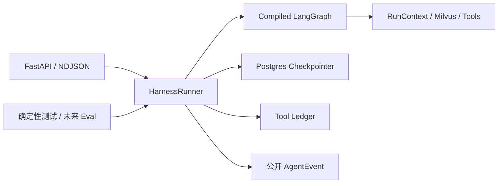

# 统一 HarnessRunner 执行边界

## 元数据

| 字段 | 内容 |
|---|---|
| 日期 | 2026-08-01 |
| Issue | https://github.com/LuzernRR/agent-workbench/issues/11 |
| 状态 | accepted |
| 目标环境 | local / production |

## 问题与目标

### 问题

修改前，`services/search-agent/app/main.py` 同时负责 FastAPI transport、运行依赖
装配、初始 State、checkpoint 恢复、`graph.astream`、断连/停止/超时、工具账本
unknown 结算和唯一 terminal 组装。生产 API 直接调用 graph，测试则直接调用
`build_graph().astream` 或导入 `main.py` 私有运行函数。

这会让后续离线评测、LangSmith tracing、图级 fan-out/fan-in 和 checkpoint 演练很
容易复制另一套运行循环；一旦生产与评测对 resume、cancel、event scope 或 terminal
的处理不同，评测结果就不能代表真实生产行为。

### 目标

- 建立显式、可复用、可依赖注入的 `HarnessRunner` 公共入口。
- 生产 HTTP API 和无 HTTP 的确定性测试共享完全相同的 run、resume、cancel、
  checkpoint、公开事件和唯一 terminal 语义。
- HTTP 层只保留认证、NDJSON transport、断连 callback 和生命周期装配。
- 不改变现有 LangGraph 拓扑、Prompt、搜索 Provider、运行预算和 Web/BFF 合同。

### 范围

- Python Search Agent 的 Harness 依赖合同、runner、事件 scope 和 HTTP adapter。
- run/resume/duplicate/timeout/recursion/stop/disconnect/empty/error 的确定性回归。
- Search Agent 全量门禁、生产镜像重建、真实 Provider smoke、中文记录与
  `HANDOFF.md`。

### 非目标

- 本 Issue 不实施 LangGraph `Send` fan-out/fan-in、并行 reducer、通用
  ToolGateway、记忆重构、Gold dataset、LangSmith tracing/eval 或 UI 改版。
- 不引入第二套 Agent 框架，不复制专用 eval Graph。
- 不改变模型、Prompt、搜索策略、小红书策略、预算或 AgentEvent 外部合同。

### 验收条件

1. 生产 API 和无 HTTP 调用都使用同一个 `HarnessRunner.stream()`。
2. `main.py` 不再调用 `graph.astream`、`graph.aget_state`、`initial_state` 或
   `runtime_event`，也不自行组装 terminal。
3. runner 显式注入 compiled graph、AgentConfig、ToolOperationLedger、Milvus、
   RunRegistry、事件时钟、stream ID factory 和 timeout factory。
4. 新 run、resume、scope mismatch、已完成 checkpoint 重放、duplicate、timeout、
   recursion、user stop、client disconnect、empty output 和未知异常都有确定性测试。
5. 相同 fake graph、固定时钟、固定 stream ID 和相同输入产生完全相同的公开事件。
6. run、resume、cancel 和断连继续正确结算 started 工具 outcome unknown，且只有一个
   terminal。
7. 公开事件不包含私有 CoT、`reasoning_content`、完整 Prompt、Provider body、
   Cookie、token 或密钥。
8. Search Agent pytest、Ruff、compileall 和真实生产 smoke 通过；七个服务 healthy，
   3000、8080 与公网入口返回 200。

## 修改前证据

| 基线 | 结果 |
|---|---|
| 稳定提交 | `5e29e74` |
| Search Agent | `165 passed` |
| 生产入口 | `main.py` 直接持有 `graph.astream/aget_state` 与 terminal 逻辑 |
| 无 HTTP 统一入口 | 不存在 |
| 确定性事件时钟/stream ID | 不可注入 |
| 回滚镜像 | 当前 `agent-workbench/search-agent:local`，重建前未单独命名 |

## 根因

- Graph 装配已经独立在 `build_graph()`，但 Graph 的执行、恢复和终态仍留在 FastAPI
  模块，transport 与 Agent runtime 没有清晰边界。
- `RunContext` 只负责 graph 节点依赖，不能单独代表一次 run 的注册、取消、timeout、
  checkpoint 输入和 event scope。
- 现有离线测试可验证 graph 节点，却无法证明“与生产 API 使用同一个执行入口”。
- `runtime_event()` 使用真实 UUID 与系统时间，无法让离线 harness 对完整事件序列做
  字节级确定性比较。

## 方案与取舍

- 新增 `HarnessDependencies`，集中声明 config、compiled graph、ledger、Milvus 和
  RunRegistry；runner 构造器再注入 event clock、stream ID factory 与 timeout
  factory，使生产使用真实实现，测试使用固定实现。
- `HarnessRunner.stream()` 建立 event scope，处理初始 State、checkpoint scope、
  graph stream、resume snapshot、断连、取消、timeout、异常和最终 terminal。
- `HarnessRunner.stop()` 统一调用 RunRegistry 并把 started 工具结算为
  `CANCELLED_OUTCOME_UNKNOWN`；HTTP stop endpoint 不再直接访问 registry/ledger。
- `main.py` 只在 lifespan 装配 runner，并把公开 event 编码为 NDJSON。运行状态机和
  terminal 不再属于 HTTP 层。
- `EventScope` 支持注入时钟和 stream ID，但默认仍使用真实 UTC 与 UUID；LangGraph
  节点内调用的 `runtime_event()` 自动继承同一 scope，因此生产和离线事件顺序一致。
- client disconnect 在 Harness 内形成安全 `run.stopped / CLIENT_DISCONNECTED`，
  同时结算工具 unknown；实际 HTTP 连接已断开时该 terminal 不会被伪称为已送达。

取舍：本次只统一运行边界，不提前抽象 ModelProvider/ToolGateway，也不改变 Graph
节点。这使变更可由现有行为回归完整覆盖，并为后续独立 feature 提供真实入口。

## 配置

没有新增配置、环境变量、密钥或公开端口。运行预算、Prompt 版本、Provider 和
checkpoint thread key `run:{run_id}` 保持不变。

## 逐文件修改

| 文件 | 修改 | 原因 |
|---|---|---|
| `services/search-agent/app/harness/__init__.py` | 导出 Harness 公共边界 | 给生产和离线调用稳定入口 |
| `services/search-agent/app/harness/runner.py` | 新增 typed dependencies、run/resume/stop/event/terminal 执行器 | 从 HTTP 层收口 Agent runtime |
| `services/search-agent/app/events/runtime.py` | EventScope 注入 clock 与 stream ID | 支持完整事件确定性回放 |
| `services/search-agent/app/main.py` | lifespan 装配 runner，endpoint 只做 transport | 消除生产专用运行循环 |
| `services/search-agent/tests/test_harness_runner.py` | 新增无 HTTP、恢复、失败和取消测试 | 证明统一边界可复用、可重复 |
| `services/search-agent/tests/test_run_control.py` | HTTP adapter/stop 测试迁移到 runner | 防止 main 重新持有运行语义 |
| `services/search-agent/tests/test_limits.py` | timeout/recursion 回归注入 runner | 保持稳定错误合同 |

## 完整执行链路

1. lifespan 初始化 PostgreSQL tool ledger、Milvus、Postgres checkpointer 和 compiled
   graph，然后构造唯一 `HarnessRunner`。
2. `/v1/runs/stream` 完成认证，把 `SearchRunRequest` 与
   `request.is_disconnected` 交给 runner。
3. runner 建立 run-scoped EventScope，固定同一 `streamId` 与严格递增 sequence。
4. runner 注册活动任务，构造 `run:{run_id}` graph config；duplicate 直接返回稳定
   `RUN_ALREADY_ACTIVE`。
5. 新 run 构造初始 State；resume 读取 checkpoint 并核对 tenant、visitor、project、
   thread、model 和 run scope。
6. runner 调用 compiled graph，原样转发真实 custom AgentEvent，并只保留最新 values
   用于 terminal。
7. timeout、recursion、scope mismatch、取消、断连和未知异常由 runner 映射为稳定
   公开状态；需要时先把工具账本结算为 outcome unknown。
8. completed checkpoint 或 graph 最终 State 统一生成唯一 `run.completed`；空答案返回
   `EMPTY_OUTPUT`。
9. HTTP adapter 只把 event 编码成 NDJSON；未来离线评测可直接消费同一个 dict event
   stream，不经过 FastAPI。

## 异常、取消与恢复

- `HarnessRunner.stop()` 与 stream 的取消处理都使用幂等 ledger 更新，恢复时不会
  盲重放结果未知的外部调用。
- resume checkpoint 作用域不一致时，graph 不会执行，返回
  `RESUME_SCOPE_MISMATCH`。
- 已完成 checkpoint 即使不再产生 graph values，也会重放唯一
  `run.completed`。
- timeout 返回 `RUN_TIMEOUT` 并写 `RUN_TIMEOUT_OUTCOME_UNKNOWN`；Graph recursion
  返回 `RECURSION_LIMIT`。
- 未知异常只暴露异常类型稳定码与安全 message，不返回异常正文、Provider body 或
  堆栈。

## 数据与安全

- Harness event scope 仍通过 `_assert_public` 拒绝 reasoning、reasoning_content、
  chain-of-thought、authorization、API key、Cookie、system prompt、messages、原始
  request/response 和 Provider body 字段。
- runner 只持有进程内依赖引用；数据库 URL、Milvus token 和内部 token 不写入 State、
  checkpoint、AgentEvent 或测试报告。
- 公开 process 仍只来自版本化 LangGraph 节点输出；Harness 不生成推理文案。
- 没有新增客户端合同、公开路由或内部服务端口。

## 验证证据

| 验收项 | 证据 | 结果 |
|---|---|---|
| 定向 Harness/HTTP tests | `16 passed` | 通过 |
| Search Agent 全量 pytest | `170 passed in 4.50s` | 通过 |
| Search Agent Ruff | `All checks passed` | 通过 |
| Python compileall | `python -m compileall -q app` | 通过 |
| HTTP 与 Graph 边界 | `main.py` 无 `astream/aget_state/initial_state/runtime_event` | 通过 |
| 确定性离线调用 | 固定 graph/clock/stream ID 两次事件完全相等，sequence 为 1、2 | 通过 |
| 生产 live E2E | 最终镜像主链路 `1 passed (57.7s)`；前一构建 `1 passed (1.3m)` | 通过 |
| VERIFIED 生产 run | `run_e909a6756aa7457ca8eba9e801e347f3` | 通过 |
| 最终镜像降级 run | `run_45d53f0533164aacb5f5f92f022f5e25` | 通过 |
| 服务与入口 | 七服务 healthy；3000、8080、域名均为 200 | 通过 |
| 最近日志 | Search Agent、Web、xiaohongshu-mcp 无 ERROR/Traceback/panic | 通过 |
| 桌面/移动端证据 | `docs/development/evidence/2026-08-01-issue-11-{desktop,mobile}.png` | 通过 |

生产 run `run_e909a6756aa7457ca8eba9e801e347f3` 在统一 runner 上耗时 59.864 秒，
6 次模型调用、4 次工具调用、7 条 Evidence，最终
`VERIFIED / completed`。四次工具完成事件分别得到 2、0、3、2 条 Evidence，其中
小红书 MCP 超时保留 `MCP_TIMEOUT` 降级原因；整轮仍由真实互补渠道安全核验完成。

最终源码镜像重建后的 run `run_45d53f0533164aacb5f5f92f022f5e25` 耗时
46.811 秒，6 次模型、4 次工具、2 条 Evidence。小红书返回 `MCP_TIMEOUT`，同 run
后续调用正确返回 `MCP_CIRCUIT_OPEN`，最终因指定渠道证据不足以
`MAX_ITERATIONS / partial` 诚实收口。对应生产 Playwright 仍通过全部 Harness、
逐字流、事件账本、唯一 terminal 和刷新恢复断言。两个 run 的持久事件都只有一个
`run.completed`，并完整保留真实工具 started/progress/completed 轨迹。

Web 和共享 contracts 未修改，因此未重复运行 Web unit/typecheck/lint/build；生产
Playwright 已通过真实 BFF 与既有 Zod/Reducer 消费路径，证明外部合同没有分叉。

## 部署与回滚

- 重建前镜像已保留为
  `agent-workbench/search-agent:pre-issue-11-5e29e74`。
- 新 `agent-workbench/search-agent:local` 已构建并仅重建
  `agent-workbench-live-search-agent`；PostgreSQL、Milvus、Web、小红书 session 和
  其他容器未删除或重建。
- 最终生产 E2E 的桌面与移动端截图保存在
  `docs/development/evidence/2026-08-01-issue-11-{desktop,mobile}.png`；Issue #10 的
  历史截图已恢复为其已提交版本，没有被本轮测试覆盖。
- 回滚时把 Search Agent 镜像切回上述标签并执行受控 `compose up -d --no-deps
  search-agent`；不执行 `down -v`，不删除 checkpoint、tool ledger、Milvus 或用户
  数据。

## 未解决问题

- 当前 HarnessRunner 统一的是现有 compiled graph 运行边界；ModelProvider 与
  ToolGateway 仍由 graph/node 侧持有，需后续独立 feature 继续依赖注入。
- 当前研究并行仍在 `research` 节点内部执行，不是 LangGraph 图级 `Send`
  fan-out/fan-in；state reducer 和确定性图归并属于下一独立 Issue。
- LangSmith tracing/eval、Gold dataset、轨迹评估和版本报告尚未实施，不能把本次
  生产 smoke 冒充完整 eval harness。

## 用户验收

- 状态：用户已于 2026-08-01 明确验收通过
- 验收反馈：验收通过 Issue #11
- 收口授权：允许对 Issue #11 的既有变更执行受控 stage、commit、push 和 close
- 下一功能执行门：Issue #11 收口后解锁；下一 feature 必须创建新的唯一 Issue、
  定义可测试验收条件并设置 `Execution Gate: allowed`
