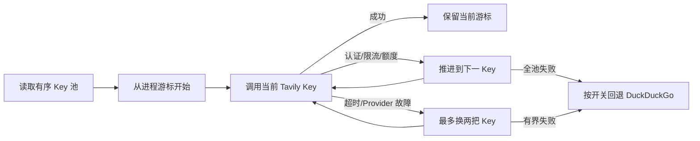

# Tavily 多 Key 有序轮换

## 元数据

| 字段 | 内容 |
|---|---|
| 日期 | 2026-08-01 |
| Issue | [#10](https://github.com/LuzernRR/agent-workbench/issues/10) |
| 状态 | accepted |
| 目标环境 | local |

## 问题与目标

### 问题

修改前 `web_search.py` 只读取一个 `TAVILY_API_KEY` 或
`config/search.local.json` 中的单个 `apiKey`。该 Key 一旦认证失败、限流、额度
耗尽、超时或服务不可用，代码会直接进入 DuckDuckGo 回退，无法使用用户提供的
同供应商备用 Key。

### 目标

- 严格按用户指定顺序使用 Tavily：30 把优先 Key、当前原有 Key、最后一把新增 Key。
- 当前 Key 用尽或不可用时自动切换，成功后后续请求继续使用已切换到的 Key。
- 所有 Tavily Key 均失败后，才允许执行既有 DuckDuckGo 回退。
- 密钥只保存在 Git 忽略的本地配置或服务端环境变量中。

### 范围

- Tavily 私密配置解析、Key 顺序、去空与去重。
- 进程内 Key 游标、凭据失败切换、Provider 故障有界切换。
- HTTP 401/403、429、432 与既有网络错误的稳定分类。
- 定向测试、Search Agent 全量门禁和真实 Tavily smoke。

### 非目标

- 不把 Key 写入数据库、事件账本、日志、Issue、文档正文或客户端。
- 不持久化跨进程游标；服务重启后从配置第一把 Key 重新开始。
- 不在本轮重建生产镜像或夹带部署当前工作区的其他未提交改动。

### 验收条件

- [x] 私密配置解析出 32 把 Key，顺序为 30 把优先、原有、末级新增。
- [x] 32 把 Key 均以最小真实请求得到 HTTP 200。
- [x] 认证、限流、额度耗尽时遍历后续 Key，成功 Key 成为后续请求游标。
- [x] 超时或 Provider 不可用时至少尝试下一 Key，同时保持总超时有界。
- [x] Tavily 全池失败后才按配置回退 DuckDuckGo。
- [x] 定向与全量 Search Agent 门禁通过。
- [x] 用户明确验收。

## 修改前证据

- `_tavily_key()` 返回 `str | None`，只能读取一个 Key。
- `web_search()` 只执行一次 Tavily Provider 重试链；失败后立即调用 DuckDuckGo。
- `config/search.local.json` 的 Tavily 节点只有旧字段 `apiKey`。

## 根因

原实现的数据结构和调用接口都以单 Key 为前提，既没有有序池，也没有运行期游标。
将所有 Key 简单逐次重试还会在 Provider 整体故障时把 15 秒读超时放大 32 倍，因此
轮换必须区分“凭据特定故障”和“供应商/网络故障”。

## 方案与取舍

- `apiKeys` 是 30 把优先池，旧 `apiKey` 保持兼容并排在其后，
  `fallbackApiKeys` 是末级备用池。
- 环境变量继续高于本地配置，并支持 `TAVILY_API_KEYS`、旧
  `TAVILY_API_KEY` 和 `TAVILY_FALLBACK_API_KEYS`。
- 401/403 映射为 `auth_required`，429 映射为 `rate_limited`，432 映射为
  `quota_exhausted`；这三类失败可快速遍历全部剩余 Key。
- 多 Key 模式下，每把 Key 对 Provider/网络故障只尝试一次，并最多换两把不同 Key；
  单 Key 模式继续使用原有 `max_attempts`。这样既满足切换，也不会把供应商整体故障
  放大为 32 组超时。
- 游标只在进程内保存且单调前进。并发请求中较慢的旧 Key 成功结果不能把另一个请求
  已推进的游标倒回去。

## 配置

| 字段 | 用途 | 是否受版本控制 |
|---|---|---|
| `search.providers.tavily.apiKeys` | 有序优先 Key 池 | 否 |
| `search.providers.tavily.apiKey` | 兼容原有单 Key，排在优先池之后 | 否 |
| `search.providers.tavily.fallbackApiKeys` | 末级备用池 | 否 |

`config/search.local.json` 由 `config/.gitignore` 的 `*.local.json` 规则忽略；本文只记录
字段和数量，不记录任何 Key 值。

## 逐文件修改

| 文件 | 修改 | 原因 |
|---|---|---|
| `services/search-agent/app/tools/web_search.py` | 增加 Key 池解析、进程游标、失败分类与有界轮换 | 在 DuckDuckGo 前使用全部 Tavily 能力 |
| `services/search-agent/tests/test_web_search_failures.py` | 增加顺序、游标、额度耗尽和 Provider 故障测试 | 固定轮换语义与超时边界 |
| `config/search.local.json` | 增加 30 把优先 Key 和 1 把末级备用 Key，保留原有 Key | 落地用户指定顺序 |
| `HANDOFF.md` | 记录当前状态、验证与未部署事实 | 保持交接账本真实 |

## 完整执行链路

1. `web_search()` 读取环境变量或 Git 忽略的本地 Key 池。
2. Key 池变化时进程游标重置为第一把；否则从上次成功或切换位置继续。
3. 当前 Key 成功时返回真实 `provider=tavily` 候选，并保持游标。
4. 当前 Key 出现凭据特定故障时推进游标并继续下一把。
5. 当前 Key 出现网络或 Provider 故障时有界尝试下一把，防止总延迟失控。
6. Tavily 未成功且 `allowDuckDuckGoFallback=true` 时，才执行既有 DuckDuckGo 搜索。
7. 搜索候选仍必须经过 URL 安全过滤与正文读取，不能直接作为 Evidence。

## 异常、取消与恢复

- Key 配置 JSON 无效、字段类型错误或池为空时，保持原有缺 Key 失败/回退语义。
- 重启进程会清空游标并从第一把 Key 重新探测；不新增数据库写入或恢复协议。
- 最后一把 Key 失败后仍保持为当前游标，使临时限流恢复后可再次尝试，而不是形成永久
  无 Key 状态。
- 既有 `httpx` 取消、超时和上层停止语义未改变。

## 数据与安全

- 32 把 Key 仅存在于用户提供的输入、进程内存和 `config/search.local.json`。
- 测试与 smoke 输出只包含编号、计数、HTTP 状态和布尔顺序结果，不回显完整 Key。
- 受版本控制的代码、测试、Issue 评论、HANDOFF 和本记录均不包含 Key 值。
- Tavily Provider 名称保持为 `tavily`，不公开当前使用的是第几把 Key。

## 验证证据

| 验收项 | 证据 | 结果 |
|---|---|---|
| 候选 Key 可用性 | 现有 Key、单独新增 Key、30 把候选各执行一次 `basic / max_results=1` | 32/32 HTTP 200 |
| 配置顺序 | 运行时比较解析结果与三个配置区段 | `count=32`，三段顺序均为 true |
| 真实集成 smoke | `web_search(..., max_results=1, allowDuckDuckGoFallback=False)` | `ok=true`、`provider=tavily`、1 条候选 |
| 真实轮换 smoke | 临时环境池为无效 Key、可用 Key，关闭 DuckDuckGo | 自动前进到索引 1，`ok=true`、1 条候选 |
| 定向测试 | `pytest -q tests/test_web_search_failures.py` | 11 passed |
| Search Agent 全量 | `pytest -q` | 183 passed in 4.41s |
| 静态检查 | `ruff check .` | passed |
| 字节码编译 | `compileall -q app` | passed |

## 回滚

- 代码回滚只需移除 Key 池与游标逻辑并恢复单 Key 调用。
- 私密配置回滚只需删除 `apiKeys` 与 `fallbackApiKeys`，保留原有 `apiKey`。
- 本轮没有部署、数据库迁移或持久数据写入，因此不需要容器或数据回滚。

## 未解决问题

- 当前生产容器仍运行旧单 Key 代码。虽然 `config/` 为只读 bind mount，新字段只有在
  Search Agent 镜像重建后才会被运行时代码识别。
- 当前工作区还有用户既有的 Issue #10 小红书相关未提交改动；为避免未经验收地一并
  部署，本轮停在本地验证阶段。

## 用户验收

- 状态：已验收
- 验收反馈：用户于 2026-08-01 明确回复“通过”，并要求连续进入后续开发。
- 下一功能执行门：允许在 #10 完成收口后创建下一唯一 Issue。
