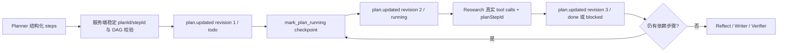

# Issue #12：结构化任务计划成为运行时一等状态

## 元数据

| 字段 | 内容 |
|---|---|
| 日期 | 2026-08-01 |
| Issue | [#12](https://github.com/LuzernRR/agent-workbench/issues/12) |
| 状态 | completed |
| Execution Gate | allowed |

## 修改前基线

- Planner 只返回 `searches[{query, channel}]`。
- `SearchState` 只有 `searches/pending_searches` 与兼容 `queries`，没有 planId、revision、
  stepId、依赖 DAG、优先级、证据目标、并行能力或步骤状态。
- `plan.updated` 只携带 `queries[]`；BFF mapper 会直接丢弃该事件。
- 工具调用无法关联到计划步骤，刷新后 Workbench 也无法从持久事件重建真实计划。
- 共享 v2 合同已有 SearchPlan DAG，但生产 Search Agent 没有使用它。

## 目标与边界

本 Issue 只交付“结构计划是一等运行状态”这一项能力。现有 HarnessRunner 继续作为唯一
执行边界；不在本轮实现 LangGraph `Send`、通用 ToolGateway、完整工具账本、Evidence
状态机、记忆、LangSmith 或评测体系。

所有公开内容继续遵守安全边界：只允许模型生成的公开摘要、结构化计划字段、节点状态、
工具结果和稳定 reason code；不请求、保存或展示私有思维链、`reasoning_content`、完整
Prompt、Provider body、Cookie、token 或密钥。

## 设计

### 结构计划

Planner 每轮输出 1–4 个原子步骤：

- `local_id`：仅在模型输出内引用，不能直接作为运行时主键；
- `facet/objective`：证据面与可验证目标；
- `query/channel`：唯一真实搜索请求；
- `depends_on`：引用同一计划的 local ID；
- `priority`：`0..100`；
- `evidence_needed`：`0..10`；
- `can_parallelize`：只有无依赖且并发不改变语义时才能为真。

服务端使用 Run、iteration 与规范化结构生成稳定 `planId`，再按 planId/local_id 生成稳定
`stepId`。同一固定模型输出得到相同 ID；模型不能自行指定持久主键。

### 校验与受控拒绝

`app/graph/plan.py` 确定性拒绝：

- 重复 stepId 或 query+channel；
- 已执行/已接受的 query+channel；
- 非 Supervisor 或证据节点允许的渠道；
- 未知依赖、重复依赖、自依赖和依赖环；
- 无可运行根步骤；
- 越界 priority/evidence target；
- 步骤数量不在 `1..4`。

拒绝结果写入 `plan_error_code`，并发布只含稳定 `reasonCode` 的 `plan.rejected`。BFF 仅把
代码作为结构化 warn log 持久化，不补写自然语言“思考”模板。无效计划不会产生工具调用。

### 生命周期与依赖

- 初始计划 revision 为全 Run 单调序号，步骤均为 `todo`。
- `mark_plan_running` 在工具执行前提交 checkpoint，将下一拓扑批次置为 `running`。
- 优先级最高且 `can_parallelize=false` 的步骤独占当前批次；可并行根步骤可同批进入现有
  Research 节点。
- 工具成功且达到 `evidence_needed` 时为 `done`；失败、未知结果或证据目标未达到时为
  `blocked` 并保留稳定 reason code。
- 被 blocked/skipped 依赖阻断的下游步骤转为 `PLAN_DEPENDENCY_BLOCKED`。
- 重规划产生新 planId；旧完整快照进入 `plan_history`，历史 `plan.updated` 事件仍可审计。

### 事件、持久化与 UI

- `plan.updated` 现在携带 `planId/revision/iteration/steps/planSource` 的完整快照。
- 每个真实 `tool.started/progress/completed/failed/unknown` 可带 `planStepId`；当前生产搜索
  路径始终携带。
- BFF Zod 再次校验唯一 ID、未知依赖、依赖环和重复 query+channel。
- mapper 将完整快照投影为持久 `plan.updated` AgentEvent；Reducer 以 revision 防回滚。
- Workbench 计划页展示目标、query、渠道、依赖、优先级、证据目标、并行标志、状态和
  reason code。UI 标签不冒充模型推理。

## 测试证据

| 门禁 | 结果 |
|---|---|
| 共享 Python 合同 | `6 passed` |
| Search Agent 定向 | `66 passed` |
| Search Agent 全量 | `210 passed in 10.96s` |
| Ruff / compileall | passed |
| Web 定向 | `59 passed` |
| Web 全量 | `378 passed, 1 skipped` |
| TypeScript / ESLint / production build | passed |
| Playwright deterministic | `16 passed, 3 skipped` |
| `git diff --check` | passed |

新增或加强的关键回归包括：

- 稳定 planId/stepId；
- 重复 ID、未知依赖、依赖环、重复 query、非法渠道、优先级越界；
- 拓扑步骤 `todo → running → done` 与 revision `1 → 2 → 3`；
- 证据目标未达到和依赖阻断；
- `tool.started.planStepId` 与 SearchTrace 一致；
- `plan.rejected` 只有 reason code，无伪造推理文本；
- BFF 完整快照、Reducer revision 防回滚、Workbench 结构字段显示。

## 回滚

- 代码回滚到本 Issue 前提交即可恢复 `searches/pending_searches` 直接执行路径。
- 本轮无数据库 migration、无配置密钥修改、无外部写操作和无不可逆数据变更。
- 已持久化的新 `plan.updated` payload 属于严格 JSON 事件；旧前端无法识别时会按既有未知
  payload 安全忽略，不影响终态消息与工具事件。

## 后续

下一独立 Issue 将使用本轮 `PlanStep.dependsOn/canParallelize/status` 作为图级调度输入，
把当前 Research 节点内部 `asyncio` 并发升级为 LangGraph `Send` fan-out/fan-in，并新增
并行安全 reducer 与确定性归并。该后续工作不会回退本轮的计划合同与持久化语义。
