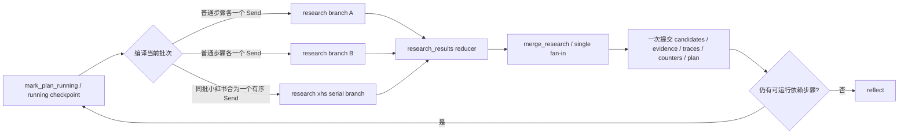

# Issue #13：LangGraph 图级 fan-out/fan-in 与确定性归并

## 元数据

| 字段 | 内容 |
|---|---|
| 日期 | 2026-08-01 |
| Issue | [#13](https://github.com/LuzernRR/agent-workbench/issues/13) |
| 状态 | completed |
| Execution Gate | allowed |

## 修改前基线

- `mark_plan_running` 会选出同一拓扑批次，但随后只进入一次 `research` 节点。
- `research` 节点内部使用 `asyncio.create_task/gather` 并发工具调用；LangGraph 看不到独立
  分支，无法为每个查询提供节点级 checkpoint、追踪、重试或 fan-in 边界。
- 并发任务共享闭包字典，再由同一个节点写入 candidates、evidence、tool traces、计数和
  plan；虽然旧实现按 index 排序，但没有 reducer 级幂等与冲突证明。
- 同批小红书调用已有串行熔断语义，改图时必须保留工具账号单会话约束。

## 单一 Feature 与安全边界

本 Issue 只把现有结构计划批次升级为真实 LangGraph `Send` fan-out/fan-in，并增加
branch-local 结果、并行安全 reducer 与唯一归并节点。HarnessRunner、Provider、计划合同和
工具语义继续复用；通用 ToolGateway、完整持久工具账本、Evidence 状态机、记忆、LangSmith
与评测仍留给后续 Issue。

公开事件仍只包含真实节点状态、工具结果、计划、证据和稳定 reason code。实现不请求、保存
或显示私有思维链、`reasoning_content`、完整 Prompt、Provider body、Cookie、token 或密钥；
确定性 Research/merge 节点也不生成自然语言“思考”模板。

## 设计



### 分支输入与稳定标识

- `build_research_work_items` 依据 Run、iteration、planId、running revision 与 stepId 生成稳定
  `batchId/resultId/toolCallId`。
- 每个普通原子步骤成为一个独立 `Send("research", branch_state)`。
- 同批多个小红书步骤进入同一个按计划顺序执行的分支；首个结构化受限错误仍会打开本 Run
  的 public-only 熔断，后续步骤不会并发争用工具账号会话。
- 工具、模型或时间预算不足时仍产生可审计的 branch-local blocked execution，由 fan-in
  统一把计划步骤结算为 blocked，不在路由器中静默丢失。

### branch-local worker

`research` worker 现在只返回：

```text
research_results: [{ batch_id, result_id, order, executions[] }]
```

它不写 `candidates/evidence/tool_traces/tool_calls/external_wait_seconds/plan`，也不返回公开
思考摘要。源码回归明确禁止在 worker 中出现 `asyncio.create_task/gather`；并发由 LangGraph
图调度承担。

### reducer 与唯一 fan-in

- `research_results` 使用自定义 reducer，按 `(plan order, resultId)` 稳定排序。
- 相同 resultId、相同内容重复到达时幂等；相同 resultId、不同内容抛出
  `RESEARCH_RESULT_CONFLICT`，HarnessRunner 只返回结构化失败码，不泄露异常正文。
- `merge_research` 是唯一全局提交者，按计划原顺序构造 Candidate、Evidence 和 SearchTrace，
  去重 URL/toolCallId，并一次性累计 tool calls 与用户验证等待时间。
- `merged_research_result_ids` 防止 post-merge replay 重复累计；临时 `research_results` 在 merge
  后清空，避免 checkpoint 膨胀。
- 下一依赖批次只在上一批 merge 输出已经进入 checkpoint 后重新进入
  `mark_plan_running`。

### 可观测性与协议

- 两个独立查询会发布两个 `research` 节点生命周期和一个 `merge_research` 生命周期。
- Web Search Agent Zod 白名单已接受 `merge_research`；它没有模型公开摘要，因此 mapper 不会
  制造新的思考文本。
- `/v1/graph` 真实返回 `mark_plan_running`、`research`、`merge_research` 及
  `Send(research fan-out) -> merge_research fan-in` 流程，不再展示过时单节点拓扑。

## 测试证据

| 门禁 | 结果 |
|---|---|
| 共享 Python 合同 | `6 passed` |
| Search Agent 定向 | `67 passed` |
| Search Agent 全量 | `216 passed` |
| Ruff / compileall | passed |
| Web 定向协议 | `36 passed` |
| Web 全量 | `379 passed, 1 skipped` |
| TypeScript / ESLint / production build | passed |
| Playwright deterministic | `16 passed, 3 skipped` |
| `git diff --check` | passed |

关键回归覆盖：

- 两个普通查询产生两个真实 Research 图任务、一个 merge，工具执行窗口小于串行耗时之和；
- fast 分支先完成、slow 分支后完成时，Candidate、Evidence、SearchTrace 仍按计划顺序；
- reducer 乱序输入字节等价、同值重复幂等、冲突 fail-closed；
- worker patch 只有 `research_results`，全局字段只由 merge 写入；
- replay 不重复累计 tool calls、external wait、Candidate、Evidence 或 trace；
- 依赖第二批的 mark/research 严格晚于第一批 merge completion；
- 两个小红书步骤只产生一个 Research 分支并保持串行熔断；
- Harness timeout、stop/cancel、outcome unknown、唯一 terminal 与私有字段隔离全量不回归。

## 部署与线上检查

- 已为旧镜像保留回滚标签：
  `agent-workbench/{search-agent,web}:pre-issue-13-5f5026b`。
- 只滚动替换 Search Agent 与 Web；PostgreSQL、Milvus、小红书工具会话和数据卷未改动。
- Compose 七服务 healthy；`127.0.0.1:3000/health`、`127.0.0.1:8080/health` 与
  [https://luzern.cc.cd/workbench](https://luzern.cc.cd/workbench) 均返回 200。
- 部署后 `/v1/graph` 返回完整 fan-out/fan-in 节点与流程；最近 Web/Search Agent 日志无
  ERROR、Traceback 或 Exception。
- 真实 Provider smoke 在进入 fan-out 前由既有 `plan_research` 结构化调用返回
  `invalid_request_error`，未产生工具调用；本记录不把该失败冒充 #13 的线上并行证据。该
  生产 Planner 兼容问题需要作为下一个独立 Issue 优先修复，然后再继续工具账本等框架项。

## 回滚

- 将 Search Agent 与 Web 镜像切换到上述 `pre-issue-13-5f5026b` 标签即可恢复旧单 Research
  节点路径。
- 本轮无数据库 migration、无配置或密钥修改、无卷删除和无不可逆数据变更。
- 新 checkpoint 增加的 branch-local 字段均为有界 JSON；merge 后临时结果会清空。

## 后续

先以独立 Issue 修复生产 Planner 的结构化模型兼容与稳定错误归一化，恢复真实 Provider
端到端 smoke。通过后再继续通用 ToolGateway、完整工具调用账本与 Evidence 状态机。
