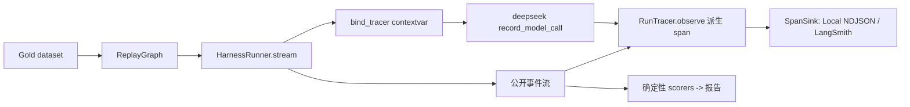

# 可观测性、可选 LangSmith tracing 与完整离线评测体系

## 元数据

| 字段 | 内容 |
|---|---|
| 日期 | 2026-08-01 |
| Issue | https://github.com/LuzernRR/agent-workbench/issues/23 |
| 状态 | accepted |
| 目标环境 | local |

## 问题与目标

### 问题

主线运行时能力已收口（结构化任务计划 #12、图级 fan-out/fan-in #13、ToolGateway 与工具账本
#15、Evidence 生命周期状态机 #19、可复用 HarnessRunner 边界 #11、已核验证据长期记忆 #21、
Postgres checkpoint 与持久化）。全仓核验（排除 `.venv`/`node_modules`）后，真实剩余缺口为三项，
引用数为 0：

- 可观测性：没有 run/node/tool/model 级 span 与稳定指标边界。
- LangSmith tracing：无 `langsmith` 依赖或导出路径。
- 完整评测体系：无 `eval`/`dataset`/`gold` 目录，无离线 runner 与 scorer。

### 目标

实现 provider-neutral 可观测性边界、可选 LangSmith tracing 导出，以及复用既有 `HarnessRunner`
的完整离线评测体系。

### 范围

`services/search-agent/app/observability/`、`services/search-agent/app/evaluation/`、
`services/search-agent/evaluation/gold/`，以及模型调用层与 HarnessRunner 的最小接线。

### 非目标

不重新实现 HarnessRunner、ToolGateway、图级 fan-out/fan-in 或 Evidence 状态机；不改动 Prompt
语义；不放宽安全边界或伪造评测数据以通过 scorer；本轮不引入 LLM-as-judge；不恢复小红书登录。

### 验收条件

见下方“验证证据”表，逐项对应 Issue #23 的 A1–A5、B1–B4、C1–C4、D1–D4、E1–E4。

## 修改前证据

`git grep` 全仓（排除 `.venv`/`node_modules`）确认改动前不存在 `app/observability/`、
`app/evaluation/`、`evaluation/gold/` 目录，无 `langsmith` 依赖或导入，无离线 runner/scorer；
`span`/`trace` 相关标识符引用数为 0。

## 根因

平台已具备完整运行时与持久化，但缺少三条正交的可审计能力：把一次 run 结构化为可导出的
span 树、把 span 可选地送到 LangSmith、以及用固定 Gold dataset 对 run 做确定性回归判分。三者
都必须复用既有的公开事件流与隐私门，不得新开第二套运行循环或第二套隐私规则。

## 方案与取舍

trace 边界从**公开事件流**派生，而非侵入节点内部——这样 tracing 关闭时 NDJSON 事件流逐字节
不变（A4）。唯一的例外是 `model` span：模型调用层不发公开事件，所以无法从事件流派生。为此引入
一个 contextvar 绑定的记录器（`bind_tracer`/`record_model_call`），让 `app/llm/deepseek.py` 在
不发事件、不进入 State/checkpoint 的前提下上报 model span；tracing 关闭时 `tracing_enabled()`
为假，模型层跳过全部计时开销，记录调用变成空操作。

span 属性走与 `runtime_event` 同源的隐私门（`_assert_public` + `_FORBIDDEN_KEYS`），另加独立
allowlist，使自由文本（问题原文、摘要、Prompt）永远进不了 span。所有 sink 故障只降级为内部
计数（`note_failure`），绝不传播。

离线 eval runner 通过 `ReplayGraph` 复用 `HarnessRunner.stream()`；没有 live 图，因此“真实
Provider 模式必须显式开启”（C4）由结构上不存在 live 路径来保证，而非靠一个开关。

## 配置

- `SEARCH_AGENT_TRACING_ENABLED`（`1/true/yes` 启用本地 NDJSON sink）；
  `SEARCH_AGENT_TRACING_OUTPUT_DIR`（默认 `.observability/traces`）。
- `SEARCH_AGENT_LANGSMITH_ENABLED` + `LANGSMITH_API_KEY`（缺一即 fail-safe 关闭）；
  `SEARCH_AGENT_LANGSMITH_PROJECT`（默认 `search-agent`）。
- 未显式开启时 `sink_from_env()` 返回 `None`，`TracerFactory(None)` 不构造 tracer，运行路径
  完全不受影响。

## 逐文件修改

| 文件 | 修改 | 原因 |
|---|---|---|
| `app/observability/span.py` | 新增 `Span` 数据类与 `SpanStatus` | span 的最小结构化载体 |
| `app/observability/sink.py` | 新增 `SpanSink` 协议、`NoopSink`、`LocalStructuredSink`、`FanOutSink`、`sink_from_env` | fail-safe 本地 sink 与多路广播 |
| `app/observability/langsmith_sink.py` | 新增 `LangSmithSink` 与 `langsmith_sink_from_env` | 可选导出，`inputs={}`，缺依赖/密钥即关闭 |
| `app/observability/trace.py` | 新增 `RunTracer`、`TracerFactory`、contextvar 绑定与 `record_model_call`/`span_now`/`tracing_enabled` | 从事件流派生 span，model span 经 contextvar 上报 |
| `app/evaluation/dataset.py` | 新增 `GoldCase`/`GoldExpectation`/`GoldDataset`，含 `answerSource`/`channels` | 版本化 Gold 数据模型 |
| `app/evaluation/replay.py` | 新增 `ReplayGraph` | 用 Gold 事件回放替代 live 图 |
| `app/evaluation/runner.py` | 新增 `build_eval_runner`/`run_case`/`run_dataset` | 复用 `HarnessRunner.stream()`，注入固定时钟/streamId |
| `app/evaluation/scorers.py` | 9 个确定性 scorer + 依赖环检测 | 逐维度判分，每维正反例 |
| `app/evaluation/report.py` | 聚合报告，JSON/Markdown 序列化 | pass/fail 计数与稳定 reasonCode |
| `app/evaluation/cli.py` | `main([...])`，坏数据集退出码 1 | 门禁可调用入口 |
| `evaluation/gold/search-agent.json` | 6 个版本化用例 | Gold 数据，无密钥 |
| `app/harness/runner.py` | `stream()` 内 `bind_tracer`/`unbind_tracer`，接受 `tracer_factory` | 把 tracer 绑到 run 上下文 |
| `app/llm/deepseek.py` | `invoke_structured`/`invoke_researcher_turn` 上报 model span | model span 的唯一真实来源 |
| `app/main.py` | 生产 runner 注入 `TracerFactory(sink_from_env())` | 生产环境按环境变量开关 |

## 完整执行链路

`HarnessRunner.stream()` 建立事件 scope 后 `bind_tracer(tracer)`；每个公开事件经
`tracer.observe(event)` 派生/更新 span（run 根、node、tool），非 span 事件挂到最近的开放父
span。模型层在 tracing 开启时用 `span_now()` 打起止时间戳，经 contextvar 找到 tracer 上报
model span。`finally` 中 `unbind_tracer` + `tracer.finish()` 关闭未完成 span 并 flush。离线评测
用 `ReplayGraph` 喂同一 `stream()`，产出的事件与 span 交给 9 个 scorer 判分并聚合成报告。

## 异常、取消与恢复

sink 的 `emit`/`flush` 抛错只增加 `sinkFailures` 计数并写入 root span 属性，不影响 run 终态
（A5）。`record_model_call` 的异常走 `tracer.note_failure()`。LangSmith 缺依赖/缺密钥/客户端
构造失败均返回 `None`，静默关闭。未闭合的 span 在 `finish()` 时以 `unknown` 状态收口。

## 数据与安全

span 属性经 `_assert_public` 拒绝 Prompt、Provider body、`reasoning_content`、私有 CoT、Cookie、
token、API key、tool arguments；另有 allowlist 只放行受控标量（duration、token 计数、
reasonCode 等）。LangSmith `inputs={}`，问题原文与 Prompt 不离开本进程。API key 只从环境变量
或 `config/*.local.json` 读取，不进入 span、事件、日志或仓库。Gold dataset 密钥扫描仅命中
token 计数字段，无凭据。

## 验证证据

| 验收项 | 证据 | 结果 |
|---|---|---|
| A1 run/node/tool/model span | `test_observability_trace.py` 派生四类 span，含 `nodeRunId`/`toolCallId`/`planStepId`/duration/reasonCode | 通过 |
| A2 隐私门 fail-closed | `test_tracer_rejects_forbidden_attribute_keys`、嵌套禁止字段计数用例 | 通过 |
| A3 默认本地 sink | `LocalStructuredSink` 每 run 一个 NDJSON，无外部依赖 | 通过 |
| A4 事件流逐字节不变 | `test_tracing_does_not_change_the_public_event_stream`：`traced == untraced` | 通过 |
| A5 sink 抛错不影响 run | `test_tracer_failure_never_breaks_the_run`、`sink_failures` 计数 | 通过 |
| B1 仅显式启用 | `test_sink_from_env_defaults_to_disabled_and_opts_in_explicitly` | 通过 |
| B2 导出禁止字段为 0 | `test_langsmith_export_never_carries_forbidden_fields_from_a_real_trace` | 通过 |
| B3 缺依赖/密钥 fail-safe | `langsmith_sink_from_env` 返回 `None` 用例 | 通过 |
| B4 密钥不入 span/日志 | `inputs={}`，key 只读环境变量 | 通过 |
| C1 版本化 Gold | `evaluation/gold/search-agent.json` 6 用例，含 `answerSource`/`channels` | 通过 |
| C2 复用 HarnessRunner | `test_eval_runner_module_contains_no_second_run_loop`：无 `graph.astream`/`initial_state`/`stream_mode`，仅 1 处 `runner.stream(` | 通过 |
| C3 确定性 | 同 dataset 连续两次运行报告 SHA-256 相同 | 通过 |
| C4 默认不触网 | 无 live 图，`ReplayGraph` 为唯一图 | 通过 |
| D1 9 个 scorer | 终态唯一、node 配对、Evidence 迁移、Citation 溯源、账本完整、计划合法（含环检测）、路由/渠道、禁止字段、延迟 | 通过 |
| D2 每维正反例 | `test_evaluation_scorers.py` 每个 scorer 有 pass 与真被判 fail 的反例 | 通过 |
| D3 聚合报告可序列化 | `report.py` JSON/Markdown，含 pass/fail 与 reasonCode | 通过 |
| D4 报告禁止字段 0 | `forbidden_field_scan` = `{"failed": 0, "passed": 6}` | 通过 |
| E1 Search Agent 门禁 | `378 passed`；Ruff 0；compileall 0 | 通过 |
| E2 共享合同 | `packages/contracts/python` `6 passed`；Web 未改动，仅回归确认 `388 passed, 1 skipped` | 通过 |
| E3 diff check | `git diff --check` = 0 | 通过 |
| E4 交接文档 | 本记录 + `HANDOFF.md` | 通过 |

评测 CLI：6 用例 × 9 维度全通过，`EXIT=0`。

## 回滚

三个目录（`app/observability/`、`app/evaluation/`、`evaluation/gold/`）为纯新增；接线改动限于
`runner.py`/`deepseek.py`/`main.py` 三处。回滚只需删除新增目录并还原三处 diff，运行时行为回到
tracing 关闭态（等价于 `sink_from_env()` 返回 `None`）。

## 未解决问题

无。tracing 默认关闭，开启后事件流仍逐字节不变。

## 用户验收

- 状态：已验收（2026-08-02）
- 验收反馈：通过
- 下一功能执行门：放行
