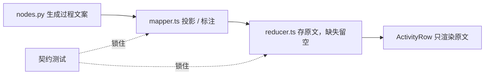

# 收敛工具过程文案到单一真相源，移除前端自撰陈述

## 元数据

| 字段 | 内容 |
|---|---|
| 日期 | 2026-08-02 |
| Issue | https://github.com/LuzernRR/agent-workbench/issues/24 |
| 状态 | accepted |
| 目标环境 | local |

## 问题与目标

### 问题

`AGENTS.md:50` 规定：公开过程文案来自版本化 LangGraph Agent 输出，前端只能标注与分组，不得发明
推理文案。全仓核验后发现三处违反：

1. `ActivityRow.tsx` 的 `summarizeSearchActivity` 用**前端去重后的来源数**重算
   「找到 N 条结果，读取 M 个来源」。同一次调用后端已在 `nodes.py:1639` 给出原文
   （`f"找到 {len(result.results)} 条结果，读取 {len(result.evidence)} 个来源"`），前端重算值在
   URL 去重生效时与后端不一致，等于前端自撰了一个可核验数字。
2. `isPlaceholderTool` / `commandTool` 分支按工具名正则为终端类工具发明「运行了多个命令」
   「正在运行命令」「命令未能完成」「命令执行失败」等过程陈述，完全不来自任何事件。
3. `reducer.ts` 的 `tool.started` 兜底为 `summary` 填「正在准备」，`run.completed` 兜底自撰
   「回答已通过证据核验」「本次回答未完全核验，请结合引用来源审阅」。

### 目标

让工具过程文案与核验结论只有一个真相源——后端事件——并用契约测试把这个不变量锁住。

### 范围

`apps/web/src/components/workbench/activity-row/ActivityRow.tsx`、
`apps/web/src/lib/agent-events/reducer.ts` 及对应测试；新增 mock 脚本契约测试。

### 非目标

不改后端事件契约与 Prompt 语义；不改 `mapper.ts` 的投影逻辑；不动 v2 契约对齐（另开 Issue）；
不恢复小红书登录。

### 明确不属于本 Issue（已取证排除）

- **`mapper.ts:375-379` 的三条终态文案是自洽的，不是缺陷。** `nodes.py:2750` 有
  `response_status = "completed" if reason in {"VERIFIED", "DIRECT_COMPLETED"} else "partial"`，
  `nodes.py:2524` 的 DIRECT_COMPLETED 分支设 `"verification_passed": False`；三条文案与
  `(partial, verificationPassed)` 的三种真实组合一一对应，且由 BFF 统一投影（属于允许的“标注”）。
  先前把这条列为违规不成立。
- **reducer 旧兜底是不可达死默认。** `mapper.ts:142` 与 `mock/engine.ts:41-46` 证明两条生产路径都
  始终填 `name`+`summary`。修正它是消除潜在风险：一旦上游哪天漏填，旧代码会静默替 Agent 断言核验
  结论。

### 验收条件

见下方“验证证据”表，逐项对应 Issue #24 的 A1–A3、B1–B4、C1–C3、D1–D5。

## 修改前证据

`git grep` 确认改动前 `apps/web/src` 存在 `summarizeSearchActivity`、`isPlaceholderTool`、
`uniqueSourceCount` 三个前端自撰函数，以及「运行了多个命令」「命令未能完成」「正在准备」等字面量。

## 根因

枚举标签与过程陈述被混在同一层。`channelName`、`nextActionLabel`、`evidenceStatusLabel` 把稳定枚举
翻译成中文，是允许的标注；但同一批代码里还夹着**重算数字**和**按工具名猜测行为**两类自撰内容。缺少
契约测试，导致“后端永远会给文案”这个事实只存在于当前实现里，没有被断言保护。

## 方案与取舍

结算行改为**只渲染后端 `settlementSummary` 原文，缺原文即整行不渲染**，而不是回落到前端重算值——
宁可少显示一行，也不显示一个可能与后端不一致的数字。主文案取 `summary || name`：`name` 是后端给的
渠道名，属枚举标注，可安全回落。

reducer 兜底改为留空（`stringValue(payload.summary)`）而非删除字段，保持 `ToolItem` 形状不变；
消费方已有 `summary || name` 回落，所以留空是安全的。`run.completed` 缺 `summary` 时不生成状态项，
因为“是否经过证据核验”是只有 Agent 能作的判断。

## 逐文件修改

| 文件 | 修改 | 原因 |
|---|---|---|
| `ActivityRow.tsx` | 删除 `isPlaceholderTool`/`uniqueSourceCount`/`summarizeSearchActivity`；结算行改用 `settlementSummary` 原文并过滤空值；`summary = item.summary \|\| item.name`；错误 Detail 去掉 `commandTool` 分支 | 移除全部前端自撰陈述 |
| `reducer.ts` | `tool.started` 的 `summary` 兜底改为留空；`run.completed` 缺 `summary` 时不生成状态项 | 消除不可达断言兜底 |
| `ActivityRow.test.ts` | 新增 `describe("ActivityRow 过程文案单一真相源")` 4 个用例；迁移受影响 fixture | A1/A2/B1/B2 |
| `reducer.test.ts` | 新增“上游漏填过程文案时留空而不发明陈述” | C1/C2 |
| `mapper.test.ts` | 新增 `tool.started`/`run.completed` 始终自带非空文案的契约测试 | C3 |
| `server/mock/scripts.test.ts` | 新增：mock 两条分支每个工具步骤都有非空 `name`/`summary` | C3 |

## 完整执行链路

后端 `nodes.py` 生成结算原文 → `mapper.ts` 投影为 `settlementSummary` 并补渠道枚举标签 →
`reducer.ts` 原样存入 `ToolItem`，上游漏填时留空 → `ActivityRow`/`SearchActivitySummary` 只渲染
原文，主文案回落到渠道名。任一环节都不再产生新的过程陈述。

## 异常、取消与恢复

上游漏填 `summary` 时：工具行显示渠道名，结算行不出现，运行终态与账本不受影响。`run.completed`
缺 `summary` 时不生成核验状态行，回答本体与引用照常渲染。

## 数据与安全

不涉及密钥、Cookie 或 Prompt。`toolCallId` 账本完整性未变：聚合仍只发生在会话视图，
`data-tool-call-ids` 仍逐个列出真实 `toolCallId`。

## 验证证据

| 验收项 | 证据 | 结果 |
|---|---|---|
| A1 结算数字用后端原文 | 用例给 `settlementSummary: "找到 10 条结果，读取 2 个来源"` 但只有 1 条去重后来源，断言后端原文在、`"读取 1 个来源"` 不在 | 通过 |
| A2 不重复渲染结算数字 | 匹配 `/找到 \d+ 条结果，读取 \d+ 个来源/u` 的叶节点恰为 1 | 通过 |
| A3 缺原文不渲染结算行 | `items.filter(... && item.settlementSummary)` + reducer 用例 | 通过 |
| B1 无命令类自撰文案 | 工具名 `命令执行器` 不产生 `运行了多个命令\|命令执行失败\|正在运行命令\|命令未能完成` | 通过 |
| B2 主文案等于后端 `summary` | 断言按钮 `title` 等于 `summary`，`summary` 为空时回落 `name` | 通过 |
| B3 自撰函数已删除 | `git grep summarizeSearchActivity\|isPlaceholderTool\|uniqueSourceCount` = 0 | 通过 |
| B4 字面量仅存于负向断言 | 4 个命令类字面量各 1 处，全在 `ActivityRow.test.ts:95` 的 `not.toHaveTextContent` | 通过 |
| C1 `tool.started` 兜底留空 | `state.items["tool:search-blank"]` 为 `{ name: "网页搜索", summary: "" }` | 通过 |
| C2 `run.completed` 缺文案不断言 | `status:event-4` 为 `undefined`；序列化状态不含三条自撰文案 | 通过 |
| C3 契约测试锁住上游 | `mapper.test.ts` 覆盖 3 渠道 + `unknown_tool` + 3 种终态；`scripts.test.ts` 覆盖 mock 2 分支 | 通过 |
| D1 Web 单测 | `394 passed, 1 skipped` | 通过 |
| D2 typecheck / lint / build | 0 error / clean / 成功 | 通过 |
| D3 Playwright | `16 passed, 3 skipped`（3 条 live 用例需真实 Provider） | 通过 |
| D4 Search Agent 回归 | `378 passed`；Ruff 0；compileall 0 | 通过 |
| D5 diff check | `git diff --check` = 0 | 通过 |

`packages/contracts/python` 当前 venv 缺 `jsonschema` 无法收集，属预存环境问题；本轮未改动该目录。

## 回滚

改动集中在 2 个生产文件与 4 个测试文件，全部为删除自撰逻辑或收紧兜底。回滚即还原这 6 处 diff，
行为回到“前端重算数字 + 自撰兜底”的旧态。

## 未解决问题

`ActivityRow.test.ts` 内新增块使用局部 `afterEach(cleanup)`——该文件未配置全局清理，其余块依赖
渲染残留，本轮不扩大范围统一处理。

## 用户验收

- 状态：已验收（2026-08-02）
- 验收反馈：通过
- 下一功能执行门：放行
