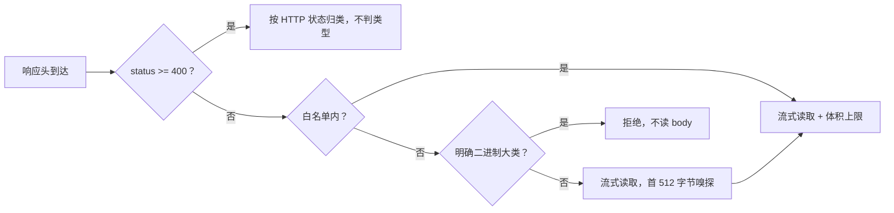

# 修复被误标 Content-Type 的网页无法读取正文，导致证据为空

## 元数据

| 字段 | 内容 |
|---|---|
| 日期 | 2026-08-03 |
| Issue | https://github.com/LuzernRR/agent-workbench/issues/25 |
| 状态 | awaiting-acceptance |
| 目标环境 | local |

## 问题与目标

### 问题

`fetch_page.py` 的响应类型门禁把两类**本可读取的 HTML 页面**判为非法，`fetch_pages` 返回
`ok=False`，`channels/web.py:65` 因 `not page.ok` 跳过该页，于是该轮 `evidence_count=0`。

证据为空会触发一条完整的放大链路：Reflector 无证据判 `insufficient` → 再规划一轮 → 触顶
`MAX_ITERATIONS` → 终态 partial、0 引用。实测单次 run 38-73s，而其中 67% 时间花在工具调用上。
换句话说，这是一个**正确性缺陷伪装成的性能问题**：延迟是重试的结果，不是原因。

两类误判：

1. **逗号合并的 Content-Type。** RFC 9110 把 `Content-Type` 定义为 singleton field，但 §5.2 允许
   把重复的字段行按逗号合并，部分 CDN（Cloudflare Workers 等）确实会发出
   `text/html, text/html`。旧代码 `.split(";", 1)[0]` 得到 `text/html, text/html`，不在白名单。
2. **被误标为 `application/octet-stream` 的 HTML。** 该值是「服务器没主动标注」的默认值，实测
   `m.tthuangli.com` 用它返回真正的 HTML。旧代码按声明类型一刀切拒绝。

### 目标

让误标类型的 HTML 能正常读取正文，同时不放过真正的二进制下载，且不削弱既有体积上限与
SSRF / robots 门禁。

### 范围

`services/search-agent/app/tools/fetch_page.py`、`tests/test_fetch_page_pinning.py`。

### 非目标

不改 403 / 反爬站点的抓取能力；不引入动态浏览器抓取（`allow_dynamic` 仍默认 False）；不改
`maxPagesPerCall` 或任何 tracked 共享配置；不改 Evidence / Candidate 语义——仍只有成功读取正文的
页面才成为 Evidence。

### 验收条件

见下方「验证证据」表，逐项对应 Issue #25 的 A1-A8。

## 修改前证据

标准库直连 `https://m.tthuangli.com/` 返回 `Content-Type: application/octet-stream`；旧路径报
`不支持的响应类型：application/octet-stream`，`FetchResult.ok=False`、`error_category` 非空，
该候选不进入证据集。

## 根因

类型门禁把「声明的类型」当成了「实际的类型」，且解析方式不符合 RFC 9110 §5.2 的合并规则。真实
Web 上这两个假设都不成立：CDN 会合并字段行，站点会漏标或错标 MIME。门禁本身是必要的（防止把
PDF/图片/压缩包喂给 trafilatura 和模型上下文），问题在于它只有「按声明拒绝」一档，没有「声明不
可信时看实际内容」这一档。

## 方案与取舍

分三层判定，顺序本身就是安全前提：

1. **明确的二进制大类直接拒绝，且不读 body。** `application/pdf`、`application/zip`、`image/*`
   等列入 `_NEVER_SNIFF_CONTENT_TYPES` / `_NEVER_SNIFF_PREFIXES`，连首字节都不取。
2. **白名单内的文本类型照旧接受。**
3. **其余（含 `application/octet-stream`）给一次首字节嗅探机会。** 只看首批 `_SNIFF_BYTES=512`
   字节是否以 `<!doctype html` / `<html` 开头。

关键取舍：**嗅探必须在流式读取中做，不能用 `await response.aread()`。** 我最初的实现用了
`aread()`，那会在体积上限生效之前把整页读进内存——等于为了判类型引入一条无界内存路径，恰好
作用在最可疑的那批响应上。现在改为边流式读边判：累积到 512 字节时判一次，正文短于窗口则在流
结束后补判，`MAX_RESPONSE_BYTES` 全程有效。既有测试
`test_declared_oversized_response_is_rejected_before_buffering` 正是锁这条不变量的。

另一处取舍：**状态码 >= 400 不做类型门禁。** 这类响应由 `_fetch_static` 按 HTTP 状态归为
`not_found` / `provider_unavailable`；在此处判类型只会用「不支持的响应类型」掩盖真实失败原因，
排查时反而更难。

嗅探标记刻意保守，只认 `<!doctype html` 和 `<html`，不认 `<?xml`、不认裸 `<`。宁可漏放几个边缘
页面，也不把二进制流当网页交给 trafilatura。

## 配置

不新增、不修改任何配置项。`_SNIFF_BYTES = 512` 为模块内常量。

## 逐文件修改

| 文件 | 修改 | 原因 |
|---|---|---|
| `app/tools/fetch_page.py` | 新增 `_declared_content_type()`：按 RFC 9110 §5.2 取逗号合并后的第一个成员 | A1 |
| `app/tools/fetch_page.py` | 新增 `_read_allowed_body()`：把类型门禁 + 体积上限 + 流式读取从 `_pinned_get` 内联块抽出，`_pinned_get` 只留一行调用 | 让读取顺序（拒绝 → Content-Length → 流式读+嗅探）可被单独测试 |
| `app/tools/fetch_page.py` | 新增 `_looks_like_html()` 与 `_SNIFF_BYTES`、`_NEVER_SNIFF_CONTENT_TYPES`、`_NEVER_SNIFF_PREFIXES` | A2/A3/A5 |
| `tests/test_fetch_page_pinning.py` | 新增 `_StreamedResponse` 替身与 6 个用例 | A1-A7 |

`fetch_pages` 在本轮中途曾被改为 `asyncio.wait` 早退（`success_target` 参数），已还原为原本的
`asyncio.gather`：全仓 grep 确认没有任何调用方传 `success_target`，`target` 恒等于 `len(urls)`，
行为与 `gather` 完全一致——那是一段没有调用方的推测性代码。真正需要早退时，应连同过量提供候选的
调用方一起改（属阶段 4 范围），而不是先埋一个无人使用的参数。

## 完整执行链路

`web.py` 选出候选 → `fetch_pages` 并发调用 `fetch_page` → `_fetch_static` → `_pinned_get` 固定
IP 发起流式请求 → `_read_allowed_body` 按三层判定读取正文 → trafilatura 抽正文 →
`FetchResult.ok=True` → `web.py:65` 通过 → 该页成为 Evidence 并可被引用。

## 异常、取消与恢复

嗅探失败与旧行为一致，抛 `ResponsePolicyError`，经 `_fetch_static` 归为 `output_invalid`，该候选
仍按 Candidate（`verified=False`）出现在结果里，不影响其他候选。超上限、Content-Length 非法、
robots 拒绝、重定向超限的处理路径均未改动。

## 数据与安全

不涉及密钥、Cookie 或 Prompt。SSRF 门禁（`resolve_fetchable` 固定 IP + 保留 Host/SNI）与 robots
门禁未改动，逐跳重定向校验保持原样。体积上限的生效时机由本轮显式加强：嗅探不再有绕过
`MAX_RESPONSE_BYTES` 的可能。Evidence / Candidate 不变量未改：仍只有成功读到正文的页面才成为
Evidence。

## 验证证据

| 验收项 | 证据 | 结果 |
|---|---|---|
| A1 逗号合并类型可读 | `test_comma_joined_content_type_takes_first_member` | 通过 |
| A2 误标 HTML 被接受 | `test_mislabeled_octet_stream_html_is_accepted_by_sniffing` | 通过 |
| A3 误标非 HTML 仍拒绝 | `test_non_html_mislabeled_body_is_rejected` | 通过 |
| A4 短页面流末补判 | `test_short_mislabeled_page_is_sniffed_at_stream_end` | 通过 |
| A5 二进制类型不读 body | `test_never_sniff_types_are_rejected_without_reading_body` 断言 `response.consumed == []` | 通过 |
| A6 错误响应不判类型 | `test_error_responses_are_not_type_gated`（404 + octet-stream 正常返回 body） | 通过 |
| A7 嗅探不缓冲整页 | 嗅探在 `aiter_bytes()` 循环内累积判定，无 `aread()`；既有 `test_declared_oversized_response_is_rejected_before_buffering` 仍通过 | 通过 |
| A8 门禁 | `pytest -q` = `384 passed`（改前 378，本轮 +6）；`ruff check .` = All checks passed；`compileall` = 0；`git diff --check` = 0 | 通过 |
| 真实站点复验 | `fetch_page("https://m.tthuangli.com/")` = `ok=True status=200 error_category=None`（改前 `不支持的响应类型：application/octet-stream`） | 通过 |

`packages/contracts/python` 因当前 venv 缺 `jsonschema` 无法收集，属预存环境问题；本轮未改动
该目录。

## 回滚

改动集中在 1 个生产文件的 3 个新函数与 1 处调用点替换，加 1 个测试文件的新增块。回滚即还原这两
个文件的 diff，行为回到「按声明类型一刀切拒绝」。

## 未解决问题

- **403 / 反爬站点仍抓不到。** `www.timeanddate.com/worldclock/china/beijing` 复验为
  `HTTP 403`，与 Content-Type 无关，本 Issue 不声称修复。日期类查询命中的站点普遍强动态或反爬，
  `maxPagesPerCall: 3` 且 `allow_dynamic=False` 时可尝试次数有限，属另一类问题。
- **`web_search.py:383-385` 的 `auth_required` 未设上限。** 凭证类失败 `continue` 时不累加
  `provider_failures`，401 会走遍整个 Key 池，而 `provider_unavailable` 有 `_TAVILY_PROVIDER_FAILURE_KEY_LIMIT`
  兜底。已知缺陷，另开 Issue，不并入本轮。
- **前端耗时显示空窗。** `reducer.ts:338` 用服务端首个事件的 `createdAt` 作为 `startedAt`，首事件
  到达前 `runTimings[runId]` 为 undefined，`Conversation.tsx:299` 渲染 null。另开 Issue。
- **`nodes.py:394` `_freshness_required()` 关键词正则**覆盖 Supervisor 语义，与
  `prompts/agents.py:23` 相悖。按用户要求，待阶段 1 的 `evidence_depth` 分层上线并验证稳定后单独
  开 Issue 移除，不与性能改造混在一起。

## 用户验收

- 状态：accepted
- 验收反馈：用户 2026-08-03 明确一并验收（在 #28 收口时确认）
- 收口提交：`181db68`，已推送 `main`，Issue #25 以 completed 关闭
- 下一功能执行门：放行
