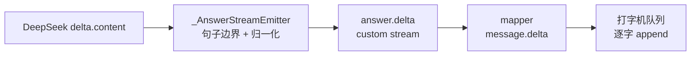

# Writer 走纯 content 流式，回答正文逐块可见

## 元数据

| 字段 | 内容 |
|---|---|
| 日期 | 2026-08-03 |
| Issue | https://github.com/LuzernRR/agent-workbench/issues/29 |
| 状态 | accepted |
| 目标环境 | local |

## 问题与目标

### 问题

Writer 此前走 `invoke_structured`（strict function calling + `ComposeResult`）。结构化输出要求模型
先产出完整且合法的 JSON，服务端才能解析出 `answer` 字段，因此正文只能在 compose 节点**整体完成后**
一次性交付。用户看到的是长时间空白，然后整段答案突然出现——首字时间（TTFT）等于整个 Writer 的生成
时间，是全链路最长的一段可见空窗。

用户给出的方向纠正（原话）：

> 我的意思是，前端是流式输出，后端是 asyncio 做异步，pydantic 做结构化校验，结构化输出是对于 agent
> 调用工具而言的，还要使用类型注解，确保整体的性能和可靠度高。

这条纠正解开了一个业界公认的冲突：结构化输出与 token 流式在同一次调用上不可兼得
（[LangGraph streaming 文档](https://docs.langchain.com/oss/python/langgraph/streaming)、
[langgraphjs#267](https://github.com/langchain-ai/langgraphjs/issues/267)、
[langchain#34767](https://github.com/langchain-ai/langchain/issues/34767)）。常见解法是增量解析
半成品 JSON，既脆弱又依赖字段输出顺序。而按用户的划分，这个冲突根本不该存在：**结构化输出服务于
Agent 的工具调用与内部决策，Writer 产出的是面向用户的自然语言，不承载任何工具调用语义**，因此它
本就不该套 schema。

### 目标

Writer 改为纯 content 流式：`delta.content` 本身就是可直接显示的文本，逐块经 LangGraph custom
stream → BFF → 前端打字机呈现，无需增量解析 JSON。

### 范围

- 后端：新增 `stream_writer_answer` 与 `WriterStreamError`；compose 节点改用流式；删除
  `ComposeResult`；新增 `_AnswerStreamEmitter` 保证公开文本 append-only。
- 事件契约：新增 `answer.started` / `answer.delta` / `answer.completed` 三个内部事件。
- BFF：mapper 把 `answer.*` 投影为 `message.*`；engine 加双重追加防护。
- 前端：打字机队列按积压提速。

### 非目标

- **不改其它角色的结构化输出。** Supervisor / Planner / Reflector / Verifier / Source Curator 仍走
  strict function calling，`PRODUCTION_STRUCTURED_SCHEMAS` 保留这 5 个 schema。
- **不写死模板。** 公开正文仍全部来自 Writer 真实输出，前端不自造任何过程文案。
- **不改 Verifier 硬门禁。**「missingChannels 非空必须 research_more」不变。
- 不做阶段 3–5 的性能改造（researcher 降 effort、`asyncio.as_completed`、prompt-caching 等）。

### 验收条件

见 Issue #29 的 A1–A11。

## 根因

链路的可见空窗不是前端渲染慢，而是**协议层强制的批量交付**：strict function calling 要求 JSON 完整
才能解析，`answer` 字段在最后一个 token 落地前不存在。只要 Writer 还挂着 schema，任何前端优化都无法
把 TTFT 降到 Writer 生成时间以下。

## 方案与取舍

### 1. `stream_writer_answer`：先若干 `str`，最后一个 `ModelUsage`

异步生成器，`stream=True` + `stream_options={"include_usage": True}`。以 `ModelUsage` 作为终结项，
调用方据此拼接正文并累加真实用量，用量口径与其它角色保持一致。全程未产出任何正文则抛
`WriterStreamError`（携带 usage），compose 据此返回 `stop_reason=OUTPUT_INVALID` 而非补一段模板答案。

### 2. `_AnswerStreamEmitter`：公开文本必须是终稿的前缀（本轮的关键设计）

前端 reducer 的已可见消息**不可回写**，因此公开出去的每个字都必须最终出现在交付 answer 里。终稿要经
`_compact_answer_markdown`（按句子边界截断到 `delivery_limit`）与 `_clean_answer_prefix`（删悬空标题、
空列表标记、未闭合代码块），且 finalize 会用 `_answer_citations` 把稀疏的 `[来源N]` 归一为连续编号。
三处都可能让「已公开的文本」与终稿产生差异，emitter 用三条规则各自封死：

1. **只在完整句子边界放行。** `_compact_answer_markdown` 超限时取的是上限内**最大**的那个边界，因此
   任何不超过上限的边界都必然被终稿包含；逐字符放行则可能越过截断点，留下收不回的尾巴。
2. **只放行 `_clean_answer_prefix` 不会再删的文本。** 候选文本若会被清理函数改写就压着不发，等后续
   正文让它不再悬空。这条是复核 `_compact_answer_markdown` 时自查发现的缺口——例如末尾停在
   `### 1. 短标题` 时，终稿会删掉这个悬空标题，但它已经公开就收不回了。
3. **公开文本按首次出现顺序增量归一 `[来源N]`。** finalize 的归一化是一次正文中段替换；emitter 用
   同一套「首次出现顺序、按 URL 去重」规则增量完成同一映射。State 仍保留模型原始编号，归一化全程
   只发生一次，两条路径必然收敛到同一文本。

公开文本还从不以空白结尾（尾部空白留在 tail 里等下一段正文），因为终稿在边界处会 `rstrip`。

### 3. `composeRound` 与独立 `messageId`

Verifier 判 rewrite 时 Writer 会重写一整段答案，不能续写在已可见消息上。compose 计算
`compose_round = repair_count + (1 if repairing else 0)`，mapper 的 `answerMessageId()` 据此在第 2 轮
起追加 `_r{N}` 后缀，前端因而渲染成一条新消息而非在旧答案后拼接。

### 4. BFF 双重追加防护

engine 记录 `streamedMessageId`（始终指向最后一轮）。finalize 时若正文已流式送达，completion 只补一条
携带 citations 的 `message.completed`；否则走原有的 started/delta/completed 三件套。少了这个分支，
前端会把整段正文追加第二遍。

### 5. 打字机按积压提速

真实流式的到达速率持续高于每帧一个字，固定速度会让队列无界积压。改为按积压量提速
（`GRAPHEMES_PER_FRAME=1`、`MAX_GRAPHEMES_PER_FRAME=24`、`BACKLOG_PER_EXTRA_GRAPHEME=12`），
backlog 有界，同时保持逐字 append、顺序不变、绝不回写。

## 配置

无新增配置项。`PROMPT_VERSION` 升至 `2026-08-03.v42-writer-content-streaming`。

## 逐文件修改

| 文件 | 修改 | 原因 |
|---|---|---|
| `app/llm/deepseek.py` | 新增 `WriterStreamError` 与 `stream_writer_answer` | Writer 走纯 content 流式 |
| `app/graph/schemas.py` | 删除 `ComposeResult` | Writer 不再有 schema |
| `app/graph/nodes.py` | 新增 `_AnswerStreamEmitter`；compose 改流式并发 `answer.*` | 逐块公开且保证 append-only |
| `app/prompts/agents.py` | 升 `PROMPT_VERSION` | 协议变更需可追溯 |
| `apps/web/src/server/search-agent/events.ts` | 新增 3 个 `answer.*` Zod schema | 运行时边界校验 |
| `apps/web/src/server/search-agent/mapper.ts` | 新增 `answerMessageId()` 与 3 个投影分支 | `answer.*` → `message.*` |
| `apps/web/src/server/live/engine.ts` | `streamedMessageId` 防护 | 避免整段正文二次追加 |
| `apps/web/src/lib/agent-events/typewriter-queue.ts` | 按积压提速 | backlog 有界，打字机不落后 |
| 5 个测试文件 | 新增 18 个用例 | 见验证证据 |

## 完整执行链路

DeepSeek `delta.content` → `stream_writer_answer` 逐块 yield → `_AnswerStreamEmitter.push()` 判定可
公开片段 → `answer.started/delta` 经 `get_stream_writer()` 走 custom stream → BFF `mapper` 投影为
`message.started/delta` → `persistLiveEvent` 落库并推送 → 前端打字机逐字 append。Writer 结束后
compose 用完整原文算终稿 answer 写入 State，`answer.completed` 收口；finalize 只补 citations。

## 异常、取消与恢复

- 流式全程无正文 → `WriterStreamError` → compose 返回 `stop_reason=OUTPUT_INVALID`、`answer=None`，
  且**不发任何 `answer.*` 事件**，前端不会留下半截空消息。
- 流式中途抛错 → 记 error span 后向上抛，由既有 run 失败路径处理。
- compose 之外（无 graph run 上下文）调用时 `_event_writer()` 返回 no-op，不影响单测与直接调用。
- 断线重连：`answer.*` 已落库为 `message.*`，恢复走既有事件重放，无新增路径。

## 数据与安全

- `answer.*` 事件只含 `composeRound` 与 `delta`，无 `reasoning_content`、无 `tool_calls`、无原始模型
  响应；`runtime_event` 的禁止字段校验对其同样生效，并有专门用例做字段白名单断言。
- API Key 仍只在 `config/*.local.json`，未新增任何 `NEXT_PUBLIC_` 暴露。
- 公开正文全部来自 Writer 真实输出，前端未新增任何自造文案。

## 验证证据

| 验收项 | 证据 | 结果 |
|---|---|---|
| A1 逐块可见 | `test_writer_streams_answer_deltas_before_the_run_terminates` | 通过 |
| A2 append-only 前缀 | `test_streamed_answer_text_is_always_a_prefix_of_the_delivered_answer` | 通过 |
| A3 引用归一一致 | `test_streamed_answer_normalizes_sparse_citations_exactly_like_finalize` | 通过 |
| A4 事件无私有字段 | `test_answer_stream_events_carry_no_private_or_raw_model_fields` | 通过 |
| A6 失败不留半截 | `test_failed_writer_stream_emits_no_partial_answer_events` | 通过 |
| A7 改写换新消息 | `test_rewrite_round_starts_a_new_answer_stream_instead_of_appending` | 通过 |
| A8 BFF 不二次追加 | `正文已逐块流式送达后，结算只补 citations，不再整段重发` | 通过 |
| A9 结构化仅限工具调用 | `test_strict_schema_compatibility.py` 保留 5 个非撰写 schema | 通过 |
| A10 mock 链路不变 | `npm run test:e2e`：16 passed / 3 skipped（skipped 为需真实 provider 的 live spec，与基线一致） | 通过 |
| 全量后端 | `pytest -q`：399 passed | 通过 |
| 全量前端 | `npx vitest run`：398 passed / 1 skipped | 通过 |
| 静态检查 | `ruff check .` 全通过；`npx tsc --noEmit` 干净 | 通过 |
| 文本规范 | 16 个改动文件均为 UTF-8、纯 LF、无 BOM；`git diff --check` 无告警 | 通过 |
| A5 真实链路 TTFT 下降 | 新链路 `firstVisible` 来自 `answer.delta`；旧链路 `deltas=0`、`firstVisible=40453ms(run.completed)` | 通过（收益有限，见下） |
| A11 真实 provider 观测 | 本地 8101 实跑，`promptVersion=2026-08-03.v42-writer-content-streaming`；`isPrefix=True`、`streamedEqualsFinal=True`、`fieldViolations=0` | 通过 |

### A5 的实测收益与口径

新旧对照在真实 provider 上完成：本地未提交代码跑 `127.0.0.1:8101`，对照容器跑已提交代码的
`127.0.0.1:8080`（同一份 live Postgres，Milvus 降级，仅影响长期证据召回，不在 Writer 流式路径上）。

| 问题 | totalMs | firstVisibleMs | 来源事件 | deltas | 前缀性质 |
|---|---|---|---|---|---|
| 今天是几号（新） | 34107 | 32438 | `answer.delta` | 2 | `isPrefix=True`、`streamedEqualsFinal=True` |
| 今天是几号（新，另一次） | 50177 | 45092 | `answer.delta` | — | 同上 |
| 你是谁（新，不搜索） | 3538 | 3232 | `answer.delta` | 3 | 同上 |
| 今天是几号（旧容器） | 40455 | 40453 | `run.completed` | 0 | 不适用 |

正文确实从「整段突现」变成了「逐块可见」，但 `firstVisible/total` 仍是 95% / 90% / 91%：34s 的运行里
流式窗口只有约 1.7s。**空窗的 90–95% 属于 Writer 之前的 research → reflect → replan 链路，不是 Writer
本身。** Writer 流式是降低体感等待的必要前提，但要真正见效必须缩短前置链路，这属于后续 Issue。

## 回滚

`git revert` 本次提交即可。事件契约是新增而非修改，回滚后旧前端不会收到 `answer.*`，engine 自动走
legacy 分支（started/delta/completed 三件套），无数据迁移。

## 未解决问题

- **单事实快路径在真实链路上未生效**：三次实测 `fastPath=False`，包括跑旧提交代码的容器，因此不是
  本轮回归。「今天是几号」的 nodeOrder 出现两轮 `plan_research → … → reflect`，从未走
  `plan_fast_search`；一次以 `stopReason=MODEL_CALL_LIMIT`、`responseStatus=partial` 结束。根因是
  `_fast_search_request()` 返回 None（Supervisor 未判 `evidence_depth="single_fact"` 或 `fast_search`
  不合法），属 #28 的语义判定缺口，单独立 Issue 并先做成熟产品的设计调研。
- `_freshness_required()` 的关键词正则仍覆盖 Supervisor 语义判定（Item I），按约定等 evidence_depth
  稳定后单独开 Issue 移除。
- `packages/contracts/python` 的 pytest 收集因缺 `jsonschema` 失败，先前既有，不在本轮范围。

## 用户验收

- 状态：已验收（用户 2026-08-03：「你自己测试一下，然后没问题就可以验收」，自测全绿后收口）
- 验收反馈：正文逐块可见符合预期；同时确认「思考搜索链路太长」为独立问题，单独立 Issue 处理。
- 下一功能执行门：放行（阶段 3 按序排队，一 Issue 一 feature）
