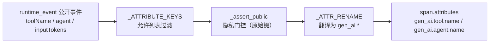

# OTel GenAI 语义约定属性名对齐

## 元数据

| 字段 | 内容 |
|---|---|
| 日期 | 2026-08-03 |
| Issue | https://github.com/LuzernRR/agent-workbench/issues/35 |
| 状态 | awaiting-acceptance |
| 目标环境 | local |

## 问题与目标

### 问题

`observability/trace.py` 派生的 span 属性全部使用项目自定义的 camelCase 命名：`modelId`、
`inputTokens`、`outputTokens`、`toolName`、`toolCallId`、`agent`。这些名字任何 OTel 后端都不认识。
接 Langfuse / Phoenix / Jaeger 的 GenAI 视图时，每个后端都要单独写一层属性映射规则，而且规则互不
通用——本质上是把一套私有 schema 的翻译成本转嫁给每一个下游消费者。

同时 span 上完全没有 `gen_ai.operation.name` 与 `gen_ai.system`。缺前者，后端无法区分一个 span 是
模型调用、工具执行还是 agent 编排；缺后者，无法按 Provider 做成本与延迟分组。

### 目标

把 span **输出层**的属性名迁移到 OTel GenAI 语义约定的 `gen_ai.*` 命名空间，并补齐
`gen_ai.operation.name` / `gen_ai.system` 两个分类维度，使 trace 可被任意兼容该约定的后端直接解读。

### 范围

- `app/observability/trace.py`：属性重命名映射、operation.name 注入、`gen_ai_system()` 判定函数
- `app/llm/deepseek.py`：把 `system` 传给 `record_model_call`，含配置不可读时的降级
- 对应测试的断言迁移与新增专项测试

### 非目标

- **不改事件协议**。`runtime_event` 的字段名、NDJSON 事件流、BFF 投影、前端 reducer 一律不动。
- 不引入 opentelemetry SDK 依赖。本项目的 sink 是自研 NDJSON / LangSmith，只需属性名对齐约定即可。
- 不覆盖约定中仍处于 experimental 的属性（如 `gen_ai.request.temperature`、
  `gen_ai.response.finish_reasons`）。本轮只对齐已稳定的核心项。

### 验收条件

1. model span 携带 `gen_ai.request.model` / `gen_ai.usage.input_tokens` /
   `gen_ai.usage.output_tokens` / `gen_ai.operation.name=chat` / `gen_ai.system`
2. tool span 携带 `gen_ai.tool.name` / `gen_ai.tool.call.id` / `gen_ai.operation.name=execute_tool`
3. node span 携带 `gen_ai.agent.name` / `gen_ai.operation.name=invoke_agent`
4. 旧的自定义名不再出现在任何 span 上（反向断言）
5. `gen_ai.system` 由 base_url 判定，未收录 Provider 记 `_OTHER`，仿冒域不命中
6. 事件协议字段名零改动；全量测试 + ruff + compileall 通过

## 修改前证据

`trace.py` 的 `_ATTRIBUTE_KEYS` 允许列表与 `_MODEL_ATTRIBUTE_KEYS` 直接被用作 span 属性名，允许列表
过滤后原样写入 `span.attributes`：

```python
def _attributes(event: dict[str, Any]) -> dict[str, Any]:
    selected = {k: v for k, v in event.items() if k in _ATTRIBUTE_KEYS and v is not None}
    _assert_public(selected, "span.attributes")
    return selected          # ← 事件字段名直接成为 span 属性名
```

`RunTracer.record_model_call()` 同样把 `{"role": role, "modelId": model_id, **attributes}` 过滤后
直接落盘。`grep gen_ai` 在改动前的 `app/` 下命中数为 0。

## 根因

不是缺陷，是**设计时点的选择**：span 属性名当初直接复用了事件字段名，因为二者当时是同一批消费者
（本地 NDJSON + 自己看）。接入标准后端才暴露成本——事件协议服务于本项目的 BFF/前端契约，span 属性
服务于 OTel 生态，两者的命名权威不同源，不该共用一套名字。

## 方案与取舍

核心决定：**在输出层加一次翻译，而不是改事件字段名**。



三个取舍点：

**其一，翻译放在 `_assert_public` 之后。** 隐私门控仍对原始键做复核，允许列表语义完全没动。若先重命名
再门控，等于要求隐私规则同时认识两套键名，规则本身会变脆。

**其二，`run` span 不设 `gen_ai.operation.name`。** `run` 是本项目的编排根，不对应约定枚举中的任何
GenAI 操作类型。硬塞一个近似值（比如 `invoke_agent`）会让后端把编排根和真正的 agent 节点混为一类，
比留空更糟。已加测试锁定这个"缺失"是有意的。

**其三，`gen_ai.system` 从 base_url 判定，而不是硬编码 `"deepseek"`。** Provider 由
`config/*.local.json` 决定且可换；硬编码会在换 Provider 后静默说谎。判定收在纯函数
`gen_ai_system(base_url)` 里，后缀必须落在域名边界上——`api.deepseek.com.evil.example` 与
`notdeepseek.com` 都命中 `_OTHER`，不会被仿冒域骗过去。

映射表：

| 事件字段名 | span 属性名 |
|---|---|
| `modelId` | `gen_ai.request.model` |
| `inputTokens` | `gen_ai.usage.input_tokens` |
| `outputTokens` | `gen_ai.usage.output_tokens` |
| `toolName` | `gen_ai.tool.name` |
| `toolCallId` | `gen_ai.tool.call.id` |
| `agent` | `gen_ai.agent.name` |

span kind → `gen_ai.operation.name`：`model→chat`、`tool→execute_tool`、`node→invoke_agent`、
`run→（不设）`。

## 配置

无新增配置项。`gen_ai.system` 复用既有 `runtime_config().base_url`，不读取也不打印 `api_key`。

## 逐文件修改

| 文件 | 修改 | 原因 |
|---|---|---|
| `app/observability/trace.py` | 新增 `_ATTR_RENAME`、`_OPERATION_BY_KIND`、`_KNOWN_GEN_AI_SYSTEMS`、`OTHER_GEN_AI_SYSTEM`、`gen_ai_system()`；`_attributes()` 加翻译层；`_new_span()` 按 kind 注入 operation.name；`record_model_call` 增 `system` 参数 | 属性名对齐约定的落点 |
| `app/llm/deepseek.py` | 新增 `_gen_ai_system()` fail-safe helper；`_record_model_span()` 传 `system=` | 提供 Provider 维度，且观测失败不影响模型调用 |
| `tests/test_observability_trace.py` | 断言迁移到新名；新增 `gen_ai_system` 参数化用例、run span 反向断言；tool span 断言扩展 | 锁定新契约与"旧名不再出现" |
| `tests/test_structured_output_repair.py` | 3 处 model span 断言改新名 | 同上 |
| `tests/test_harness_runner.py` | 1 处 `inputTokens` 断言改新名 | 同上 |
| `scripts/title_probe.py` | 移除未使用的 `trafilatura` import | #34 遗留的 ruff F401，顺带清掉 |

## 完整执行链路

`nodes.py` / `deepseek.py` 调 `runtime_event(...)`（字段名不变）→ `HarnessRunner` 把公开事件交给
`RunTracer.observe()` → `_attributes()` 过滤 + 门控 + 翻译 → `span.attributes` 用 `gen_ai.*` 落盘。

model span 是另一条路：模型层不发事件，`deepseek.py` 的 `_record_model_span()` 经 contextvar 找到
tracer，`RunTracer.record_model_call()` 走同一套 `_ATTR_RENAME` 并额外写入 `gen_ai.system`。

## 异常、取消与恢复

`_gen_ai_system()` 用 `try/except Exception` 包住 `runtime_config()`，配置不可读时返回 `_OTHER`。
这一层是必要的：`_record_model_span` 在模型调用的成功与失败路径上都会被调，若它自己抛异常就会把一次
本来只是"观测缺失"的问题升级成模型调用失败。既有 `_emit` 吞 sink 异常、`record_model_call` 吞全部
异常并只计数 `sinkFailures` 的行为未改。

## 数据与安全

- 属性重命名只发生在**键名**上，值一律原样传递，没有引入任何新的数据来源。
- `_assert_public` 仍对**原始键**做复核，隐私门控的判定基准没变。
- `gen_ai_system()` 只读 `base_url` 的 hostname，不接触 `api_key`；返回值是固定枚举串，不含 URL 任何
  片段，因此即便 base_url 里带了查询参数也不会泄漏到 span。
- 未改动 SSRF / robots / URL policy 任何门禁逻辑，未新增网络出口。

## 验证证据

| 验收项 | 证据 | 结果 |
|---|---|---|
| model span 五项属性 | `test_model_span_is_recorded_under_the_bound_tracer` | 通过 |
| tool span 三项属性 | `test_tracer_derives_tool_spans_and_terminal_status` | 通过 |
| node span 两项属性 | `test_tracer_derives_node_spans_from_started_and_completed` | 通过 |
| 旧名不再出现 | 同上三处的 `not in span.attributes` 反向断言 | 通过 |
| system 判定 + 反欺骗 | `test_gen_ai_system_is_derived_from_base_url_host`（9 用例） | 通过 |
| run span 无 operation.name | `test_run_span_carries_no_gen_ai_operation_name` | 通过 |
| 事件流不变 | `test_tracing_does_not_change_the_public_event_stream`（既有，未改） | 通过 |
| 全量测试 | `pytest -q` → **417 passed in 6.74s**（改前 408，本轮 +9） | 通过 |
| Lint | `ruff check .` → All checks passed | 通过 |
| 编译 | `compileall -q app` → exit 0 | 通过 |

## 回滚

`git revert c536856`。span 属性名回到自定义 camelCase，事件协议本就未动，因此回滚不影响 BFF、
前端或任何持久数据。已落盘的 NDJSON trace 文件里两种命名会共存，属预期——它们是不同时间段的记录。

## 未解决问题

- 约定中仍处于 experimental 的属性未采纳：`gen_ai.request.temperature`、`gen_ai.request.max_tokens`、
  `gen_ai.response.finish_reasons`、`gen_ai.conversation.id`。等约定稳定后可另开 Issue 评估。
- `_MODEL_ATTRIBUTE_KEYS` 新增了 `"provider"` 条目但当前无写入方，是为将来显式 Provider 标注预留。
- `costUsd` / `totalTokens` / `attempts` / `durationMs` 保持自定义名——约定中没有对应项，强行套
  `gen_ai.*` 前缀反而会让后端误以为它们是标准字段。

## 用户验收

- 状态：等待验收
- 验收反馈：待填写
- 下一功能执行门：阻塞（等 #35 验收；随后阶段 4 性能优化按序排队）
