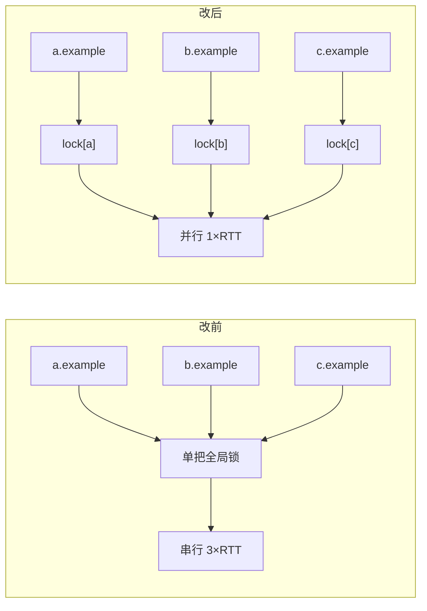

# robots 门禁的 per-origin 锁分片

## 元数据

| 字段 | 内容 |
|---|---|
| 日期 | 2026-08-04 |
| Issue | https://github.com/LuzernRR/agent-workbench/issues/37 |
| 状态 | awaiting-acceptance |
| 目标环境 | local |

## 问题与目标

### 问题

`fetch_pages` 的注释与实现都宣称「全局最多 3 页并发、同域最多 2 页」，但三个**不同域名**的
候选页在 robots 门禁阶段被完全串行化。并发上限形同虚设——真正的瓶颈在它上游。

### 目标

把 `robots_policy` 的单把进程级锁换成 per-origin 锁：不同 origin 的 robots.txt 抓取并行，
同一 origin 仍然只抓一次。

### 范围

- `app/tools/robots_policy.py`：锁分片 + 双重检查
- `tests/test_robots_policy.py`：并发度、去重、锁生命周期三项回归
- `scripts/robots_lock_probe.py`：取证脚本（非 feature 代码）

### 非目标

- **不改 robots 判定语义**。fail closed 的每个分支、TTL、`ROBOTS_*` reason 码一律不动。
- 不改 `check_robots` 签名与返回类型，三个渠道调用方零改动。
- 不放宽任何并发上限。`MAX_FETCH_CONCURRENCY` / `MAX_PER_DOMAIN_CONCURRENCY` 未动。

### 验收条件

1. 三个不同 origin 并发 `check_robots`，观测到的并发度为 3 而非 1
2. 同一 origin 并发 N 次，`_load_policy` 仍只调用 1 次
3. 缓存 TTL、missing / denied / unavailable 各分支行为零变化
4. 全量测试 + ruff + compileall 通过

## 修改前证据

`scripts/robots_lock_probe.py` 把 `_load_policy` 替换为固定 0.5s 延迟，不发真实网络请求：

```
域名数            = 3
单域模拟抓取耗时  = 0.50s
实际墙钟          = 1.52s
_load_policy 调用 = 3
理论并行上限      = 0.50s
理论串行下限      = 1.50s
结论              = 串行（全局锁生效）
```

墙钟 1.52s 落在串行下限 1.50s 上，与并行上限 0.50s 相差 3 倍。

## 根因

```python
_CACHE_LOCK = asyncio.Lock()          # ← 单把，全进程共用

async with _CACHE_LOCK:
    policy = _CACHE.get(origin)
    if not policy or policy.expires_at <= now:
        policy = await _load_policy(policy_url, timeout)   # ← 网络 IO 在锁内
```

锁的意图是正确的：同一 origin 并发时只抓一次 robots.txt，避免自己给对方站点放大压力。
错的是**粒度**——锁保护的是「整个缓存字典」，而需要互斥的其实是「同一个 origin 的抓取」。
`await _load_policy(...)` 持锁做网络 IO，于是 `b.example` 必须等 `a.example` 的 robots.txt
抓完才能开始。

放大效应：`_fetch_static` 每跳重定向都要再调一次 `check_robots`，每次都重新抢这把全局锁。

## 方案与取舍



三个取舍点：

**其一，锁字典本身不加锁保护。** `_ORIGIN_LOCKS.setdefault(origin, asyncio.Lock())` 中间没有
`await`，在 asyncio 的单线程事件循环里不存在被抢占的时机，两个协程不可能各拿到一把不同的锁。
为它再套一层元锁只会把刚拆掉的全局争用原样加回来。

**其二，进锁后必须复查缓存。** 等锁期间同 origin 的另一个协程可能已抓完并写入缓存。不复查就会
在锁释放的瞬间再抓一次，去重语义丢失——这正是本次改动最容易破坏的性质，因此单独立了测试。

**其三，`clear_robots_cache()` 同时清锁字典。** 锁与缓存同生共死。只清缓存会让 `_ORIGIN_LOCKS`
随访问过的 origin 数量无界增长。极端情况下清理时某把锁仍被持有，后果仅是该 origin 多抓一次
robots.txt，不影响任何判定结果。

考虑过但**没有**采用的方案：把 `_load_policy` 挪到锁外、只用锁保护字典读写。那样同 origin 的
N 个并发会各抓一次 robots.txt，等于用「给目标站点加压」换并发——与本模块「不给站点造成压力」的
设计前提冲突。

## 配置

无新增配置项。`ROBOTS_CACHE_SECONDS`、`MAX_ROBOTS_BYTES`、`ROBOTS_USER_AGENT` 均未改动。

## 逐文件修改

| 文件 | 修改 | 原因 |
|---|---|---|
| `app/tools/robots_policy.py` | `_CACHE_LOCK` 换为 `_ORIGIN_LOCKS` 字典；新增 `_origin_lock()`；`check_robots` 改为锁外先查 + 锁内复查；`clear_robots_cache` 同步清锁 | 锁分片的落点 |
| `tests/test_robots_policy.py` | 新增跨域并发度、同域去重、锁生命周期三项测试；补 `asyncio` import | 锁定「并行」与「仍然去重」两个方向 |
| `scripts/robots_lock_probe.py` | 新增取证脚本 | 提供改前/改后的可复现墙钟对比 |

## 完整执行链路

`fetch_pages` → `fetch_page` → `_fetch_static` → `check_robots(url)` → 按 origin 分片取锁 →
锁外命中缓存直接返回 / 未命中则进锁复查后 `_load_policy` → `RobotsDecision`。

判定链路本身一步未改：`failure_reason` → 拒绝、`missing` → 允许、`parser is None` → 拒绝、
其余走 `parser.can_fetch()`。

## 异常、取消与恢复

`_load_policy` 内部已把 `UrlPolicyError` / `TimeoutException` / `HTTPError` 全部转成带
`failure_reason` 的 `_CachedPolicy`，不向上抛。因此锁内 `await` 不会因异常而跳过释放——
`async with` 本就保证释放，此处只是说明不存在「异常导致缓存写入被跳过」的分支。

若协程在等锁时被外部取消，`CancelledError` 正常向上传播，锁由 `async with` 释放，
缓存保持未写入状态，下一次调用重新抓取。

## 数据与安全

- **robots 语义零变化**：fail closed 的所有分支、TTL、reason 码均未触碰。
- 未放宽任何并发上限，对单一站点的请求速率不增反降（同域去重仍然生效）。
- 未新增网络出口，未改动 SSRF / URL policy 任何门禁逻辑。
- 取证脚本不发真实网络请求，不读取也不打印任何密钥。

## 验证证据

| 验收项 | 证据 | 结果 |
|---|---|---|
| 跨域并行 | `test_different_origins_load_policies_concurrently` 断言 `max_active == 3` | 通过 |
| 同域仍去重 | `test_same_origin_concurrency_still_loads_the_policy_once` 断言 `loads == 1` | 通过 |
| 去重不压平判定 | 同上：复用缓存后 `/private` 仍被拒 | 通过 |
| 锁不泄漏 | `test_clearing_the_cache_also_releases_origin_locks` | 通过 |
| 既有语义不变 | 原有 3 项 robots 测试未改动 | 通过 |
| 墙钟对比 | `robots_lock_probe.py`：**1.52s → 0.51s**，同域抓取次数仍为 1 | 通过 |
| 全量测试 | `pytest -q` → **420 passed in 9.59s**（改前 417，本轮 +3） | 通过 |
| Lint | `ruff check .` → All checks passed | 通过 |
| 编译 | `compileall -q app` → exit 0 | 通过 |

## 回滚

`git revert <merge-sha>`。锁退回单把全局锁，跨域串行重现，判定语义本就未动，因此回滚不影响
任何持久数据或调用方。

## 未解决问题

- `_fetch_static` 每跳重定向重复调 `check_robots`。命中缓存后已是纯内存操作，本轮不动。
- 阶段 4 清单其余项仍未做：`asyncio.as_completed` 先到先用、单页超时分层、HTTP/2 与连接复用、
  DuckDuckGo 竞速、小红书验证移出关键路径、短期结果缓存。
- **清单中的 "gzip" 项与既有决策冲突**：`fetch_page.py` 的 `accept-encoding: identity` 带有
  在案理由（容器内解码器组合曾导致官方 LangGraph 页面抛 `DecodingError`）。改它需要先复现
  那次故障并确认解码器现状，不应作为顺带改动，建议单独立 Issue。
- **"keep-alive" 项受 SSRF 防御制约**：`_pinned_get` 每次尝试新建 `AsyncClient` 是为了把连接
  钉在校验过的 IP 上并覆盖 SNI。要复用连接必须先解决「连接池按 IP 而非 host 复用」，
  复杂度远高于清单其余项。

## 用户验收

- 状态：等待验收
- 验收反馈：待填写
- 下一功能执行门：阻塞（等 #37 验收）
