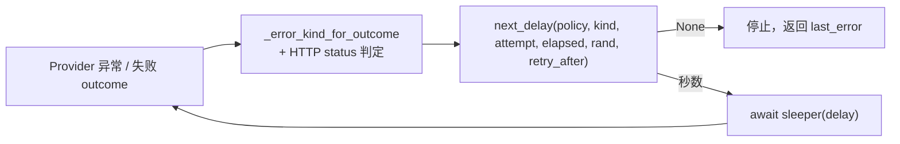

# Web 搜索 Provider 重试策略与 Retry-After

## 元数据

| 字段 | 内容 |
|---|---|
| 日期 | 2026-08-04 |
| Issue | https://github.com/LuzernRR/agent-workbench/issues/39 |
| 状态 | awaiting-acceptance |
| 目标环境 | local |

## 问题与目标

### 问题

`web_search.py` 的重试是写死在循环里的 `await asyncio.sleep(0.5 * (2 ** attempt))`：无 jitter、
不看 `Retry-After`、没有累计耗时上限，并且**错误分类与重试决策纠缠在一起**——判断依据是
`_TAVILY_CREDENTIAL_FAILURES` 这个 Tavily 专用集合，DuckDuckGo 复用同一段逻辑属于巧合。

### 目标

抽出与 Provider 无关的重试策略模块，只迁移 Web Search 一条调用链，使重试满足「先分类再决定；
次数与总耗时双限制；429/503 遵循 `Retry-After`；退避带 full jitter」。

### 范围

- 新增 `app/reliability/retry.py`：`ErrorKind`、`RetryPolicy`、`parse_retry_after`、`next_delay`
- `app/tools/web_search.py`：Provider 调用改用该策略，注入时钟、随机源与 sleeper
- `tests/test_retry_policy.py`（新）、`tests/test_web_search_failures.py`（扩充）
- `docs/Agent生产化优化任务清单.md`：把两份外部手册的技术栈、当前差距与 P0/P1/P2 后续顺序固化给
  后续模型

### 非目标

- 不迁移 DeepSeek SDK 内部重试，不迁移小红书 MCP 重试。
- 不实现分布式熔断、Redis、Worker、队列或 Provider 健康服务。
- 不改 Tavily Key 池轮换顺序、DuckDuckGo fallback 顺序、搜索结果公共协议或前端事件协议。
- 不实现 DuckDuckGo 竞速、结果缓存、HTTP/2 / keep-alive / gzip。

### 验收条件

1. timeout、网络错误、429 与可重试 5xx 才重试；认证失败、额度耗尽、参数错误不重试
2. 合法 `Retry-After`（delta-seconds 与 HTTP-date）生效且仍受最大等待与剩余 deadline 约束
3. 退避为 full jitter，随机源、时钟、sleeper 可注入，测试不真实睡眠
4. `max_attempts` 与 `max_elapsed_seconds` 均为硬上限
5. Tavily Key 轮换、DuckDuckGo 串行 fallback、错误文案与公共数据结构保持兼容
6. 新增测试覆盖重试/不重试/Retry-After/jitter/deadline，全量测试、ruff、compileall 通过

## 修改前证据

```python
for attempt in range(max_attempts):
    try:
        outcome = await _search_tavily(...)          # 或 _search_duckduckgo
        if outcome.ok:
            return outcome
        last_error = outcome
        if outcome.error_category in _TAVILY_CREDENTIAL_FAILURES:
            break
    except httpx.TimeoutException:
        last_error = ...  # timeout
    except httpx.HTTPError as exc:
        last_error = ...  # provider_unavailable

    if attempt < max_attempts - 1:
        await asyncio.sleep(0.5 * (2 ** attempt))
```

这段代码有四个各自独立的缺陷：

| # | 缺陷 | 真实后果 |
|---|---|---|
| 1 | 退避固定为 0.5s / 1.0s，无 jitter | 同一时刻被限流的并发查询会**同步**重试，重试尖峰与限流窗口对齐 |
| 2 | 从不读 `Retry-After` | 服务端明确告知「5 秒后再来」时仍按 0.5s 重来，加剧限流 |
| 3 | 无累计耗时上限 | 最坏路径 3 × (connect 5s + read 15s) + 1.5s ≈ **61.5s**，且这只是**单个 Provider**；Key 池 + DuckDuckGo 回退还要各叠一份 |
| 4 | `httpx.HTTPStatusError` 是 `httpx.HTTPError` 的子类 | **HTTP 400 / 404 被当作瞬时故障重试 3 次**——重试一个参数错误的请求，三次必然得到同一个 400 |

第 5 个问题是分类本身：`_TAVILY_CREDENTIAL_FAILURES` 同时含 `auth_required`、`quota_exhausted`
和 `rate_limited`。前两者不该重试是对的，但 **429 被一起 `break` 掉了**——最该按 `Retry-After`
重试的那一类，恰恰是唯一被禁止重试的一类。

## 根因

重试决策需要的输入有四个：错误是否瞬时、已尝试几次、已耗时多久、服务端是否给了建议等待时间。
旧代码只有第二个。其余三个要么没采集（`Retry-After`、elapsed），要么用一个 Provider 专用的
集合近似（错误分类）。所以问题不是「退避算法不够好」，而是**决策所需的事实没有被表达出来**。

## 方案与取舍



**其一，策略层是纯函数，不碰网络也不碰时间。** `next_delay` 的所有输入都是参数：当前尝试序号、
已耗时、随机数、服务端建议。调用方负责执行请求和注入时钟。这样测试既确定又不需要真实睡眠——
六项重试测试全部在毫秒级完成。

**其二，`Retry-After` 优先但不是命令。** 服务端可以返回 `Retry-After: 3600`；无条件遵守等于把
一次搜索挂起一小时。因此它先被 `max_delay_seconds` 截断，再与剩余 deadline 比较。

**其三，等待会耗尽预算时直接停止，而不是「等完再试」。** `delay >= remaining` 时返回 `None`。
反过来做会发出一个从诞生起就没有时间预算的请求——它必然超时，只是把失败推迟了 `delay` 秒。

**其四，429 现在重试，但 Key 轮换语义不变。** `_error_kind_for_outcome` 把 `rate_limited` 判为
`RATE_LIMIT`（可重试），`auth_required` / `quota_exhausted` / `invalid_arguments` 落 `PERMANENT`。
Key 池那一层的 `_TAVILY_CREDENTIAL_FAILURES` 判断**原样保留**：多 Key 时
`attempts_per_key = 1`，单 Key 内不重试、直接轮换；只有单 Key 时才在本 Key 内按 `Retry-After`
重试。轮换顺序与游标推进一行未改。

**其五，`asyncio.timeout(remaining)` 包住单次调用。** httpx 的 `read=15s` 只约束单次读，不约束
整体。没有这层，`max_elapsed_seconds` 只在两次尝试**之间**被检查，一次慢调用就能整体超出预算。

考虑过但**没有**采用：直接引入 `tenacity` 或 `backoff`。两者都把「决定重试」与「执行调用」耦合在
装饰器里，而本项目需要在同一次失败上同时驱动 Key 轮换与 Provider 回退——那是调用方的控制流，
不是重试库的。为一个 130 行的纯函数模块引入依赖，换来的是更难注入的时钟。

## 配置

无新增配置项，无新增环境变量。`max_elapsed_seconds` 有模块级默认值 30.0，可由调用方按参数覆盖。

## 逐文件修改

| 文件 | 修改 | 原因 |
|---|---|---|
| `app/reliability/__init__.py` | 新增（空包） | 可靠性模块的落点，与 `tools/` 平级 |
| `app/reliability/retry.py` | 新增 `ErrorKind` / `RetryPolicy` / `parse_retry_after` / `next_delay` | 与 Provider 无关的策略层 |
| `app/tools/web_search.py` | `SearchOutcome` 加 `retry_after_seconds`；`_search_tavily` / `_search_duckduckgo` 的 429 分支解析 `Retry-After`；新增 `_error_kind_for_outcome`；`_search_provider_with_retries` 改为策略驱动并接受注入 | 唯一被迁移的调用链 |
| `tests/test_retry_policy.py` | 新增 7 项纯函数测试 | 锁定 Retry-After / jitter / 上限 / 参数校验 |
| `tests/test_web_search_failures.py` | 新增 6 项集成测试，改写原限流用例 | 锁定重试与不重试两个方向 |
| `docs/Agent生产化优化任务清单.md` | 新增技术栈对照、P0/P1/P2 队列和接手步骤 | 满足用户要求，防止后续模型遗漏生产化问题或并行开工 |

`retry_after_seconds` 标记为 `repr=False, compare=False` 并带注释：它只服务于重试层，
**不投影到公共 AgentEvent 协议**，也不参与 outcome 相等性比较。

## 完整执行链路

`web_search` → （`default_provider == "duckduckgo"` 或无 Key）`_search_provider_with_retries` /
（有 Key）`_search_tavily_key_pool` → 逐 Key 调 `_search_provider_with_retries` → 每次尝试进入
`asyncio.timeout(remaining)` → 成功即返回；失败按 `_error_kind_for_outcome` 或 HTTP status 定级 →
`next_delay` → 返回 `None` 则跳出，否则 `await sleeper(delay)` 后重试 → Key 池按
`_TAVILY_CREDENTIAL_FAILURES` 决定轮换或计入 provider 故障 → Tavily 整体失败且允许回退时
串行降级 DuckDuckGo。

错误文案与 `error_category` 取值集合未变，因此上层 `channels/web.py` 与 BFF 投影零改动。

## 异常、取消与恢复

- `asyncio.timeout` 到期抛内置 `TimeoutError`，与 `httpx.TimeoutException` 一起归 `ErrorKind.TIMEOUT`。
- `httpx.HTTPStatusError` 先于 `httpx.RequestError`、`httpx.HTTPError` 捕获（前两者都是后者的子类），
  顺序颠倒会让状态码判定失效。500/502/503/504 判 `TRANSIENT`，其余状态码判 `PERMANENT`——
  这修掉了修改前证据表中的第 4 项。
- `httpx.RequestError`（连接失败、DNS 失败、连接重置）判 `TRANSIENT`。
- 外部取消时 `CancelledError` 不被上述任何 `except` 捕获（它继承 `BaseException`），正常向上传播，
  不会被误当作瞬时故障重试。
- 所有尝试耗尽后返回保存的 `last_error`；只有在从未产生任何错误对象的不可达路径上才构造兜底
  outcome。空结果仍是合法结果，任何路径都不构造伪候选。

## 数据与安全

- 未新增网络出口，未改动 robots / SSRF / `url_policy` 任何门禁逻辑。
- `parse_retry_after` 只接受 delta-seconds 与 RFC HTTP-date；`NaN` / `Infinity` / 空串 / 乱码一律
  返回 `None` 回退到普通退避。**过去的日期与负秒数归一为 0**，不会产生负延迟。
- 上限收紧而非放宽：单 Provider 调用从最坏约 61.5s 降到 30s 硬上限。
- 新增字段不出现在 `repr` 中，日志与异常信息不会因此泄露服务端头部内容。密钥处理未触碰。

## 验证证据

| 验收项 | 证据 | 结果 |
|---|---|---|
| 超时重试后成功 | `test_timeout_retries_until_success`：`calls == 2`，`waits == [0.5]`（jitter 0.25 × 初始 2s） | 通过 |
| 网络错误重试 | `test_network_error_retries`：`ConnectError` 后第 2 次成功 | 通过 |
| 5xx 重试 / 4xx 不重试 | `test_retryable_503_retries_but_400_does_not`：503 重试成功，400 一次即停 | 通过 |
| 凭据类不重试 | `test_credential_failure_does_not_retry`（`auth_required` / `quota_exhausted`）：`calls == 1` | 通过 |
| 429 按 Retry-After 重试 | `test_single_key_rate_limit_retries_with_retry_after`：`calls == 3` | 通过 |
| deadline 硬上限 | `test_retry_budget_stops_before_waiting_past_deadline`：注入时钟走到 4s/5s，`waits == []` | 通过 |
| attempts 硬上限 | `test_max_attempts_is_a_hard_limit`：`calls == 2` | 通过 |
| Retry-After 解析 | `test_parse_retry_after_accepts_delta_seconds` / `..._http_date_and_clamps_past_date` / `..._rejects_invalid_values` | 通过 |
| full jitter 与封顶 | `test_next_delay_uses_full_jitter_and_caps_exponential_backoff` | 通过 |
| Retry-After 受限 | `test_next_delay_prefers_retry_after_but_keeps_hard_limits`：8s 被截到 4s；剩余 3s 时返回 `None` | 通过 |
| 参数校验 | `test_retry_policy_rejects_invalid_limits`（5 组非法上限） | 通过 |
| 全量测试 | `pytest -q` → **443 passed in 8.21s**（改前 420，本轮 +23） | 通过 |
| Lint | `ruff check .` → All checks passed | 通过 |
| 编译 | `compileall -q app` → exit 0 | 通过 |

全部重试测试通过注入 sleeper 完成，未真实睡眠，未发真实网络请求。

## 回滚

`git revert <merge-sha>`。`app/reliability/` 目前只有 Web Search 一个调用方，回滚后退回固定退避，
不影响任何持久数据、事件协议或前端。

## 未解决问题

- **`max_elapsed_seconds` 是「每次 Provider 调用」的预算，不是 `web_search` 整体的。**
  Tavily Key 池中每把 Key 各拿一份完整 30s，回退 DuckDuckGo 再叠一份，最坏累计约 90s。
  收成整体预算需要改 Key 池的时间账，属本 Issue 的非目标，已登记为
  [生产化优化任务清单 P0-01](../Agent生产化优化任务清单.md#p0-01-run-级-deadline-propagation)。
- DeepSeek SDK 与小红书 MCP 仍用各自的重试，尚未迁到本模块（本 Issue 明确的非目标）。
- 阶段 4 清单其余项仍未做：`asyncio.as_completed` 先到先用、单页超时分层、DuckDuckGo 竞速代替
  串行降级、短期结果缓存；`gzip` 与 `keep-alive` 两项的前置冲突见
  [037](2026-08-04-037-issue-37-robots-per-origin-lock.md) 的同名段落。
- Model Gateway、Worker/lease/fencing、Checkpoint/Event/Outbox 原子边界、OIDC/RBAC/ABAC、
  Tool Gateway、RAG 技术收敛、记忆治理、OTel/SLO、Golden Cases、PITR、分层与 ADR 等审计问题均已
  进入上述生产化清单；它们仍是未来任务，不能视为本 Issue 已实现。

## 用户验收

- 状态：等待验收
- 验收反馈：待填写
- 下一功能执行门：阻塞（等 #39 验收）
