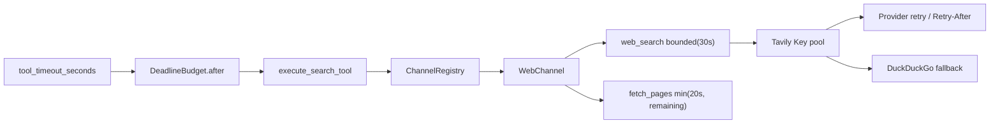

# Web Search 绝对 Deadline 贯穿 Key 池、fallback 与抓取

## 元数据

| 字段 | 内容 |
|---|---|
| 日期 | 2026-08-04 |
| Issue | https://github.com/LuzernRR/agent-workbench/issues/41 |
| 状态 | awaiting-acceptance |
| 目标环境 | local |

## 问题与诊断

### 原始假设

#39 收口时发现 `max_elapsed_seconds` 是单 Provider 预算：Tavily Key 池中的不同 Key 和 DuckDuckGo
fallback 会分别获得完整 30 秒，理论上可叠加到约 90 秒。因此生产化清单最初把下一项写成“补 Run 级
Deadline”。

### 真实现状

取证后确认项目已经有三层 Run 时间控制：

1. `HarnessRunner` 用 `asyncio.timeout(config.graph.max_run_seconds + 10)` 包住整张 LangGraph。
2. State 保存 `started_at` / `max_run_seconds`；`budget_reason()` 达到上限后停止继续规划。
3. `tool_timeout_seconds()` 从剩余 Run 时间扣除 60 秒最终写作/核验预留；`_run_one_search` 再用外层
   `asyncio.timeout(timeout_seconds)` 包住整次工具执行。

所以真正缺陷不是“没有 Run 超时”，而是**内部没有共享 deadline**：外层只会在耗尽时取消整条调用，
Tavily Key、fallback 和正文抓取不知道还剩多少时间，仍可能在预算尾部启动一个注定无法完成的新请求。

## 目标、范围与非目标

目标是创建一次基于单调时钟的绝对 deadline，并让 Web 搜索链所有阶段只消费剩余预算。

范围：

- 新增 `DeadlineBudget` 可靠性原语。
- `_run_one_search` 将现有 Web `timeout_seconds` 转成一次绝对 deadline。
- deadline 经 Search Tool、ChannelRegistry、WebChannel 传入 `web_search`。
- Tavily Key 池、Provider retry、DuckDuckGo fallback 共用 deadline。
- 发现阶段与 `fetch_pages` 共用 deadline。
- 假时钟、取消和跨层对象身份测试。

非目标：

- 不修改 `maxRunSeconds`、60 秒最终预留或小红书人工验证暂停计时。
- 不迁移 DeepSeek、X、小红书 MCP 的内部 timeout。
- 不做 Worker、队列、lease/fencing、熔断、缓存、竞速、HTTP client 复用。
- 不改 Tavily Key 顺序、fallback 顺序、搜索结果、AgentEvent 或 BFF Schema。

## 架构决策

### 为什么是绝对单调 deadline

相对 timeout 每穿过一层就容易被重新计时。`DeadlineBudget` 只保存 `expires_at` 与单调时钟：

```text
remaining = max(0, expires_at - monotonic_now)
```

单调时钟不受系统校时、时区或夏令时影响；对象只存在于当前进程，不序列化到 State/Checkpoint。恢复后的
Run 会按持久化 `started_at` 重新计算工具窗口，再创建新的进程内 deadline。

### 父预算只能收紧

`DeadlineBudget.after(seconds)` 创建根预算；`bounded(seconds)` 返回
`min(parent.expires_at, now + seconds)`。Web Search 保留自己的 30 秒局部上限，但它只能比工具 deadline
更早，永远不能延长调用方预算。每个 Provider 再用同样规则收紧，切 Key 不会重置父 deadline。

### 外层 timeout 仍然保留

deadline propagation 用于让内部在启动下一步前主动判断；`asyncio.timeout` 用于中断一个已经在途且不返回
的 await。两者分别解决“不要启动必败工作”和“在途调用必须可终止”，不能互相替代。

## 完整调用链



预算耗尽后的规则：

- Provider attempt 开始前 `remaining <= 0`：不发请求，返回稳定 `timeout`。
- Key 完成后 deadline 已耗尽：不启动下一把 Key。
- Tavily 失败后 deadline 已耗尽：不启动 DuckDuckGo。
- 搜索发现成功但 deadline 已耗尽：保留真实候选，跳过正文抓取；候选保持 `verified=false`，不构造证据。
- Retry-After / jitter 等待会耗尽剩余预算：`next_delay()` 返回 `None`，立即停止。

## 逐文件修改

| 文件 | 修改 |
|---|---|
| `app/reliability/deadline.py` | 新增 `DeadlineBudget.after/bounded/remaining_seconds/expired` |
| `app/reliability/__init__.py` | 导出 deadline 原语 |
| `app/graph/nodes.py` | Web 工具执行前创建一次绝对 deadline |
| `app/tools/search_tool.py` | 运行时 deadline 透传到 ChannelRegistry |
| `app/tools/channels/registry.py` | 只向 Web adapter 传 deadline，X/小红书行为不变 |
| `app/tools/channels/web.py` | 发现与抓取共享 deadline；抓取使用实时剩余预算 |
| `app/tools/web_search.py` | Key、重试和 fallback 共用 deadline，耗尽后不启动下游 |
| `tests/test_deadline.py` | 单调时钟、父子上限与非法参数测试 |
| `tests/test_web_search_failures.py` | 多 Key 消耗、禁止 fallback、到期和取消测试 |
| `tests/test_search_tool.py` | Tool/Registry/Web/fetch 跨层传播测试 |
| `tests/test_tool_idempotency.py` | `_run_one_search` 只创建一个 deadline 的测试 |
| `tests/test_graph_runtime.py` | 确定性 Scenario 接受新增的内部运行时参数 |

## 兼容性、安全和异常

- `DeadlineBudget` 不是 Pydantic DTO，不进 JSON、持久化、日志或公开事件。
- `CancelledError` 继承 `BaseException`，现有重试 `except` 不捕获；取消测试确认它继续向上传播。
- Provider 的 `asyncio.timeout(remaining)` 仍保护在途请求；外层工具 timeout 和 Ledger unknown 结算未动。
- deadline 到期不改变已发生的 Key 凭据故障游标推进；预算充足时 Key 轮换、单 Key retry、fallback 顺序
  与错误分类保持现状。
- fetch 仍使用既有 `fetch_pages` / `fetch_page`，SSRF、robots、DNS pinning、重定向和动态抓取门禁未改。
- 到期后不会把搜索 snippet 当证据；只保留公开候选并标记未验证。

## 验证证据

本轮先运行相关基线：121 passed。新增测试曾因 `app.reliability.deadline` 不存在产生 3 个 collection error，
实现后转绿，证明新测试确实约束新增能力。

| 验收项 | 测试证据 |
|---|---|
| 多 Key 共享预算 | `test_tavily_keys_consume_one_shared_deadline`：两次调用分别看到 5.0s、2.0s |
| 禁止预算后工作 | `test_exhausted_deadline_does_not_start_next_key_or_fallback`：只调用第一把 Key |
| 到期不发请求 | `test_expired_deadline_never_starts_provider`：Provider 未调用，结果为 timeout |
| 发现/fetch 共享 | `test_web_discovery_and_fetch_share_remaining_deadline`：发现用 4s 后 fetch 只获 6s |
| 到期跳过 fetch | `test_web_channel_does_not_fetch_after_deadline`：保留候选、无伪证据 |
| 跨层传播 | Tool → Registry → Web 三层对象身份断言通过 |
| 外部取消 | `test_cancellation_still_escapes_shared_deadline` 抛 `CancelledError` |
| 参数约束 | 0、负数、NaN、Infinity 均拒绝；子 deadline 不能延长父预算 |
| 定向回归 | 136 passed，定向 ruff 通过 |
| 初次全量 | `pytest -q` → 458 passed in 7.42s（改前 443，本轮 +15） |
| 最终全量 | `pytest -q` → 458 passed in 7.18s；`ruff check .`、`compileall -q app`、`git diff --check` 通过 |

最终验证使用仓库内 `services/search-agent/.venv/Scripts/python.exe`，未调用缺少项目依赖的系统 Python。

## 遗留与下一项

- DeepSeek/Model Gateway 仍用自身 timeout/retry，是生产化清单 P0-02。
- X 与小红书内部尚不接收 `DeadlineBudget`，但仍受现有渠道 timeout 与 `_run_one_search` 外层硬 timeout
  约束；迁移小红书时必须保留二维码人工验证等待从 Run 预算中扣除/恢复的现有语义。
- `DeadlineBudget` 是单进程对象，不解决 Worker 重启恢复；Worker/lease/fencing 属 P0-03。
- 本轮没有加入事件字段，前端无法区分“局部 Provider timeout”与“共享 deadline 耗尽”；若产品确需展示，
  应先扩充稳定错误协议并单独立 Issue，不能从前端猜测。

## 回滚

`git revert <merge-sha>`。无数据迁移、配置变更和协议变更；回滚后恢复 #39 的每次 Provider 相对预算，
不会影响已持久化 Run。

## 用户验收

- 状态：等待验收
- 验收反馈：待填写
- 下一功能执行门：阻塞（等 #41 验收）
