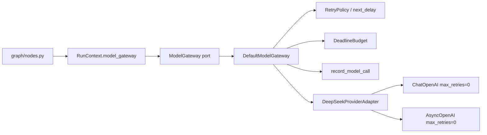

# Search Agent 统一 Model Gateway 与分层重试

## 元数据

| 字段 | 内容 |
|---|---|
| 日期 | 2026-08-04 |
| Issue | https://github.com/LuzernRR/agent-workbench/issues/43 |
| 状态 | accepted |
| 目标环境 | local |

## 手册依据

两份手册（《生产级Agent底层技术架构与工程实战》《商用Agent开发全流程手册》）在模型接入上给出同一条
边界：业务节点只依赖内部 Model Gateway 契约，Provider SDK 只能出现在 adapter 里；网络重试必须收敛到
唯一一层，禁止与 SDK 自带重试叠加；降级路径必须显式声明，不能按模型名或列表顺序猜测。

## 问题与诊断

改前 `app/graph/nodes.py` 直接 `from app.llm.deepseek import invoke_structured, stream_writer_answer`，
带来四个各自独立的缺陷：

1. **重试叠加**：`ChatOpenAI` 与 `AsyncOpenAI` 都启用 SDK 默认 `max_retries=2`。一次 429 在 SDK 内部
   已经重试过，应用层完全看不见，这些真实尝试不进入 deadline、不计入 `model_calls`、不进 OTel。
2. **记账混淆**：结构化输出的格式修复复用 `ModelUsage.attempts`。于是「模型返回了不合 Schema 的结果」
   与「网络失败重试」共用一个计数器，二者无法分辨，预算判断因此不可靠。
3. **无显式降级**：没有任何 fallback 路径。既没有能力，也没有约束——一旦后续加上，很容易滑向按模型名
   或配置顺序猜测。
4. **静态耦合**：业务节点直接依赖具体 Provider 模块，测试只能 monkeypatch 具体函数名，重构即碎。

## 目标、范围与非目标

目标是让业务节点只依赖内部 Pydantic 契约与 `ModelGateway` port；DeepSeek 只存在于 provider adapter；
网络重试、deadline、显式备用模型、用量/成本与 OTel 属性由 Gateway 统一治理。

范围：

- 新增 `app/llm/contracts.py`、`app/llm/ports.py`、`app/llm/gateway.py`、`app/llm/factory.py`。
- `nodes.py` 7 处模型调用点全部迁到 port；`RunContext` 新增 `model_gateway`。
- DeepSeek 封成 `DeepSeekProviderAdapter`，SDK `max_retries=0`，只做单次网络尝试。
- Gateway 复用 #39 的 `RetryPolicy` 与 #41 的 `DeadlineBudget`。
- 共享本地模型配置新增可选 `fallbackModel`，Python/TypeScript 两侧同时校验。

非目标：租户持久配额、Provider 健康度存储、熔断/隔离（P0-05/P0-08）；不迁移 mock/旧预览 TypeScript
DeepSeek 客户端；不引入 LiteLLM/Temporal/独立 Gateway 微服务；不改 X/小红书/Web Search provider。

## 架构决策

### 网络重试与格式修复必须分开记账

这不是命名偏好。两者的正确响应完全相反：网络失败应当退避后重发**同一请求**；Schema 不合法则必须
追加反馈消息重新请求，退避毫无意义。合并计数会让「限流 3 次」和「模型胡乱输出 3 次」在预算判断里
不可区分。因此 `ModelUsage` 拆成四个独立计数：

```text
attempts         = 真实 Provider 尝试总数（唯一进入 model_calls 的量）
network_retries  = 其中因可恢复网络故障重发的次数
format_repairs   = 其中因 Schema 不合法追加反馈的次数（全程上限 1）
fallbacks        = 切换到显式备用模型的次数
```

`_structured_usage_patch` 相应改为 `model_calls += usage.attempts`、
`schema_repair_count += usage.format_repairs`。

### 备用模型 fail closed

`_routes()` 只返回 `(request.model_id, *fallback_models.get(request.model_id, ()))`，而
`fallback_models` 只能来自配置里显式的 `model.fallbackModel`。没有配置就没有第二个候选，可恢复故障
在主模型上耗尽预算后失败——不按名称相似度、不按列表下一项猜测。配置侧还要求备用模型的推理强度集合
与媒体能力都不低于主模型，否则解析期直接报错。当前 `config/` 未声明任何 `fallbackModel`，即线上
行为与改前一致。

### Writer 首段正文之后不再重试或切模型

流式回答是 append-only 的：一旦第一个 delta 发给用户，重试会产生重复正文，切模型会产生风格断裂。
`_stream_text` 用 `produced` 标记，首个 delta 之后的任何故障直接抛 `WriterStreamError`，不进退避、
不进 fallback 分支。

### span 包装与记账内核分离

`generate_structured` / `stream_text` 只负责取时间戳、调内核、在 `finally` 语义下补记 span；
`_generate_structured` / `_stream_text` 承载全部重试与记账逻辑。`except BaseException` 让
`CancelledError` 也能留下观测记录，同时 `raise` 保证它原样向上传播（`CancelledError` 继承
`BaseException`，不会被任何 `except Exception` 吞掉）。

span 属性把 `primary_model` 与 `effective_model` 分列为 `gen_ai.request.model` 与
`gen_ai.response.model`，再附 `networkRetries` / `formatRepairs` / `fallbacks`，因此后端能区分
「请求的模型」与「真正应答的模型」。

## 完整调用链



预算耗尽与错误分类规则：

- `PERMANENT`（400/401/403/404/422）：不退避、不重试、不 fallback，原样抛出。
- `RATE_LIMIT` / `TIMEOUT` / `TRANSIENT`：交给 `next_delay()`，遵守 `Retry-After`、full jitter、
  attempt 与 elapsed 双上限。
- `deadline.expired`：不启动下一次尝试，也不启动 fallback 路由。
- 等待会耗尽剩余预算时 `next_delay()` 返回 `None`，立即失败，不发一个没有时间预算的请求。
- `attempts >= request.max_provider_attempts`（由 Run 剩余 `model_calls` 推导）时停止。

## 逐文件修改

| 文件 | 修改 |
|---|---|
| `app/llm/contracts.py` | 新增 `ModelErrorKind/ModelMessage/ModelRequest/ModelAttempt/ModelResult/ModelUsage` |
| `app/llm/ports.py` | 新增 `ModelProvider` / `ModelGateway` Protocol |
| `app/llm/gateway.py` | 新增 `DefaultModelGateway`：路由、deadline、重试、fallback、记账、model span |
| `app/llm/factory.py` | 生产装配；fallback 只从显式配置读取 |
| `app/llm/deepseek.py` | 新增 `DeepSeekProviderAdapter`；`max_retries=0`；错误归一保留 `Retry-After` |
| `app/graph/nodes.py` | 7 处模型调用迁到 port；`ModelMessage` 取代 LangChain 消息类 |
| `app/graph/context.py` | `RunContext` 新增 `model_gateway` |
| `app/harness/runner.py` | 依赖可注入，默认取 `model_gateway()` |
| `app/config/runtime.py` | 解析并校验 `fallbackModel` |
| `app/observability/trace.py` | model span 白名单新增 4 键；`effectiveModelId → gen_ai.response.model` |
| `apps/web/src/server/config/runtime-config.ts` | 同一份共享配置的 TypeScript 侧校验 |
| `tests/test_model_gateway.py` | 新增 Gateway 行为与 span 测试 |
| `tests/test_deepseek_model_adapter.py` | 新增 SDK 无隐藏重试与错误分类测试 |
| `tests/test_model_runtime_config.py` | 新增 fallback 配置 fail-closed 测试 |
| `tests/test_graph_runtime.py` | 测试 double 改为经 port 注入，不再 monkeypatch provider 函数 |

## 兼容性、安全和异常

- Prompt 常量、LangGraph 拓扑、Checkpoint Schema、公开 AgentEvent 与 Writer append-only 流式语义均未改。
- `ModelRequest/ModelUsage` 都是 `extra="forbid", frozen=True`，不含 Prompt 之外的 Provider 正文；
  `ModelAttempt` 只记 provider/model/phase/status/error_kind/latency，不记 Header、凭据、请求体。
- span 属性经 `_MODEL_ATTRIBUTE_KEYS` 白名单 + `_assert_public` 双重过滤；`reasoning_content` 与
  Prompt 无法进入观测。
- `CancelledError` 继承 `BaseException`，Gateway 的 `except ModelProviderError` 不捕获它；已加测试断言
  它穿过 Gateway 并且仍留下 error span。
- 当前配置未声明 `fallbackModel`，因此 fallback 分支在生产路径上不激活，行为与改前等价。

## 验证证据

起点是分支上一次未完成的迁移：`nodes.py` 的 import 已删、7 处调用点还在，`pytest -q` 为
**53 failed / 424 passed**。

| 验收项 | 测试证据 |
|---|---|
| AC1 静态解耦 | `test_graph_nodes_never_import_the_concrete_provider_adapter`：AST 扫描确认无 `app.llm.deepseek`，且有 `app.llm.ports` |
| AC1 port 注入 | `tests/test_graph_runtime.py` 的 `Scenario` 经 `RunContext` 注入，不再 monkeypatch provider 函数 |
| AC2 无隐藏重试 | `test_structured_sdk_client_has_no_hidden_retries` / `test_streaming_sdk_client_has_no_hidden_retries`：`max_retries == 0` |
| AC2 错误分类 | `test_provider_errors_are_classified_without_exposing_bodies`：timeout/429/503/400 → TIMEOUT/RATE_LIMIT/TRANSIENT/PERMANENT |
| AC2 永久错误不重试 | `test_permanent_error_is_never_retried_or_fallbacked`：只调用一次，且不切 fallback |
| AC3 Retry-After | `test_rate_limit_retry_after_is_owned_and_counted_by_gateway`：等待恰为 2s，attempts=2、network_retries=1 |
| AC3 full jitter | `test_timeout_retries_with_full_jitter_backoff`：initial=1、random=0.5 → 等待 0.5s |
| AC3 deadline 恰好耗尽 | `test_exhausted_deadline_stops_retry_and_fallback`：只调用主模型，不启动 fallback |
| AC3 外部取消 | `test_external_cancellation_escapes_gateway` + `test_external_cancellation_still_records_a_span_and_propagates` |
| AC4 分项记账 | `test_retryable_failure_uses_only_explicit_fallback`：attempts=3、network_retries=1、fallbacks=1、primary≠effective |
| AC4 不泄露 | `test_stream_span_never_leaks_prompt_or_provider_body`：序列化后的 span 属性不含 Prompt 文本，无 prompt 类键名 |
| AC5 修复只一次 | `test_schema_repair_is_separate_from_network_retry`：format_repairs=1、network_retries=0、第二次请求多一条反馈消息 |
| AC5 修复失败 | `test_schema_repair_failure_stays_invalid_output`：attempts=2、format_repairs=1、network_retries=0 |
| AC5 计数分离 | `test_graph_runtime` 中 `structured_attempts={"planner":2}` 且 `structured_format_repairs={"planner":1}` → `model_calls` 与 `schema_repair_count` 分别推进 |
| AC6 fail closed | `test_missing_fallback_config_fails_closed`：无配置时 3 次预算全给主模型，不出现第二个模型 ID |
| AC6 配置校验 | `test_explicit_fallback_requires_equal_or_greater_capability` / `test_invalid_fallback_route_fails_closed`；Web 侧 `只接受显式且能力不降低的备用模型` |
| AC6 首段后不切 | `test_stream_failure_after_first_delta_never_retries_or_fallbacks`：`stream_calls == ["primary"]` |
| AC6 span 可区分 | `test_model_span_separates_primary_from_effective_model`：request.model=primary、response.model=fallback、fallbacks=1 |
| AC6 错误 span | `test_failed_call_records_a_span_with_the_stable_error_kind`：status=error、reasonCode=permanent |
| AC7 行为兼容 | `tests/test_graph_runtime.py` **77 passed**，Prompt 常量与事件断言未改 |
| AC9 全量 | `pytest -q` → **484 passed in 8.42s**（#41 验收基线 458，本轮 +26）；`ruff check .`、`compileall -q app`、`git diff --check` 通过 |
| AC9 Web 侧 | `runtime-config.test.ts` 4 passed；`npm run typecheck`、`npm run lint` 通过 |

全部测试使用假 Provider、假时钟与注入 sleeper，不访问真实网络、不真实等待。Python 门禁使用仓库内
`services/search-agent/.venv/Scripts/python.exe`。

## 遗留与下一项

- `app/llm/deepseek.py` 里的 `invoke_structured`、`stream_writer_answer`、`invoke_researcher_turn` 与
  `_record_model_span` 已无生产调用点，只被 `tests/test_structured_output_repair.py`、
  `tests/test_strict_schema_compatibility.py` 和 `scripts/intent_probe.py` 引用。本轮按「只清理自己造成
  的孤儿」原则未删除，也未改写这些既有测试。**建议单独立 Issue 清理**：删除旧函数、把两个测试文件迁到
  adapter + Gateway 组合上、更新探针脚本。
- `invoke_researcher_turn`（thinking + tool-calling 子回合）尚未纳入 Gateway 契约，因为它返回
  `assistant_message` 原始结构，需要先扩展 `ModelResult` 才能表达工具调用；属独立范围。
- 未做租户持久配额、Provider 健康度存储、熔断与隔离（P0-05/P0-08）。
- Gateway 是进程内对象，不解决 Worker 重启恢复；Worker/lease/fencing 属 P0-03。
- 公开事件未新增字段，前端无法区分「网络重试」「格式修复」「已切备用模型」。若产品需要展示，应先
  扩充稳定错误协议并单独立 Issue，不能由前端推断。

## 回滚

`git revert <merge-sha>`。无数据迁移；`fallbackModel` 是可选字段且当前未被任何配置使用，回滚后配置
仍可解析。回滚即恢复 SDK 自带重试与合并记账，不影响已持久化 Run。

## 用户验收

- 状态：验收通过
- 验收反馈：用户 2026-08-04 回复“通过，继续”。
- 下一功能执行门：放行（#43 已验收；下一项按清单顺序为 P0-03 独立 Worker、持久任务队列与租约，
  须先建带 Problem/Goal/Scope/Non-Goals/DoD 的 Issue 并置 `Execution Gate: allowed` 才能改代码）
