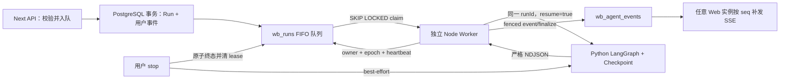

# PostgreSQL 持久队列、独立 Worker 与租约 fencing

## 元数据

| 字段 | 内容 |
|---|---|
| 日期 | 2026-08-05 |
| Issue | https://github.com/LuzernRR/agent-workbench/issues/48 |
| 状态 | accepted |
| 目标环境 | local / Compose dev |

## 手册依据

《商用Agent开发全流程手册》和《生产级Agent底层技术架构与工程实战》都把长任务执行与同步 API 生命周期
分开，并把可恢复状态放在外部权威存储中。两份手册在本阶段对应的工程约束是：

- API 无状态，只负责校验、鉴权、创建任务并立即返回，不在请求进程持有运行所有权。
- 短/中时长 Agent 任务优先使用 PostgreSQL `FOR UPDATE SKIP LOCKED` 或成熟队列；当前规模没有引入
  Redis、Celery/Dramatiq、Temporal、Kafka 或 Kubernetes 的证据。
- Worker 使用 lease、heartbeat 与单调 fencing token；数据库必须拒绝失租 Worker 的迟到写入，不能只靠
  进程内标志自律。
- Checkpoint 负责 Agent 图恢复，AgentEvent 负责公开过程回放，二者不能退化成 Web 进程内状态。
- 优雅停机必须先停止领取，再取消当前上游、交还有效租约并关闭连接；崩溃则依赖租约到期接管。

因此本项选择“现有 PostgreSQL + 独立 Node Worker”，没有为了形式完整堆入尚无运维基础的中间件。跨小时或
跨天、需要外部事件等待和复杂补偿的工作流，达到真实需求后才评估 Temporal。

## 问题与目标

### 修改前问题

生产运行入口 `apps/web/src/server/live/engine.ts` 使用模块级 `Map` 保存 AbortController 和订阅者，并以
`void execute(...)` 在 Next.js 进程内启动 Search Agent 流。恢复扫描虽然读取 PostgreSQL，却没有持久
claim：两个 Web 实例可以先后恢复同一 Run。SSE、运行所有权与 Web 生命周期耦合后还产生以下风险：

1. Web 重启会中断模型/工具执行，页面断线与服务故障无法严格区分。
2. 多实例恢复没有 lease 和 fencing，旧实例迟到事件可能覆盖新实例终态。
3. Python `RunRegistry` 只防单进程重复，不能替代跨实例数据库所有权。
4. Compose 没有独立 Worker，也没有停止领取、释放租约和关闭数据库的停机协议。

### 目标

让 PostgreSQL 成为 Run 队列与所有权的权威来源。API 只入队；独立 Worker 以 FIFO + `SKIP LOCKED` 领取，
定期续租，所有业务事件和终态写入都校验 owner + epoch + 未过期 lease。Worker 丢失租约或退出后，同一
`runId` 由下一实例以 `resume=true` 从 LangGraph Checkpoint 恢复。

### 范围

- 扩展 `wb_runs` 的持久输入、排队、租约、heartbeat、epoch、attempt 与首次启动时间字段。
- 实现 claim、renew、release、fenced event、fenced finalize 和用户 stop 抢占。
- 把生产执行器移入独立 Node Worker，复用 Search Agent NDJSON、mapper、重连和项目记忆写入。
- SSE 改为仅按 PostgreSQL seq 轮询和补发，不保留进程内订阅者。
- 增加单元测试、真实 PostgreSQL 故障注入测试和 Compose Worker 服务。

### 非目标

- 不把 LangGraph Checkpoint、AgentEvent、Tool Ledger 和 Outbox 合并为一个跨服务原子事务，该边界属于 P0-04。
- 不引入 Redis、Celery/Dramatiq、Temporal、Kafka、Kubernetes 或专用调度平台。
- 不修改 Model Gateway、Prompt、图拓扑、搜索策略、Milvus/RAG、工具审批或副作用语义。
- 不实现 OIDC、RBAC/ABAC、租户配额和独立 Migration Job。
- 不迁移确定性 mock/Playwright 预览运行时。

## 架构与取舍

### 为什么继续使用 PostgreSQL

当前 Web、Run/Event 和 LangGraph Checkpoint 已依赖 PostgreSQL，任务是单用户交互型短/中任务，没有需要
独立 broker 的吞吐证据。`FOR UPDATE SKIP LOCKED` 能提供并发唯一领取，事务更新同时写入 lease 与 epoch，
减少一套中间件、一致性边界和运维告警。队列索引按 `available_at, created_at, id` 支持稳定 FIFO。

### 为什么 fencing 在 SQL 内实现

Worker 内的 `leaseLost` 只能缩短停止时间，不能证明旧进程不会迟到。以下四类写操作都在数据库 WHERE 条件
或行锁验证中要求 `id + lease_owner + lease_epoch + lease_expires_at > now()`：

| 操作 | 数据库行为 |
|---|---|
| heartbeat | 仅有效 owner/epoch 可延长 `lease_expires_at` |
| event | 事务内 `SELECT ... FOR UPDATE` 验证租约后插入 AgentEvent |
| release | 仅有效租约可回到 `queued` 并清 owner/expiry |
| finalize | 原子抢占运行终态并清 lease，再在同事务写消息、记忆和唯一终态事件 |

重新 claim 总是 `lease_epoch = lease_epoch + 1`。即使部署时误配了相同 owner，旧 Worker 的 epoch 也无法通过
新租约校验。用户 stop 使用另一条带 visitor 所有权的原子终态更新，先清 lease 和写 `run.cancelled`，再
best-effort 通知 Search Agent；迟到完成无法覆盖 cancelled。

### Worker 打包方案

Web 与 Worker 共用源代码和镜像，但使用不同进程入口。Worker 不能直接依赖 Next standalone 自动追踪到的
全部模块，因此由 esbuild 生成独立 bundle。运行态验证发现并修复两种不可用配置：

1. 外部化 npm 依赖：镜像只有 Next standalone 追踪文件，Worker 启动时报缺少 `zod`。
2. 把 `pg` 打进 ESM：`pg` 内部动态 `require("events")` 在 ESM bundle 中失败。

最终使用 CommonJS `dist/worker.cjs`，内联纯 JavaScript 依赖，只排除可选原生模块 `pg-native`。同一镜像
可分别运行 `apps/web/server.js` 和 `apps/web/dist/worker.cjs`，避免两套依赖版本漂移。

## 状态流与完整执行链路

| 场景 | Run 状态与所有权 |
|---|---|
| API 创建 | 同一事务写 `queued` Run、`run.created` 和用户消息；线程置 `running`，API 返回 `runId` |
| 首次 claim | `queued -> running`，写 owner、epoch=1、expiry、heartbeat、attempt=1、started_at |
| 正常执行 | Worker 每 10 秒续 30 秒 lease，按来源事件顺序串行 fenced 持久化 |
| 正常完成 | `running/waiting -> completed/failed/stopped`，同事务清 lease、更新线程、写终态 |
| Worker 失租 | heartbeat 返回 false，Abort 上游；不再 event/finalize/release |
| Worker 崩溃 | 无清理；expiry 到期后其他 Worker claim，epoch/attempt +1，`resume=true` |
| SIGTERM/SIGINT | 停止 claim，Abort 当前上游，等待事件尾，释放仍有效 lease，关闭 pool 后退出 |
| 用户 stop | `queued/running/waiting -> stopped` 原子抢占，清 lease，写唯一 cancelled，再通知 Python |
| SSE 断线 | 不改变 Run；重连携带 `Last-Event-ID`，任意 Web 实例从持久 seq 继续补发 |

Worker 单进程当前串行领取一个 Run。横向吞吐通过 Compose `--scale worker=N` 扩展，数据库 claim 保证不同
实例不并行拥有同一 Run。claim 或 retention 暂时失败时记录结构化错误并继续轮询；Search Agent 的网络
断流按 1/2/4/8 秒有界重连，每次重连使用相同 `runId` 和 `resume=true`。不可重试错误由有效租约持有者
写入 `run.failed`，不会无限重新入队。

## 异常、取消与恢复

- heartbeat 调用异常按失租处理，fail closed，而不是假定租约仍属于当前 Worker。
- event/finalize 返回 null 立即设置 `leaseLost` 并 Abort 上游，后续队列操作先检查该标志。
- Search Agent 返回 `RUN_ALREADY_ACTIVE` 时视为上一次流仍在收口，进入同一有界恢复序列。
- Worker 接管不重复写 `run.started`，而写带 `workerAttempt` 和 `leaseEpoch` 的 `run.status` 恢复事件。
- 业务事件通过 `eventTail` 串行，避免同一 Worker 的异步映射写入乱序。
- SIGTERM 与 lease 丢失不同：前者在租约仍有效时主动 release；后者绝不 release，防止旧 epoch 改写新所有权。
- SSE 每秒读取数据库。瞬时读取失败主动关闭连接，让浏览器按已持久 cursor 重连，不把数据库故障解释为运行失败。

## 配置与安全

| 配置 | 默认值 | 约束/用途 |
|---|---:|---|
| `WORKBENCH_WORKER_DATABASE_POOL_MAX` | 5 | 每个 Worker 的 PostgreSQL pool 上限 |
| `WORKBENCH_RUN_LEASE_MS` | 30000 | 3 秒至 5 分钟；租约有效期 |
| `WORKBENCH_RUN_HEARTBEAT_MS` | 10000 | 0.5 至 60 秒，且严格小于 lease 一半 |
| `WORKBENCH_RUN_POLL_MS` | 500 | 50 毫秒至 30 秒；空队列轮询间隔 |
| `WORKBENCH_WORKER_ID` | 自动生成 | 可选稳定 owner；默认 hostname + pid + 随机后缀 |

Worker 与 Web 挂载相同只读 `config/`，数据库 URL 和内部 token 只来自服务端环境，不发布端口，不进入
`NEXT_PUBLIC_`。容器使用非 root 用户、只读根文件系统、`cap_drop: ALL` 和 `no-new-privileges`。日志只记录
owner、runId、attempt、epoch、outcome 与稳定错误文本，不记录 Prompt、回答、附件或密钥。

## 逐文件修改

| 文件 | 修改 |
|---|---|
| `apps/web/src/server/live/engine.ts` | 删除进程内执行、恢复与订阅；API 仅入队；stop 先抢占持久终态 |
| `apps/web/src/server/live/handler.ts` | SSE 改为数据库 seq 轮询与补发 |
| `apps/web/src/server/live/store.ts` | 持久输入、claim/renew/release/fencing/finalize 与 queued 快照 |
| `apps/web/src/server/persistence/schema.ts` | Run 队列、lease、epoch、heartbeat、attempt 字段、升级约束和 claim 索引 |
| `apps/web/src/server/worker/executor.ts` | Search Agent 执行、heartbeat、重连、失租中断与原子收口 |
| `apps/web/src/server/worker/loop.ts` | 串行领取、retention、轮询、配置校验和停机循环 |
| `apps/web/src/server/worker/main.ts` | 结构化日志、SIGTERM/SIGINT 和数据库关闭 |
| `apps/web/package.json` | Worker 构建/启动脚本和 esbuild 开发依赖 |
| `deploy/compose.yaml` | 无端口 Worker 服务、健康依赖、安全选项和运行参数 |
| `deploy/web.Dockerfile` | 将 Worker bundle 复制到 runtime 镜像 |
| `config/deploy.env.example` | Worker pool、lease、heartbeat、poll 示例配置 |
| `README.md`、`deploy/README.md` | 更新运行架构、故障接管与部署运维说明 |
| `HANDOFF.md`、生产化清单 | 保存自主验收授权、当前边界和 P0-04 门禁 |
| `*.test.ts` | API、SSE、SQL fencing、Worker 心跳/停机与 PostgreSQL 故障注入 |

## 验证证据

以下证据均在 2026-08-05 本轮重新执行并读取完整退出码，不沿用实现阶段的历史结论。

| 验收项 | 直接证据 | 本轮结果 |
|---|---|---|
| A1 API 只入队 | `engine.test.ts` 证明只调用 `prepareLiveRun` 并立即返回；生产 engine 无 `void execute`/恢复扫描 | 通过 |
| A2 FIFO 与唯一 claim | 隔离 PostgreSQL 并发 claim 仅一个命中；SQL 为 `ORDER BY available_at, created_at, id FOR UPDATE SKIP LOCKED` | 通过 |
| A3 过期接管与 resume | 强制 lease 过期后 replacement 的 epoch/attempt 均 +1，`resume=true` | 通过 |
| A4 四类迟到操作拒绝 | 旧 claim 的 renew/release/event/finalize 全部 false/null；数据库终态计数为 1 | 通过 |
| A5 heartbeat 与失租中断 | executor 单测证明 heartbeat false 后 Abort 上游且不 finalize/release | 通过 |
| A6 优雅停机 | loop 单测；当前镜像容器收到 SIGTERM 后记录 requested/stopped、退出码 0；重启 owner 更新 | 通过 |
| A7 stop 竞态唯一终态 | engine/store 单元证明 stop 先落盘；PostgreSQL 证明迟到 stop/complete 只能有一个终态 | 通过 |
| A8 SSE 持久补发 | handler 测试；SSE 只调用 `activeEventsForRun`/`liveRun`，无 subscriber 或 Worker 内存依赖 | 通过 |
| A9 单元与 PostgreSQL 故障注入 | 聚焦 33 passed / 2 integration skipped；显式启用隔离 PostgreSQL 后 3 passed，含旧表约束升级 | 通过 |
| A10 全量工程门禁 | Web 403 passed / 3 skipped；typecheck、Lint、build 通过；E2E 16 passed / 3 live skipped；Python 486 passed，Ruff/compileall 通过；diff check 通过 | 通过 |
| A11 文档与后续门禁 | 本记录、索引、HANDOFF、README、部署文档和优化清单已更新；P0-04 保持 blocked | 通过 |

### 验证过程中的非功能失败

- 隔离 PostgreSQL 前两次没有进入业务 SQL：一次沿用了本地配置的错误宿主端口 `5432`，一次沿用了没有
  可用密码的本地 URL。两次随机临时库都由 `finally` 删除。第三次从运行容器内存读取凭据、使用实际宿主
  端口 `15432` 后原 2/2 通过；补入旧库约束升级场景后的最终串行结果为 3/3。凭据没有输出、写文件或
  进入命令文本。曾把数据库集成与全量 Web 并行运行，原记忆边界用例因资源竞争触及 5 秒默认上限；没有
  放宽超时，改为串行后 0.52 秒通过。
- E2E 第一轮在“滚动到底部”按钮等待上发生一次时序抖动，聚焦复跑 1/1 通过；没有修改无关 UI，也没有
  放宽断言。随后重新运行完整 `npm run test:e2e`，16 个 mock 场景全部通过，3 个真实 Provider 场景按
  默认门禁配置跳过。
- Python pytest 在本机 LangSmith 可选连接上出现 SSL 获取信息失败并自动降级，但 486 项测试全部通过且
  退出码为 0。该日志不影响 #48 行为，后续可在测试配置治理中关闭非必要远端探测。

## 回滚

代码通过 `git revert <merge-sha>` 回滚。回滚前必须先停止所有新 Worker，避免旧 Web 代码与 Worker 同时拥有
任务；数据库新增列和索引可保留，旧版本不会读取它们。若必须删除字段，应使用独立 migration，在确认没有
`queued` Run、没有有效 lease 且已备份后执行，不能随应用回滚直接破坏数据。

## 未解决问题

1. LangGraph Checkpoint 提交与 Node AgentEvent/Tool Ledger 提交仍跨 Python/Node 两个事务。崩溃窗口可能
   导致 checkpoint 已推进而公开事件尚未写入，或恢复时重放非终态投影；P0-04 必须设计 inbox/outbox、
   source event 幂等键和一致的 replay 规则。
2. 当前 Worker 单进程串行，扩容依赖实例数量；尚无按租户公平调度、队列深度/租约失效指标和租户并发配额。
3. Schema 仍由应用启动时执行，没有独立 Migration Job、expand/contract 发布门禁和回滚演练，属于 P0-07。
4. 没有生产环境 OIDC/RBAC/ABAC 与租户级策略，内部 token 不能替代真实身份面。
5. `npm audit --omit=dev` 报告 Next.js 内嵌 PostCSS 的 2 个 moderate 告警；修复要求升级到当前范围外的
   Next 16.3.0。本项不使用强制升级混入队列功能，已登记到 P2-04 发布与依赖治理。

## 用户验收

- 状态：验收通过。A1-A11 均有本轮直接证据，Codex 依据用户授权判定为 `accepted`。
- 验收授权：用户 2026-08-05 明确要求“自行判断是否通过，并自动提交继续下一个”。
- GitHub 状态：等待本分支提交、PR 自审合并和 Issue 关闭；合并前不会开启 P0-04。
- 下一功能执行门：P0-04 保持阻塞；#48 的 PR 合并且 Issue 关闭后，才创建 P0-04 独立 Issue 并重新设置
  `Status: ready`、`Execution Gate: allowed`。
