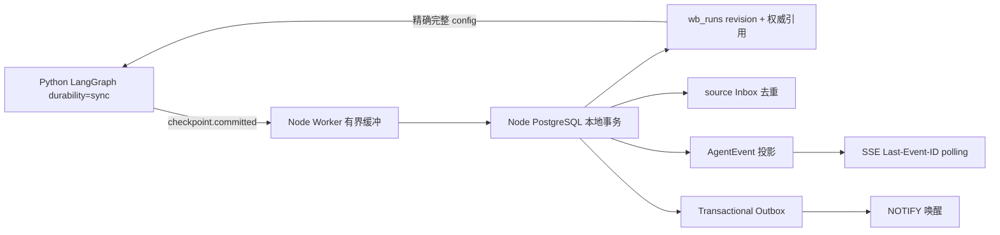

# Checkpoint、AgentEvent 与 Outbox 原子确认边界

## 元数据

| 字段 | 内容 |
|---|---|
| 日期 | 2026-08-06 |
| Issue | https://github.com/LuzernRR/agent-workbench/issues/50 |
| 分支 | `codex/issue-50-checkpoint-outbox` |
| 状态 | awaiting-acceptance |
| 目标环境 | local / Compose dev / 隔离 PostgreSQL |

## 手册与架构约束

本项按 `addyosmani/agent-skills` 的增量实现、五轴代码审阅和发布检查执行，并遵守仓库
`AGENTS.md` 的单 Issue 门禁。目标不是制造一个跨服务 XA，而是把两个真实存在的提交边界明确化：

1. Python LangGraph 本地事务以 `durability="sync"` 写入 Checkpoint。
2. Node PostgreSQL 本地事务以 Run 账本的权威引用为前提，确认投影和 Outbox。

两者之间用完整引用、parent continuity、revision、Inbox 业务键和重放规则组成可恢复确认协议。任何
描述都不能把它称为 Python/Node 跨服务原子事务、两阶段提交或 XA。

## 问题与目标

### 修改前问题

Python 可能已经推进 LangGraph Checkpoint，而 Node 只持久化了部分公开事件；反过来，Node 也可能让 SSE
看到尚未成为恢复权威的事件。线程中较新的孤立 Checkpoint 还可能被默认恢复逻辑误选，造成状态越界或
事件与状态不一致。

### 目标

- 让 `wb_runs` 中的完整引用 `{checkpointSessionId, checkpointNs, checkpointId}` 成为唯一自动恢复起点。
- 让 Python 只在精确 Checkpoint 可读后发出私有 `checkpoint.committed` 边界，并且不暴露 State 正文。
- 让 Worker 在边界前缓冲 source event；边界到达后以一个 Node 事务确认 Run revision、Checkpoint commit、
  source Inbox、AgentEvent 投影和 transactional Outbox。
- 让重复批次只读幂等，冲突内容、断裂 parent、旧 lease 和不完整终态 fail closed。
- 保持持久事件表 + SSE cursor 为可靠恢复来源，`NOTIFY` 只做低延迟唤醒。

### 非目标

- 不建立跨 Python/Node 的 XA、2PC、分布式锁或“跨服务原子提交”声明。
- 不引入 Kafka、Redis Streams、Temporal、Celery/Dramatiq 或新的 broker。
- 不在本项实现 OIDC/RBAC/ABAC、租户配额、独立 Migration Job、备份/PITR 或完整 Tool Gateway 策略面。
- 不改变公开 UI 文案、Agent 推理文本、图拓扑或搜索业务策略；查询理解与关键词迭代是验收后的下一候选。

## 架构与关键决策



### 恢复引用

请求和 Run 账本都保留 `checkpointSessionId`、`checkpointNs`、`checkpointId`。非 resume 请求若携带部分
引用会被拒绝；显式 ID 不存在、namespace/session scope 不匹配也会拒绝。Node 不查询“最新 checkpoint”
作为 fallback。首个权威 checkpoint 后 namespace 固定，因此跨 namespace continuation 会因 parent continuity
失败；namespace 仍参与请求校验、boundary 内容、批次 hash 和 Python 精确读取。

### Python 边界

`services/search-agent/app/harness/runner.py` 使用
`stream_mode=["custom", "values", "checkpoints"]` 与 `durability="sync"`。收到 checkpoint stream
元数据后，Runner 先用完整 config 做精确 `aget_state` 校验，构造只含 ID、parent、namespace、session 和
step 的 boundary；下一次可观察事件才发出 `checkpoint.committed`。若读取失败，boundary 永不发出。
Compose 固定 `LANGGRAPH_STRICT_MSGPACK=true`，部署文档同时说明严格反序列化要求，避免 pickle fallback。

### Node 批次事务

`apps/web/src/server/live/checkpoint-batches.ts` 对每个批次执行以下顺序：

1. 校验 boundary 是最后的协议分隔；若批次收口，source 终态和公开投影终态必须分别唯一、类型匹配且位于
   各自序列末尾，失败/停止终态不得写项目记忆。
2. `SELECT ... FOR UPDATE` 锁定 Run，校验 owner、epoch、未过期 lease、parent 和 namespace。
3. 对已存在的 checkpoint commit / batch hash 做 duplicate 或 conflict 判定。
4. 将 revision 严格推进一位，写完整权威引用和 checkpoint commit。
5. 写 source Inbox、连续 AgentEvent 与对应 Outbox；任一异常让本地事务整体回滚。

boundary 自身计入 source count、Inbox 业务键、batch hash 和唯一性检查，避免“边界之外”的终态或重复
边界绕过协议。canonical JSON hash 不受 key 顺序或 locale 排序影响。

### Worker 与 Outbox

`apps/web/src/server/worker/executor.ts` 在 boundary 前只缓冲 source event，最多 10,000 条（包含 boundary）
和 8 MiB UTF-8；超限返回 `SEARCH_AGENT_CHECKPOINT_BUFFER_LIMIT`。checkpoint batch 失败时不写终态，
Worker 交还仍有效的 lease，下一次以同一权威引用恢复。

`apps/web/src/server/live/event-outbox.ts` 用有界批次、`FOR UPDATE SKIP LOCKED` 领取消息，在同一事务中
发布 `pg_notify` 并结算 `attempts/published_at`。发布失败会回滚通知、保留消息并允许下一轮重试；没有 listener
时，SSE 仍从 `wb_agent_events` 按 `Last-Event-ID` 完整补发。

## 逐文件修改

| 文件 | 修改 | 目的 |
|---|---|---|
| `services/search-agent/app/api/schemas.py` | 严格校验 checkpoint 三元组及 resume 组合 | 防止 scope 漂移和静默 fallback |
| `services/search-agent/app/harness/runner.py` | sync checkpoint stream、精确可读 boundary、终态收口 | 建立 Python 提交边界 |
| `services/search-agent/tests/test_checkpoint_recovery_postgres.py` | 真实 PostgreSQL 微图 exact-fork 实验 | 证明孤儿 checkpoint 不会被恢复 |
| `apps/web/src/server/persistence/schema.ts` | revision、权威引用、commit、Inbox、Outbox 及目录约束 | 数据库强制不变量 |
| `apps/web/src/server/live/checkpoint-batches.ts` | fenced/parent-contiguous/idempotent 批次事务 | Node 确认协议核心 |
| `apps/web/src/server/live/event-outbox.ts` | 有界 SKIP LOCKED dispatcher | 可靠发布与重试 |
| `apps/web/src/server/worker/executor.ts` | boundary 前缓冲、批次提交、恢复和上限 | 防止逐条暴露半批 |
| `apps/web/src/server/live/handler.ts` 相关测试 | 无 listener 时 cursor 补发 | 保持 SSE 可靠兜底 |
| `deploy/compose.yaml`、`deploy/README.md` | 严格 msgpack 环境与运维说明 | 运行配置不可漂移 |
| `HANDOFF.md`、`docs/Agent生产化优化任务清单.md`、`tasks/` | 当前状态、证据和下一门禁 | 可交接、可验收 |

## 故障、取消与恢复

- **Python 已提交、Node 尚未确认**：Node 崩溃只留下可回收孤儿；Run 账本仍指向旧权威 checkpoint，接管
  从旧完整 config fork，Inbox/AgentEvent/Outbox 在下一次成功批次中一次确认。
- **Node 事务任一阶段失败**：Run revision、引用、commit、Inbox、AgentEvent、Outbox 均不可见；同一批次
  可重试，冲突 hash 不会被当作 duplicate。
- **Worker 失租或被 kill**：不再 finalize/release；lease 到期后新 owner 递增 epoch，以账本权威引用恢复。
- **工具重放**：稳定 toolCallId 命中 Tool Ledger 的 cached result，不再次执行外部副作用；unknown outcome
  fail closed。
- **SSE 断线**：浏览器携带 `Last-Event-ID`，从持久事件表按 seq 补发，不依赖进程内订阅者或 NOTIFY 是否
  到达。

## 验收条件与直接证据（A1-A11）

| 项 | 直接证据 | 结果 |
|---|---|---|
| A1 | Python `test_checkpoint_resume_contract_fails_closed`、缺失/非法/scope mismatch 测试；Node client 权威引用测试 | 通过 |
| A2 | Harness `test_sync_checkpoint_boundary_is_private_readable_and_closes_terminal`、`test_unreadable_checkpoint_boundary_is_never_emitted`；`durability="sync"` 与 checkpoints stream 源码 | 通过 |
| A3 | schema 单测 + PostgreSQL `schema 可重复执行并由目录约束与 revision trigger 强制不变量` | 通过 |
| A4 | Worker buffering 单测；checkpoint batch integration 的 Run/Inbox/AgentEvent/Outbox 全阶段回滚 | 通过 |
| A5 | Worker 孤儿恢复测试 + 真实 PostgreSQL exact-fork 微图（旧 authority parent，最终 `finalized:authority`） | 通过 |
| A6 | duplicate、内容冲突、断裂 parent、旧 lease、source/投影终态对应、重复终态和 boundary key collision 测试 | 通过 |
| A7 | 四个 Web PostgreSQL integration 文件共 10 passed；Worker kill/lease recovery、终态唯一和 cursor replay 证据 | 通过 |
| A8 | `test_unconfirmed_checkpoint_replay_reuses_ledger_without_provider_replay` 与并发 ledger 测试 | 通过 |
| A9 | Outbox unit/integration：bounded `SKIP LOCKED`、失败保留重试；handler 无 listener cursor 补发 | 通过 |
| A10 | Web 424 passed/10 skipped；Search Agent 501 passed/1 skipped；Ruff、compileall、typecheck、ESLint、build、Playwright 16 passed/3 live-only skipped、Compose build/config、diff check | 通过 |
| A11 | 本记录、`HANDOFF.md`、生产化清单、`tasks/` 与部署文档均更新；两个本地事务边界明确 | 通过 |

## 运行时证据

- Web health：`http://127.0.0.1:3000/health` 返回 `ok`。
- Search Agent health：`http://127.0.0.1:8080/health` 返回 `ok`。
- Search Agent 容器环境确认 `LANGGRAPH_STRICT_MSGPACK=true`。
- Worker SIGTERM smoke：日志含 `worker.shutdown.requested` 与 `worker.stopped`，退出码 0；重启后 owner
  变更且继续正常运行。
- Outbox runtime smoke：`claimed=1`、`published=1`、`failed=0`。
- 隔离测试数据按 visitor 级联清理；检查结果 `pending_outbox=0`、`active_runs=0`。

## 安全、性能与可观测性

- 外部 source event、checkpoint 元数据和 Tool Ledger 结果均在边界使用 Zod/Pydantic/白名单校验；SQL 使用
  参数化查询。State 正文、Prompt、回答和密钥不进入公开 boundary 或结构化日志。
- Batch 行数、UTF-8 bytes、revision 和 Outbox claim 都有上限；`SKIP LOCKED` 避免 dispatcher 互相等待，
  SSE polling 保证低延迟通知丢失不影响完整性。
- 结构化 Worker 日志记录 owner、runId、epoch、attempt、outcome 和稳定错误码；不记录敏感内容。运行态
  smoke 和持久计数为发布后第一小时检查提供基线。
- `npm audit --omit=dev --audit-level=high` 退出码为 0，无 high/critical；仍有 Next 内嵌 PostCSS 的 2 个
  moderate 告警。自动修复要求 `npm audit fix --force` 并越界升级到 Next 16.3.0，因此本项没有把强制依赖
  升级混入 checkpoint 协议，后续按独立依赖治理 Issue 处理。

## 配置与部署

生产/Compose Search Agent 必须设置：

```yaml
LANGGRAPH_STRICT_MSGPACK: "true"
```

迁移到旧数据库时可重复执行 schema setup；约束和 revision trigger 由数据库强制，不能依赖应用自觉。生产
部署仍应先在隔离库执行 migration/目录检查，再逐步重启 Worker，确认 health、queue depth、Outbox backlog
和错误率后放量。

## 回滚策略

1. 发现错误率超过基线 2 倍、数据完整性异常或恢复越界时，先停止新 Worker 领取并保留数据库事件。
2. 回滚应用代码（`git revert <merge-sha>`），旧版本可忽略新增列/表；不要直接删除 checkpoint、Inbox 或
   Outbox 数据。
3. 检查 health、Run 权威引用、revision、pending Outbox 和 SSE cursor；确认旧 Worker 不会以旧 epoch 写入。
4. 若需要删除 schema，另行执行可回滚 migration，并在无活跃 Run/lease、完成备份后进行。

## 未解决问题

- 这是可恢复确认协议，不是跨服务原子事务；Python checkpoint 与 Node 投影之间仍存在可观测但可恢复的
  崩溃窗口。
- OIDC/RBAC/ABAC、租户配额、独立 Migration Job、PITR/备份演练和 provider 健康熔断仍按生产化清单留在
  后续 Issue。
- 查询理解、关键词拆解、多路检索、结果缺口驱动改写和搜索质量评测是用户新增的下一候选，本记录不包含
  其实现或外部方案调研。

## 用户验收

- 状态：等待用户显式验收。
- 验收反馈：待填写。
- 下一功能执行门：阻塞。收到 #50 明确验收后，才创建查询理解/迭代检索的独立 Issue，写明可测试 DoD，
  设置 `Status: ready` 与 `Execution Gate: allowed`，再开始方案检索和实现。
