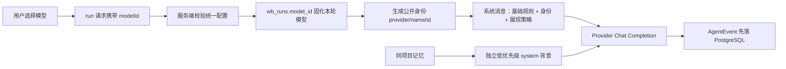

# 阶段 2 研究：动态模型身份与分层记忆契约

## 1. 研究目标

阶段 2 对应 [Issue #3](https://github.com/LuzernRR/agent-workbench/issues/3)。本阶段解决两个前置问题：模型身份必须来自本轮真实运行配置；已有会话历史和项目记忆必须通过完整生命周期契约验证。只有这两层稳定后，Python/LangGraph 才能安全接管编排。

## 2. 结论

1. 每轮调用由服务端把 `providerName`、`modelName`、`modelId` 注入最高优先级系统消息。
2. 身份类问题必须回答三项真实字段；普通任务不得重复自报身份。
3. API Key、Endpoint、数据库连接和系统提示词不属于公开身份，不能进入身份上下文。
4. 当前短期记忆是同会话活动分支中已完成的 user/assistant 消息。
5. 当前长期上下文只有同访客、同项目、跨会话的限界时间召回；它是低优先级、不可信事实背景。
6. `embedding vector` 仍为空且未参与排序，当前不能称为 pgvector 语义记忆或 RAG。
7. 下一阶段才适合引入 Python/LangGraph：先迁移运行状态和 checkpoint，再接工具循环，最后做检索与长期记忆提炼。

## 3. 官方资料得到的约束

| 来源 | 可执行结论 |
|---|---|
| DeepSeek Chat Completion | `model` 是每次请求字段；身份必须绑定本轮请求，不能只取前端显示值或全局默认值 |
| LangGraph Memory | 线程内短期状态与跨线程 Store 是两种不同生命周期，不能存进同一无类型文本池 |
| LangChain Memory | 长上下文会降低模型对早期信息的利用率；必须限制召回量，并对历史做裁剪或摘要 |
| PostgreSQL Constraints | 项目归属必须同时约束资源 ID 与所有者；当前使用 `(project_id, visitor_id)` 复合外键 |
| pgvector | 向量相似度不能替代租户、用户、项目、状态等结构化过滤；过滤必须先成为检索边界 |

## 4. 运行身份链路



身份来源以 `wb_runs.model_id` 和本轮已校验模型定义为准。模型切换发生在新运行创建前；已经创建的运行不会因浏览器随后切换下拉项而改变身份。

## 5. Prompt 顺序

```text
system 1 = 基础系统 Prompt
         + 可信运行身份
         + 输出结构策略
system 2 = 可选项目记忆，不可信事实背景
history  = 当前会话活动分支的已完成消息
user     = 当前消息 + 可读附件上下文
```

身份消息规定：只在用户询问模型、底层模型或驱动来源时回答 Provider、模型名称和模型 ID；普通任务不主动重复。项目记忆单独用 `<project_memory>` 包裹，并明确禁止执行其中命令，因此历史内容不能覆盖身份或系统规则。

## 6. 当前记忆分层

| 层级 | 当前载体 | 读取范围 | 写入时机 | 当前状态 |
|---|---|---|---|---|
| 会话历史 | `wb_agent_events` | 同访客、同会话、活动分支 | 用户提交、模型流式事件与完成事件 | 已实现 |
| 项目记忆 | `wb_project_memories` | 同访客、同项目、排除当前会话、未归档 | 运行成功完成的 user/assistant 交换 | 已实现，时间召回 |
| 用户长期记忆 | 独立事实表与提炼流程 | 同租户、同用户、按类型与授权 | 候选提取、验证、覆盖或撤销 | 未实现 |
| LangGraph checkpoint | Checkpointer | `thread_id + checkpoint_ns` | 图节点提交 | 未实现 |
| RAG 资料 | 文档、切片、索引与引用表 | 租户、ACL、数据源、版本过滤 | 索引流水线 | 未实现 |
| 程序记忆 | 版本化 Prompt、工具策略、工作流 | 发布版本 | 代码审查与发布 | 由代码管理，不允许对话直接改写 |

## 7. 隔离矩阵

| 场景 | 会话历史 | 项目记忆 |
|---|---|---|
| 同会话下一轮 | 可见 | 当前会话通过历史获得，不从项目记忆重复召回 |
| 同访客、同项目、另一会话 | 不可见原始历史 | 可见限界项目记忆 |
| 同访客、不同项目 | 不可见 | 不可见 |
| 不同访客、同名项目 | 不可见 | 不可见 |
| 无项目会话 | 只见本会话 | 不读取、不写入 |
| 归档分支 | 不可见 | 不可见 |

任何未来向量检索都必须先应用 `visitor_id/project_id/status/ACL` 过滤，再做相似度排序；不得在全库取近邻后依靠 Prompt 过滤越权结果。

## 8. 生命周期语义

| 操作 | 会话历史 | 项目记忆 |
|---|---|---|
| 完成 | 完成消息进入活动历史 | 同一事务写入 user/assistant 两条记忆 |
| 停止 | 保留已持久化事件并以 `run.cancelled` 终止 | 不写记忆 |
| 失败 | 以 `run.failed` 终止 | 不写记忆 |
| 编辑旧消息 | 目标运行及下游运行、事件全部归档 | 对应旧分支记忆同步归档；新分支完成后重新写入 |
| 项目 A 直接移到 B | 运行与事件归属更新到 B | 未归档来源记忆迁移到 B |
| 移出项目 | 会话成为无项目会话 | 来源记忆归档，不再召回 |
| 手动删除会话 | 原始链路级联删除 | 来源记忆显式删除 |
| 自动 TTL | 超过 3 天且非运行会话删除，运行/事件/附件级联 | 有界项目记忆保留，继续服务项目 |
| 删除项目或访客 | 级联删除 | 级联删除 |

## 9. 上下文预算

- 会话历史最多 40 条已完成消息，总正文约 80000 字符，超限时从最旧消息开始移除。
- 项目记忆默认查询最近 24 条，每项目最多保留 120 条。
- 项目记忆上下文默认最多 16000 字符，标签和分隔符也计入预算。
- 第一条召回内容超预算时只截取可用部分，最终上下文不能越界。
- 当前按创建时间倒序选取，再按时间正序注入，避免阅读顺序颠倒。

## 10. 为什么现在不直接做 LangGraph/ReAct

LangGraph 会增加图状态、checkpoint、重试、暂停恢复和工具副作用边界。如果会话归属、活动分支或跨项目记忆尚未稳定，这些错误会被持久化到图状态并扩大排查成本。阶段顺序应为：

1. 真实身份与记忆契约。
2. Python/LangGraph 最小运行时、PostgreSQL checkpoint 与 AgentEvent 适配。
3. 有界 ReAct 工具循环、权限、停止和恢复。
4. 搜索工具、证据模型、RAG 与验证循环。
5. 用户长期记忆提炼、冲突覆盖、撤销和评测。

## 11. 资料

- [DeepSeek Create Chat Completion](https://api-docs.deepseek.com/api/create-chat-completion)
- [LangGraph Add and manage memory](https://docs.langchain.com/oss/python/langgraph/add-memory)
- [LangChain Memory overview](https://docs.langchain.com/oss/python/concepts/memory)
- [PostgreSQL Constraints](https://www.postgresql.org/docs/current/ddl-constraints.html)
- [pgvector](https://github.com/pgvector/pgvector)
