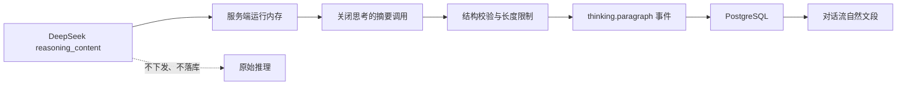

# 阶段 3 研究：思考结果、项目记忆与稳定拖拽

## 1. 目标

本阶段只处理 Issue [#4](https://github.com/LuzernRR/agent-workbench/issues/4)：

1. 对话流展示简洁、分段的思考结果，不展示模型原始推理文本。
2. 同一项目完整归档所有成功会话，并让新会话在上下文预算内可靠召回。
3. 修复项目排序和会话拖入、拖出时不跟手、落点回跳与文字闪屏。

## 2. DeepSeek 思考能力

DeepSeek 官方 Thinking Mode 文档说明，开启思考模式后，流式增量在与 `content` 同级的 `reasoning_content` 中返回推理内容。当前统一配置已经发送：

```json
{
  "thinking": { "type": "enabled" },
  "reasoning_effort": "medium"
}
```

对本地已配置模型执行真实 API 探测：

| 模型 | thinking | `reasoning_content` | `content` |
|---|---|---:|---:|
| `deepseek-v4-flash` | enabled | 有 | 有 |
| `deepseek-v4-pro` | enabled | 有 | 有 |
| `deepseek-v4-flash` | disabled | 无 | 有 |

结论：Flash 和 Pro 都具备真实思考能力，现有客户端只是只解析 `delta.content`，因此丢失了思考通道。

## 3. 可见思考结果契约

用户不需要原始思维链。原始 `reasoning_content` 可能冗长、反复、包含无用草稿，也不适合作为长期记忆。采用两层协议：



用户可见内容为 1 至 3 个由模型根据本轮真实推理生成的自然文段。文段只能归纳实际发生的判断、取舍和处理方向，不能复述完整思维链，不能加入推理中没有的事实。禁止标题、标签、编号、列表、Markdown、固定阶段词和固定段落数量；结构由本轮推理决定。

事件协议：

1. 首个 `reasoning_content` 到达时写 `thinking.started`。
2. 原始推理只在当前 Node 进程内累积。
3. 首个正文到达前，调用关闭思考的同 Provider 请求，要求只返回 `paragraphs` 字符串数组。
4. Zod 校验段数、长度和自然段格式，逐段写 `thinking.paragraph`，最后写 `thinking.completed`。
5. 首个正文随后创建 assistant message，并继续 `text.delta`。
6. 停止后禁止再写思考、正文或完成事件。
7. `streaming` 转为终态时思考结果自动折叠，用户可再次手动展开。

摘要失败时发送零段完成事件，Reducer 删除空思考块；不回退展示原始推理，也不生成本地模板文案。历史 Prompt 和项目记忆都不包含思考结果或原始推理。

## 4. 项目记忆模型

存储完整性与单轮上下文必须分离：

- `wb_project_memories` 保存每个成功运行的完整 user/assistant 交换，不再按 120 条物理删除。
- 保存来源会话 ID、来源会话标题、来源运行、角色、时间和内容哈希。
- 当前会话近期消息来自活动 AgentEvent；当前会话较早内容也可以从项目记忆补回。
- 召回先按 `visitor_id + project_id + archived_at` 做元数据过滤，再执行会话公平、问题相关和时间排序。
- 小项目在条数和字符预算内注入全部内容；大项目保留完整归档，但只注入预算内最有用的片段。
- 原始推理和可见思考结果均不进入事实记忆。

### 4.1 召回顺序

1. 输出项目来源会话目录。
2. 每个来源会话优先选择最新一次交换。
3. 使用当前问题做关键词相关性排序，补充较早交换。
4. 用全局最近交换填满剩余条数和字符预算。
5. 最终按时间正序组装，避免上下文叙事倒置。

同会话最近活动运行 ID 会从项目召回中排除，避免原始历史与项目记忆重复；被 40 条活动历史裁掉的更早运行仍可从项目记忆召回，因此长会话不会在中段突然失忆。

## 5. 拖拽根因与修复

当前 `onDragEnd()` 先清除 `DragOverlay`，而 React Query 的 `onMutate()` 先等待 `cancelQueries()` 再修改缓存。其帧序为：覆盖层消失、原卡片回旧位置、缓存异步移动、卡片再跳到新位置。

修复约束：

- Pointer 激活距离从 3 像素降为 1 像素。
- `onDragEnd` 同步计算并写入乐观缓存，再清除覆盖层。
- 不使用滞后的 drop animation。
- 活跃源节点不应用 transform transition；普通排序只使用 transform 和 opacity，最长 180ms。
- 保持 `DragOverlay` 常驻，只条件渲染其子项。
- 尊重 `prefers-reduced-motion`。
- Playwright 逐帧采样卡片数量、透明度、位置和文字，验证没有重复闪现或旧位置回跳。

## 6. 资料

- [DeepSeek Thinking Mode](https://api-docs.deepseek.com/guides/thinking_mode)
- [DeepSeek Chat Completion](https://api-docs.deepseek.com/api/create-chat-completion)
- [DeepSeek JSON Output](https://api-docs.deepseek.com/guides/json_mode)
- [LangGraph Memory](https://docs.langchain.com/oss/python/langgraph/add-memory)
- [dnd-kit DragOverlay](https://docs.dndkit.com/api-documentation/draggable/drag-overlay)
- [PostgreSQL 全文检索](https://www.postgresql.org/docs/current/textsearch.html)
- [pgvector](https://github.com/pgvector/pgvector)
