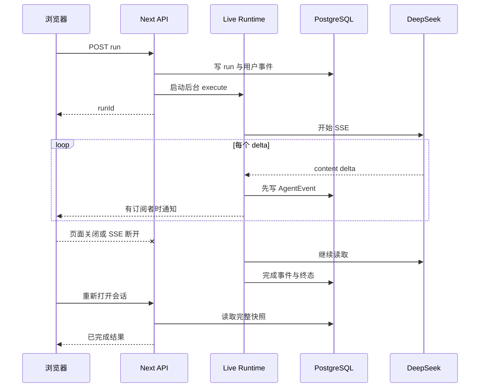

# 阶段 1 研究：真实会话连续性与工作台交互

## 研究目标

阶段 1 对应 [Issue #2](https://github.com/LuzernRR/agent-workbench/issues/2)，统一处理匿名身份、PostgreSQL 持久化、可恢复 URL、活动消息分支、项目树拖拽、无闪屏、项目共享记忆、3 天保留、结构化输出、用户滚动优先和页面关闭后持续生成。它们共享同一套会话真值，拆开实现会反复引入状态竞争。

## 原始问题与根因

| 问题 | 根因 | 采用方案 |
|---|---|---|
| 刷新丢会话 | 选择只存在 React state | URL 作为可恢复选择，快照决定真实归属 |
| 所有用户共享数据 | 固定 `demo-user` | 高熵 `HttpOnly` Cookie，服务端哈希定位访客 |
| live 重启丢数据 | live 与测试共用内存 Map | live 使用 PostgreSQL；mock 只用于 3110 测试 |
| 编辑后旧回复仍出现 | 只裁剪 Prompt，未改变事件活动分支 | 事务归档目标运行及下游运行 |
| 切换或刷新闪旧内容 | 旧 React Query 快照被临时复用 | 选择身份门、稳定壳层和结构骨架 |
| 顶栏归属错误 | 项目与会话由同一菜单猜测 | 项目、会话两个点击目标，按当前范围过滤 |
| 侧栏层级不清 | 项目和会话平铺且归属重复 | 项目树内嵌所属会话，无项目会话单独列表 |
| 拖拽需等待 | PointerSensor 使用延时激活 | 3 像素移动阈值，按住移动即拖动 |
| 焦点闪矩形 | 浏览器 outline、局部 focus 背景和组件 ring 叠加 | 基础与焦点状态统一清除矩形边框和阴影 |
| 模型名重复 | Popover 触发器与菜单同时显示当前模型 | 菜单打开时触发器只显示“模型” |
| 空列表出现教程文案 | 空状态组件输出说明和行动句 | 列表保持空，仅保留固定工具栏命令 |
| 同项目无法共享事实 | 只有当前会话历史 | `wb_project_memories` 按访客与项目隔离 |
| 原始会话无限增长 | 无清理任务 | 3 天 TTL，首次请求及 15 分钟间隔清理 |
| 表格在移动端过窄 | Markdown 表格被强制压缩到视口 | 内容区内部横向滚动，页面宽度保持稳定 |
| 流式时无法向上阅读 | 每个事件都手写 `scrollTo(bottom)` | 删除重复滚动，只保留 assistant-ui 底部感知 |
| 后台看似暂停 | 逐字符队列依赖隐藏页面会暂停的 rAF | 页面隐藏时合并 delta 并立即追平；运行仍由服务端持有 |

## 身份方案

| 方案 | 风险 | 结论 |
|---|---|---|
| URL Token | 进入历史、截图、日志与 Referer | 拒绝 |
| `localStorage` | XSS 可读取；首个服务端请求不可用 | 拒绝 |
| `HttpOnly` Cookie | 清除 Cookie 后无法恢复，但浏览器脚本不可读 | 采用 |

Cookie 保存 256 位随机 Base64URL 凭证；`wb_visitors` 只保存 SHA-256。`thread_id` 只负责定位，所有项目、会话、运行、事件和附件 API 仍同时匹配 `visitor_id`。

## 数据方案

PostgreSQL 17 + pgvector 同时提供事务、复合外键、JSONB、字节存储和后续向量检索能力。SQLite、JSON 和 `localStorage` 均不能同时满足服务端运行、附件、并发隔离和 Python/LangGraph 后续迁移。

| 表 | 核心职责 | 删除与隔离 |
|---|---|---|
| `wb_visitors` | 匿名身份摘要 | 删除访客级联全部数据 |
| `wb_projects` | 项目与持久排序 | `visitor_id` 隔离；删除级联会话与记忆 |
| `wb_threads` | 会话归属、状态、最后活动 | 3 天过期；项目复合外键 |
| `wb_runs` | 模型、状态、活动分支 | 会话删除时级联 |
| `wb_agent_events` | 单调序号、结构事件、JSONB payload | 运行和会话删除时级联 |
| `wb_attachments` | 附件元数据与字节 | 会话删除时级联 |
| `wb_project_memories` | 跨会话项目事实 | 项目删除时级联；不引用会话外键以允许原始会话过期 |

## 项目记忆

记忆只召回同一 `visitor_id + project_id`、非当前会话且未归档的最近记录。每次成功运行保存用户问题和助手回复；编辑旧消息归档相应记忆；手动删除会话删除其来源记忆；会话移出项目归档，移入其他项目迁移活动记忆。

项目记忆进入独立 system message，并包在 `<project_memory>` 中。提示词明确它是不可信事实背景，不得执行其中命令，防止历史内容升级为高优先级指令。当前 `embedding vector` 为预留字段，未生成向量时只能称为限界时间召回。

## 保留策略

清理 SQL 只删除 `updated_at < now() - 3 days` 且状态不是 `running/waiting` 的会话。运行、事件、附件依靠外键级联；项目记忆按每项目最大条数保留。这样同时满足原始对话存储可控与同项目长期事实连续性。

清理在 live 服务首次请求时执行，之后由进程内时间戳按 `cleanupIntervalMinutes` 限频。它不是精确定时调度；生产多实例阶段应迁移到独立 worker 或数据库调度器并加 leader lease。

## 消息活动分支

编辑操作定位用户消息所属运行，归档该运行及创建时间更晚的活动运行、事件和项目记忆，然后复用逻辑消息 ID 创建新运行。快照、Prompt 与 SSE 回放均只读取 `archived_at IS NULL`，因此提交修改后旧下游内容不会再次出现，同时审计记录仍保留。

## URL 与顶栏真值

| 路由 | 顶栏项目目标 | 顶栏会话目标 | 会话菜单范围 |
|---|---|---|---|
| `/workbench` | 无 | `新会话` | 无项目会话 |
| `/workbench/p/{projectId}` | 当前项目，可点击 | 无 | 当前项目会话 |
| `/workbench/t/{threadId}` 且属于项目 | 所属项目，可点击 | 当前会话，可点击 | 同项目会话 |
| `/workbench/t/{threadId}` 且无项目 | 无 | 当前会话，可点击 | 无项目会话 |
| 快照加载中 | 固定骨架 | 固定骨架 | 不渲染猜测归属 |

## 拖拽方案

采用 `@dnd-kit/core` 与 `@dnd-kit/sortable`，项目使用 sortable，会话使用 draggable，项目与无项目区使用 droppable。PointerSensor 激活条件为移动 3 像素，不设置长按延时；专用拖拽手柄避免点击标题时误拖。mutation 先乐观更新 React Query 缓存，失败回滚，成功写 `sort_order` 或 `project_id`。

## 流式运行与页面生命周期

`subscribers` 是空集合也不影响 `execute`。前端可见时使用自适应逐字队列；页面进入 hidden 时调用 `flush()`，把每个未渲染 delta 的剩余字符一次应用，并让本轮后续事件直接更新。下一轮运行重新启用逐字效果。

## 滚动规则

assistant-ui 的 Viewport 已维护 `isAtBottom`：在底部时随内容增长，用户向上滚动后停止，底部按钮显现。原项目监听 `state.lastSeq` 再次执行平滑滚动，覆盖了该状态。删除这层 effect 后，用户位置成为唯一真值；只有用户点击“滚动到底部”才恢复。

## 停止与终态一致性

停止不是只关闭 SSE。前端必须先取得服务端 `runId` 再显示停止按钮；点击后同步设置运行取消标记并调用 `AbortController.abort()`，让 Provider 读取和重试等待立即收到信号。同一 runtime 的持久事件进入 Promise 尾链，取消后尚未执行的正文事件在真正落库前再次检查标记。

停止、完成、失败可能同时到达，不能依赖内存布尔值决定数据库终态。`finalizeLiveRun()` 使用 `UPDATE ... WHERE status IN ('queued', 'running', 'waiting') RETURNING id` 抢占唯一终态；只有更新成功者在同一事务更新线程、写完成消息或项目记忆，并写唯一终态事件。重复停止或较晚完成读取已存在终态并返回实际状态，不覆盖、不重复写事件。该设计同时满足单进程事件顺序和多请求数据库仲裁。

## 输出结构

系统 Prompt 要求模型先判断表达形式：多对象多字段比较用表格，流程用有序步骤，层级要点用列表，简单结论用短段落；表格不能提高比较效率时禁止强行使用。输出继续通过 Markdown + GFM + sanitize 渲染，链接和图片经过协议白名单。

## 风险控制

- live 数据库失败返回真实 503，不回退 mock。
- API Key 只存在本地 JSON 和服务端 Authorization header。
- SSE 先补发数据库事件，再订阅内存 runtime，订阅断开不取消运行。
- 服务重启无法恢复 provider 流；活动运行统一标记失败并写说明事件。
- 匿名模式不提供跨设备恢复，不能宣传为账号系统。
- 记忆内容可能陈旧或受污染，始终低于系统规则并限制长度。
- 3 天清理不是合规删除全链路；未来接登录、向量索引和对象存储后必须扩展删除传播。

## 参考资料

- [Next.js Proxy](https://nextjs.org/docs/app/api-reference/file-conventions/proxy)
- [Next.js Dynamic Segments](https://nextjs.org/docs/app/api-reference/file-conventions/dynamic-routes)
- [dnd-kit Sensors](https://docs.dndkit.com/api-documentation/sensors)
- [TanStack Query](https://tanstack.com/query/latest/docs/framework/react/overview)
- [OWASP Session Management](https://cheatsheetseries.owasp.org/cheatsheets/Session_Management_Cheat_Sheet.html)
- [PostgreSQL Constraints](https://www.postgresql.org/docs/current/ddl-constraints.html)
- [pgvector](https://github.com/pgvector/pgvector)
- [MDN Page Visibility API](https://developer.mozilla.org/docs/Web/API/Page_Visibility_API)
- [MDN requestAnimationFrame](https://developer.mozilla.org/docs/Web/API/Window/requestAnimationFrame)
- [MDN AbortController.abort](https://developer.mozilla.org/docs/Web/API/AbortController/abort)
- [PostgreSQL UPDATE](https://www.postgresql.org/docs/current/sql-update.html)
